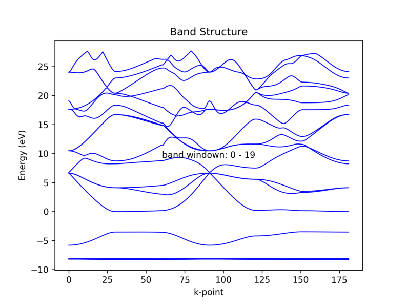
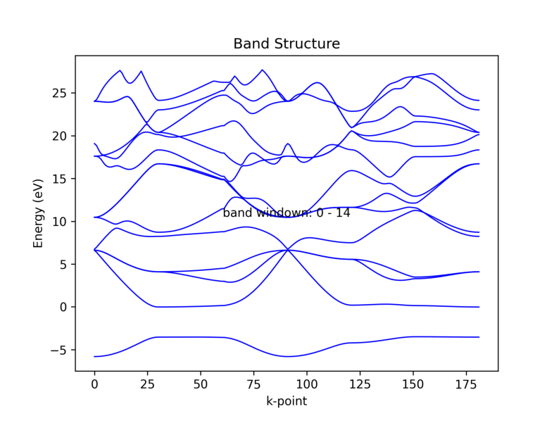
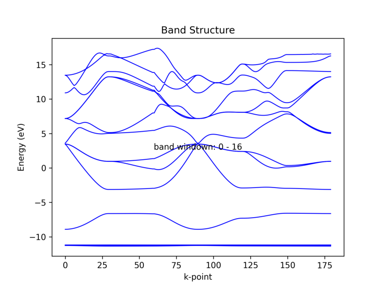
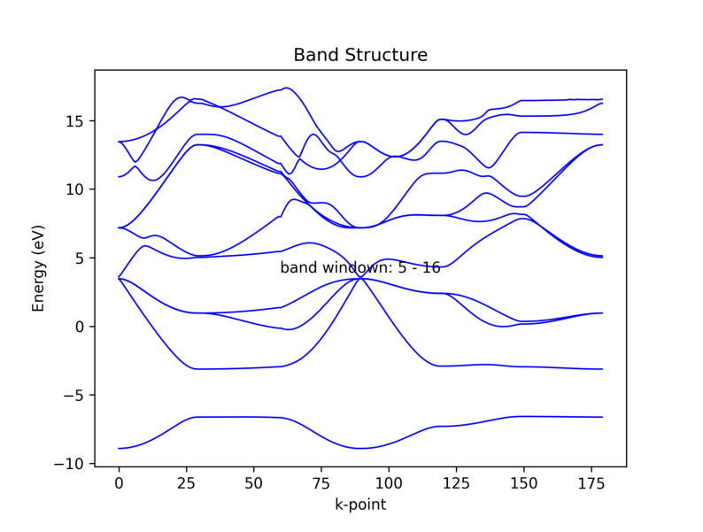
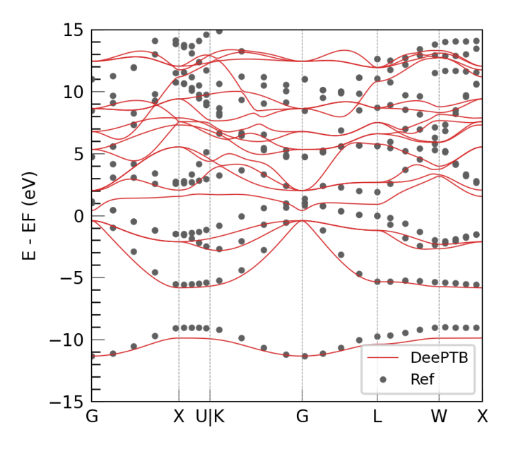
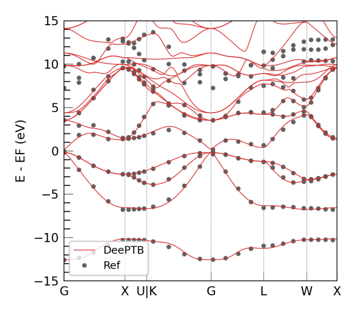
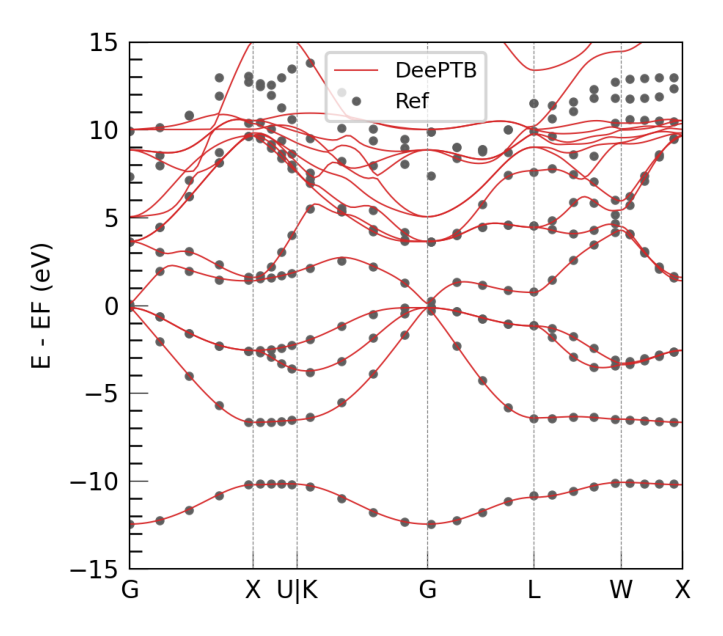

# DeePTB Tutorial 2: data preparation for deeptb-sk model  [v2.2]

<div style="color:black; background-color:#FFF3E9; border: 1px solid #FFE0C3; border-radius: 10px; margin-bottom:1rem">
    <p style="margin:1rem; padding-left: 1rem; line-height: 2.5;">
        Author: <a style="font-weight:normal" href="mailto:guqq@ustc.edu.cn">Gu, Qiangqiang 顾强强 📨 </a></b></i><br/>
        Date: 2025-04-20<br/>
        Protocol：<a rel="license" href="http://creativecommons.org/licenses/by-nc-sa/4.0/">Creative Commons Attribution-NonCommercial-ShareAlike 4.0 International License.</a></i><br/>
        Quick Start：Click the <span style="background-color:rgb(85, 91, 228); color:white; padding: 3px; border-radius: 5px;box-shadow: 2px 2px 3px rgba(0, 0, 0, 0.3); font-size:0.75rem;">Start Connection</span> button，then wait a moment to begin.
    </p>
</div>

## Introduction
**DeePTB** is a method that uses deep learning to accelerate first-principles electronic structure simulations.

### Version Features
- **v1**: Constructed tight-binding (TB) models with first-principles accuracy (DeePTB-SK)
- **v2.0-2.1**: Added E3 equivariant networks to represent single-electron operators (Hamiltonian, density matrix, and overlap matrix) (DeePTB-E3)
- **v2.2**: Incorporated built-in SK empirical parameters covering commonly used elements across the periodic table

Through these capabilities, DeePTB provides multiple approaches to accelerate electronic structure simulations of materials.

### Learning Objectives

In this tutorial, you will:
1. Learn how to prepare data for DeePTB-SK models
2. Become familiar with the initial training scheme for DeePTB-SK

## 1. Prepare Data for DeePTB-SK Model
This section will show how to prepare data for DeePTB-SK model. The training label of DeePTB-SK model is the energy eigenvalue. This tutorial will show the usage of DFTIO with two DFT software, abacus and VASP.

### Pre-requisites
1. Install DFTIO, see https://github.com/deepmodeling/dftio.git
2. Run DFT Calculation:
   
   For a given structure, perform static calculations using either ABACUS or VASP. Self-consistent or non-self-consistent calculations are both acceptable. This tutorial will use ABACUS and VASP as examples to prepare data. The following sections will describe the usage of DFTIO for both software.
   
You can run `dftio -h` and `dftio <command> -h` to view the help documentation.


```python
!dftio -h
```

    usage: dftio [-h] [-v] {parse,band} ...
    
    dftio is to assist machine learning communities to transcript DFT output into
    a format that is easy to read or used by machine learning models.
    
    options:
      -h, --help     show this help message and exit
      -v, --version  show the dftio's version number and exit
    
    Valid subcommands:
      {parse,band}
        parse        parse dataset from DFT output
        band         plot band for eigenvalues data


```python
!dftio parse -h
```

    usage: dftio parse [-h] [-ll {DEBUG,3,INFO,2,WARNING,1,ERROR,0}]
                       [-lp LOG_PATH] [-m MODE] [-n NUM_WORKERS] [-r ROOT]
                       [-p PREFIX] [-o OUTROOT] [-f FORMAT] [-ham] [-ovp] [-dm]
                       [-eig] [-min BAND_INDEX_MIN]
    
    options:
      -h, --help            show this help message and exit
      -ll {DEBUG,3,INFO,2,WARNING,1,ERROR,0}, --log-level {DEBUG,3,INFO,2,WARNING,1,ERROR,0}
                            set verbosity level by string or number, 0=ERROR,
                            1=WARNING, 2=INFO and 3=DEBUG (default: INFO)
      -lp LOG_PATH, --log-path LOG_PATH
                            set log file to log messages to disk, if not
                            specified, the logs will only be output to console
                            (default: None)
      -m MODE, --mode MODE  The name of the DFT software, currently support
                            abacus/rescu/siesta/gaussian (default: abacus)
      -n NUM_WORKERS, --num_workers NUM_WORKERS
                            The number of workers used to parse the dataset. (For
                            n>1, we use the multiprocessing to accelerate io.)
                            (default: 1)
      -r ROOT, --root ROOT  The root directory of the DFT files. (default: ./)
      -p PREFIX, --prefix PREFIX
                            The prefix of the DFT files under root. (default:
                            frame)
      -o OUTROOT, --outroot OUTROOT
                            The output root directory. (default: ./)
      -f FORMAT, --format FORMAT
                            The output file format, should be dat, ase or lmdb.
                            (default: dat)
      -ham, --hamiltonian   Whether to parse the Hamiltonian matrix. (default:
                            False)
      -ovp, --overlap       Whether to parse the Overlap matrix (default: False)
      -dm, --density_matrix
                            Whether to parse the Density matrix (default: False)
      -eig, --eigenvalue    Whether to parse the kpoints and eigenvalues (default:
                            False)
      -min BAND_INDEX_MIN, --band_index_min BAND_INDEX_MIN
                            The initial band index for eigenvalues to
                            save.(0-band_index_min) bands will be ignored!
                            (default: 0)


###  1.1 ABACUS Case:

The following folder contains the result files from ABACUS calculations. We will demonstrate how to convert the ABACUS calculation data into the training data format for the DeePTB-SK model using a single command.


```python
import matplotlib.pyplot as plt
import matplotlib.image as mpimg

import os
workdir='/root/soft/DeePTB/examples/GaAs_io_sk/data'
os.chdir(f"{workdir}")
!tree -L 1 ./
```

    ./
    ├── ABACUS
    ├── VASP
    ├── abc_ase
    └── vasp_ase
    
    4 directories, 0 files


The command to process the data is as follows:


```python
! dftio parse -m abacus -r ./ -p ABACUS -f ase -o abc_ase -eig
```

    /opt/mamba/lib/python3.10/site-packages/dpdata/system.py:1106: UserWarning: Data type spins is registered twice; only the newly registered one will be used.
      warnings.warn(
    Parsing the DFT files: 100%|█████████████████████| 1/1 [00:00<00:00, 121.39it/s]


The command above, the meaning of each parameter is as follows:
- `-m`: Specify the software, can be abacus, vasp, etc., default is abacus
- `-r`: root_dir, the root directory of the calculation results
- `-p`: prefix, the prefix of the calculation results, will search all file names: The retrieval rule is: `glob.glob(root + '/*' + prefix + '*')`
- `-f`: format output data format: dat ase lmdb; For eigenvalue training data, dat ase is a common format. lmdb is mainly for training quantum operator matrices.
- `-o`: out_dir output folder, root_dir/out_dir
- `-eig`: Whether to output eigenvalues, add -eig to set it to True
  
The following command provides a preview of the corresponding eigenvalue band structure, which is convenient for analysis:


```python
!dftio band -r ./abc_ase/AsGa.0 -f ase 

# display the band plot:
image_path = f'{workdir}/abc_ase/AsGa.0/band_structure.png'
img = mpimg.imread(image_path)
plt.figure(figsize=(10, 8))
plt.imshow(img)
plt.axis('off')
plt.show()

```

    Figure(640x480)


    

    


The plotting command:
```python
dftio band -r ./abc_ase/AsGa.0 -f ase 
```
The meaning of the parameters is as follows:
- `-r` : root_dir, the root directory of the calculation results. Batch plotting is not supported here, so we directly specify the folder containing the parsed data from the previous step without using the prefix and search folder mode.
- `-f` : format, corresponding to the output format during parsing, ase or dat

### Band structure analysis

For the above band structure, we can see that some bands belong to core orbitals. We do not need these bands for training the TB model. We can remove these bands by adding an extra parameter to the above command.

We first check how many bands we want to remove. We can visualize the band structure to see this:


```python
!dftio band -r ./abc_ase/AsGa.0 -f ase -min 5

# display the band plot:

image_path = f'{workdir}/abc_ase/AsGa.0/band_structure.png'
img = mpimg.imread(image_path)
plt.figure(figsize=(10, 8))
plt.imshow(img)
plt.axis('off')
plt.show()
```

    Figure(640x480)


    

    


Note that the above plotting command has an extra parameter:
- `-min` specifies the starting band for plotting. 

For example, `-min 5` means starting from the 5th band, as the counting starts from 0. This indicates that the first 5 bands are completely discarded.

Users can change the value of `-min` to check the band structure. After determining the appropriate value for `-min`, we can rerun the `dftio parse` command with this parameter. 

Additionally, users should ensure that the chosen `-min` value does not exceed the total number of bands available in the dataset.


```python
!dftio parse -m abacus -r ./ -p ABACUS -f ase -o abc_ase -eig -min 5
```

    /opt/mamba/lib/python3.10/site-packages/dpdata/system.py:1106: UserWarning: Data type spins is registered twice; only the newly registered one will be used.
      warnings.warn(
    Parsing the DFT files: 100%|█████████████████████| 1/1 [00:00<00:00, 390.02it/s]


The above command will remove the first 5 bands from the band structure plot. 


```python
!dftio band -r ./abc_ase/AsGa.0 -f ase # -min 0

# display the band plot:
image_path = f'{workdir}/abc_ase/AsGa.0/band_structure.png'

img = mpimg.imread(image_path)
plt.figure(figsize=(10, 8))
plt.imshow(img)
plt.axis('off')
plt.show()
```

    Figure(640x480)


    

    


### Finally, the training data set format for DeePTB-SK model is obtained. 


```python
!tree -L 2 ./abc_ase
```

    ./abc_ase
    └── AsGa.0
        ├── band_structure.png
        ├── eigenvalues.npy
        ├── kpoints.npy
        └── xdat.traj
    
    1 directory, 4 files


###  1.2. VASP Case:

The following folder contains the result files from VASP calculations.


```python
workdir='/root/soft/DeePTB/examples/GaAs_io_sk/data/'
os.chdir(f"{workdir}")
! tree ./VASP -L 1
```

    ./VASP
    ├── EIGENVAL
    ├── KPOINTS
    ├── OUTCAR
    └── POSCAR
    
    0 directories, 4 files


using the same command as in the ABACUS case, but with the `-m` parameter set to `vasp`:


```python
! dftio parse -m vasp -r ./ -p VASP -f ase -o vasp_ase -eig
```

    DFTIO WARNING VASP parser only supports the static (SCF or NSCF) calculations. MD and RELAX is not supported yet.
    DFTIO WARNING VASP parser only supports the static (SCF or NSCF) calculations. MD and RELAX is not supported yet.
    Parsing the DFT files: 100%|██████████████████████| 1/1 [00:00<00:00, 59.79it/s]


Observe that the above command is the same as the abacus case, except for the `-m` parameter, which is set to `vasp`.

For visualizing the band structure of data already output in ASE format, the process is similar to that of the ABACUS case. 


```python
!dftio band -r ./vasp_ase/AsGa.0 -f ase 

# display the band plot:
image_path = f'{workdir}/vasp_ase/AsGa.0/band_structure.png'
img = mpimg.imread(image_path)
plt.figure(figsize=(10, 8))
plt.imshow(img)
plt.axis('off')
plt.show()
```

    Figure(640x480)


    

    


Again, there are core orbitals in the band structure. We can use the same method as in the ABACUS case to remove these bands.

Again, by visualization, we can get the information about how many bands need to be removed:


```python
!dftio band -r ./vasp_ase/AsGa.0 -f ase  -min 5

# display the band plot:
image_path = f'{workdir}/vasp_ase/AsGa.0/band_structure.png'

img = mpimg.imread(image_path)
plt.figure(figsize=(10, 8))
plt.imshow(img)
plt.axis('off')
plt.show()
```

    Figure(640x480)


    

    


Re-run the data processing command to discard the lower energy bands. The command is as follows:


```python
! dftio parse -m vasp -r ./ -p VASP -f ase -o vasp_ase -eig -min 5
```

    DFTIO WARNING VASP parser only supports the static (SCF or NSCF) calculations. MD and RELAX is not supported yet.
    DFTIO WARNING VASP parser only supports the static (SCF or NSCF) calculations. MD and RELAX is not supported yet.
    Parsing the DFT files: 100%|██████████████████████| 1/1 [00:00<00:00, 95.83it/s]


To confirm the band structure, we can visualize it again. The command is as follows:


```python
!dftio band -r ./vasp_ase/AsGa.0 -f ase # -min 5

# display the band plot:
image_path = f'{workdir}/vasp_ase/AsGa.0/band_structure.png'
img = mpimg.imread(image_path)
plt.figure(figsize=(10, 8))
plt.imshow(img)
plt.axis('off')
plt.show()
```

    Figure(640x480)


    

    


### Finally, the training data set format for DeePTB-SK model is obtained. 

**Note:**

After the above operations, the obtained data only contains one frame structure. If you have multiple frame structures, you can perform the following two operations:

1. Place different structures in different folders, using the same prefix and different suffixes for naming. Different folders should be placed in the same directory. The data structure is as follows:
    ```bash
      .root_dir
      └── prefix.suffix1
          ├── info.json
          ├── eigenvalues.npy
          ├── kpoints.npy
          └── xdat.traj
      └── prefix.suffix2
          ├── info.json
          ├── eigenvalues.npy
          ├── kpoints.npy
          └── xdat.traj
      └── ...
    ```

    **Note**: You may notice that I added an `info.json` file! This file contains some parameter settings for the training set, which are required when training DeePTB-SK. Please refer to the DeePTB-SK tutorial for details.

2. In another case, if the data for different frames of structures is the same except for the atomic coordinates (e.g., different structures in the same MD trajectory), you can merge them into one file. The `xdat.traj` file is used to save different frames of structures, and the shape of `eigenvalues.npy` is [nframe,nk,nb]. The shape of `kpoints` can be [nframe,nk,nb] or [nk,nb], where the latter indicates that this structure uses the same kpoints.


## 2. **Training DeePTB-SK Model using vasp data**

In the previous step, we have prepared the data, and now we can start training the model.


```python
import os
workdir='/root/soft/DeePTB/examples/GaAs_io_sk/'
os.chdir(f"{workdir}")
!tree -L 1 ./data/vasp_ase
```

    ./data/vasp_ase
    ├── AsGa.0
    └── processed_dataset_22915fbb7a750e40346716ff89f45ffe8cc73ea3
    
    2 directories, 0 files


First, we need to create an `info.json` file in the data folder with the following content:
```json
{
    "nframes": 1,
    "natoms": 2,
    "pos_type": "ase",
    "pbc": true,
    "bandinfo": {
        "band_min": 0,
        "band_max": 8,
        "emin": null,
        "emax": null
    }
}
```
`nframes` indicates the number of trajectory snapshots, `natoms` indicates the number of atoms in each snapshot, `pos_type` indicates the coordinate type, and `pbc` indicates whether periodic boundary conditions are applied. The `bandinfo` section contains information about the band window, which can be set according to the user's needs. The band window information can be sorted by band index or divided by energy range. Note that the value of emin is relative to min(eig[band_min]). Taking min(eig[band_min]) as the 0 energy.


```python
import json 

infodict = {
    "nframes": 1,
    "natoms": 2,
    "pos_type": "ase",
    "pbc": True,
    "bandinfo": {
        "band_min": 0,
        "band_max": 8,
        "emin": None,
        "emax": None
        }
    }

with open(f'{workdir}/data/vasp_ase/AsGa.0/info.json', 'w') as f:
    json.dump(infodict, f, indent=4)
```

### 2.1 Extract initial empirical SK parameters

Refer to tutorial 1, we extract the initial SK parameters of GaAs from the built-in baseline model.


```python
os.chdir(f"{workdir}/train")
!dptb esk gaas.json -m poly4 
```

    TBPLaS is not installed. Thus the TBPLaS is not available, Please install it first.
     
     
    #################################################################################
    #                                                                               #
    #                                                                               #
    #      ██████████                     ███████████  ███████████ ███████████      #
    #     ░░███░░░░███                   ░░███░░░░░███░█░░░███░░░█░░███░░░░░███     #
    #      ░███   ░░███  ██████   ██████  ░███    ░███░   ░███  ░  ░███    ░███     #
    #      ░███    ░███ ███░░███ ███░░███ ░██████████     ░███     ░██████████      #
    #      ░███    ░███░███████ ░███████  ░███░░░░░░      ░███     ░███░░░░░███     #
    #      ░███    ███ ░███░░░  ░███░░░   ░███            ░███     ░███    ░███     #
    #      ██████████  ░░██████ ░░██████  █████           █████    ███████████      #
    #     ░░░░░░░░░░    ░░░░░░   ░░░░░░  ░░░░░           ░░░░░    ░░░░░░░░░░░       #
    #                                                                               #
    #                         Version: 2.0.4.dev93+ea00a42                          #
    #                                                                               #
    #################################################################################
     
     
    DEEPTB INFO    Extracting empirical SK parameters for GaAs
    DEEPTB INFO    dtype is not provided in the input json, set to the value torch.float32 in model ckpt.
    DEEPTB INFO    device is not provided in the input json, set to the value cpu in model ckpt.
    DEEPTB INFO    overlap is not provided in the input json, set to the value True in model ckpt.
    DEEPTB INFO    Empirical SK parameters are saved in ./sktb.json
    DEEPTB INFO    If you want to further train the model, please use `dptb config` command to generate input template.


We can compare the initial model band structure with the DFT band structure to see how well the model fits the DFT results.


```python
!dptb run band.json -i sktb.json -o  band 

# display the band plot:
image_path = f'./band/results/band.png'
img = mpimg.imread(image_path)
plt.figure(figsize=(10, 8))
plt.imshow(img)
plt.axis('off')
plt.show()
```

    TBPLaS is not installed. Thus the TBPLaS is not available, Please install it first.
     
     
    #################################################################################
    #                                                                               #
    #                                                                               #
    #      ██████████                     ███████████  ███████████ ███████████      #
    #     ░░███░░░░███                   ░░███░░░░░███░█░░░███░░░█░░███░░░░░███     #
    #      ░███   ░░███  ██████   ██████  ░███    ░███░   ░███  ░  ░███    ░███     #
    #      ░███    ░███ ███░░███ ███░░███ ░██████████     ░███     ░██████████      #
    #      ░███    ░███░███████ ░███████  ░███░░░░░░      ░███     ░███░░░░░███     #
    #      ░███    ███ ░███░░░  ░███░░░   ░███            ░███     ░███    ░███     #
    #      ██████████  ░░██████ ░░██████  █████           █████    ███████████      #
    #     ░░░░░░░░░░    ░░░░░░   ░░░░░░  ░░░░░           ░░░░░    ░░░░░░░░░░░       #
    #                                                                               #
    #                         Version: 2.0.4.dev93+ea00a42                          #
    #                                                                               #
    #################################################################################
     
     
    DEEPTB WARNING Warning! structure is not set in run option, read from input config file.
    /opt/mamba/lib/python3.10/site-packages/torch/nested/__init__.py:107: UserWarning: The PyTorch API of nested tensors is in prototype stage and will change in the near future. (Triggered internally at ../aten/src/ATen/NestedTensorImpl.cpp:178.)
      return torch._nested_tensor_from_tensor_list(ts, dtype, None, device, None)
    DEEPTB INFO    KPOINTS  klist: 180 kpoints
    DEEPTB INFO    The eigenvalues are already in data. will use them.
    DEEPTB INFO    Calculating Fermi energy in the case of spin-degeneracy.
    DEEPTB INFO    Fermi energy converged after 16 iterations.
    DEEPTB INFO    q_cal: 7.999999999921436, total_electrons: 8.0, diff q: 7.856382211457458e-11
    DEEPTB INFO    Estimated E_fermi: -4.927888815054766 based on the valence electrons setting nel_atom : {'As': 5, 'Ga': 3} .
    DEEPTB INFO    No Fermi energy provided, using estimated value: -4.9279 eV
    Figure(640x560)
    DEEPTB INFO    band calculation successfully completed.


    

    


### 2.1 model training (briefly introduce)


```python
# 94.116 s on NVIDIA V100
!dptb train input.json -i sktb.json -o nnsk
```

    TBPLaS is not installed. Thus the TBPLaS is not available, Please install it first.
     
     
    #################################################################################
    #                                                                               #
    #                                                                               #
    #      ██████████                     ███████████  ███████████ ███████████      #
    #     ░░███░░░░███                   ░░███░░░░░███░█░░░███░░░█░░███░░░░░███     #
    #      ░███   ░░███  ██████   ██████  ░███    ░███░   ░███  ░  ░███    ░███     #
    #      ░███    ░███ ███░░███ ███░░███ ░██████████     ░███     ░██████████      #
    #      ░███    ░███░███████ ░███████  ░███░░░░░░      ░███     ░███░░░░░███     #
    #      ░███    ███ ░███░░░  ░███░░░   ░███            ░███     ░███    ░███     #
    #      ██████████  ░░██████ ░░██████  █████           █████    ███████████      #
    #     ░░░░░░░░░░    ░░░░░░   ░░░░░░  ░░░░░           ░░░░░    ░░░░░░░░░░░       #
    #                                                                               #
    #                         Version: 2.0.4.dev93+ea00a42                          #
    #                                                                               #
    #################################################################################
     
     
    DEEPTB INFO    ------------------------------------------------------------------
    DEEPTB INFO         Cutoff options:                                            
    DEEPTB INFO                                                                    
    DEEPTB INFO         r_max            : {'Ga-Ga': 6.220000000000001, 'Ga-As': 6.43, 'As-Ga': 6.43, 'As-As': 6.630000000000001}    
    DEEPTB INFO         er_max           : None                                    
    DEEPTB INFO         oer_max          : None                                    
    DEEPTB INFO    ------------------------------------------------------------------
    /opt/mamba/lib/python3.10/site-packages/torch/nested/__init__.py:107: UserWarning: The PyTorch API of nested tensors is in prototype stage and will change in the near future. (Triggered internally at ../aten/src/ATen/NestedTensorImpl.cpp:178.)
      return torch._nested_tensor_from_tensor_list(ts, dtype, None, device, None)
    DEEPTB WARNING The cutoffs in data and model are not checked. be careful!
    DEEPTB INFO    The ['overlap_param'] are frozen!
    DEEPTB INFO    The ['overlap_param'] are frozen!
    DEEPTB INFO    The ['overlap_param'] are frozen!
    DEEPTB INFO    iteration:1	train_loss: 4.588784  (1.376635)	lr: 0.01
    DEEPTB INFO    checkpoint saved as nnsk.iter1
    DEEPTB INFO    Epoch 1 summary:	train_loss: 4.588784	
    ---------------------------------------------------------------------------------
    DEEPTB INFO    checkpoint saved as nnsk.ep1
    DEEPTB INFO    iteration:2	train_loss: 3.226382  (1.931559)	lr: 0.00997
    DEEPTB INFO    checkpoint saved as nnsk.iter2
    DEEPTB INFO    Epoch 2 summary:	train_loss: 3.226382	
    ---------------------------------------------------------------------------------
    DEEPTB INFO    checkpoint saved as nnsk.ep2
    DEEPTB INFO    iteration:3	train_loss: 2.254159  (2.028339)	lr: 0.00994
    DEEPTB INFO    checkpoint saved as nnsk.iter3
    DEEPTB INFO    Epoch 3 summary:	train_loss: 2.254159	
    ---------------------------------------------------------------------------------
    DEEPTB INFO    checkpoint saved as nnsk.ep3
    DEEPTB INFO    iteration:4	train_loss: 1.622852  (1.906693)	lr: 0.00991
    DEEPTB INFO    checkpoint saved as nnsk.iter4
    DEEPTB INFO    Epoch 4 summary:	train_loss: 1.622852	
    ---------------------------------------------------------------------------------
    DEEPTB INFO    checkpoint saved as nnsk.ep4
    DEEPTB INFO    iteration:5	train_loss: 1.282440  (1.719417)	lr: 0.009881
    DEEPTB INFO    checkpoint saved as nnsk.iter5
    DEEPTB INFO    Epoch 5 summary:	train_loss: 1.282440	
    ---------------------------------------------------------------------------------
    DEEPTB INFO    checkpoint saved as nnsk.ep5
    DEEPTB INFO    iteration:6	train_loss: 1.172432  (1.555322)	lr: 0.009851
    DEEPTB INFO    checkpoint saved as nnsk.iter6
    DEEPTB INFO    Epoch 6 summary:	train_loss: 1.172432	
    ---------------------------------------------------------------------------------
    DEEPTB INFO    checkpoint saved as nnsk.ep6
    DEEPTB INFO    iteration:7	train_loss: 1.205577  (1.450398)	lr: 0.009821
    DEEPTB INFO    checkpoint saved as nnsk.iter7
    DEEPTB INFO    Epoch 7 summary:	train_loss: 1.205577	
    ---------------------------------------------------------------------------------
    DEEPTB INFO    iteration:8	train_loss: 1.280454  (1.399415)	lr: 0.009792
    DEEPTB INFO    checkpoint saved as nnsk.iter8
    DEEPTB INFO    Epoch 8 summary:	train_loss: 1.280454	
    ---------------------------------------------------------------------------------
    DEEPTB INFO    iteration:9	train_loss: 1.314541  (1.373953)	lr: 0.009763
    DEEPTB INFO    checkpoint saved as nnsk.iter9
    DEEPTB INFO    Epoch 9 summary:	train_loss: 1.314541	
    ---------------------------------------------------------------------------------
    DEEPTB INFO    iteration:10	train_loss: 1.271724  (1.343284)	lr: 0.009733
    DEEPTB INFO    checkpoint saved as nnsk.iter10
    DEEPTB INFO    Epoch 10 summary:	train_loss: 1.271724	
    ---------------------------------------------------------------------------------
    DEEPTB INFO    iteration:11	train_loss: 1.157568  (1.287569)	lr: 0.009704
    DEEPTB INFO    checkpoint saved as nnsk.iter11
    DEEPTB INFO    Epoch 11 summary:	train_loss: 1.157568	
    ---------------------------------------------------------------------------------
    DEEPTB INFO    checkpoint saved as nnsk.ep11
    DEEPTB INFO    iteration:12	train_loss: 1.003133  (1.202238)	lr: 0.009675
    DEEPTB INFO    checkpoint saved as nnsk.iter12
    DEEPTB INFO    Epoch 12 summary:	train_loss: 1.003133	
    ---------------------------------------------------------------------------------
    DEEPTB INFO    checkpoint saved as nnsk.ep12
    DEEPTB INFO    iteration:13	train_loss: 0.840826  (1.093815)	lr: 0.009646
    DEEPTB INFO    checkpoint saved as nnsk.iter13
    DEEPTB INFO    Epoch 13 summary:	train_loss: 0.840826	
    ---------------------------------------------------------------------------------
    DEEPTB INFO    checkpoint saved as nnsk.ep13
    DEEPTB INFO    iteration:14	train_loss: 0.702217  (0.976335)	lr: 0.009617
    DEEPTB INFO    checkpoint saved as nnsk.iter14
    DEEPTB INFO    Epoch 14 summary:	train_loss: 0.702217	
    ---------------------------------------------------------------------------------
    DEEPTB INFO    checkpoint saved as nnsk.ep14
    DEEPTB INFO    iteration:15	train_loss: 0.604724  (0.864852)	lr: 0.009588
    DEEPTB INFO    checkpoint saved as nnsk.iter15
    DEEPTB INFO    Epoch 15 summary:	train_loss: 0.604724	
    ---------------------------------------------------------------------------------
    DEEPTB INFO    checkpoint saved as nnsk.ep15
    DEEPTB INFO    iteration:16	train_loss: 0.549106  (0.770128)	lr: 0.009559
    DEEPTB INFO    checkpoint saved as nnsk.iter16
    DEEPTB INFO    Epoch 16 summary:	train_loss: 0.549106	
    ---------------------------------------------------------------------------------
    DEEPTB INFO    checkpoint saved as nnsk.ep16
    DEEPTB INFO    iteration:17	train_loss: 0.526853  (0.697146)	lr: 0.009531
    DEEPTB INFO    checkpoint saved as nnsk.iter17
    DEEPTB INFO    Epoch 17 summary:	train_loss: 0.526853	
    ---------------------------------------------------------------------------------
    DEEPTB INFO    checkpoint saved as nnsk.ep17
    DEEPTB INFO    iteration:18	train_loss: 0.521364  (0.644411)	lr: 0.009502
    DEEPTB INFO    checkpoint saved as nnsk.iter18
    DEEPTB INFO    Epoch 18 summary:	train_loss: 0.521364	
    ---------------------------------------------------------------------------------
    DEEPTB INFO    checkpoint saved as nnsk.ep18
    DEEPTB INFO    iteration:19	train_loss: 0.509211  (0.603851)	lr: 0.009474
    DEEPTB INFO    checkpoint saved as nnsk.iter19
    DEEPTB INFO    Epoch 19 summary:	train_loss: 0.509211	
    ---------------------------------------------------------------------------------
    DEEPTB INFO    checkpoint saved as nnsk.ep19
    DEEPTB INFO    iteration:20	train_loss: 0.482988  (0.567592)	lr: 0.009445
    DEEPTB INFO    checkpoint saved as nnsk.iter20
    DEEPTB INFO    Epoch 20 summary:	train_loss: 0.482988	
    ---------------------------------------------------------------------------------
    DEEPTB INFO    checkpoint saved as nnsk.ep20
    DEEPTB INFO    iteration:21	train_loss: 0.445105  (0.530846)	lr: 0.009417
    DEEPTB INFO    checkpoint saved as nnsk.iter21
    DEEPTB INFO    Epoch 21 summary:	train_loss: 0.445105	
    ---------------------------------------------------------------------------------
    DEEPTB INFO    checkpoint saved as nnsk.ep21
    DEEPTB INFO    iteration:22	train_loss: 0.408590  (0.494169)	lr: 0.009389
    DEEPTB INFO    checkpoint saved as nnsk.iter22
    DEEPTB INFO    Epoch 22 summary:	train_loss: 0.408590	
    ---------------------------------------------------------------------------------
    DEEPTB INFO    checkpoint saved as nnsk.ep22
    DEEPTB INFO    iteration:23	train_loss: 0.391568  (0.463389)	lr: 0.00936 
    DEEPTB INFO    checkpoint saved as nnsk.iter23
    DEEPTB INFO    Epoch 23 summary:	train_loss: 0.391568	
    ---------------------------------------------------------------------------------
    DEEPTB INFO    checkpoint saved as nnsk.ep23
    DEEPTB INFO    iteration:24	train_loss: 0.396272  (0.443254)	lr: 0.009332
    DEEPTB INFO    checkpoint saved as nnsk.iter24
    DEEPTB INFO    Epoch 24 summary:	train_loss: 0.396272	
    ---------------------------------------------------------------------------------
    DEEPTB INFO    iteration:25	train_loss: 0.387767  (0.426608)	lr: 0.009304
    DEEPTB INFO    checkpoint saved as nnsk.iter25
    DEEPTB INFO    Epoch 25 summary:	train_loss: 0.387767	
    ---------------------------------------------------------------------------------
    DEEPTB INFO    checkpoint saved as nnsk.ep25
    DEEPTB INFO    iteration:26	train_loss: 0.359340  (0.406427)	lr: 0.009276
    DEEPTB INFO    checkpoint saved as nnsk.iter26
    DEEPTB INFO    Epoch 26 summary:	train_loss: 0.359340	
    ---------------------------------------------------------------------------------
    DEEPTB INFO    checkpoint saved as nnsk.ep26
    DEEPTB INFO    iteration:27	train_loss: 0.330227  (0.383567)	lr: 0.009249
    DEEPTB INFO    checkpoint saved as nnsk.iter27
    DEEPTB INFO    Epoch 27 summary:	train_loss: 0.330227	
    ---------------------------------------------------------------------------------
    DEEPTB INFO    checkpoint saved as nnsk.ep27
    DEEPTB INFO    iteration:28	train_loss: 0.314850  (0.362952)	lr: 0.009221
    DEEPTB INFO    checkpoint saved as nnsk.iter28
    DEEPTB INFO    Epoch 28 summary:	train_loss: 0.314850	
    ---------------------------------------------------------------------------------
    DEEPTB INFO    checkpoint saved as nnsk.ep28
    DEEPTB INFO    iteration:29	train_loss: 0.312546  (0.347830)	lr: 0.009193
    DEEPTB INFO    checkpoint saved as nnsk.iter29
    DEEPTB INFO    Epoch 29 summary:	train_loss: 0.312546	
    ---------------------------------------------------------------------------------
    DEEPTB INFO    checkpoint saved as nnsk.ep29
    DEEPTB INFO    iteration:30	train_loss: 0.312207  (0.337143)	lr: 0.009166
    DEEPTB INFO    checkpoint saved as nnsk.iter30
    DEEPTB INFO    Epoch 30 summary:	train_loss: 0.312207	
    ---------------------------------------------------------------------------------
    DEEPTB INFO    checkpoint saved as nnsk.ep30
    DEEPTB INFO    iteration:31	train_loss: 0.305062  (0.327519)	lr: 0.009138
    DEEPTB INFO    checkpoint saved as nnsk.iter31
    DEEPTB INFO    Epoch 31 summary:	train_loss: 0.305062	
    ---------------------------------------------------------------------------------
    DEEPTB INFO    checkpoint saved as nnsk.ep31
    DEEPTB INFO    iteration:32	train_loss: 0.291385  (0.316679)	lr: 0.009111
    DEEPTB INFO    checkpoint saved as nnsk.iter32
    DEEPTB INFO    Epoch 32 summary:	train_loss: 0.291385	
    ---------------------------------------------------------------------------------
    DEEPTB INFO    checkpoint saved as nnsk.ep32
    DEEPTB INFO    iteration:33	train_loss: 0.277740  (0.304997)	lr: 0.009083
    DEEPTB INFO    checkpoint saved as nnsk.iter33
    DEEPTB INFO    Epoch 33 summary:	train_loss: 0.277740	
    ---------------------------------------------------------------------------------
    DEEPTB INFO    checkpoint saved as nnsk.ep33
    DEEPTB INFO    iteration:34	train_loss: 0.270189  (0.294555)	lr: 0.009056
    DEEPTB INFO    checkpoint saved as nnsk.iter34
    DEEPTB INFO    Epoch 34 summary:	train_loss: 0.270189	
    ---------------------------------------------------------------------------------
    DEEPTB INFO    checkpoint saved as nnsk.ep34
    DEEPTB INFO    iteration:35	train_loss: 0.269936  (0.287169)	lr: 0.009029
    DEEPTB INFO    checkpoint saved as nnsk.iter35
    DEEPTB INFO    Epoch 35 summary:	train_loss: 0.269936	
    ---------------------------------------------------------------------------------
    DEEPTB INFO    checkpoint saved as nnsk.ep35
    DEEPTB INFO    iteration:36	train_loss: 0.269819  (0.281964)	lr: 0.009002
    DEEPTB INFO    checkpoint saved as nnsk.iter36
    DEEPTB INFO    Epoch 36 summary:	train_loss: 0.269819	
    ---------------------------------------------------------------------------------
    DEEPTB INFO    checkpoint saved as nnsk.ep36
    DEEPTB INFO    iteration:37	train_loss: 0.263360  (0.276383)	lr: 0.008975
    DEEPTB INFO    checkpoint saved as nnsk.iter37
    DEEPTB INFO    Epoch 37 summary:	train_loss: 0.263360	
    ---------------------------------------------------------------------------------
    DEEPTB INFO    checkpoint saved as nnsk.ep37
    DEEPTB INFO    iteration:38	train_loss: 0.252643  (0.269261)	lr: 0.008948
    DEEPTB INFO    checkpoint saved as nnsk.iter38
    DEEPTB INFO    Epoch 38 summary:	train_loss: 0.252643	
    ---------------------------------------------------------------------------------
    DEEPTB INFO    checkpoint saved as nnsk.ep38
    DEEPTB INFO    iteration:39	train_loss: 0.243613  (0.261566)	lr: 0.008921
    DEEPTB INFO    checkpoint saved as nnsk.iter39
    DEEPTB INFO    Epoch 39 summary:	train_loss: 0.243613	
    ---------------------------------------------------------------------------------
    DEEPTB INFO    checkpoint saved as nnsk.ep39
    DEEPTB INFO    iteration:40	train_loss: 0.238452  (0.254632)	lr: 0.008894
    DEEPTB INFO    checkpoint saved as nnsk.iter40
    DEEPTB INFO    Epoch 40 summary:	train_loss: 0.238452	
    ---------------------------------------------------------------------------------
    DEEPTB INFO    checkpoint saved as nnsk.ep40
    DEEPTB INFO    iteration:41	train_loss: 0.234838  (0.248694)	lr: 0.008868
    DEEPTB INFO    checkpoint saved as nnsk.iter41
    DEEPTB INFO    Epoch 41 summary:	train_loss: 0.234838	
    ---------------------------------------------------------------------------------
    DEEPTB INFO    checkpoint saved as nnsk.ep41
    DEEPTB INFO    iteration:42	train_loss: 0.229916  (0.243061)	lr: 0.008841
    DEEPTB INFO    checkpoint saved as nnsk.iter42
    DEEPTB INFO    Epoch 42 summary:	train_loss: 0.229916	
    ---------------------------------------------------------------------------------
    DEEPTB INFO    checkpoint saved as nnsk.ep42
    DEEPTB INFO    iteration:43	train_loss: 0.222801  (0.236983)	lr: 0.008814
    DEEPTB INFO    checkpoint saved as nnsk.iter43
    DEEPTB INFO    Epoch 43 summary:	train_loss: 0.222801	
    ---------------------------------------------------------------------------------
    DEEPTB INFO    checkpoint saved as nnsk.ep43
    DEEPTB INFO    iteration:44	train_loss: 0.214843  (0.230341)	lr: 0.008788
    DEEPTB INFO    checkpoint saved as nnsk.iter44
    DEEPTB INFO    Epoch 44 summary:	train_loss: 0.214843	
    ---------------------------------------------------------------------------------
    DEEPTB INFO    checkpoint saved as nnsk.ep44
    DEEPTB INFO    iteration:45	train_loss: 0.208131  (0.223678)	lr: 0.008762
    DEEPTB INFO    checkpoint saved as nnsk.iter45
    DEEPTB INFO    Epoch 45 summary:	train_loss: 0.208131	
    ---------------------------------------------------------------------------------
    DEEPTB INFO    checkpoint saved as nnsk.ep45
    DEEPTB INFO    iteration:46	train_loss: 0.203460  (0.217612)	lr: 0.008735
    DEEPTB INFO    checkpoint saved as nnsk.iter46
    DEEPTB INFO    Epoch 46 summary:	train_loss: 0.203460	
    ---------------------------------------------------------------------------------
    DEEPTB INFO    checkpoint saved as nnsk.ep46
    DEEPTB INFO    iteration:47	train_loss: 0.199675  (0.212231)	lr: 0.008709
    DEEPTB INFO    checkpoint saved as nnsk.iter47
    DEEPTB INFO    Epoch 47 summary:	train_loss: 0.199675	
    ---------------------------------------------------------------------------------
    DEEPTB INFO    checkpoint saved as nnsk.ep47
    DEEPTB INFO    iteration:48	train_loss: 0.194981  (0.207056)	lr: 0.008683
    DEEPTB INFO    checkpoint saved as nnsk.iter48
    DEEPTB INFO    Epoch 48 summary:	train_loss: 0.194981	
    ---------------------------------------------------------------------------------
    DEEPTB INFO    checkpoint saved as nnsk.ep48
    DEEPTB INFO    iteration:49	train_loss: 0.188880  (0.201603)	lr: 0.008657
    DEEPTB INFO    checkpoint saved as nnsk.iter49
    DEEPTB INFO    Epoch 49 summary:	train_loss: 0.188880	
    ---------------------------------------------------------------------------------
    DEEPTB INFO    checkpoint saved as nnsk.ep49
    DEEPTB INFO    iteration:50	train_loss: 0.182495  (0.195871)	lr: 0.008631
    DEEPTB INFO    checkpoint saved as nnsk.iter50
    DEEPTB INFO    Epoch 50 summary:	train_loss: 0.182495	
    ---------------------------------------------------------------------------------
    DEEPTB INFO    checkpoint saved as nnsk.ep50
    DEEPTB INFO    iteration:51	train_loss: 0.176859  (0.190167)	lr: 0.008605
    DEEPTB INFO    checkpoint saved as nnsk.iter51
    DEEPTB INFO    Epoch 51 summary:	train_loss: 0.176859	
    ---------------------------------------------------------------------------------
    DEEPTB INFO    checkpoint saved as nnsk.ep51
    DEEPTB INFO    iteration:52	train_loss: 0.172087  (0.184743)	lr: 0.008579
    DEEPTB INFO    checkpoint saved as nnsk.iter52
    DEEPTB INFO    Epoch 52 summary:	train_loss: 0.172087	
    ---------------------------------------------------------------------------------
    DEEPTB INFO    checkpoint saved as nnsk.ep52
    DEEPTB INFO    iteration:53	train_loss: 0.167292  (0.179508)	lr: 0.008554
    DEEPTB INFO    checkpoint saved as nnsk.iter53
    DEEPTB INFO    Epoch 53 summary:	train_loss: 0.167292	
    ---------------------------------------------------------------------------------
    DEEPTB INFO    checkpoint saved as nnsk.ep53
    DEEPTB INFO    iteration:54	train_loss: 0.161771  (0.174187)	lr: 0.008528
    DEEPTB INFO    checkpoint saved as nnsk.iter54
    DEEPTB INFO    Epoch 54 summary:	train_loss: 0.161771	
    ---------------------------------------------------------------------------------
    DEEPTB INFO    checkpoint saved as nnsk.ep54
    DEEPTB INFO    iteration:55	train_loss: 0.155641  (0.168623)	lr: 0.008502
    DEEPTB INFO    checkpoint saved as nnsk.iter55
    DEEPTB INFO    Epoch 55 summary:	train_loss: 0.155641	
    ---------------------------------------------------------------------------------
    DEEPTB INFO    checkpoint saved as nnsk.ep55
    DEEPTB INFO    iteration:56	train_loss: 0.149631  (0.162925)	lr: 0.008477
    DEEPTB INFO    checkpoint saved as nnsk.iter56
    DEEPTB INFO    Epoch 56 summary:	train_loss: 0.149631	
    ---------------------------------------------------------------------------------
    DEEPTB INFO    checkpoint saved as nnsk.ep56
    DEEPTB INFO    iteration:57	train_loss: 0.144308  (0.157340)	lr: 0.008451
    DEEPTB INFO    checkpoint saved as nnsk.iter57
    DEEPTB INFO    Epoch 57 summary:	train_loss: 0.144308	
    ---------------------------------------------------------------------------------
    DEEPTB INFO    checkpoint saved as nnsk.ep57
    DEEPTB INFO    iteration:58	train_loss: 0.139577  (0.152011)	lr: 0.008426
    DEEPTB INFO    checkpoint saved as nnsk.iter58
    DEEPTB INFO    Epoch 58 summary:	train_loss: 0.139577	
    ---------------------------------------------------------------------------------
    DEEPTB INFO    checkpoint saved as nnsk.ep58
    DEEPTB INFO    iteration:59	train_loss: 0.135006  (0.146910)	lr: 0.008401
    DEEPTB INFO    checkpoint saved as nnsk.iter59
    DEEPTB INFO    Epoch 59 summary:	train_loss: 0.135006	
    ---------------------------------------------------------------------------------
    DEEPTB INFO    checkpoint saved as nnsk.ep59
    DEEPTB INFO    iteration:60	train_loss: 0.130286  (0.141923)	lr: 0.008376
    DEEPTB INFO    checkpoint saved as nnsk.iter60
    DEEPTB INFO    Epoch 60 summary:	train_loss: 0.130286	
    ---------------------------------------------------------------------------------
    DEEPTB INFO    checkpoint saved as nnsk.ep60
    DEEPTB INFO    iteration:61	train_loss: 0.125442  (0.136978)	lr: 0.00835 
    DEEPTB INFO    checkpoint saved as nnsk.iter61
    DEEPTB INFO    Epoch 61 summary:	train_loss: 0.125442	
    ---------------------------------------------------------------------------------
    DEEPTB INFO    checkpoint saved as nnsk.ep61
    DEEPTB INFO    iteration:62	train_loss: 0.120872  (0.132146)	lr: 0.008325
    DEEPTB INFO    checkpoint saved as nnsk.iter62
    DEEPTB INFO    Epoch 62 summary:	train_loss: 0.120872	
    ---------------------------------------------------------------------------------
    DEEPTB INFO    checkpoint saved as nnsk.ep62
    DEEPTB INFO    iteration:63	train_loss: 0.116906  (0.127574)	lr: 0.0083  
    DEEPTB INFO    checkpoint saved as nnsk.iter63
    DEEPTB INFO    Epoch 63 summary:	train_loss: 0.116906	
    ---------------------------------------------------------------------------------
    DEEPTB INFO    checkpoint saved as nnsk.ep63
    DEEPTB INFO    iteration:64	train_loss: 0.113477  (0.123345)	lr: 0.008276
    DEEPTB INFO    checkpoint saved as nnsk.iter64
    DEEPTB INFO    Epoch 64 summary:	train_loss: 0.113477	
    ---------------------------------------------------------------------------------
    DEEPTB INFO    checkpoint saved as nnsk.ep64
    DEEPTB INFO    iteration:65	train_loss: 0.110360  (0.119450)	lr: 0.008251
    DEEPTB INFO    checkpoint saved as nnsk.iter65
    DEEPTB INFO    Epoch 65 summary:	train_loss: 0.110360	
    ---------------------------------------------------------------------------------
    DEEPTB INFO    checkpoint saved as nnsk.ep65
    DEEPTB INFO    iteration:66	train_loss: 0.107322  (0.115811)	lr: 0.008226
    DEEPTB INFO    checkpoint saved as nnsk.iter66
    DEEPTB INFO    Epoch 66 summary:	train_loss: 0.107322	
    ---------------------------------------------------------------------------------
    DEEPTB INFO    checkpoint saved as nnsk.ep66
    DEEPTB INFO    iteration:67	train_loss: 0.104361  (0.112376)	lr: 0.008201
    DEEPTB INFO    checkpoint saved as nnsk.iter67
    DEEPTB INFO    Epoch 67 summary:	train_loss: 0.104361	
    ---------------------------------------------------------------------------------
    DEEPTB INFO    checkpoint saved as nnsk.ep67
    DEEPTB INFO    iteration:68	train_loss: 0.101629  (0.109152)	lr: 0.008177
    DEEPTB INFO    checkpoint saved as nnsk.iter68
    DEEPTB INFO    Epoch 68 summary:	train_loss: 0.101629	
    ---------------------------------------------------------------------------------
    DEEPTB INFO    checkpoint saved as nnsk.ep68
    DEEPTB INFO    iteration:69	train_loss: 0.099212  (0.106170)	lr: 0.008152
    DEEPTB INFO    checkpoint saved as nnsk.iter69
    DEEPTB INFO    Epoch 69 summary:	train_loss: 0.099212	
    ---------------------------------------------------------------------------------
    DEEPTB INFO    checkpoint saved as nnsk.ep69
    DEEPTB INFO    iteration:70	train_loss: 0.097001  (0.103419)	lr: 0.008128
    DEEPTB INFO    checkpoint saved as nnsk.iter70
    DEEPTB INFO    Epoch 70 summary:	train_loss: 0.097001	
    ---------------------------------------------------------------------------------
    DEEPTB INFO    checkpoint saved as nnsk.ep70
    DEEPTB INFO    iteration:71	train_loss: 0.094866  (0.100854)	lr: 0.008103
    DEEPTB INFO    checkpoint saved as nnsk.iter71
    DEEPTB INFO    Epoch 71 summary:	train_loss: 0.094866	
    ---------------------------------------------------------------------------------
    DEEPTB INFO    checkpoint saved as nnsk.ep71
    DEEPTB INFO    iteration:72	train_loss: 0.092723  (0.098414)	lr: 0.008079
    DEEPTB INFO    checkpoint saved as nnsk.iter72
    DEEPTB INFO    Epoch 72 summary:	train_loss: 0.092723	
    ---------------------------------------------------------------------------------
    DEEPTB INFO    checkpoint saved as nnsk.ep72
    DEEPTB INFO    iteration:73	train_loss: 0.090601  (0.096070)	lr: 0.008055
    DEEPTB INFO    checkpoint saved as nnsk.iter73
    DEEPTB INFO    Epoch 73 summary:	train_loss: 0.090601	
    ---------------------------------------------------------------------------------
    DEEPTB INFO    checkpoint saved as nnsk.ep73
    DEEPTB INFO    iteration:74	train_loss: 0.088583  (0.093824)	lr: 0.008031
    DEEPTB INFO    checkpoint saved as nnsk.iter74
    DEEPTB INFO    Epoch 74 summary:	train_loss: 0.088583	
    ---------------------------------------------------------------------------------
    DEEPTB INFO    checkpoint saved as nnsk.ep74
    DEEPTB INFO    iteration:75	train_loss: 0.086714  (0.091691)	lr: 0.008006
    DEEPTB INFO    checkpoint saved as nnsk.iter75
    DEEPTB INFO    Epoch 75 summary:	train_loss: 0.086714	
    ---------------------------------------------------------------------------------
    DEEPTB INFO    checkpoint saved as nnsk.ep75
    DEEPTB INFO    iteration:76	train_loss: 0.084947  (0.089668)	lr: 0.007982
    DEEPTB INFO    checkpoint saved as nnsk.iter76
    DEEPTB INFO    Epoch 76 summary:	train_loss: 0.084947	
    ---------------------------------------------------------------------------------
    DEEPTB INFO    checkpoint saved as nnsk.ep76
    DEEPTB INFO    iteration:77	train_loss: 0.083209  (0.087730)	lr: 0.007959
    DEEPTB INFO    checkpoint saved as nnsk.iter77
    DEEPTB INFO    Epoch 77 summary:	train_loss: 0.083209	
    ---------------------------------------------------------------------------------
    DEEPTB INFO    checkpoint saved as nnsk.ep77
    DEEPTB INFO    iteration:78	train_loss: 0.081471  (0.085852)	lr: 0.007935
    DEEPTB INFO    checkpoint saved as nnsk.iter78
    DEEPTB INFO    Epoch 78 summary:	train_loss: 0.081471	
    ---------------------------------------------------------------------------------
    DEEPTB INFO    checkpoint saved as nnsk.ep78
    DEEPTB INFO    iteration:79	train_loss: 0.079775  (0.084029)	lr: 0.007911
    DEEPTB INFO    checkpoint saved as nnsk.iter79
    DEEPTB INFO    Epoch 79 summary:	train_loss: 0.079775	
    ---------------------------------------------------------------------------------
    DEEPTB INFO    checkpoint saved as nnsk.ep79
    DEEPTB INFO    iteration:80	train_loss: 0.078178  (0.082274)	lr: 0.007887
    DEEPTB INFO    checkpoint saved as nnsk.iter80
    DEEPTB INFO    Epoch 80 summary:	train_loss: 0.078178	
    ---------------------------------------------------------------------------------
    DEEPTB INFO    checkpoint saved as nnsk.ep80
    DEEPTB INFO    iteration:81	train_loss: 0.076697  (0.080601)	lr: 0.007863
    DEEPTB INFO    checkpoint saved as nnsk.iter81
    DEEPTB INFO    Epoch 81 summary:	train_loss: 0.076697	
    ---------------------------------------------------------------------------------
    DEEPTB INFO    checkpoint saved as nnsk.ep81
    DEEPTB INFO    iteration:82	train_loss: 0.075292  (0.079008)	lr: 0.00784 
    DEEPTB INFO    checkpoint saved as nnsk.iter82
    DEEPTB INFO    Epoch 82 summary:	train_loss: 0.075292	
    ---------------------------------------------------------------------------------
    DEEPTB INFO    checkpoint saved as nnsk.ep82
    DEEPTB INFO    iteration:83	train_loss: 0.073907  (0.077478)	lr: 0.007816
    DEEPTB INFO    checkpoint saved as nnsk.iter83
    DEEPTB INFO    Epoch 83 summary:	train_loss: 0.073907	
    ---------------------------------------------------------------------------------
    DEEPTB INFO    checkpoint saved as nnsk.ep83
    DEEPTB INFO    iteration:84	train_loss: 0.072539  (0.075996)	lr: 0.007793
    DEEPTB INFO    checkpoint saved as nnsk.iter84
    DEEPTB INFO    Epoch 84 summary:	train_loss: 0.072539	
    ---------------------------------------------------------------------------------
    DEEPTB INFO    checkpoint saved as nnsk.ep84
    DEEPTB INFO    iteration:85	train_loss: 0.071201  (0.074558)	lr: 0.00777 
    DEEPTB INFO    checkpoint saved as nnsk.iter85
    DEEPTB INFO    Epoch 85 summary:	train_loss: 0.071201	
    ---------------------------------------------------------------------------------
    DEEPTB INFO    checkpoint saved as nnsk.ep85
    DEEPTB INFO    iteration:86	train_loss: 0.069928  (0.073169)	lr: 0.007746
    DEEPTB INFO    checkpoint saved as nnsk.iter86
    DEEPTB INFO    Epoch 86 summary:	train_loss: 0.069928	
    ---------------------------------------------------------------------------------
    DEEPTB INFO    checkpoint saved as nnsk.ep86
    DEEPTB INFO    iteration:87	train_loss: 0.068741  (0.071840)	lr: 0.007723
    DEEPTB INFO    checkpoint saved as nnsk.iter87
    DEEPTB INFO    Epoch 87 summary:	train_loss: 0.068741	
    ---------------------------------------------------------------------------------
    DEEPTB INFO    checkpoint saved as nnsk.ep87
    DEEPTB INFO    iteration:88	train_loss: 0.067662  (0.070587)	lr: 0.0077  
    DEEPTB INFO    checkpoint saved as nnsk.iter88
    DEEPTB INFO    Epoch 88 summary:	train_loss: 0.067662	
    ---------------------------------------------------------------------------------
    DEEPTB INFO    checkpoint saved as nnsk.ep88
    DEEPTB INFO    iteration:89	train_loss: 0.066590  (0.069388)	lr: 0.007677
    DEEPTB INFO    checkpoint saved as nnsk.iter89
    DEEPTB INFO    Epoch 89 summary:	train_loss: 0.066590	
    ---------------------------------------------------------------------------------
    DEEPTB INFO    checkpoint saved as nnsk.ep89
    DEEPTB INFO    iteration:90	train_loss: 0.065507  (0.068224)	lr: 0.007654
    DEEPTB INFO    checkpoint saved as nnsk.iter90
    DEEPTB INFO    Epoch 90 summary:	train_loss: 0.065507	
    ---------------------------------------------------------------------------------
    DEEPTB INFO    checkpoint saved as nnsk.ep90
    DEEPTB INFO    iteration:91	train_loss: 0.064448  (0.067091)	lr: 0.007631
    DEEPTB INFO    checkpoint saved as nnsk.iter91
    DEEPTB INFO    Epoch 91 summary:	train_loss: 0.064448	
    ---------------------------------------------------------------------------------
    DEEPTB INFO    checkpoint saved as nnsk.ep91
    DEEPTB INFO    iteration:92	train_loss: 0.063493  (0.066012)	lr: 0.007608
    DEEPTB INFO    checkpoint saved as nnsk.iter92
    DEEPTB INFO    Epoch 92 summary:	train_loss: 0.063493	
    ---------------------------------------------------------------------------------
    DEEPTB INFO    checkpoint saved as nnsk.ep92
    DEEPTB INFO    iteration:93	train_loss: 0.062569  (0.064979)	lr: 0.007585
    DEEPTB INFO    checkpoint saved as nnsk.iter93
    DEEPTB INFO    Epoch 93 summary:	train_loss: 0.062569	
    ---------------------------------------------------------------------------------
    DEEPTB INFO    checkpoint saved as nnsk.ep93
    DEEPTB INFO    iteration:94	train_loss: 0.061653  (0.063981)	lr: 0.007562
    DEEPTB INFO    checkpoint saved as nnsk.iter94
    DEEPTB INFO    Epoch 94 summary:	train_loss: 0.061653	
    ---------------------------------------------------------------------------------
    DEEPTB INFO    checkpoint saved as nnsk.ep94
    DEEPTB INFO    iteration:95	train_loss: 0.060744  (0.063010)	lr: 0.00754 
    DEEPTB INFO    checkpoint saved as nnsk.iter95
    DEEPTB INFO    Epoch 95 summary:	train_loss: 0.060744	
    ---------------------------------------------------------------------------------
    DEEPTB INFO    checkpoint saved as nnsk.ep95
    DEEPTB INFO    iteration:96	train_loss: 0.059874  (0.062069)	lr: 0.007517
    DEEPTB INFO    checkpoint saved as nnsk.iter96
    DEEPTB INFO    Epoch 96 summary:	train_loss: 0.059874	
    ---------------------------------------------------------------------------------
    DEEPTB INFO    checkpoint saved as nnsk.ep96
    DEEPTB INFO    iteration:97	train_loss: 0.059056  (0.061165)	lr: 0.007494
    DEEPTB INFO    checkpoint saved as nnsk.iter97
    DEEPTB INFO    Epoch 97 summary:	train_loss: 0.059056	
    ---------------------------------------------------------------------------------
    DEEPTB INFO    checkpoint saved as nnsk.ep97
    DEEPTB INFO    iteration:98	train_loss: 0.058250  (0.060290)	lr: 0.007472
    DEEPTB INFO    checkpoint saved as nnsk.iter98
    DEEPTB INFO    Epoch 98 summary:	train_loss: 0.058250	
    ---------------------------------------------------------------------------------
    DEEPTB INFO    checkpoint saved as nnsk.ep98
    DEEPTB INFO    iteration:99	train_loss: 0.057454  (0.059439)	lr: 0.007449
    DEEPTB INFO    checkpoint saved as nnsk.iter99
    DEEPTB INFO    Epoch 99 summary:	train_loss: 0.057454	
    ---------------------------------------------------------------------------------
    DEEPTB INFO    checkpoint saved as nnsk.ep99
    DEEPTB INFO    iteration:100	train_loss: 0.056678  (0.058611)	lr: 0.007427
    DEEPTB INFO    checkpoint saved as nnsk.iter100
    DEEPTB INFO    Epoch 100 summary:	train_loss: 0.056678	
    ---------------------------------------------------------------------------------
    DEEPTB INFO    checkpoint saved as nnsk.ep100
    DEEPTB INFO    iteration:101	train_loss: 0.055938  (0.057809)	lr: 0.007405
    DEEPTB INFO    checkpoint saved as nnsk.iter101
    DEEPTB INFO    Epoch 101 summary:	train_loss: 0.055938	
    ---------------------------------------------------------------------------------
    DEEPTB INFO    checkpoint saved as nnsk.ep101
    DEEPTB INFO    iteration:102	train_loss: 0.055241  (0.057039)	lr: 0.007383
    DEEPTB INFO    checkpoint saved as nnsk.iter102
    DEEPTB INFO    Epoch 102 summary:	train_loss: 0.055241	
    ---------------------------------------------------------------------------------
    DEEPTB INFO    checkpoint saved as nnsk.ep102
    DEEPTB INFO    iteration:103	train_loss: 0.054544  (0.056290)	lr: 0.00736 
    DEEPTB INFO    checkpoint saved as nnsk.iter103
    DEEPTB INFO    Epoch 103 summary:	train_loss: 0.054544	
    ---------------------------------------------------------------------------------
    DEEPTB INFO    checkpoint saved as nnsk.ep103
    DEEPTB INFO    iteration:104	train_loss: 0.053858  (0.055561)	lr: 0.007338
    DEEPTB INFO    checkpoint saved as nnsk.iter104
    DEEPTB INFO    Epoch 104 summary:	train_loss: 0.053858	
    ---------------------------------------------------------------------------------
    DEEPTB INFO    checkpoint saved as nnsk.ep104
    DEEPTB INFO    iteration:105	train_loss: 0.053211  (0.054856)	lr: 0.007316
    DEEPTB INFO    checkpoint saved as nnsk.iter105
    DEEPTB INFO    Epoch 105 summary:	train_loss: 0.053211	
    ---------------------------------------------------------------------------------
    DEEPTB INFO    checkpoint saved as nnsk.ep105
    DEEPTB INFO    iteration:106	train_loss: 0.052587  (0.054175)	lr: 0.007294
    DEEPTB INFO    checkpoint saved as nnsk.iter106
    DEEPTB INFO    Epoch 106 summary:	train_loss: 0.052587	
    ---------------------------------------------------------------------------------
    DEEPTB INFO    checkpoint saved as nnsk.ep106
    DEEPTB INFO    iteration:107	train_loss: 0.051981  (0.053517)	lr: 0.007273
    DEEPTB INFO    checkpoint saved as nnsk.iter107
    DEEPTB INFO    Epoch 107 summary:	train_loss: 0.051981	
    ---------------------------------------------------------------------------------
    DEEPTB INFO    checkpoint saved as nnsk.ep107
    DEEPTB INFO    iteration:108	train_loss: 0.051386  (0.052878)	lr: 0.007251
    DEEPTB INFO    checkpoint saved as nnsk.iter108
    DEEPTB INFO    Epoch 108 summary:	train_loss: 0.051386	
    ---------------------------------------------------------------------------------
    DEEPTB INFO    checkpoint saved as nnsk.ep108
    DEEPTB INFO    iteration:109	train_loss: 0.050806  (0.052256)	lr: 0.007229
    DEEPTB INFO    checkpoint saved as nnsk.iter109
    DEEPTB INFO    Epoch 109 summary:	train_loss: 0.050806	
    ---------------------------------------------------------------------------------
    DEEPTB INFO    checkpoint saved as nnsk.ep109
    DEEPTB INFO    iteration:110	train_loss: 0.050247  (0.051653)	lr: 0.007207
    DEEPTB INFO    checkpoint saved as nnsk.iter110
    DEEPTB INFO    Epoch 110 summary:	train_loss: 0.050247	
    ---------------------------------------------------------------------------------
    DEEPTB INFO    checkpoint saved as nnsk.ep110
    DEEPTB INFO    iteration:111	train_loss: 0.049705  (0.051069)	lr: 0.007186
    DEEPTB INFO    checkpoint saved as nnsk.iter111
    DEEPTB INFO    Epoch 111 summary:	train_loss: 0.049705	
    ---------------------------------------------------------------------------------
    DEEPTB INFO    checkpoint saved as nnsk.ep111
    DEEPTB INFO    iteration:112	train_loss: 0.049182  (0.050503)	lr: 0.007164
    DEEPTB INFO    checkpoint saved as nnsk.iter112
    DEEPTB INFO    Epoch 112 summary:	train_loss: 0.049182	
    ---------------------------------------------------------------------------------
    DEEPTB INFO    checkpoint saved as nnsk.ep112
    DEEPTB INFO    iteration:113	train_loss: 0.048668  (0.049952)	lr: 0.007143
    DEEPTB INFO    checkpoint saved as nnsk.iter113
    DEEPTB INFO    Epoch 113 summary:	train_loss: 0.048668	
    ---------------------------------------------------------------------------------
    DEEPTB INFO    checkpoint saved as nnsk.ep113
    DEEPTB INFO    iteration:114	train_loss: 0.048162  (0.049415)	lr: 0.007121
    DEEPTB INFO    checkpoint saved as nnsk.iter114
    DEEPTB INFO    Epoch 114 summary:	train_loss: 0.048162	
    ---------------------------------------------------------------------------------
    DEEPTB INFO    checkpoint saved as nnsk.ep114
    DEEPTB INFO    iteration:115	train_loss: 0.047671  (0.048892)	lr: 0.0071  
    DEEPTB INFO    checkpoint saved as nnsk.iter115
    DEEPTB INFO    Epoch 115 summary:	train_loss: 0.047671	
    ---------------------------------------------------------------------------------
    DEEPTB INFO    checkpoint saved as nnsk.ep115
    DEEPTB INFO    iteration:116	train_loss: 0.047191  (0.048382)	lr: 0.007079
    DEEPTB INFO    checkpoint saved as nnsk.iter116
    DEEPTB INFO    Epoch 116 summary:	train_loss: 0.047191	
    ---------------------------------------------------------------------------------
    DEEPTB INFO    checkpoint saved as nnsk.ep116
    DEEPTB INFO    iteration:117	train_loss: 0.046723  (0.047884)	lr: 0.007057
    DEEPTB INFO    checkpoint saved as nnsk.iter117
    DEEPTB INFO    Epoch 117 summary:	train_loss: 0.046723	
    ---------------------------------------------------------------------------------
    DEEPTB INFO    checkpoint saved as nnsk.ep117
    DEEPTB INFO    iteration:118	train_loss: 0.046266  (0.047399)	lr: 0.007036
    DEEPTB INFO    checkpoint saved as nnsk.iter118
    DEEPTB INFO    Epoch 118 summary:	train_loss: 0.046266	
    ---------------------------------------------------------------------------------
    DEEPTB INFO    checkpoint saved as nnsk.ep118
    DEEPTB INFO    iteration:119	train_loss: 0.045816  (0.046924)	lr: 0.007015
    DEEPTB INFO    checkpoint saved as nnsk.iter119
    DEEPTB INFO    Epoch 119 summary:	train_loss: 0.045816	
    ---------------------------------------------------------------------------------
    DEEPTB INFO    checkpoint saved as nnsk.ep119
    DEEPTB INFO    iteration:120	train_loss: 0.045375  (0.046459)	lr: 0.006994
    DEEPTB INFO    checkpoint saved as nnsk.iter120
    DEEPTB INFO    Epoch 120 summary:	train_loss: 0.045375	
    ---------------------------------------------------------------------------------
    DEEPTB INFO    checkpoint saved as nnsk.ep120
    DEEPTB INFO    iteration:121	train_loss: 0.044940  (0.046004)	lr: 0.006973
    DEEPTB INFO    checkpoint saved as nnsk.iter121
    DEEPTB INFO    Epoch 121 summary:	train_loss: 0.044940	
    ---------------------------------------------------------------------------------
    DEEPTB INFO    checkpoint saved as nnsk.ep121
    DEEPTB INFO    iteration:122	train_loss: 0.044514  (0.045557)	lr: 0.006952
    DEEPTB INFO    checkpoint saved as nnsk.iter122
    DEEPTB INFO    Epoch 122 summary:	train_loss: 0.044514	
    ---------------------------------------------------------------------------------
    DEEPTB INFO    checkpoint saved as nnsk.ep122
    DEEPTB INFO    iteration:123	train_loss: 0.044096  (0.045119)	lr: 0.006931
    DEEPTB INFO    checkpoint saved as nnsk.iter123
    DEEPTB INFO    Epoch 123 summary:	train_loss: 0.044096	
    ---------------------------------------------------------------------------------
    DEEPTB INFO    checkpoint saved as nnsk.ep123
    DEEPTB INFO    iteration:124	train_loss: 0.043685  (0.044688)	lr: 0.00691 
    DEEPTB INFO    checkpoint saved as nnsk.iter124
    DEEPTB INFO    Epoch 124 summary:	train_loss: 0.043685	
    ---------------------------------------------------------------------------------
    DEEPTB INFO    checkpoint saved as nnsk.ep124
    DEEPTB INFO    iteration:125	train_loss: 0.043276  (0.044265)	lr: 0.00689 
    DEEPTB INFO    checkpoint saved as nnsk.iter125
    DEEPTB INFO    Epoch 125 summary:	train_loss: 0.043276	
    ---------------------------------------------------------------------------------
    DEEPTB INFO    checkpoint saved as nnsk.ep125
    DEEPTB INFO    iteration:126	train_loss: 0.042868  (0.043846)	lr: 0.006869
    DEEPTB INFO    checkpoint saved as nnsk.iter126
    DEEPTB INFO    Epoch 126 summary:	train_loss: 0.042868	
    ---------------------------------------------------------------------------------
    DEEPTB INFO    checkpoint saved as nnsk.ep126
    DEEPTB INFO    iteration:127	train_loss: 0.042467  (0.043432)	lr: 0.006848
    DEEPTB INFO    checkpoint saved as nnsk.iter127
    DEEPTB INFO    Epoch 127 summary:	train_loss: 0.042467	
    ---------------------------------------------------------------------------------
    DEEPTB INFO    checkpoint saved as nnsk.ep127
    DEEPTB INFO    iteration:128	train_loss: 0.042069  (0.043023)	lr: 0.006828
    DEEPTB INFO    checkpoint saved as nnsk.iter128
    DEEPTB INFO    Epoch 128 summary:	train_loss: 0.042069	
    ---------------------------------------------------------------------------------
    DEEPTB INFO    checkpoint saved as nnsk.ep128
    DEEPTB INFO    iteration:129	train_loss: 0.041677  (0.042619)	lr: 0.006807
    DEEPTB INFO    checkpoint saved as nnsk.iter129
    DEEPTB INFO    Epoch 129 summary:	train_loss: 0.041677	
    ---------------------------------------------------------------------------------
    DEEPTB INFO    checkpoint saved as nnsk.ep129
    DEEPTB INFO    iteration:130	train_loss: 0.041288  (0.042220)	lr: 0.006787
    DEEPTB INFO    checkpoint saved as nnsk.iter130
    DEEPTB INFO    Epoch 130 summary:	train_loss: 0.041288	
    ---------------------------------------------------------------------------------
    DEEPTB INFO    checkpoint saved as nnsk.ep130
    DEEPTB INFO    iteration:131	train_loss: 0.040903  (0.041825)	lr: 0.006767
    DEEPTB INFO    checkpoint saved as nnsk.iter131
    DEEPTB INFO    Epoch 131 summary:	train_loss: 0.040903	
    ---------------------------------------------------------------------------------
    DEEPTB INFO    checkpoint saved as nnsk.ep131
    DEEPTB INFO    iteration:132	train_loss: 0.040522  (0.041434)	lr: 0.006746
    DEEPTB INFO    checkpoint saved as nnsk.iter132
    DEEPTB INFO    Epoch 132 summary:	train_loss: 0.040522	
    ---------------------------------------------------------------------------------
    DEEPTB INFO    checkpoint saved as nnsk.ep132
    DEEPTB INFO    iteration:133	train_loss: 0.040147  (0.041048)	lr: 0.006726
    DEEPTB INFO    checkpoint saved as nnsk.iter133
    DEEPTB INFO    Epoch 133 summary:	train_loss: 0.040147	
    ---------------------------------------------------------------------------------
    DEEPTB INFO    checkpoint saved as nnsk.ep133
    DEEPTB INFO    iteration:134	train_loss: 0.039777  (0.040667)	lr: 0.006706
    DEEPTB INFO    checkpoint saved as nnsk.iter134
    DEEPTB INFO    Epoch 134 summary:	train_loss: 0.039777	
    ---------------------------------------------------------------------------------
    DEEPTB INFO    checkpoint saved as nnsk.ep134
    DEEPTB INFO    iteration:135	train_loss: 0.039413  (0.040291)	lr: 0.006686
    DEEPTB INFO    checkpoint saved as nnsk.iter135
    DEEPTB INFO    Epoch 135 summary:	train_loss: 0.039413	
    ---------------------------------------------------------------------------------
    DEEPTB INFO    checkpoint saved as nnsk.ep135
    DEEPTB INFO    iteration:136	train_loss: 0.039053  (0.039919)	lr: 0.006666
    DEEPTB INFO    checkpoint saved as nnsk.iter136
    DEEPTB INFO    Epoch 136 summary:	train_loss: 0.039053	
    ---------------------------------------------------------------------------------
    DEEPTB INFO    checkpoint saved as nnsk.ep136
    DEEPTB INFO    iteration:137	train_loss: 0.038697  (0.039553)	lr: 0.006646
    DEEPTB INFO    checkpoint saved as nnsk.iter137
    DEEPTB INFO    Epoch 137 summary:	train_loss: 0.038697	
    ---------------------------------------------------------------------------------
    DEEPTB INFO    checkpoint saved as nnsk.ep137
    DEEPTB INFO    iteration:138	train_loss: 0.038347  (0.039191)	lr: 0.006626
    DEEPTB INFO    checkpoint saved as nnsk.iter138
    DEEPTB INFO    Epoch 138 summary:	train_loss: 0.038347	
    ---------------------------------------------------------------------------------
    DEEPTB INFO    checkpoint saved as nnsk.ep138
    DEEPTB INFO    iteration:139	train_loss: 0.038001  (0.038834)	lr: 0.006606
    DEEPTB INFO    checkpoint saved as nnsk.iter139
    DEEPTB INFO    Epoch 139 summary:	train_loss: 0.038001	
    ---------------------------------------------------------------------------------
    DEEPTB INFO    checkpoint saved as nnsk.ep139
    DEEPTB INFO    iteration:140	train_loss: 0.037661  (0.038482)	lr: 0.006586
    DEEPTB INFO    checkpoint saved as nnsk.iter140
    DEEPTB INFO    Epoch 140 summary:	train_loss: 0.037661	
    ---------------------------------------------------------------------------------
    DEEPTB INFO    checkpoint saved as nnsk.ep140
    DEEPTB INFO    iteration:141	train_loss: 0.037326  (0.038135)	lr: 0.006566
    DEEPTB INFO    checkpoint saved as nnsk.iter141
    DEEPTB INFO    Epoch 141 summary:	train_loss: 0.037326	
    ---------------------------------------------------------------------------------
    DEEPTB INFO    checkpoint saved as nnsk.ep141
    DEEPTB INFO    iteration:142	train_loss: 0.036997  (0.037794)	lr: 0.006547
    DEEPTB INFO    checkpoint saved as nnsk.iter142
    DEEPTB INFO    Epoch 142 summary:	train_loss: 0.036997	
    ---------------------------------------------------------------------------------
    DEEPTB INFO    checkpoint saved as nnsk.ep142
    DEEPTB INFO    iteration:143	train_loss: 0.036673  (0.037458)	lr: 0.006527
    DEEPTB INFO    checkpoint saved as nnsk.iter143
    DEEPTB INFO    Epoch 143 summary:	train_loss: 0.036673	
    ---------------------------------------------------------------------------------
    DEEPTB INFO    checkpoint saved as nnsk.ep143
    DEEPTB INFO    iteration:144	train_loss: 0.036354  (0.037127)	lr: 0.006507
    DEEPTB INFO    checkpoint saved as nnsk.iter144
    DEEPTB INFO    Epoch 144 summary:	train_loss: 0.036354	
    ---------------------------------------------------------------------------------
    DEEPTB INFO    checkpoint saved as nnsk.ep144
    DEEPTB INFO    iteration:145	train_loss: 0.036042  (0.036801)	lr: 0.006488
    DEEPTB INFO    checkpoint saved as nnsk.iter145
    DEEPTB INFO    Epoch 145 summary:	train_loss: 0.036042	
    ---------------------------------------------------------------------------------
    DEEPTB INFO    checkpoint saved as nnsk.ep145
    DEEPTB INFO    iteration:146	train_loss: 0.035735  (0.036481)	lr: 0.006468
    DEEPTB INFO    checkpoint saved as nnsk.iter146
    DEEPTB INFO    Epoch 146 summary:	train_loss: 0.035735	
    ---------------------------------------------------------------------------------
    DEEPTB INFO    checkpoint saved as nnsk.ep146
    DEEPTB INFO    iteration:147	train_loss: 0.035433  (0.036167)	lr: 0.006449
    DEEPTB INFO    checkpoint saved as nnsk.iter147
    DEEPTB INFO    Epoch 147 summary:	train_loss: 0.035433	
    ---------------------------------------------------------------------------------
    DEEPTB INFO    checkpoint saved as nnsk.ep147
    DEEPTB INFO    iteration:148	train_loss: 0.035136  (0.035858)	lr: 0.00643 
    DEEPTB INFO    checkpoint saved as nnsk.iter148
    DEEPTB INFO    Epoch 148 summary:	train_loss: 0.035136	
    ---------------------------------------------------------------------------------
    DEEPTB INFO    checkpoint saved as nnsk.ep148
    DEEPTB INFO    iteration:149	train_loss: 0.034843  (0.035553)	lr: 0.00641 
    DEEPTB INFO    checkpoint saved as nnsk.iter149
    DEEPTB INFO    Epoch 149 summary:	train_loss: 0.034843	
    ---------------------------------------------------------------------------------
    DEEPTB INFO    checkpoint saved as nnsk.ep149
    DEEPTB INFO    iteration:150	train_loss: 0.034554  (0.035253)	lr: 0.006391
    DEEPTB INFO    checkpoint saved as nnsk.iter150
    DEEPTB INFO    Epoch 150 summary:	train_loss: 0.034554	
    ---------------------------------------------------------------------------------
    DEEPTB INFO    checkpoint saved as nnsk.ep150
    DEEPTB INFO    iteration:151	train_loss: 0.034270  (0.034958)	lr: 0.006372
    DEEPTB INFO    checkpoint saved as nnsk.iter151
    DEEPTB INFO    Epoch 151 summary:	train_loss: 0.034270	
    ---------------------------------------------------------------------------------
    DEEPTB INFO    checkpoint saved as nnsk.ep151
    DEEPTB INFO    iteration:152	train_loss: 0.033991  (0.034668)	lr: 0.006353
    DEEPTB INFO    checkpoint saved as nnsk.iter152
    DEEPTB INFO    Epoch 152 summary:	train_loss: 0.033991	
    ---------------------------------------------------------------------------------
    DEEPTB INFO    checkpoint saved as nnsk.ep152
    DEEPTB INFO    iteration:153	train_loss: 0.033717  (0.034383)	lr: 0.006334
    DEEPTB INFO    checkpoint saved as nnsk.iter153
    DEEPTB INFO    Epoch 153 summary:	train_loss: 0.033717	
    ---------------------------------------------------------------------------------
    DEEPTB INFO    checkpoint saved as nnsk.ep153
    DEEPTB INFO    iteration:154	train_loss: 0.033446  (0.034102)	lr: 0.006315
    DEEPTB INFO    checkpoint saved as nnsk.iter154
    DEEPTB INFO    Epoch 154 summary:	train_loss: 0.033446	
    ---------------------------------------------------------------------------------
    DEEPTB INFO    checkpoint saved as nnsk.ep154
    DEEPTB INFO    iteration:155	train_loss: 0.033181  (0.033826)	lr: 0.006296
    DEEPTB INFO    checkpoint saved as nnsk.iter155
    DEEPTB INFO    Epoch 155 summary:	train_loss: 0.033181	
    ---------------------------------------------------------------------------------
    DEEPTB INFO    checkpoint saved as nnsk.ep155
    DEEPTB INFO    iteration:156	train_loss: 0.032919  (0.033553)	lr: 0.006277
    DEEPTB INFO    checkpoint saved as nnsk.iter156
    DEEPTB INFO    Epoch 156 summary:	train_loss: 0.032919	
    ---------------------------------------------------------------------------------
    DEEPTB INFO    checkpoint saved as nnsk.ep156
    DEEPTB INFO    iteration:157	train_loss: 0.032661  (0.033286)	lr: 0.006258
    DEEPTB INFO    checkpoint saved as nnsk.iter157
    DEEPTB INFO    Epoch 157 summary:	train_loss: 0.032661	
    ---------------------------------------------------------------------------------
    DEEPTB INFO    checkpoint saved as nnsk.ep157
    DEEPTB INFO    iteration:158	train_loss: 0.032407  (0.033022)	lr: 0.006239
    DEEPTB INFO    checkpoint saved as nnsk.iter158
    DEEPTB INFO    Epoch 158 summary:	train_loss: 0.032407	
    ---------------------------------------------------------------------------------
    DEEPTB INFO    checkpoint saved as nnsk.ep158
    DEEPTB INFO    iteration:159	train_loss: 0.032157  (0.032763)	lr: 0.006221
    DEEPTB INFO    checkpoint saved as nnsk.iter159
    DEEPTB INFO    Epoch 159 summary:	train_loss: 0.032157	
    ---------------------------------------------------------------------------------
    DEEPTB INFO    checkpoint saved as nnsk.ep159
    DEEPTB INFO    iteration:160	train_loss: 0.031912  (0.032507)	lr: 0.006202
    DEEPTB INFO    checkpoint saved as nnsk.iter160
    DEEPTB INFO    Epoch 160 summary:	train_loss: 0.031912	
    ---------------------------------------------------------------------------------
    DEEPTB INFO    checkpoint saved as nnsk.ep160
    DEEPTB INFO    iteration:161	train_loss: 0.031670  (0.032256)	lr: 0.006183
    DEEPTB INFO    checkpoint saved as nnsk.iter161
    DEEPTB INFO    Epoch 161 summary:	train_loss: 0.031670	
    ---------------------------------------------------------------------------------
    DEEPTB INFO    checkpoint saved as nnsk.ep161
    DEEPTB INFO    iteration:162	train_loss: 0.031433  (0.032009)	lr: 0.006165
    DEEPTB INFO    checkpoint saved as nnsk.iter162
    DEEPTB INFO    Epoch 162 summary:	train_loss: 0.031433	
    ---------------------------------------------------------------------------------
    DEEPTB INFO    checkpoint saved as nnsk.ep162
    DEEPTB INFO    iteration:163	train_loss: 0.031200  (0.031767)	lr: 0.006146
    DEEPTB INFO    checkpoint saved as nnsk.iter163
    DEEPTB INFO    Epoch 163 summary:	train_loss: 0.031200	
    ---------------------------------------------------------------------------------
    DEEPTB INFO    checkpoint saved as nnsk.ep163
    DEEPTB INFO    iteration:164	train_loss: 0.030971  (0.031528)	lr: 0.006128
    DEEPTB INFO    checkpoint saved as nnsk.iter164
    DEEPTB INFO    Epoch 164 summary:	train_loss: 0.030971	
    ---------------------------------------------------------------------------------
    DEEPTB INFO    checkpoint saved as nnsk.ep164
    DEEPTB INFO    iteration:165	train_loss: 0.030746  (0.031294)	lr: 0.00611 
    DEEPTB INFO    checkpoint saved as nnsk.iter165
    DEEPTB INFO    Epoch 165 summary:	train_loss: 0.030746	
    ---------------------------------------------------------------------------------
    DEEPTB INFO    checkpoint saved as nnsk.ep165
    DEEPTB INFO    iteration:166	train_loss: 0.030525  (0.031063)	lr: 0.006091
    DEEPTB INFO    checkpoint saved as nnsk.iter166
    DEEPTB INFO    Epoch 166 summary:	train_loss: 0.030525	
    ---------------------------------------------------------------------------------
    DEEPTB INFO    checkpoint saved as nnsk.ep166
    DEEPTB INFO    iteration:167	train_loss: 0.030307  (0.030836)	lr: 0.006073
    DEEPTB INFO    checkpoint saved as nnsk.iter167
    DEEPTB INFO    Epoch 167 summary:	train_loss: 0.030307	
    ---------------------------------------------------------------------------------
    DEEPTB INFO    checkpoint saved as nnsk.ep167
    DEEPTB INFO    iteration:168	train_loss: 0.030093  (0.030613)	lr: 0.006055
    DEEPTB INFO    checkpoint saved as nnsk.iter168
    DEEPTB INFO    Epoch 168 summary:	train_loss: 0.030093	
    ---------------------------------------------------------------------------------
    DEEPTB INFO    checkpoint saved as nnsk.ep168
    DEEPTB INFO    iteration:169	train_loss: 0.029884  (0.030395)	lr: 0.006037
    DEEPTB INFO    checkpoint saved as nnsk.iter169
    DEEPTB INFO    Epoch 169 summary:	train_loss: 0.029884	
    ---------------------------------------------------------------------------------
    DEEPTB INFO    checkpoint saved as nnsk.ep169
    DEEPTB INFO    iteration:170	train_loss: 0.029678  (0.030180)	lr: 0.006018
    DEEPTB INFO    checkpoint saved as nnsk.iter170
    DEEPTB INFO    Epoch 170 summary:	train_loss: 0.029678	
    ---------------------------------------------------------------------------------
    DEEPTB INFO    checkpoint saved as nnsk.ep170
    DEEPTB INFO    iteration:171	train_loss: 0.029475  (0.029968)	lr: 0.006   
    DEEPTB INFO    checkpoint saved as nnsk.iter171
    DEEPTB INFO    Epoch 171 summary:	train_loss: 0.029475	
    ---------------------------------------------------------------------------------
    DEEPTB INFO    checkpoint saved as nnsk.ep171
    DEEPTB INFO    iteration:172	train_loss: 0.029276  (0.029761)	lr: 0.005982
    DEEPTB INFO    checkpoint saved as nnsk.iter172
    DEEPTB INFO    Epoch 172 summary:	train_loss: 0.029276	
    ---------------------------------------------------------------------------------
    DEEPTB INFO    checkpoint saved as nnsk.ep172
    DEEPTB INFO    iteration:173	train_loss: 0.029081  (0.029557)	lr: 0.005964
    DEEPTB INFO    checkpoint saved as nnsk.iter173
    DEEPTB INFO    Epoch 173 summary:	train_loss: 0.029081	
    ---------------------------------------------------------------------------------
    DEEPTB INFO    checkpoint saved as nnsk.ep173
    DEEPTB INFO    iteration:174	train_loss: 0.028888  (0.029356)	lr: 0.005947
    DEEPTB INFO    checkpoint saved as nnsk.iter174
    DEEPTB INFO    Epoch 174 summary:	train_loss: 0.028888	
    ---------------------------------------------------------------------------------
    DEEPTB INFO    checkpoint saved as nnsk.ep174
    DEEPTB INFO    iteration:175	train_loss: 0.028700  (0.029159)	lr: 0.005929
    DEEPTB INFO    checkpoint saved as nnsk.iter175
    DEEPTB INFO    Epoch 175 summary:	train_loss: 0.028700	
    ---------------------------------------------------------------------------------
    DEEPTB INFO    checkpoint saved as nnsk.ep175
    DEEPTB INFO    iteration:176	train_loss: 0.028515  (0.028966)	lr: 0.005911
    DEEPTB INFO    checkpoint saved as nnsk.iter176
    DEEPTB INFO    Epoch 176 summary:	train_loss: 0.028515	
    ---------------------------------------------------------------------------------
    DEEPTB INFO    checkpoint saved as nnsk.ep176
    DEEPTB INFO    iteration:177	train_loss: 0.028334  (0.028776)	lr: 0.005893
    DEEPTB INFO    checkpoint saved as nnsk.iter177
    DEEPTB INFO    Epoch 177 summary:	train_loss: 0.028334	
    ---------------------------------------------------------------------------------
    DEEPTB INFO    checkpoint saved as nnsk.ep177
    DEEPTB INFO    iteration:178	train_loss: 0.028156  (0.028590)	lr: 0.005875
    DEEPTB INFO    checkpoint saved as nnsk.iter178
    DEEPTB INFO    Epoch 178 summary:	train_loss: 0.028156	
    ---------------------------------------------------------------------------------
    DEEPTB INFO    checkpoint saved as nnsk.ep178
    DEEPTB INFO    iteration:179	train_loss: 0.027981  (0.028407)	lr: 0.005858
    DEEPTB INFO    checkpoint saved as nnsk.iter179
    DEEPTB INFO    Epoch 179 summary:	train_loss: 0.027981	
    ---------------------------------------------------------------------------------
    DEEPTB INFO    checkpoint saved as nnsk.ep179
    DEEPTB INFO    iteration:180	train_loss: 0.027810  (0.028228)	lr: 0.00584 
    DEEPTB INFO    checkpoint saved as nnsk.iter180
    DEEPTB INFO    Epoch 180 summary:	train_loss: 0.027810	
    ---------------------------------------------------------------------------------
    DEEPTB INFO    checkpoint saved as nnsk.ep180
    DEEPTB INFO    iteration:181	train_loss: 0.027642  (0.028052)	lr: 0.005823
    DEEPTB INFO    checkpoint saved as nnsk.iter181
    DEEPTB INFO    Epoch 181 summary:	train_loss: 0.027642	
    ---------------------------------------------------------------------------------
    DEEPTB INFO    checkpoint saved as nnsk.ep181
    DEEPTB INFO    iteration:182	train_loss: 0.027477  (0.027880)	lr: 0.005805
    DEEPTB INFO    checkpoint saved as nnsk.iter182
    DEEPTB INFO    Epoch 182 summary:	train_loss: 0.027477	
    ---------------------------------------------------------------------------------
    DEEPTB INFO    checkpoint saved as nnsk.ep182
    DEEPTB INFO    iteration:183	train_loss: 0.027314  (0.027710)	lr: 0.005788
    DEEPTB INFO    checkpoint saved as nnsk.iter183
    DEEPTB INFO    Epoch 183 summary:	train_loss: 0.027314	
    ---------------------------------------------------------------------------------
    DEEPTB INFO    checkpoint saved as nnsk.ep183
    DEEPTB INFO    iteration:184	train_loss: 0.027154  (0.027543)	lr: 0.005771
    DEEPTB INFO    checkpoint saved as nnsk.iter184
    DEEPTB INFO    Epoch 184 summary:	train_loss: 0.027154	
    ---------------------------------------------------------------------------------
    DEEPTB INFO    checkpoint saved as nnsk.ep184
    DEEPTB INFO    iteration:185	train_loss: 0.026998  (0.027380)	lr: 0.005753
    DEEPTB INFO    checkpoint saved as nnsk.iter185
    DEEPTB INFO    Epoch 185 summary:	train_loss: 0.026998	
    ---------------------------------------------------------------------------------
    DEEPTB INFO    checkpoint saved as nnsk.ep185
    DEEPTB INFO    iteration:186	train_loss: 0.026844  (0.027219)	lr: 0.005736
    DEEPTB INFO    checkpoint saved as nnsk.iter186
    DEEPTB INFO    Epoch 186 summary:	train_loss: 0.026844	
    ---------------------------------------------------------------------------------
    DEEPTB INFO    checkpoint saved as nnsk.ep186
    DEEPTB INFO    iteration:187	train_loss: 0.026694  (0.027061)	lr: 0.005719
    DEEPTB INFO    checkpoint saved as nnsk.iter187
    DEEPTB INFO    Epoch 187 summary:	train_loss: 0.026694	
    ---------------------------------------------------------------------------------
    DEEPTB INFO    checkpoint saved as nnsk.ep187
    DEEPTB INFO    iteration:188	train_loss: 0.026546  (0.026907)	lr: 0.005702
    DEEPTB INFO    checkpoint saved as nnsk.iter188
    DEEPTB INFO    Epoch 188 summary:	train_loss: 0.026546	
    ---------------------------------------------------------------------------------
    DEEPTB INFO    checkpoint saved as nnsk.ep188
    DEEPTB INFO    iteration:189	train_loss: 0.026401  (0.026755)	lr: 0.005684
    DEEPTB INFO    checkpoint saved as nnsk.iter189
    DEEPTB INFO    Epoch 189 summary:	train_loss: 0.026401	
    ---------------------------------------------------------------------------------
    DEEPTB INFO    checkpoint saved as nnsk.ep189
    DEEPTB INFO    iteration:190	train_loss: 0.026260  (0.026607)	lr: 0.005667
    DEEPTB INFO    checkpoint saved as nnsk.iter190
    DEEPTB INFO    Epoch 190 summary:	train_loss: 0.026260	
    ---------------------------------------------------------------------------------
    DEEPTB INFO    checkpoint saved as nnsk.ep190
    DEEPTB INFO    iteration:191	train_loss: 0.026121  (0.026461)	lr: 0.00565 
    DEEPTB INFO    checkpoint saved as nnsk.iter191
    DEEPTB INFO    Epoch 191 summary:	train_loss: 0.026121	
    ---------------------------------------------------------------------------------
    DEEPTB INFO    checkpoint saved as nnsk.ep191
    DEEPTB INFO    iteration:192	train_loss: 0.025984  (0.026318)	lr: 0.005633
    DEEPTB INFO    checkpoint saved as nnsk.iter192
    DEEPTB INFO    Epoch 192 summary:	train_loss: 0.025984	
    ---------------------------------------------------------------------------------
    DEEPTB INFO    checkpoint saved as nnsk.ep192
    DEEPTB INFO    iteration:193	train_loss: 0.025849  (0.026177)	lr: 0.005617
    DEEPTB INFO    checkpoint saved as nnsk.iter193
    DEEPTB INFO    Epoch 193 summary:	train_loss: 0.025849	
    ---------------------------------------------------------------------------------
    DEEPTB INFO    checkpoint saved as nnsk.ep193
    DEEPTB INFO    iteration:194	train_loss: 0.025716  (0.026039)	lr: 0.0056  
    DEEPTB INFO    checkpoint saved as nnsk.iter194
    DEEPTB INFO    Epoch 194 summary:	train_loss: 0.025716	
    ---------------------------------------------------------------------------------
    DEEPTB INFO    checkpoint saved as nnsk.ep194
    DEEPTB INFO    iteration:195	train_loss: 0.025585  (0.025902)	lr: 0.005583
    DEEPTB INFO    checkpoint saved as nnsk.iter195
    DEEPTB INFO    Epoch 195 summary:	train_loss: 0.025585	
    ---------------------------------------------------------------------------------
    DEEPTB INFO    checkpoint saved as nnsk.ep195
    DEEPTB INFO    iteration:196	train_loss: 0.025450  (0.025767)	lr: 0.005566
    DEEPTB INFO    checkpoint saved as nnsk.iter196
    DEEPTB INFO    Epoch 196 summary:	train_loss: 0.025450	
    ---------------------------------------------------------------------------------
    DEEPTB INFO    checkpoint saved as nnsk.ep196
    DEEPTB INFO    iteration:197	train_loss: 0.025313  (0.025630)	lr: 0.005549
    DEEPTB INFO    checkpoint saved as nnsk.iter197
    DEEPTB INFO    Epoch 197 summary:	train_loss: 0.025313	
    ---------------------------------------------------------------------------------
    DEEPTB INFO    checkpoint saved as nnsk.ep197
    DEEPTB INFO    iteration:198	train_loss: 0.025171  (0.025493)	lr: 0.005533
    DEEPTB INFO    checkpoint saved as nnsk.iter198
    DEEPTB INFO    Epoch 198 summary:	train_loss: 0.025171	
    ---------------------------------------------------------------------------------
    DEEPTB INFO    checkpoint saved as nnsk.ep198
    DEEPTB INFO    iteration:199	train_loss: 0.025027  (0.025353)	lr: 0.005516
    DEEPTB INFO    checkpoint saved as nnsk.iter199
    DEEPTB INFO    Epoch 199 summary:	train_loss: 0.025027	
    ---------------------------------------------------------------------------------
    DEEPTB INFO    checkpoint saved as nnsk.ep199
    DEEPTB INFO    iteration:200	train_loss: 0.024879  (0.025211)	lr: 0.0055  
    DEEPTB INFO    checkpoint saved as nnsk.iter200
    DEEPTB INFO    Epoch 200 summary:	train_loss: 0.024879	
    ---------------------------------------------------------------------------------
    DEEPTB INFO    checkpoint saved as nnsk.ep200
    DEEPTB INFO    iteration:201	train_loss: 0.024726  (0.025065)	lr: 0.005483
    DEEPTB INFO    checkpoint saved as nnsk.iter201
    DEEPTB INFO    Epoch 201 summary:	train_loss: 0.024726	
    ---------------------------------------------------------------------------------
    DEEPTB INFO    checkpoint saved as nnsk.ep201
    DEEPTB INFO    iteration:202	train_loss: 0.024572  (0.024917)	lr: 0.005467
    DEEPTB INFO    checkpoint saved as nnsk.iter202
    DEEPTB INFO    Epoch 202 summary:	train_loss: 0.024572	
    ---------------------------------------------------------------------------------
    DEEPTB INFO    checkpoint saved as nnsk.ep202
    DEEPTB INFO    iteration:203	train_loss: 0.024417  (0.024767)	lr: 0.00545 
    DEEPTB INFO    checkpoint saved as nnsk.iter203
    DEEPTB INFO    Epoch 203 summary:	train_loss: 0.024417	
    ---------------------------------------------------------------------------------
    DEEPTB INFO    checkpoint saved as nnsk.ep203
    DEEPTB INFO    iteration:204	train_loss: 0.024265  (0.024617)	lr: 0.005434
    DEEPTB INFO    checkpoint saved as nnsk.iter204
    DEEPTB INFO    Epoch 204 summary:	train_loss: 0.024265	
    ---------------------------------------------------------------------------------
    DEEPTB INFO    checkpoint saved as nnsk.ep204
    DEEPTB INFO    iteration:205	train_loss: 0.024114  (0.024466)	lr: 0.005418
    DEEPTB INFO    checkpoint saved as nnsk.iter205
    DEEPTB INFO    Epoch 205 summary:	train_loss: 0.024114	
    ---------------------------------------------------------------------------------
    DEEPTB INFO    checkpoint saved as nnsk.ep205
    DEEPTB INFO    iteration:206	train_loss: 0.023963  (0.024315)	lr: 0.005401
    DEEPTB INFO    checkpoint saved as nnsk.iter206
    DEEPTB INFO    Epoch 206 summary:	train_loss: 0.023963	
    ---------------------------------------------------------------------------------
    DEEPTB INFO    checkpoint saved as nnsk.ep206
    DEEPTB INFO    iteration:207	train_loss: 0.023817  (0.024165)	lr: 0.005385
    DEEPTB INFO    checkpoint saved as nnsk.iter207
    DEEPTB INFO    Epoch 207 summary:	train_loss: 0.023817	
    ---------------------------------------------------------------------------------
    DEEPTB INFO    checkpoint saved as nnsk.ep207
    DEEPTB INFO    iteration:208	train_loss: 0.023677  (0.024019)	lr: 0.005369
    DEEPTB INFO    checkpoint saved as nnsk.iter208
    DEEPTB INFO    Epoch 208 summary:	train_loss: 0.023677	
    ---------------------------------------------------------------------------------
    DEEPTB INFO    checkpoint saved as nnsk.ep208
    DEEPTB INFO    iteration:209	train_loss: 0.023541  (0.023875)	lr: 0.005353
    DEEPTB INFO    checkpoint saved as nnsk.iter209
    DEEPTB INFO    Epoch 209 summary:	train_loss: 0.023541	
    ---------------------------------------------------------------------------------
    DEEPTB INFO    checkpoint saved as nnsk.ep209
    DEEPTB INFO    iteration:210	train_loss: 0.023403  (0.023734)	lr: 0.005337
    DEEPTB INFO    checkpoint saved as nnsk.iter210
    DEEPTB INFO    Epoch 210 summary:	train_loss: 0.023403	
    ---------------------------------------------------------------------------------
    DEEPTB INFO    checkpoint saved as nnsk.ep210
    DEEPTB INFO    iteration:211	train_loss: 0.023272  (0.023595)	lr: 0.005321
    DEEPTB INFO    checkpoint saved as nnsk.iter211
    DEEPTB INFO    Epoch 211 summary:	train_loss: 0.023272	
    ---------------------------------------------------------------------------------
    DEEPTB INFO    checkpoint saved as nnsk.ep211
    DEEPTB INFO    iteration:212	train_loss: 0.023148  (0.023461)	lr: 0.005305
    DEEPTB INFO    checkpoint saved as nnsk.iter212
    DEEPTB INFO    Epoch 212 summary:	train_loss: 0.023148	
    ---------------------------------------------------------------------------------
    DEEPTB INFO    checkpoint saved as nnsk.ep212
    DEEPTB INFO    iteration:213	train_loss: 0.023033  (0.023333)	lr: 0.005289
    DEEPTB INFO    checkpoint saved as nnsk.iter213
    DEEPTB INFO    Epoch 213 summary:	train_loss: 0.023033	
    ---------------------------------------------------------------------------------
    DEEPTB INFO    checkpoint saved as nnsk.ep213
    DEEPTB INFO    iteration:214	train_loss: 0.022921  (0.023209)	lr: 0.005273
    DEEPTB INFO    checkpoint saved as nnsk.iter214
    DEEPTB INFO    Epoch 214 summary:	train_loss: 0.022921	
    ---------------------------------------------------------------------------------
    DEEPTB INFO    checkpoint saved as nnsk.ep214
    DEEPTB INFO    iteration:215	train_loss: 0.022811  (0.023089)	lr: 0.005257
    DEEPTB INFO    checkpoint saved as nnsk.iter215
    DEEPTB INFO    Epoch 215 summary:	train_loss: 0.022811	
    ---------------------------------------------------------------------------------
    DEEPTB INFO    checkpoint saved as nnsk.ep215
    DEEPTB INFO    iteration:216	train_loss: 0.022703  (0.022973)	lr: 0.005242
    DEEPTB INFO    checkpoint saved as nnsk.iter216
    DEEPTB INFO    Epoch 216 summary:	train_loss: 0.022703	
    ---------------------------------------------------------------------------------
    DEEPTB INFO    checkpoint saved as nnsk.ep216
    DEEPTB INFO    iteration:217	train_loss: 0.022598  (0.022861)	lr: 0.005226
    DEEPTB INFO    checkpoint saved as nnsk.iter217
    DEEPTB INFO    Epoch 217 summary:	train_loss: 0.022598	
    ---------------------------------------------------------------------------------
    DEEPTB INFO    checkpoint saved as nnsk.ep217
    DEEPTB INFO    iteration:218	train_loss: 0.022497  (0.022752)	lr: 0.00521 
    DEEPTB INFO    checkpoint saved as nnsk.iter218
    DEEPTB INFO    Epoch 218 summary:	train_loss: 0.022497	
    ---------------------------------------------------------------------------------
    DEEPTB INFO    checkpoint saved as nnsk.ep218
    DEEPTB INFO    iteration:219	train_loss: 0.022400  (0.022646)	lr: 0.005195
    DEEPTB INFO    checkpoint saved as nnsk.iter219
    DEEPTB INFO    Epoch 219 summary:	train_loss: 0.022400	
    ---------------------------------------------------------------------------------
    DEEPTB INFO    checkpoint saved as nnsk.ep219
    DEEPTB INFO    iteration:220	train_loss: 0.022306  (0.022544)	lr: 0.005179
    DEEPTB INFO    checkpoint saved as nnsk.iter220
    DEEPTB INFO    Epoch 220 summary:	train_loss: 0.022306	
    ---------------------------------------------------------------------------------
    DEEPTB INFO    checkpoint saved as nnsk.ep220
    DEEPTB INFO    iteration:221	train_loss: 0.022215  (0.022446)	lr: 0.005163
    DEEPTB INFO    checkpoint saved as nnsk.iter221
    DEEPTB INFO    Epoch 221 summary:	train_loss: 0.022215	
    ---------------------------------------------------------------------------------
    DEEPTB INFO    checkpoint saved as nnsk.ep221
    DEEPTB INFO    iteration:222	train_loss: 0.022126  (0.022350)	lr: 0.005148
    DEEPTB INFO    checkpoint saved as nnsk.iter222
    DEEPTB INFO    Epoch 222 summary:	train_loss: 0.022126	
    ---------------------------------------------------------------------------------
    DEEPTB INFO    checkpoint saved as nnsk.ep222
    DEEPTB INFO    iteration:223	train_loss: 0.022037  (0.022256)	lr: 0.005132
    DEEPTB INFO    checkpoint saved as nnsk.iter223
    DEEPTB INFO    Epoch 223 summary:	train_loss: 0.022037	
    ---------------------------------------------------------------------------------
    DEEPTB INFO    checkpoint saved as nnsk.ep223
    DEEPTB INFO    iteration:224	train_loss: 0.021950  (0.022164)	lr: 0.005117
    DEEPTB INFO    checkpoint saved as nnsk.iter224
    DEEPTB INFO    Epoch 224 summary:	train_loss: 0.021950	
    ---------------------------------------------------------------------------------
    DEEPTB INFO    checkpoint saved as nnsk.ep224
    DEEPTB INFO    iteration:225	train_loss: 0.021864  (0.022074)	lr: 0.005102
    DEEPTB INFO    checkpoint saved as nnsk.iter225
    DEEPTB INFO    Epoch 225 summary:	train_loss: 0.021864	
    ---------------------------------------------------------------------------------
    DEEPTB INFO    checkpoint saved as nnsk.ep225
    DEEPTB INFO    iteration:226	train_loss: 0.021780  (0.021986)	lr: 0.005086
    DEEPTB INFO    checkpoint saved as nnsk.iter226
    DEEPTB INFO    Epoch 226 summary:	train_loss: 0.021780	
    ---------------------------------------------------------------------------------
    DEEPTB INFO    checkpoint saved as nnsk.ep226
    DEEPTB INFO    iteration:227	train_loss: 0.021698  (0.021900)	lr: 0.005071
    DEEPTB INFO    checkpoint saved as nnsk.iter227
    DEEPTB INFO    Epoch 227 summary:	train_loss: 0.021698	
    ---------------------------------------------------------------------------------
    DEEPTB INFO    checkpoint saved as nnsk.ep227
    DEEPTB INFO    iteration:228	train_loss: 0.021617  (0.021815)	lr: 0.005056
    DEEPTB INFO    checkpoint saved as nnsk.iter228
    DEEPTB INFO    Epoch 228 summary:	train_loss: 0.021617	
    ---------------------------------------------------------------------------------
    DEEPTB INFO    checkpoint saved as nnsk.ep228
    DEEPTB INFO    iteration:229	train_loss: 0.021538  (0.021732)	lr: 0.005041
    DEEPTB INFO    checkpoint saved as nnsk.iter229
    DEEPTB INFO    Epoch 229 summary:	train_loss: 0.021538	
    ---------------------------------------------------------------------------------
    DEEPTB INFO    checkpoint saved as nnsk.ep229
    DEEPTB INFO    iteration:230	train_loss: 0.021461  (0.021651)	lr: 0.005026
    DEEPTB INFO    checkpoint saved as nnsk.iter230
    DEEPTB INFO    Epoch 230 summary:	train_loss: 0.021461	
    ---------------------------------------------------------------------------------
    DEEPTB INFO    checkpoint saved as nnsk.ep230
    DEEPTB INFO    iteration:231	train_loss: 0.021385  (0.021571)	lr: 0.005011
    DEEPTB INFO    checkpoint saved as nnsk.iter231
    DEEPTB INFO    Epoch 231 summary:	train_loss: 0.021385	
    ---------------------------------------------------------------------------------
    DEEPTB INFO    checkpoint saved as nnsk.ep231
    DEEPTB INFO    iteration:232	train_loss: 0.021311  (0.021493)	lr: 0.004996
    DEEPTB INFO    checkpoint saved as nnsk.iter232
    DEEPTB INFO    Epoch 232 summary:	train_loss: 0.021311	
    ---------------------------------------------------------------------------------
    DEEPTB INFO    checkpoint saved as nnsk.ep232
    DEEPTB INFO    iteration:233	train_loss: 0.021238  (0.021416)	lr: 0.004981
    DEEPTB INFO    checkpoint saved as nnsk.iter233
    DEEPTB INFO    Epoch 233 summary:	train_loss: 0.021238	
    ---------------------------------------------------------------------------------
    DEEPTB INFO    checkpoint saved as nnsk.ep233
    DEEPTB INFO    iteration:234	train_loss: 0.021166  (0.021341)	lr: 0.004966
    DEEPTB INFO    checkpoint saved as nnsk.iter234
    DEEPTB INFO    Epoch 234 summary:	train_loss: 0.021166	
    ---------------------------------------------------------------------------------
    DEEPTB INFO    checkpoint saved as nnsk.ep234
    DEEPTB INFO    iteration:235	train_loss: 0.021095  (0.021267)	lr: 0.004951
    DEEPTB INFO    checkpoint saved as nnsk.iter235
    DEEPTB INFO    Epoch 235 summary:	train_loss: 0.021095	
    ---------------------------------------------------------------------------------
    DEEPTB INFO    checkpoint saved as nnsk.ep235
    DEEPTB INFO    iteration:236	train_loss: 0.021025  (0.021195)	lr: 0.004936
    DEEPTB INFO    checkpoint saved as nnsk.iter236
    DEEPTB INFO    Epoch 236 summary:	train_loss: 0.021025	
    ---------------------------------------------------------------------------------
    DEEPTB INFO    checkpoint saved as nnsk.ep236
    DEEPTB INFO    iteration:237	train_loss: 0.020957  (0.021123)	lr: 0.004921
    DEEPTB INFO    checkpoint saved as nnsk.iter237
    DEEPTB INFO    Epoch 237 summary:	train_loss: 0.020957	
    ---------------------------------------------------------------------------------
    DEEPTB INFO    checkpoint saved as nnsk.ep237
    DEEPTB INFO    iteration:238	train_loss: 0.020890  (0.021053)	lr: 0.004906
    DEEPTB INFO    checkpoint saved as nnsk.iter238
    DEEPTB INFO    Epoch 238 summary:	train_loss: 0.020890	
    ---------------------------------------------------------------------------------
    DEEPTB INFO    checkpoint saved as nnsk.ep238
    DEEPTB INFO    iteration:239	train_loss: 0.020824  (0.020985)	lr: 0.004892
    DEEPTB INFO    checkpoint saved as nnsk.iter239
    DEEPTB INFO    Epoch 239 summary:	train_loss: 0.020824	
    ---------------------------------------------------------------------------------
    DEEPTB INFO    checkpoint saved as nnsk.ep239
    DEEPTB INFO    iteration:240	train_loss: 0.020760  (0.020917)	lr: 0.004877
    DEEPTB INFO    checkpoint saved as nnsk.iter240
    DEEPTB INFO    Epoch 240 summary:	train_loss: 0.020760	
    ---------------------------------------------------------------------------------
    DEEPTB INFO    checkpoint saved as nnsk.ep240
    DEEPTB INFO    iteration:241	train_loss: 0.020696  (0.020851)	lr: 0.004862
    DEEPTB INFO    checkpoint saved as nnsk.iter241
    DEEPTB INFO    Epoch 241 summary:	train_loss: 0.020696	
    ---------------------------------------------------------------------------------
    DEEPTB INFO    checkpoint saved as nnsk.ep241
    DEEPTB INFO    iteration:242	train_loss: 0.020633  (0.020786)	lr: 0.004848
    DEEPTB INFO    checkpoint saved as nnsk.iter242
    DEEPTB INFO    Epoch 242 summary:	train_loss: 0.020633	
    ---------------------------------------------------------------------------------
    DEEPTB INFO    checkpoint saved as nnsk.ep242
    DEEPTB INFO    iteration:243	train_loss: 0.020572  (0.020721)	lr: 0.004833
    DEEPTB INFO    checkpoint saved as nnsk.iter243
    DEEPTB INFO    Epoch 243 summary:	train_loss: 0.020572	
    ---------------------------------------------------------------------------------
    DEEPTB INFO    checkpoint saved as nnsk.ep243
    DEEPTB INFO    iteration:244	train_loss: 0.020511  (0.020658)	lr: 0.004819
    DEEPTB INFO    checkpoint saved as nnsk.iter244
    DEEPTB INFO    Epoch 244 summary:	train_loss: 0.020511	
    ---------------------------------------------------------------------------------
    DEEPTB INFO    checkpoint saved as nnsk.ep244
    DEEPTB INFO    iteration:245	train_loss: 0.020451  (0.020596)	lr: 0.004804
    DEEPTB INFO    checkpoint saved as nnsk.iter245
    DEEPTB INFO    Epoch 245 summary:	train_loss: 0.020451	
    ---------------------------------------------------------------------------------
    DEEPTB INFO    checkpoint saved as nnsk.ep245
    DEEPTB INFO    iteration:246	train_loss: 0.020392  (0.020535)	lr: 0.00479 
    DEEPTB INFO    checkpoint saved as nnsk.iter246
    DEEPTB INFO    Epoch 246 summary:	train_loss: 0.020392	
    ---------------------------------------------------------------------------------
    DEEPTB INFO    checkpoint saved as nnsk.ep246
    DEEPTB INFO    iteration:247	train_loss: 0.020333  (0.020474)	lr: 0.004775
    DEEPTB INFO    checkpoint saved as nnsk.iter247
    DEEPTB INFO    Epoch 247 summary:	train_loss: 0.020333	
    ---------------------------------------------------------------------------------
    DEEPTB INFO    checkpoint saved as nnsk.ep247
    DEEPTB INFO    iteration:248	train_loss: 0.020276  (0.020415)	lr: 0.004761
    DEEPTB INFO    checkpoint saved as nnsk.iter248
    DEEPTB INFO    Epoch 248 summary:	train_loss: 0.020276	
    ---------------------------------------------------------------------------------
    DEEPTB INFO    checkpoint saved as nnsk.ep248
    DEEPTB INFO    iteration:249	train_loss: 0.020219  (0.020356)	lr: 0.004747
    DEEPTB INFO    checkpoint saved as nnsk.iter249
    DEEPTB INFO    Epoch 249 summary:	train_loss: 0.020219	
    ---------------------------------------------------------------------------------
    DEEPTB INFO    checkpoint saved as nnsk.ep249
    DEEPTB INFO    iteration:250	train_loss: 0.020163  (0.020298)	lr: 0.004733
    DEEPTB INFO    checkpoint saved as nnsk.iter250
    DEEPTB INFO    Epoch 250 summary:	train_loss: 0.020163	
    ---------------------------------------------------------------------------------
    DEEPTB INFO    checkpoint saved as nnsk.ep250
    DEEPTB INFO    iteration:251	train_loss: 0.020107  (0.020241)	lr: 0.004718
    DEEPTB INFO    checkpoint saved as nnsk.iter251
    DEEPTB INFO    Epoch 251 summary:	train_loss: 0.020107	
    ---------------------------------------------------------------------------------
    DEEPTB INFO    checkpoint saved as nnsk.ep251
    DEEPTB INFO    iteration:252	train_loss: 0.020052  (0.020184)	lr: 0.004704
    DEEPTB INFO    checkpoint saved as nnsk.iter252
    DEEPTB INFO    Epoch 252 summary:	train_loss: 0.020052	
    ---------------------------------------------------------------------------------
    DEEPTB INFO    checkpoint saved as nnsk.ep252
    DEEPTB INFO    iteration:253	train_loss: 0.019998  (0.020128)	lr: 0.00469 
    DEEPTB INFO    checkpoint saved as nnsk.iter253
    DEEPTB INFO    Epoch 253 summary:	train_loss: 0.019998	
    ---------------------------------------------------------------------------------
    DEEPTB INFO    checkpoint saved as nnsk.ep253
    DEEPTB INFO    iteration:254	train_loss: 0.019945  (0.020073)	lr: 0.004676
    DEEPTB INFO    checkpoint saved as nnsk.iter254
    DEEPTB INFO    Epoch 254 summary:	train_loss: 0.019945	
    ---------------------------------------------------------------------------------
    DEEPTB INFO    checkpoint saved as nnsk.ep254
    DEEPTB INFO    iteration:255	train_loss: 0.019892  (0.020019)	lr: 0.004662
    DEEPTB INFO    checkpoint saved as nnsk.iter255
    DEEPTB INFO    Epoch 255 summary:	train_loss: 0.019892	
    ---------------------------------------------------------------------------------
    DEEPTB INFO    checkpoint saved as nnsk.ep255
    DEEPTB INFO    iteration:256	train_loss: 0.019840  (0.019965)	lr: 0.004648
    DEEPTB INFO    checkpoint saved as nnsk.iter256
    DEEPTB INFO    Epoch 256 summary:	train_loss: 0.019840	
    ---------------------------------------------------------------------------------
    DEEPTB INFO    checkpoint saved as nnsk.ep256
    DEEPTB INFO    iteration:257	train_loss: 0.019788  (0.019912)	lr: 0.004634
    DEEPTB INFO    checkpoint saved as nnsk.iter257
    DEEPTB INFO    Epoch 257 summary:	train_loss: 0.019788	
    ---------------------------------------------------------------------------------
    DEEPTB INFO    checkpoint saved as nnsk.ep257
    DEEPTB INFO    iteration:258	train_loss: 0.019737  (0.019859)	lr: 0.00462 
    DEEPTB INFO    checkpoint saved as nnsk.iter258
    DEEPTB INFO    Epoch 258 summary:	train_loss: 0.019737	
    ---------------------------------------------------------------------------------
    DEEPTB INFO    checkpoint saved as nnsk.ep258
    DEEPTB INFO    iteration:259	train_loss: 0.019687  (0.019808)	lr: 0.004606
    DEEPTB INFO    checkpoint saved as nnsk.iter259
    DEEPTB INFO    Epoch 259 summary:	train_loss: 0.019687	
    ---------------------------------------------------------------------------------
    DEEPTB INFO    checkpoint saved as nnsk.ep259
    DEEPTB INFO    iteration:260	train_loss: 0.019637  (0.019756)	lr: 0.004592
    DEEPTB INFO    checkpoint saved as nnsk.iter260
    DEEPTB INFO    Epoch 260 summary:	train_loss: 0.019637	
    ---------------------------------------------------------------------------------
    DEEPTB INFO    checkpoint saved as nnsk.ep260
    DEEPTB INFO    iteration:261	train_loss: 0.019588  (0.019706)	lr: 0.004579
    DEEPTB INFO    checkpoint saved as nnsk.iter261
    DEEPTB INFO    Epoch 261 summary:	train_loss: 0.019588	
    ---------------------------------------------------------------------------------
    DEEPTB INFO    checkpoint saved as nnsk.ep261
    DEEPTB INFO    iteration:262	train_loss: 0.019539  (0.019656)	lr: 0.004565
    DEEPTB INFO    checkpoint saved as nnsk.iter262
    DEEPTB INFO    Epoch 262 summary:	train_loss: 0.019539	
    ---------------------------------------------------------------------------------
    DEEPTB INFO    checkpoint saved as nnsk.ep262
    DEEPTB INFO    iteration:263	train_loss: 0.019491  (0.019606)	lr: 0.004551
    DEEPTB INFO    checkpoint saved as nnsk.iter263
    DEEPTB INFO    Epoch 263 summary:	train_loss: 0.019491	
    ---------------------------------------------------------------------------------
    DEEPTB INFO    checkpoint saved as nnsk.ep263
    DEEPTB INFO    iteration:264	train_loss: 0.019443  (0.019557)	lr: 0.004538
    DEEPTB INFO    checkpoint saved as nnsk.iter264
    DEEPTB INFO    Epoch 264 summary:	train_loss: 0.019443	
    ---------------------------------------------------------------------------------
    DEEPTB INFO    checkpoint saved as nnsk.ep264
    DEEPTB INFO    iteration:265	train_loss: 0.019396  (0.019509)	lr: 0.004524
    DEEPTB INFO    checkpoint saved as nnsk.iter265
    DEEPTB INFO    Epoch 265 summary:	train_loss: 0.019396	
    ---------------------------------------------------------------------------------
    DEEPTB INFO    checkpoint saved as nnsk.ep265
    DEEPTB INFO    iteration:266	train_loss: 0.019350  (0.019461)	lr: 0.00451 
    DEEPTB INFO    checkpoint saved as nnsk.iter266
    DEEPTB INFO    Epoch 266 summary:	train_loss: 0.019350	
    ---------------------------------------------------------------------------------
    DEEPTB INFO    checkpoint saved as nnsk.ep266
    DEEPTB INFO    iteration:267	train_loss: 0.019304  (0.019414)	lr: 0.004497
    DEEPTB INFO    checkpoint saved as nnsk.iter267
    DEEPTB INFO    Epoch 267 summary:	train_loss: 0.019304	
    ---------------------------------------------------------------------------------
    DEEPTB INFO    checkpoint saved as nnsk.ep267
    DEEPTB INFO    iteration:268	train_loss: 0.019258  (0.019367)	lr: 0.004483
    DEEPTB INFO    checkpoint saved as nnsk.iter268
    DEEPTB INFO    Epoch 268 summary:	train_loss: 0.019258	
    ---------------------------------------------------------------------------------
    DEEPTB INFO    checkpoint saved as nnsk.ep268
    DEEPTB INFO    iteration:269	train_loss: 0.019213  (0.019321)	lr: 0.00447 
    DEEPTB INFO    checkpoint saved as nnsk.iter269
    DEEPTB INFO    Epoch 269 summary:	train_loss: 0.019213	
    ---------------------------------------------------------------------------------
    DEEPTB INFO    checkpoint saved as nnsk.ep269
    DEEPTB INFO    iteration:270	train_loss: 0.019169  (0.019275)	lr: 0.004457
    DEEPTB INFO    checkpoint saved as nnsk.iter270
    DEEPTB INFO    Epoch 270 summary:	train_loss: 0.019169	
    ---------------------------------------------------------------------------------
    DEEPTB INFO    checkpoint saved as nnsk.ep270
    DEEPTB INFO    iteration:271	train_loss: 0.019125  (0.019230)	lr: 0.004443
    DEEPTB INFO    checkpoint saved as nnsk.iter271
    DEEPTB INFO    Epoch 271 summary:	train_loss: 0.019125	
    ---------------------------------------------------------------------------------
    DEEPTB INFO    checkpoint saved as nnsk.ep271
    DEEPTB INFO    iteration:272	train_loss: 0.019081  (0.019185)	lr: 0.00443 
    DEEPTB INFO    checkpoint saved as nnsk.iter272
    DEEPTB INFO    Epoch 272 summary:	train_loss: 0.019081	
    ---------------------------------------------------------------------------------
    DEEPTB INFO    checkpoint saved as nnsk.ep272
    DEEPTB INFO    iteration:273	train_loss: 0.019037  (0.019141)	lr: 0.004417
    DEEPTB INFO    checkpoint saved as nnsk.iter273
    DEEPTB INFO    Epoch 273 summary:	train_loss: 0.019037	
    ---------------------------------------------------------------------------------
    DEEPTB INFO    checkpoint saved as nnsk.ep273
    DEEPTB INFO    iteration:274	train_loss: 0.018994  (0.019097)	lr: 0.004403
    DEEPTB INFO    checkpoint saved as nnsk.iter274
    DEEPTB INFO    Epoch 274 summary:	train_loss: 0.018994	
    ---------------------------------------------------------------------------------
    DEEPTB INFO    checkpoint saved as nnsk.ep274
    DEEPTB INFO    iteration:275	train_loss: 0.018951  (0.019053)	lr: 0.00439 
    DEEPTB INFO    checkpoint saved as nnsk.iter275
    DEEPTB INFO    Epoch 275 summary:	train_loss: 0.018951	
    ---------------------------------------------------------------------------------
    DEEPTB INFO    checkpoint saved as nnsk.ep275
    DEEPTB INFO    iteration:276	train_loss: 0.018908  (0.019010)	lr: 0.004377
    DEEPTB INFO    checkpoint saved as nnsk.iter276
    DEEPTB INFO    Epoch 276 summary:	train_loss: 0.018908	
    ---------------------------------------------------------------------------------
    DEEPTB INFO    checkpoint saved as nnsk.ep276
    DEEPTB INFO    iteration:277	train_loss: 0.018866  (0.018966)	lr: 0.004364
    DEEPTB INFO    checkpoint saved as nnsk.iter277
    DEEPTB INFO    Epoch 277 summary:	train_loss: 0.018866	
    ---------------------------------------------------------------------------------
    DEEPTB INFO    checkpoint saved as nnsk.ep277
    DEEPTB INFO    iteration:278	train_loss: 0.018824  (0.018924)	lr: 0.004351
    DEEPTB INFO    checkpoint saved as nnsk.iter278
    DEEPTB INFO    Epoch 278 summary:	train_loss: 0.018824	
    ---------------------------------------------------------------------------------
    DEEPTB INFO    checkpoint saved as nnsk.ep278
    DEEPTB INFO    iteration:279	train_loss: 0.018782  (0.018881)	lr: 0.004338
    DEEPTB INFO    checkpoint saved as nnsk.iter279
    DEEPTB INFO    Epoch 279 summary:	train_loss: 0.018782	
    ---------------------------------------------------------------------------------
    DEEPTB INFO    checkpoint saved as nnsk.ep279
    DEEPTB INFO    iteration:280	train_loss: 0.018741  (0.018839)	lr: 0.004325
    DEEPTB INFO    checkpoint saved as nnsk.iter280
    DEEPTB INFO    Epoch 280 summary:	train_loss: 0.018741	
    ---------------------------------------------------------------------------------
    DEEPTB INFO    checkpoint saved as nnsk.ep280
    DEEPTB INFO    iteration:281	train_loss: 0.018700  (0.018797)	lr: 0.004312
    DEEPTB INFO    checkpoint saved as nnsk.iter281
    DEEPTB INFO    Epoch 281 summary:	train_loss: 0.018700	
    ---------------------------------------------------------------------------------
    DEEPTB INFO    checkpoint saved as nnsk.ep281
    DEEPTB INFO    iteration:282	train_loss: 0.018659  (0.018756)	lr: 0.004299
    DEEPTB INFO    checkpoint saved as nnsk.iter282
    DEEPTB INFO    Epoch 282 summary:	train_loss: 0.018659	
    ---------------------------------------------------------------------------------
    DEEPTB INFO    checkpoint saved as nnsk.ep282
    DEEPTB INFO    iteration:283	train_loss: 0.018619  (0.018715)	lr: 0.004286
    DEEPTB INFO    checkpoint saved as nnsk.iter283
    DEEPTB INFO    Epoch 283 summary:	train_loss: 0.018619	
    ---------------------------------------------------------------------------------
    DEEPTB INFO    checkpoint saved as nnsk.ep283
    DEEPTB INFO    iteration:284	train_loss: 0.018580  (0.018674)	lr: 0.004273
    DEEPTB INFO    checkpoint saved as nnsk.iter284
    DEEPTB INFO    Epoch 284 summary:	train_loss: 0.018580	
    ---------------------------------------------------------------------------------
    DEEPTB INFO    checkpoint saved as nnsk.ep284
    DEEPTB INFO    iteration:285	train_loss: 0.018540  (0.018634)	lr: 0.00426 
    DEEPTB INFO    checkpoint saved as nnsk.iter285
    DEEPTB INFO    Epoch 285 summary:	train_loss: 0.018540	
    ---------------------------------------------------------------------------------
    DEEPTB INFO    checkpoint saved as nnsk.ep285
    DEEPTB INFO    iteration:286	train_loss: 0.018501  (0.018594)	lr: 0.004247
    DEEPTB INFO    checkpoint saved as nnsk.iter286
    DEEPTB INFO    Epoch 286 summary:	train_loss: 0.018501	
    ---------------------------------------------------------------------------------
    DEEPTB INFO    checkpoint saved as nnsk.ep286
    DEEPTB INFO    iteration:287	train_loss: 0.018463  (0.018555)	lr: 0.004235
    DEEPTB INFO    checkpoint saved as nnsk.iter287
    DEEPTB INFO    Epoch 287 summary:	train_loss: 0.018463	
    ---------------------------------------------------------------------------------
    DEEPTB INFO    checkpoint saved as nnsk.ep287
    DEEPTB INFO    iteration:288	train_loss: 0.018424  (0.018516)	lr: 0.004222
    DEEPTB INFO    checkpoint saved as nnsk.iter288
    DEEPTB INFO    Epoch 288 summary:	train_loss: 0.018424	
    ---------------------------------------------------------------------------------
    DEEPTB INFO    checkpoint saved as nnsk.ep288
    DEEPTB INFO    iteration:289	train_loss: 0.018387  (0.018477)	lr: 0.004209
    DEEPTB INFO    checkpoint saved as nnsk.iter289
    DEEPTB INFO    Epoch 289 summary:	train_loss: 0.018387	
    ---------------------------------------------------------------------------------
    DEEPTB INFO    checkpoint saved as nnsk.ep289
    DEEPTB INFO    iteration:290	train_loss: 0.018349  (0.018439)	lr: 0.004197
    DEEPTB INFO    checkpoint saved as nnsk.iter290
    DEEPTB INFO    Epoch 290 summary:	train_loss: 0.018349	
    ---------------------------------------------------------------------------------
    DEEPTB INFO    checkpoint saved as nnsk.ep290
    DEEPTB INFO    iteration:291	train_loss: 0.018312  (0.018401)	lr: 0.004184
    DEEPTB INFO    checkpoint saved as nnsk.iter291
    DEEPTB INFO    Epoch 291 summary:	train_loss: 0.018312	
    ---------------------------------------------------------------------------------
    DEEPTB INFO    checkpoint saved as nnsk.ep291
    DEEPTB INFO    iteration:292	train_loss: 0.018275  (0.018363)	lr: 0.004171
    DEEPTB INFO    checkpoint saved as nnsk.iter292
    DEEPTB INFO    Epoch 292 summary:	train_loss: 0.018275	
    ---------------------------------------------------------------------------------
    DEEPTB INFO    checkpoint saved as nnsk.ep292
    DEEPTB INFO    iteration:293	train_loss: 0.018239  (0.018326)	lr: 0.004159
    DEEPTB INFO    checkpoint saved as nnsk.iter293
    DEEPTB INFO    Epoch 293 summary:	train_loss: 0.018239	
    ---------------------------------------------------------------------------------
    DEEPTB INFO    checkpoint saved as nnsk.ep293
    DEEPTB INFO    iteration:294	train_loss: 0.018203  (0.018289)	lr: 0.004146
    DEEPTB INFO    checkpoint saved as nnsk.iter294
    DEEPTB INFO    Epoch 294 summary:	train_loss: 0.018203	
    ---------------------------------------------------------------------------------
    DEEPTB INFO    checkpoint saved as nnsk.ep294
    DEEPTB INFO    iteration:295	train_loss: 0.018167  (0.018253)	lr: 0.004134
    DEEPTB INFO    checkpoint saved as nnsk.iter295
    DEEPTB INFO    Epoch 295 summary:	train_loss: 0.018167	
    ---------------------------------------------------------------------------------
    DEEPTB INFO    checkpoint saved as nnsk.ep295
    DEEPTB INFO    iteration:296	train_loss: 0.018132  (0.018216)	lr: 0.004122
    DEEPTB INFO    checkpoint saved as nnsk.iter296
    DEEPTB INFO    Epoch 296 summary:	train_loss: 0.018132	
    ---------------------------------------------------------------------------------
    DEEPTB INFO    checkpoint saved as nnsk.ep296
    DEEPTB INFO    iteration:297	train_loss: 0.018097  (0.018181)	lr: 0.004109
    DEEPTB INFO    checkpoint saved as nnsk.iter297
    DEEPTB INFO    Epoch 297 summary:	train_loss: 0.018097	
    ---------------------------------------------------------------------------------
    DEEPTB INFO    checkpoint saved as nnsk.ep297
    DEEPTB INFO    iteration:298	train_loss: 0.018062  (0.018145)	lr: 0.004097
    DEEPTB INFO    checkpoint saved as nnsk.iter298
    DEEPTB INFO    Epoch 298 summary:	train_loss: 0.018062	
    ---------------------------------------------------------------------------------
    DEEPTB INFO    checkpoint saved as nnsk.ep298
    DEEPTB INFO    iteration:299	train_loss: 0.018027  (0.018110)	lr: 0.004085
    DEEPTB INFO    checkpoint saved as nnsk.iter299
    DEEPTB INFO    Epoch 299 summary:	train_loss: 0.018027	
    ---------------------------------------------------------------------------------
    DEEPTB INFO    checkpoint saved as nnsk.ep299
    DEEPTB INFO    iteration:300	train_loss: 0.017993  (0.018075)	lr: 0.004072
    DEEPTB INFO    checkpoint saved as nnsk.iter300
    DEEPTB INFO    Epoch 300 summary:	train_loss: 0.017993	
    ---------------------------------------------------------------------------------
    DEEPTB INFO    checkpoint saved as nnsk.ep300
    DEEPTB INFO    iteration:301	train_loss: 0.017959  (0.018040)	lr: 0.00406 
    DEEPTB INFO    checkpoint saved as nnsk.iter301
    DEEPTB INFO    Epoch 301 summary:	train_loss: 0.017959	
    ---------------------------------------------------------------------------------
    DEEPTB INFO    checkpoint saved as nnsk.ep301
    DEEPTB INFO    iteration:302	train_loss: 0.017925  (0.018006)	lr: 0.004048
    DEEPTB INFO    checkpoint saved as nnsk.iter302
    DEEPTB INFO    Epoch 302 summary:	train_loss: 0.017925	
    ---------------------------------------------------------------------------------
    DEEPTB INFO    checkpoint saved as nnsk.ep302
    DEEPTB INFO    iteration:303	train_loss: 0.017892  (0.017971)	lr: 0.004036
    DEEPTB INFO    checkpoint saved as nnsk.iter303
    DEEPTB INFO    Epoch 303 summary:	train_loss: 0.017892	
    ---------------------------------------------------------------------------------
    DEEPTB INFO    checkpoint saved as nnsk.ep303
    DEEPTB INFO    iteration:304	train_loss: 0.017859  (0.017938)	lr: 0.004024
    DEEPTB INFO    checkpoint saved as nnsk.iter304
    DEEPTB INFO    Epoch 304 summary:	train_loss: 0.017859	
    ---------------------------------------------------------------------------------
    DEEPTB INFO    checkpoint saved as nnsk.ep304
    DEEPTB INFO    iteration:305	train_loss: 0.017826  (0.017904)	lr: 0.004012
    DEEPTB INFO    checkpoint saved as nnsk.iter305
    DEEPTB INFO    Epoch 305 summary:	train_loss: 0.017826	
    ---------------------------------------------------------------------------------
    DEEPTB INFO    checkpoint saved as nnsk.ep305
    DEEPTB INFO    iteration:306	train_loss: 0.017793  (0.017871)	lr: 0.004   
    DEEPTB INFO    checkpoint saved as nnsk.iter306
    DEEPTB INFO    Epoch 306 summary:	train_loss: 0.017793	
    ---------------------------------------------------------------------------------
    DEEPTB INFO    checkpoint saved as nnsk.ep306
    DEEPTB INFO    iteration:307	train_loss: 0.017761  (0.017838)	lr: 0.003988
    DEEPTB INFO    checkpoint saved as nnsk.iter307
    DEEPTB INFO    Epoch 307 summary:	train_loss: 0.017761	
    ---------------------------------------------------------------------------------
    DEEPTB INFO    checkpoint saved as nnsk.ep307
    DEEPTB INFO    iteration:308	train_loss: 0.017729  (0.017805)	lr: 0.003976
    DEEPTB INFO    checkpoint saved as nnsk.iter308
    DEEPTB INFO    Epoch 308 summary:	train_loss: 0.017729	
    ---------------------------------------------------------------------------------
    DEEPTB INFO    checkpoint saved as nnsk.ep308
    DEEPTB INFO    iteration:309	train_loss: 0.017697  (0.017773)	lr: 0.003964
    DEEPTB INFO    checkpoint saved as nnsk.iter309
    DEEPTB INFO    Epoch 309 summary:	train_loss: 0.017697	
    ---------------------------------------------------------------------------------
    DEEPTB INFO    checkpoint saved as nnsk.ep309
    DEEPTB INFO    iteration:310	train_loss: 0.017666  (0.017741)	lr: 0.003952
    DEEPTB INFO    checkpoint saved as nnsk.iter310
    DEEPTB INFO    Epoch 310 summary:	train_loss: 0.017666	
    ---------------------------------------------------------------------------------
    DEEPTB INFO    checkpoint saved as nnsk.ep310
    DEEPTB INFO    iteration:311	train_loss: 0.017635  (0.017709)	lr: 0.00394 
    DEEPTB INFO    checkpoint saved as nnsk.iter311
    DEEPTB INFO    Epoch 311 summary:	train_loss: 0.017635	
    ---------------------------------------------------------------------------------
    DEEPTB INFO    checkpoint saved as nnsk.ep311
    DEEPTB INFO    iteration:312	train_loss: 0.017604  (0.017678)	lr: 0.003928
    DEEPTB INFO    checkpoint saved as nnsk.iter312
    DEEPTB INFO    Epoch 312 summary:	train_loss: 0.017604	
    ---------------------------------------------------------------------------------
    DEEPTB INFO    checkpoint saved as nnsk.ep312
    DEEPTB INFO    iteration:313	train_loss: 0.017574  (0.017646)	lr: 0.003916
    DEEPTB INFO    checkpoint saved as nnsk.iter313
    DEEPTB INFO    Epoch 313 summary:	train_loss: 0.017574	
    ---------------------------------------------------------------------------------
    DEEPTB INFO    checkpoint saved as nnsk.ep313
    DEEPTB INFO    iteration:314	train_loss: 0.017543  (0.017616)	lr: 0.003905
    DEEPTB INFO    checkpoint saved as nnsk.iter314
    DEEPTB INFO    Epoch 314 summary:	train_loss: 0.017543	
    ---------------------------------------------------------------------------------
    DEEPTB INFO    checkpoint saved as nnsk.ep314
    DEEPTB INFO    iteration:315	train_loss: 0.017513  (0.017585)	lr: 0.003893
    DEEPTB INFO    checkpoint saved as nnsk.iter315
    DEEPTB INFO    Epoch 315 summary:	train_loss: 0.017513	
    ---------------------------------------------------------------------------------
    DEEPTB INFO    checkpoint saved as nnsk.ep315
    DEEPTB INFO    iteration:316	train_loss: 0.017484  (0.017555)	lr: 0.003881
    DEEPTB INFO    checkpoint saved as nnsk.iter316
    DEEPTB INFO    Epoch 316 summary:	train_loss: 0.017484	
    ---------------------------------------------------------------------------------
    DEEPTB INFO    checkpoint saved as nnsk.ep316
    DEEPTB INFO    iteration:317	train_loss: 0.017454  (0.017524)	lr: 0.00387 
    DEEPTB INFO    checkpoint saved as nnsk.iter317
    DEEPTB INFO    Epoch 317 summary:	train_loss: 0.017454	
    ---------------------------------------------------------------------------------
    DEEPTB INFO    checkpoint saved as nnsk.ep317
    DEEPTB INFO    iteration:318	train_loss: 0.017425  (0.017495)	lr: 0.003858
    DEEPTB INFO    checkpoint saved as nnsk.iter318
    DEEPTB INFO    Epoch 318 summary:	train_loss: 0.017425	
    ---------------------------------------------------------------------------------
    DEEPTB INFO    checkpoint saved as nnsk.ep318
    DEEPTB INFO    iteration:319	train_loss: 0.017396  (0.017465)	lr: 0.003846
    DEEPTB INFO    checkpoint saved as nnsk.iter319
    DEEPTB INFO    Epoch 319 summary:	train_loss: 0.017396	
    ---------------------------------------------------------------------------------
    DEEPTB INFO    checkpoint saved as nnsk.ep319
    DEEPTB INFO    iteration:320	train_loss: 0.017367  (0.017436)	lr: 0.003835
    DEEPTB INFO    checkpoint saved as nnsk.iter320
    DEEPTB INFO    Epoch 320 summary:	train_loss: 0.017367	
    ---------------------------------------------------------------------------------
    DEEPTB INFO    checkpoint saved as nnsk.ep320
    DEEPTB INFO    iteration:321	train_loss: 0.017339  (0.017407)	lr: 0.003823
    DEEPTB INFO    checkpoint saved as nnsk.iter321
    DEEPTB INFO    Epoch 321 summary:	train_loss: 0.017339	
    ---------------------------------------------------------------------------------
    DEEPTB INFO    checkpoint saved as nnsk.ep321
    DEEPTB INFO    iteration:322	train_loss: 0.017311  (0.017378)	lr: 0.003812
    DEEPTB INFO    checkpoint saved as nnsk.iter322
    DEEPTB INFO    Epoch 322 summary:	train_loss: 0.017311	
    ---------------------------------------------------------------------------------
    DEEPTB INFO    checkpoint saved as nnsk.ep322
    DEEPTB INFO    iteration:323	train_loss: 0.017283  (0.017349)	lr: 0.003801
    DEEPTB INFO    checkpoint saved as nnsk.iter323
    DEEPTB INFO    Epoch 323 summary:	train_loss: 0.017283	
    ---------------------------------------------------------------------------------
    DEEPTB INFO    checkpoint saved as nnsk.ep323
    DEEPTB INFO    iteration:324	train_loss: 0.017255  (0.017321)	lr: 0.003789
    DEEPTB INFO    checkpoint saved as nnsk.iter324
    DEEPTB INFO    Epoch 324 summary:	train_loss: 0.017255	
    ---------------------------------------------------------------------------------
    DEEPTB INFO    checkpoint saved as nnsk.ep324
    DEEPTB INFO    iteration:325	train_loss: 0.017227  (0.017293)	lr: 0.003778
    DEEPTB INFO    checkpoint saved as nnsk.iter325
    DEEPTB INFO    Epoch 325 summary:	train_loss: 0.017227	
    ---------------------------------------------------------------------------------
    DEEPTB INFO    checkpoint saved as nnsk.ep325
    DEEPTB INFO    iteration:326	train_loss: 0.017199  (0.017265)	lr: 0.003766
    DEEPTB INFO    checkpoint saved as nnsk.iter326
    DEEPTB INFO    Epoch 326 summary:	train_loss: 0.017199	
    ---------------------------------------------------------------------------------
    DEEPTB INFO    checkpoint saved as nnsk.ep326
    DEEPTB INFO    iteration:327	train_loss: 0.017172  (0.017237)	lr: 0.003755
    DEEPTB INFO    checkpoint saved as nnsk.iter327
    DEEPTB INFO    Epoch 327 summary:	train_loss: 0.017172	
    ---------------------------------------------------------------------------------
    DEEPTB INFO    checkpoint saved as nnsk.ep327
    DEEPTB INFO    iteration:328	train_loss: 0.017145  (0.017209)	lr: 0.003744
    DEEPTB INFO    checkpoint saved as nnsk.iter328
    DEEPTB INFO    Epoch 328 summary:	train_loss: 0.017145	
    ---------------------------------------------------------------------------------
    DEEPTB INFO    checkpoint saved as nnsk.ep328
    DEEPTB INFO    iteration:329	train_loss: 0.017118  (0.017182)	lr: 0.003733
    DEEPTB INFO    checkpoint saved as nnsk.iter329
    DEEPTB INFO    Epoch 329 summary:	train_loss: 0.017118	
    ---------------------------------------------------------------------------------
    DEEPTB INFO    checkpoint saved as nnsk.ep329
    DEEPTB INFO    iteration:330	train_loss: 0.017092  (0.017155)	lr: 0.003721
    DEEPTB INFO    checkpoint saved as nnsk.iter330
    DEEPTB INFO    Epoch 330 summary:	train_loss: 0.017092	
    ---------------------------------------------------------------------------------
    DEEPTB INFO    checkpoint saved as nnsk.ep330
    DEEPTB INFO    iteration:331	train_loss: 0.017066  (0.017128)	lr: 0.00371 
    DEEPTB INFO    checkpoint saved as nnsk.iter331
    DEEPTB INFO    Epoch 331 summary:	train_loss: 0.017066	
    ---------------------------------------------------------------------------------
    DEEPTB INFO    checkpoint saved as nnsk.ep331
    DEEPTB INFO    iteration:332	train_loss: 0.017039  (0.017102)	lr: 0.003699
    DEEPTB INFO    checkpoint saved as nnsk.iter332
    DEEPTB INFO    Epoch 332 summary:	train_loss: 0.017039	
    ---------------------------------------------------------------------------------
    DEEPTB INFO    checkpoint saved as nnsk.ep332
    DEEPTB INFO    iteration:333	train_loss: 0.017014  (0.017075)	lr: 0.003688
    DEEPTB INFO    checkpoint saved as nnsk.iter333
    DEEPTB INFO    Epoch 333 summary:	train_loss: 0.017014	
    ---------------------------------------------------------------------------------
    DEEPTB INFO    checkpoint saved as nnsk.ep333
    DEEPTB INFO    iteration:334	train_loss: 0.016988  (0.017049)	lr: 0.003677
    DEEPTB INFO    checkpoint saved as nnsk.iter334
    DEEPTB INFO    Epoch 334 summary:	train_loss: 0.016988	
    ---------------------------------------------------------------------------------
    DEEPTB INFO    checkpoint saved as nnsk.ep334
    DEEPTB INFO    iteration:335	train_loss: 0.016963  (0.017023)	lr: 0.003666
    DEEPTB INFO    checkpoint saved as nnsk.iter335
    DEEPTB INFO    Epoch 335 summary:	train_loss: 0.016963	
    ---------------------------------------------------------------------------------
    DEEPTB INFO    checkpoint saved as nnsk.ep335
    DEEPTB INFO    iteration:336	train_loss: 0.016937  (0.016997)	lr: 0.003655
    DEEPTB INFO    checkpoint saved as nnsk.iter336
    DEEPTB INFO    Epoch 336 summary:	train_loss: 0.016937	
    ---------------------------------------------------------------------------------
    DEEPTB INFO    checkpoint saved as nnsk.ep336
    DEEPTB INFO    iteration:337	train_loss: 0.016912  (0.016972)	lr: 0.003644
    DEEPTB INFO    checkpoint saved as nnsk.iter337
    DEEPTB INFO    Epoch 337 summary:	train_loss: 0.016912	
    ---------------------------------------------------------------------------------
    DEEPTB INFO    checkpoint saved as nnsk.ep337
    DEEPTB INFO    iteration:338	train_loss: 0.016887  (0.016947)	lr: 0.003633
    DEEPTB INFO    checkpoint saved as nnsk.iter338
    DEEPTB INFO    Epoch 338 summary:	train_loss: 0.016887	
    ---------------------------------------------------------------------------------
    DEEPTB INFO    checkpoint saved as nnsk.ep338
    DEEPTB INFO    iteration:339	train_loss: 0.016863  (0.016921)	lr: 0.003622
    DEEPTB INFO    checkpoint saved as nnsk.iter339
    DEEPTB INFO    Epoch 339 summary:	train_loss: 0.016863	
    ---------------------------------------------------------------------------------
    DEEPTB INFO    checkpoint saved as nnsk.ep339
    DEEPTB INFO    iteration:340	train_loss: 0.016838  (0.016896)	lr: 0.003611
    DEEPTB INFO    checkpoint saved as nnsk.iter340
    DEEPTB INFO    Epoch 340 summary:	train_loss: 0.016838	
    ---------------------------------------------------------------------------------
    DEEPTB INFO    checkpoint saved as nnsk.ep340
    DEEPTB INFO    iteration:341	train_loss: 0.016814  (0.016872)	lr: 0.0036  
    DEEPTB INFO    checkpoint saved as nnsk.iter341
    DEEPTB INFO    Epoch 341 summary:	train_loss: 0.016814	
    ---------------------------------------------------------------------------------
    DEEPTB INFO    checkpoint saved as nnsk.ep341
    DEEPTB INFO    iteration:342	train_loss: 0.016790  (0.016847)	lr: 0.00359 
    DEEPTB INFO    checkpoint saved as nnsk.iter342
    DEEPTB INFO    Epoch 342 summary:	train_loss: 0.016790	
    ---------------------------------------------------------------------------------
    DEEPTB INFO    checkpoint saved as nnsk.ep342
    DEEPTB INFO    iteration:343	train_loss: 0.016766  (0.016823)	lr: 0.003579
    DEEPTB INFO    checkpoint saved as nnsk.iter343
    DEEPTB INFO    Epoch 343 summary:	train_loss: 0.016766	
    ---------------------------------------------------------------------------------
    DEEPTB INFO    checkpoint saved as nnsk.ep343
    DEEPTB INFO    iteration:344	train_loss: 0.016742  (0.016798)	lr: 0.003568
    DEEPTB INFO    checkpoint saved as nnsk.iter344
    DEEPTB INFO    Epoch 344 summary:	train_loss: 0.016742	
    ---------------------------------------------------------------------------------
    DEEPTB INFO    checkpoint saved as nnsk.ep344
    DEEPTB INFO    iteration:345	train_loss: 0.016718  (0.016774)	lr: 0.003557
    DEEPTB INFO    checkpoint saved as nnsk.iter345
    DEEPTB INFO    Epoch 345 summary:	train_loss: 0.016718	
    ---------------------------------------------------------------------------------
    DEEPTB INFO    checkpoint saved as nnsk.ep345
    DEEPTB INFO    iteration:346	train_loss: 0.016694  (0.016750)	lr: 0.003547
    DEEPTB INFO    checkpoint saved as nnsk.iter346
    DEEPTB INFO    Epoch 346 summary:	train_loss: 0.016694	
    ---------------------------------------------------------------------------------
    DEEPTB INFO    checkpoint saved as nnsk.ep346
    DEEPTB INFO    iteration:347	train_loss: 0.016671  (0.016727)	lr: 0.003536
    DEEPTB INFO    checkpoint saved as nnsk.iter347
    DEEPTB INFO    Epoch 347 summary:	train_loss: 0.016671	
    ---------------------------------------------------------------------------------
    DEEPTB INFO    checkpoint saved as nnsk.ep347
    DEEPTB INFO    iteration:348	train_loss: 0.016648  (0.016703)	lr: 0.003525
    DEEPTB INFO    checkpoint saved as nnsk.iter348
    DEEPTB INFO    Epoch 348 summary:	train_loss: 0.016648	
    ---------------------------------------------------------------------------------
    DEEPTB INFO    checkpoint saved as nnsk.ep348
    DEEPTB INFO    iteration:349	train_loss: 0.016625  (0.016679)	lr: 0.003515
    DEEPTB INFO    checkpoint saved as nnsk.iter349
    DEEPTB INFO    Epoch 349 summary:	train_loss: 0.016625	
    ---------------------------------------------------------------------------------
    DEEPTB INFO    checkpoint saved as nnsk.ep349
    DEEPTB INFO    iteration:350	train_loss: 0.016601  (0.016656)	lr: 0.003504
    DEEPTB INFO    checkpoint saved as nnsk.iter350
    DEEPTB INFO    Epoch 350 summary:	train_loss: 0.016601	
    ---------------------------------------------------------------------------------
    DEEPTB INFO    checkpoint saved as nnsk.ep350
    DEEPTB INFO    iteration:351	train_loss: 0.016578  (0.016633)	lr: 0.003494
    DEEPTB INFO    checkpoint saved as nnsk.iter351
    DEEPTB INFO    Epoch 351 summary:	train_loss: 0.016578	
    ---------------------------------------------------------------------------------
    DEEPTB INFO    checkpoint saved as nnsk.ep351
    DEEPTB INFO    iteration:352	train_loss: 0.016555  (0.016609)	lr: 0.003483
    DEEPTB INFO    checkpoint saved as nnsk.iter352
    DEEPTB INFO    Epoch 352 summary:	train_loss: 0.016555	
    ---------------------------------------------------------------------------------
    DEEPTB INFO    checkpoint saved as nnsk.ep352
    DEEPTB INFO    iteration:353	train_loss: 0.016533  (0.016586)	lr: 0.003473
    DEEPTB INFO    checkpoint saved as nnsk.iter353
    DEEPTB INFO    Epoch 353 summary:	train_loss: 0.016533	
    ---------------------------------------------------------------------------------
    DEEPTB INFO    checkpoint saved as nnsk.ep353
    DEEPTB INFO    iteration:354	train_loss: 0.016510  (0.016564)	lr: 0.003463
    DEEPTB INFO    checkpoint saved as nnsk.iter354
    DEEPTB INFO    Epoch 354 summary:	train_loss: 0.016510	
    ---------------------------------------------------------------------------------
    DEEPTB INFO    checkpoint saved as nnsk.ep354
    DEEPTB INFO    iteration:355	train_loss: 0.016488  (0.016541)	lr: 0.003452
    DEEPTB INFO    checkpoint saved as nnsk.iter355
    DEEPTB INFO    Epoch 355 summary:	train_loss: 0.016488	
    ---------------------------------------------------------------------------------
    DEEPTB INFO    checkpoint saved as nnsk.ep355
    DEEPTB INFO    iteration:356	train_loss: 0.016466  (0.016518)	lr: 0.003442
    DEEPTB INFO    checkpoint saved as nnsk.iter356
    DEEPTB INFO    Epoch 356 summary:	train_loss: 0.016466	
    ---------------------------------------------------------------------------------
    DEEPTB INFO    checkpoint saved as nnsk.ep356
    DEEPTB INFO    iteration:357	train_loss: 0.016444  (0.016496)	lr: 0.003431
    DEEPTB INFO    checkpoint saved as nnsk.iter357
    DEEPTB INFO    Epoch 357 summary:	train_loss: 0.016444	
    ---------------------------------------------------------------------------------
    DEEPTB INFO    checkpoint saved as nnsk.ep357
    DEEPTB INFO    iteration:358	train_loss: 0.016422  (0.016474)	lr: 0.003421
    DEEPTB INFO    checkpoint saved as nnsk.iter358
    DEEPTB INFO    Epoch 358 summary:	train_loss: 0.016422	
    ---------------------------------------------------------------------------------
    DEEPTB INFO    checkpoint saved as nnsk.ep358
    DEEPTB INFO    iteration:359	train_loss: 0.016400  (0.016452)	lr: 0.003411
    DEEPTB INFO    checkpoint saved as nnsk.iter359
    DEEPTB INFO    Epoch 359 summary:	train_loss: 0.016400	
    ---------------------------------------------------------------------------------
    DEEPTB INFO    checkpoint saved as nnsk.ep359
    DEEPTB INFO    iteration:360	train_loss: 0.016379  (0.016430)	lr: 0.003401
    DEEPTB INFO    checkpoint saved as nnsk.iter360
    DEEPTB INFO    Epoch 360 summary:	train_loss: 0.016379	
    ---------------------------------------------------------------------------------
    DEEPTB INFO    checkpoint saved as nnsk.ep360
    DEEPTB INFO    iteration:361	train_loss: 0.016357  (0.016408)	lr: 0.00339 
    DEEPTB INFO    checkpoint saved as nnsk.iter361
    DEEPTB INFO    Epoch 361 summary:	train_loss: 0.016357	
    ---------------------------------------------------------------------------------
    DEEPTB INFO    checkpoint saved as nnsk.ep361
    DEEPTB INFO    iteration:362	train_loss: 0.016336  (0.016386)	lr: 0.00338 
    DEEPTB INFO    checkpoint saved as nnsk.iter362
    DEEPTB INFO    Epoch 362 summary:	train_loss: 0.016336	
    ---------------------------------------------------------------------------------
    DEEPTB INFO    checkpoint saved as nnsk.ep362
    DEEPTB INFO    iteration:363	train_loss: 0.016315  (0.016365)	lr: 0.00337 
    DEEPTB INFO    checkpoint saved as nnsk.iter363
    DEEPTB INFO    Epoch 363 summary:	train_loss: 0.016315	
    ---------------------------------------------------------------------------------
    DEEPTB INFO    checkpoint saved as nnsk.ep363
    DEEPTB INFO    iteration:364	train_loss: 0.016294  (0.016344)	lr: 0.00336 
    DEEPTB INFO    checkpoint saved as nnsk.iter364
    DEEPTB INFO    Epoch 364 summary:	train_loss: 0.016294	
    ---------------------------------------------------------------------------------
    DEEPTB INFO    checkpoint saved as nnsk.ep364
    DEEPTB INFO    iteration:365	train_loss: 0.016274  (0.016323)	lr: 0.00335 
    DEEPTB INFO    checkpoint saved as nnsk.iter365
    DEEPTB INFO    Epoch 365 summary:	train_loss: 0.016274	
    ---------------------------------------------------------------------------------
    DEEPTB INFO    checkpoint saved as nnsk.ep365
    DEEPTB INFO    iteration:366	train_loss: 0.016253  (0.016302)	lr: 0.00334 
    DEEPTB INFO    checkpoint saved as nnsk.iter366
    DEEPTB INFO    Epoch 366 summary:	train_loss: 0.016253	
    ---------------------------------------------------------------------------------
    DEEPTB INFO    checkpoint saved as nnsk.ep366
    DEEPTB INFO    iteration:367	train_loss: 0.016233  (0.016281)	lr: 0.00333 
    DEEPTB INFO    checkpoint saved as nnsk.iter367
    DEEPTB INFO    Epoch 367 summary:	train_loss: 0.016233	
    ---------------------------------------------------------------------------------
    DEEPTB INFO    checkpoint saved as nnsk.ep367
    DEEPTB INFO    iteration:368	train_loss: 0.016212  (0.016261)	lr: 0.00332 
    DEEPTB INFO    checkpoint saved as nnsk.iter368
    DEEPTB INFO    Epoch 368 summary:	train_loss: 0.016212	
    ---------------------------------------------------------------------------------
    DEEPTB INFO    checkpoint saved as nnsk.ep368
    DEEPTB INFO    iteration:369	train_loss: 0.016192  (0.016240)	lr: 0.00331 
    DEEPTB INFO    checkpoint saved as nnsk.iter369
    DEEPTB INFO    Epoch 369 summary:	train_loss: 0.016192	
    ---------------------------------------------------------------------------------
    DEEPTB INFO    checkpoint saved as nnsk.ep369
    DEEPTB INFO    iteration:370	train_loss: 0.016173  (0.016220)	lr: 0.0033  
    DEEPTB INFO    checkpoint saved as nnsk.iter370
    DEEPTB INFO    Epoch 370 summary:	train_loss: 0.016173	
    ---------------------------------------------------------------------------------
    DEEPTB INFO    checkpoint saved as nnsk.ep370
    DEEPTB INFO    iteration:371	train_loss: 0.016153  (0.016200)	lr: 0.00329 
    DEEPTB INFO    checkpoint saved as nnsk.iter371
    DEEPTB INFO    Epoch 371 summary:	train_loss: 0.016153	
    ---------------------------------------------------------------------------------
    DEEPTB INFO    checkpoint saved as nnsk.ep371
    DEEPTB INFO    iteration:372	train_loss: 0.016133  (0.016180)	lr: 0.00328 
    DEEPTB INFO    checkpoint saved as nnsk.iter372
    DEEPTB INFO    Epoch 372 summary:	train_loss: 0.016133	
    ---------------------------------------------------------------------------------
    DEEPTB INFO    checkpoint saved as nnsk.ep372
    DEEPTB INFO    iteration:373	train_loss: 0.016114  (0.016160)	lr: 0.00327 
    DEEPTB INFO    checkpoint saved as nnsk.iter373
    DEEPTB INFO    Epoch 373 summary:	train_loss: 0.016114	
    ---------------------------------------------------------------------------------
    DEEPTB INFO    checkpoint saved as nnsk.ep373
    DEEPTB INFO    iteration:374	train_loss: 0.016094  (0.016140)	lr: 0.003261
    DEEPTB INFO    checkpoint saved as nnsk.iter374
    DEEPTB INFO    Epoch 374 summary:	train_loss: 0.016094	
    ---------------------------------------------------------------------------------
    DEEPTB INFO    checkpoint saved as nnsk.ep374
    DEEPTB INFO    iteration:375	train_loss: 0.016075  (0.016121)	lr: 0.003251
    DEEPTB INFO    checkpoint saved as nnsk.iter375
    DEEPTB INFO    Epoch 375 summary:	train_loss: 0.016075	
    ---------------------------------------------------------------------------------
    DEEPTB INFO    checkpoint saved as nnsk.ep375
    DEEPTB INFO    iteration:376	train_loss: 0.016056  (0.016101)	lr: 0.003241
    DEEPTB INFO    checkpoint saved as nnsk.iter376
    DEEPTB INFO    Epoch 376 summary:	train_loss: 0.016056	
    ---------------------------------------------------------------------------------
    DEEPTB INFO    checkpoint saved as nnsk.ep376
    DEEPTB INFO    iteration:377	train_loss: 0.016037  (0.016082)	lr: 0.003231
    DEEPTB INFO    checkpoint saved as nnsk.iter377
    DEEPTB INFO    Epoch 377 summary:	train_loss: 0.016037	
    ---------------------------------------------------------------------------------
    DEEPTB INFO    checkpoint saved as nnsk.ep377
    DEEPTB INFO    iteration:378	train_loss: 0.016018  (0.016063)	lr: 0.003222
    DEEPTB INFO    checkpoint saved as nnsk.iter378
    DEEPTB INFO    Epoch 378 summary:	train_loss: 0.016018	
    ---------------------------------------------------------------------------------
    DEEPTB INFO    checkpoint saved as nnsk.ep378
    DEEPTB INFO    iteration:379	train_loss: 0.015999  (0.016044)	lr: 0.003212
    DEEPTB INFO    checkpoint saved as nnsk.iter379
    DEEPTB INFO    Epoch 379 summary:	train_loss: 0.015999	
    ---------------------------------------------------------------------------------
    DEEPTB INFO    checkpoint saved as nnsk.ep379
    DEEPTB INFO    iteration:380	train_loss: 0.015981  (0.016025)	lr: 0.003202
    DEEPTB INFO    checkpoint saved as nnsk.iter380
    DEEPTB INFO    Epoch 380 summary:	train_loss: 0.015981	
    ---------------------------------------------------------------------------------
    DEEPTB INFO    checkpoint saved as nnsk.ep380
    DEEPTB INFO    iteration:381	train_loss: 0.015962  (0.016006)	lr: 0.003193
    DEEPTB INFO    checkpoint saved as nnsk.iter381
    DEEPTB INFO    Epoch 381 summary:	train_loss: 0.015962	
    ---------------------------------------------------------------------------------
    DEEPTB INFO    checkpoint saved as nnsk.ep381
    DEEPTB INFO    iteration:382	train_loss: 0.015944  (0.015987)	lr: 0.003183
    DEEPTB INFO    checkpoint saved as nnsk.iter382
    DEEPTB INFO    Epoch 382 summary:	train_loss: 0.015944	
    ---------------------------------------------------------------------------------
    DEEPTB INFO    checkpoint saved as nnsk.ep382
    DEEPTB INFO    iteration:383	train_loss: 0.015925  (0.015969)	lr: 0.003174
    DEEPTB INFO    checkpoint saved as nnsk.iter383
    DEEPTB INFO    Epoch 383 summary:	train_loss: 0.015925	
    ---------------------------------------------------------------------------------
    DEEPTB INFO    checkpoint saved as nnsk.ep383
    DEEPTB INFO    iteration:384	train_loss: 0.015907  (0.015950)	lr: 0.003164
    DEEPTB INFO    checkpoint saved as nnsk.iter384
    DEEPTB INFO    Epoch 384 summary:	train_loss: 0.015907	
    ---------------------------------------------------------------------------------
    DEEPTB INFO    checkpoint saved as nnsk.ep384
    DEEPTB INFO    iteration:385	train_loss: 0.015889  (0.015932)	lr: 0.003155
    DEEPTB INFO    checkpoint saved as nnsk.iter385
    DEEPTB INFO    Epoch 385 summary:	train_loss: 0.015889	
    ---------------------------------------------------------------------------------
    DEEPTB INFO    checkpoint saved as nnsk.ep385
    DEEPTB INFO    iteration:386	train_loss: 0.015871  (0.015913)	lr: 0.003145
    DEEPTB INFO    checkpoint saved as nnsk.iter386
    DEEPTB INFO    Epoch 386 summary:	train_loss: 0.015871	
    ---------------------------------------------------------------------------------
    DEEPTB INFO    checkpoint saved as nnsk.ep386
    DEEPTB INFO    iteration:387	train_loss: 0.015853  (0.015895)	lr: 0.003136
    DEEPTB INFO    checkpoint saved as nnsk.iter387
    DEEPTB INFO    Epoch 387 summary:	train_loss: 0.015853	
    ---------------------------------------------------------------------------------
    DEEPTB INFO    checkpoint saved as nnsk.ep387
    DEEPTB INFO    iteration:388	train_loss: 0.015835  (0.015877)	lr: 0.003126
    DEEPTB INFO    checkpoint saved as nnsk.iter388
    DEEPTB INFO    Epoch 388 summary:	train_loss: 0.015835	
    ---------------------------------------------------------------------------------
    DEEPTB INFO    checkpoint saved as nnsk.ep388
    DEEPTB INFO    iteration:389	train_loss: 0.015817  (0.015859)	lr: 0.003117
    DEEPTB INFO    checkpoint saved as nnsk.iter389
    DEEPTB INFO    Epoch 389 summary:	train_loss: 0.015817	
    ---------------------------------------------------------------------------------
    DEEPTB INFO    checkpoint saved as nnsk.ep389
    DEEPTB INFO    iteration:390	train_loss: 0.015800  (0.015841)	lr: 0.003108
    DEEPTB INFO    checkpoint saved as nnsk.iter390
    DEEPTB INFO    Epoch 390 summary:	train_loss: 0.015800	
    ---------------------------------------------------------------------------------
    DEEPTB INFO    checkpoint saved as nnsk.ep390
    DEEPTB INFO    iteration:391	train_loss: 0.015782  (0.015824)	lr: 0.003098
    DEEPTB INFO    checkpoint saved as nnsk.iter391
    DEEPTB INFO    Epoch 391 summary:	train_loss: 0.015782	
    ---------------------------------------------------------------------------------
    DEEPTB INFO    checkpoint saved as nnsk.ep391
    DEEPTB INFO    iteration:392	train_loss: 0.015765  (0.015806)	lr: 0.003089
    DEEPTB INFO    checkpoint saved as nnsk.iter392
    DEEPTB INFO    Epoch 392 summary:	train_loss: 0.015765	
    ---------------------------------------------------------------------------------
    DEEPTB INFO    checkpoint saved as nnsk.ep392
    DEEPTB INFO    iteration:393	train_loss: 0.015748  (0.015789)	lr: 0.00308 
    DEEPTB INFO    checkpoint saved as nnsk.iter393
    DEEPTB INFO    Epoch 393 summary:	train_loss: 0.015748	
    ---------------------------------------------------------------------------------
    DEEPTB INFO    checkpoint saved as nnsk.ep393
    DEEPTB INFO    iteration:394	train_loss: 0.015731  (0.015771)	lr: 0.00307 
    DEEPTB INFO    checkpoint saved as nnsk.iter394
    DEEPTB INFO    Epoch 394 summary:	train_loss: 0.015731	
    ---------------------------------------------------------------------------------
    DEEPTB INFO    checkpoint saved as nnsk.ep394
    DEEPTB INFO    iteration:395	train_loss: 0.015714  (0.015754)	lr: 0.003061
    DEEPTB INFO    checkpoint saved as nnsk.iter395
    DEEPTB INFO    Epoch 395 summary:	train_loss: 0.015714	
    ---------------------------------------------------------------------------------
    DEEPTB INFO    checkpoint saved as nnsk.ep395
    DEEPTB INFO    iteration:396	train_loss: 0.015697  (0.015737)	lr: 0.003052
    DEEPTB INFO    checkpoint saved as nnsk.iter396
    DEEPTB INFO    Epoch 396 summary:	train_loss: 0.015697	
    ---------------------------------------------------------------------------------
    DEEPTB INFO    checkpoint saved as nnsk.ep396
    DEEPTB INFO    iteration:397	train_loss: 0.015680  (0.015720)	lr: 0.003043
    DEEPTB INFO    checkpoint saved as nnsk.iter397
    DEEPTB INFO    Epoch 397 summary:	train_loss: 0.015680	
    ---------------------------------------------------------------------------------
    DEEPTB INFO    checkpoint saved as nnsk.ep397
    DEEPTB INFO    iteration:398	train_loss: 0.015663  (0.015703)	lr: 0.003034
    DEEPTB INFO    checkpoint saved as nnsk.iter398
    DEEPTB INFO    Epoch 398 summary:	train_loss: 0.015663	
    ---------------------------------------------------------------------------------
    DEEPTB INFO    checkpoint saved as nnsk.ep398
    DEEPTB INFO    iteration:399	train_loss: 0.015647  (0.015686)	lr: 0.003025
    DEEPTB INFO    checkpoint saved as nnsk.iter399
    DEEPTB INFO    Epoch 399 summary:	train_loss: 0.015647	
    ---------------------------------------------------------------------------------
    DEEPTB INFO    checkpoint saved as nnsk.ep399
    DEEPTB INFO    iteration:400	train_loss: 0.015630  (0.015669)	lr: 0.003016
    DEEPTB INFO    checkpoint saved as nnsk.iter400
    DEEPTB INFO    Epoch 400 summary:	train_loss: 0.015630	
    ---------------------------------------------------------------------------------
    DEEPTB INFO    checkpoint saved as nnsk.ep400
    DEEPTB INFO    iteration:401	train_loss: 0.015614  (0.015653)	lr: 0.003007
    DEEPTB INFO    checkpoint saved as nnsk.iter401
    DEEPTB INFO    Epoch 401 summary:	train_loss: 0.015614	
    ---------------------------------------------------------------------------------
    DEEPTB INFO    checkpoint saved as nnsk.ep401
    DEEPTB INFO    iteration:402	train_loss: 0.015598  (0.015636)	lr: 0.002997
    DEEPTB INFO    checkpoint saved as nnsk.iter402
    DEEPTB INFO    Epoch 402 summary:	train_loss: 0.015598	
    ---------------------------------------------------------------------------------
    DEEPTB INFO    checkpoint saved as nnsk.ep402
    DEEPTB INFO    iteration:403	train_loss: 0.015582  (0.015620)	lr: 0.002989
    DEEPTB INFO    checkpoint saved as nnsk.iter403
    DEEPTB INFO    Epoch 403 summary:	train_loss: 0.015582	
    ---------------------------------------------------------------------------------
    DEEPTB INFO    checkpoint saved as nnsk.ep403
    DEEPTB INFO    iteration:404	train_loss: 0.015566  (0.015604)	lr: 0.00298 
    DEEPTB INFO    checkpoint saved as nnsk.iter404
    DEEPTB INFO    Epoch 404 summary:	train_loss: 0.015566	
    ---------------------------------------------------------------------------------
    DEEPTB INFO    checkpoint saved as nnsk.ep404
    DEEPTB INFO    iteration:405	train_loss: 0.015550  (0.015587)	lr: 0.002971
    DEEPTB INFO    checkpoint saved as nnsk.iter405
    DEEPTB INFO    Epoch 405 summary:	train_loss: 0.015550	
    ---------------------------------------------------------------------------------
    DEEPTB INFO    checkpoint saved as nnsk.ep405
    DEEPTB INFO    iteration:406	train_loss: 0.015534  (0.015571)	lr: 0.002962
    DEEPTB INFO    checkpoint saved as nnsk.iter406
    DEEPTB INFO    Epoch 406 summary:	train_loss: 0.015534	
    ---------------------------------------------------------------------------------
    DEEPTB INFO    checkpoint saved as nnsk.ep406
    DEEPTB INFO    iteration:407	train_loss: 0.015518  (0.015555)	lr: 0.002953
    DEEPTB INFO    checkpoint saved as nnsk.iter407
    DEEPTB INFO    Epoch 407 summary:	train_loss: 0.015518	
    ---------------------------------------------------------------------------------
    DEEPTB INFO    checkpoint saved as nnsk.ep407
    DEEPTB INFO    iteration:408	train_loss: 0.015502  (0.015539)	lr: 0.002944
    DEEPTB INFO    checkpoint saved as nnsk.iter408
    DEEPTB INFO    Epoch 408 summary:	train_loss: 0.015502	
    ---------------------------------------------------------------------------------
    DEEPTB INFO    checkpoint saved as nnsk.ep408
    DEEPTB INFO    iteration:409	train_loss: 0.015487  (0.015524)	lr: 0.002935
    DEEPTB INFO    checkpoint saved as nnsk.iter409
    DEEPTB INFO    Epoch 409 summary:	train_loss: 0.015487	
    ---------------------------------------------------------------------------------
    DEEPTB INFO    checkpoint saved as nnsk.ep409
    DEEPTB INFO    iteration:410	train_loss: 0.015471  (0.015508)	lr: 0.002926
    DEEPTB INFO    checkpoint saved as nnsk.iter410
    DEEPTB INFO    Epoch 410 summary:	train_loss: 0.015471	
    ---------------------------------------------------------------------------------
    DEEPTB INFO    checkpoint saved as nnsk.ep410
    DEEPTB INFO    iteration:411	train_loss: 0.015455  (0.015492)	lr: 0.002918
    DEEPTB INFO    checkpoint saved as nnsk.iter411
    DEEPTB INFO    Epoch 411 summary:	train_loss: 0.015455	
    ---------------------------------------------------------------------------------
    DEEPTB INFO    checkpoint saved as nnsk.ep411
    DEEPTB INFO    iteration:412	train_loss: 0.015440  (0.015476)	lr: 0.002909
    DEEPTB INFO    checkpoint saved as nnsk.iter412
    DEEPTB INFO    Epoch 412 summary:	train_loss: 0.015440	
    ---------------------------------------------------------------------------------
    DEEPTB INFO    checkpoint saved as nnsk.ep412
    DEEPTB INFO    iteration:413	train_loss: 0.015425  (0.015461)	lr: 0.0029  
    DEEPTB INFO    checkpoint saved as nnsk.iter413
    DEEPTB INFO    Epoch 413 summary:	train_loss: 0.015425	
    ---------------------------------------------------------------------------------
    DEEPTB INFO    checkpoint saved as nnsk.ep413
    DEEPTB INFO    iteration:414	train_loss: 0.015410  (0.015446)	lr: 0.002891
    DEEPTB INFO    checkpoint saved as nnsk.iter414
    DEEPTB INFO    Epoch 414 summary:	train_loss: 0.015410	
    ---------------------------------------------------------------------------------
    DEEPTB INFO    checkpoint saved as nnsk.ep414
    DEEPTB INFO    iteration:415	train_loss: 0.015394  (0.015430)	lr: 0.002883
    DEEPTB INFO    checkpoint saved as nnsk.iter415
    DEEPTB INFO    Epoch 415 summary:	train_loss: 0.015394	
    ---------------------------------------------------------------------------------
    DEEPTB INFO    checkpoint saved as nnsk.ep415
    DEEPTB INFO    iteration:416	train_loss: 0.015379  (0.015415)	lr: 0.002874
    DEEPTB INFO    checkpoint saved as nnsk.iter416
    DEEPTB INFO    Epoch 416 summary:	train_loss: 0.015379	
    ---------------------------------------------------------------------------------
    DEEPTB INFO    checkpoint saved as nnsk.ep416
    DEEPTB INFO    iteration:417	train_loss: 0.015364  (0.015400)	lr: 0.002865
    DEEPTB INFO    checkpoint saved as nnsk.iter417
    DEEPTB INFO    Epoch 417 summary:	train_loss: 0.015364	
    ---------------------------------------------------------------------------------
    DEEPTB INFO    checkpoint saved as nnsk.ep417
    DEEPTB INFO    iteration:418	train_loss: 0.015349  (0.015385)	lr: 0.002857
    DEEPTB INFO    checkpoint saved as nnsk.iter418
    DEEPTB INFO    Epoch 418 summary:	train_loss: 0.015349	
    ---------------------------------------------------------------------------------
    DEEPTB INFO    checkpoint saved as nnsk.ep418
    DEEPTB INFO    iteration:419	train_loss: 0.015335  (0.015370)	lr: 0.002848
    DEEPTB INFO    checkpoint saved as nnsk.iter419
    DEEPTB INFO    Epoch 419 summary:	train_loss: 0.015335	
    ---------------------------------------------------------------------------------
    DEEPTB INFO    checkpoint saved as nnsk.ep419
    DEEPTB INFO    iteration:420	train_loss: 0.015320  (0.015355)	lr: 0.00284 
    DEEPTB INFO    checkpoint saved as nnsk.iter420
    DEEPTB INFO    Epoch 420 summary:	train_loss: 0.015320	
    ---------------------------------------------------------------------------------
    DEEPTB INFO    checkpoint saved as nnsk.ep420
    DEEPTB INFO    iteration:421	train_loss: 0.015305  (0.015340)	lr: 0.002831
    DEEPTB INFO    checkpoint saved as nnsk.iter421
    DEEPTB INFO    Epoch 421 summary:	train_loss: 0.015305	
    ---------------------------------------------------------------------------------
    DEEPTB INFO    checkpoint saved as nnsk.ep421
    DEEPTB INFO    iteration:422	train_loss: 0.015291  (0.015325)	lr: 0.002823
    DEEPTB INFO    checkpoint saved as nnsk.iter422
    DEEPTB INFO    Epoch 422 summary:	train_loss: 0.015291	
    ---------------------------------------------------------------------------------
    DEEPTB INFO    checkpoint saved as nnsk.ep422
    DEEPTB INFO    iteration:423	train_loss: 0.015276  (0.015310)	lr: 0.002814
    DEEPTB INFO    checkpoint saved as nnsk.iter423
    DEEPTB INFO    Epoch 423 summary:	train_loss: 0.015276	
    ---------------------------------------------------------------------------------
    DEEPTB INFO    checkpoint saved as nnsk.ep423
    DEEPTB INFO    iteration:424	train_loss: 0.015261  (0.015296)	lr: 0.002806
    DEEPTB INFO    checkpoint saved as nnsk.iter424
    DEEPTB INFO    Epoch 424 summary:	train_loss: 0.015261	
    ---------------------------------------------------------------------------------
    DEEPTB INFO    checkpoint saved as nnsk.ep424
    DEEPTB INFO    iteration:425	train_loss: 0.015247  (0.015281)	lr: 0.002797
    DEEPTB INFO    checkpoint saved as nnsk.iter425
    DEEPTB INFO    Epoch 425 summary:	train_loss: 0.015247	
    ---------------------------------------------------------------------------------
    DEEPTB INFO    checkpoint saved as nnsk.ep425
    DEEPTB INFO    iteration:426	train_loss: 0.015233  (0.015266)	lr: 0.002789
    DEEPTB INFO    checkpoint saved as nnsk.iter426
    DEEPTB INFO    Epoch 426 summary:	train_loss: 0.015233	
    ---------------------------------------------------------------------------------
    DEEPTB INFO    checkpoint saved as nnsk.ep426
    DEEPTB INFO    iteration:427	train_loss: 0.015218  (0.015252)	lr: 0.002781
    DEEPTB INFO    checkpoint saved as nnsk.iter427
    DEEPTB INFO    Epoch 427 summary:	train_loss: 0.015218	
    ---------------------------------------------------------------------------------
    DEEPTB INFO    checkpoint saved as nnsk.ep427
    DEEPTB INFO    iteration:428	train_loss: 0.015204  (0.015238)	lr: 0.002772
    DEEPTB INFO    checkpoint saved as nnsk.iter428
    DEEPTB INFO    Epoch 428 summary:	train_loss: 0.015204	
    ---------------------------------------------------------------------------------
    DEEPTB INFO    checkpoint saved as nnsk.ep428
    DEEPTB INFO    iteration:429	train_loss: 0.015190  (0.015223)	lr: 0.002764
    DEEPTB INFO    checkpoint saved as nnsk.iter429
    DEEPTB INFO    Epoch 429 summary:	train_loss: 0.015190	
    ---------------------------------------------------------------------------------
    DEEPTB INFO    checkpoint saved as nnsk.ep429
    DEEPTB INFO    iteration:430	train_loss: 0.015176  (0.015209)	lr: 0.002756
    DEEPTB INFO    checkpoint saved as nnsk.iter430
    DEEPTB INFO    Epoch 430 summary:	train_loss: 0.015176	
    ---------------------------------------------------------------------------------
    DEEPTB INFO    checkpoint saved as nnsk.ep430
    DEEPTB INFO    iteration:431	train_loss: 0.015162  (0.015195)	lr: 0.002747
    DEEPTB INFO    checkpoint saved as nnsk.iter431
    DEEPTB INFO    Epoch 431 summary:	train_loss: 0.015162	
    ---------------------------------------------------------------------------------
    DEEPTB INFO    checkpoint saved as nnsk.ep431
    DEEPTB INFO    iteration:432	train_loss: 0.015148  (0.015181)	lr: 0.002739
    DEEPTB INFO    checkpoint saved as nnsk.iter432
    DEEPTB INFO    Epoch 432 summary:	train_loss: 0.015148	
    ---------------------------------------------------------------------------------
    DEEPTB INFO    checkpoint saved as nnsk.ep432
    DEEPTB INFO    iteration:433	train_loss: 0.015134  (0.015167)	lr: 0.002731
    DEEPTB INFO    checkpoint saved as nnsk.iter433
    DEEPTB INFO    Epoch 433 summary:	train_loss: 0.015134	
    ---------------------------------------------------------------------------------
    DEEPTB INFO    checkpoint saved as nnsk.ep433
    DEEPTB INFO    iteration:434	train_loss: 0.015120  (0.015153)	lr: 0.002723
    DEEPTB INFO    checkpoint saved as nnsk.iter434
    DEEPTB INFO    Epoch 434 summary:	train_loss: 0.015120	
    ---------------------------------------------------------------------------------
    DEEPTB INFO    checkpoint saved as nnsk.ep434
    DEEPTB INFO    iteration:435	train_loss: 0.015107  (0.015139)	lr: 0.002715
    DEEPTB INFO    checkpoint saved as nnsk.iter435
    DEEPTB INFO    Epoch 435 summary:	train_loss: 0.015107	
    ---------------------------------------------------------------------------------
    DEEPTB INFO    checkpoint saved as nnsk.ep435
    DEEPTB INFO    iteration:436	train_loss: 0.015093  (0.015125)	lr: 0.002706
    DEEPTB INFO    checkpoint saved as nnsk.iter436
    DEEPTB INFO    Epoch 436 summary:	train_loss: 0.015093	
    ---------------------------------------------------------------------------------
    DEEPTB INFO    checkpoint saved as nnsk.ep436
    DEEPTB INFO    iteration:437	train_loss: 0.015079  (0.015111)	lr: 0.002698
    DEEPTB INFO    checkpoint saved as nnsk.iter437
    DEEPTB INFO    Epoch 437 summary:	train_loss: 0.015079	
    ---------------------------------------------------------------------------------
    DEEPTB INFO    checkpoint saved as nnsk.ep437
    DEEPTB INFO    iteration:438	train_loss: 0.015066  (0.015098)	lr: 0.00269 
    DEEPTB INFO    checkpoint saved as nnsk.iter438
    DEEPTB INFO    Epoch 438 summary:	train_loss: 0.015066	
    ---------------------------------------------------------------------------------
    DEEPTB INFO    checkpoint saved as nnsk.ep438
    DEEPTB INFO    iteration:439	train_loss: 0.015053  (0.015084)	lr: 0.002682
    DEEPTB INFO    checkpoint saved as nnsk.iter439
    DEEPTB INFO    Epoch 439 summary:	train_loss: 0.015053	
    ---------------------------------------------------------------------------------
    DEEPTB INFO    checkpoint saved as nnsk.ep439
    DEEPTB INFO    iteration:440	train_loss: 0.015039  (0.015071)	lr: 0.002674
    DEEPTB INFO    checkpoint saved as nnsk.iter440
    DEEPTB INFO    Epoch 440 summary:	train_loss: 0.015039	
    ---------------------------------------------------------------------------------
    DEEPTB INFO    checkpoint saved as nnsk.ep440
    DEEPTB INFO    iteration:441	train_loss: 0.015026  (0.015057)	lr: 0.002666
    DEEPTB INFO    checkpoint saved as nnsk.iter441
    DEEPTB INFO    Epoch 441 summary:	train_loss: 0.015026	
    ---------------------------------------------------------------------------------
    DEEPTB INFO    checkpoint saved as nnsk.ep441
    DEEPTB INFO    iteration:442	train_loss: 0.015013  (0.015044)	lr: 0.002658
    DEEPTB INFO    checkpoint saved as nnsk.iter442
    DEEPTB INFO    Epoch 442 summary:	train_loss: 0.015013	
    ---------------------------------------------------------------------------------
    DEEPTB INFO    checkpoint saved as nnsk.ep442
    DEEPTB INFO    iteration:443	train_loss: 0.015000  (0.015031)	lr: 0.00265 
    DEEPTB INFO    checkpoint saved as nnsk.iter443
    DEEPTB INFO    Epoch 443 summary:	train_loss: 0.015000	
    ---------------------------------------------------------------------------------
    DEEPTB INFO    checkpoint saved as nnsk.ep443
    DEEPTB INFO    iteration:444	train_loss: 0.014987  (0.015017)	lr: 0.002642
    DEEPTB INFO    checkpoint saved as nnsk.iter444
    DEEPTB INFO    Epoch 444 summary:	train_loss: 0.014987	
    ---------------------------------------------------------------------------------
    DEEPTB INFO    checkpoint saved as nnsk.ep444
    DEEPTB INFO    iteration:445	train_loss: 0.014974  (0.015004)	lr: 0.002634
    DEEPTB INFO    checkpoint saved as nnsk.iter445
    DEEPTB INFO    Epoch 445 summary:	train_loss: 0.014974	
    ---------------------------------------------------------------------------------
    DEEPTB INFO    checkpoint saved as nnsk.ep445
    DEEPTB INFO    iteration:446	train_loss: 0.014961  (0.014991)	lr: 0.002626
    DEEPTB INFO    checkpoint saved as nnsk.iter446
    DEEPTB INFO    Epoch 446 summary:	train_loss: 0.014961	
    ---------------------------------------------------------------------------------
    DEEPTB INFO    checkpoint saved as nnsk.ep446
    DEEPTB INFO    iteration:447	train_loss: 0.014948  (0.014978)	lr: 0.002618
    DEEPTB INFO    checkpoint saved as nnsk.iter447
    DEEPTB INFO    Epoch 447 summary:	train_loss: 0.014948	
    ---------------------------------------------------------------------------------
    DEEPTB INFO    checkpoint saved as nnsk.ep447
    DEEPTB INFO    iteration:448	train_loss: 0.014935  (0.014965)	lr: 0.002611
    DEEPTB INFO    checkpoint saved as nnsk.iter448
    DEEPTB INFO    Epoch 448 summary:	train_loss: 0.014935	
    ---------------------------------------------------------------------------------
    DEEPTB INFO    checkpoint saved as nnsk.ep448
    DEEPTB INFO    iteration:449	train_loss: 0.014922  (0.014952)	lr: 0.002603
    DEEPTB INFO    checkpoint saved as nnsk.iter449
    DEEPTB INFO    Epoch 449 summary:	train_loss: 0.014922	
    ---------------------------------------------------------------------------------
    DEEPTB INFO    checkpoint saved as nnsk.ep449
    DEEPTB INFO    iteration:450	train_loss: 0.014909  (0.014939)	lr: 0.002595
    DEEPTB INFO    checkpoint saved as nnsk.iter450
    DEEPTB INFO    Epoch 450 summary:	train_loss: 0.014909	
    ---------------------------------------------------------------------------------
    DEEPTB INFO    checkpoint saved as nnsk.ep450
    DEEPTB INFO    iteration:451	train_loss: 0.014897  (0.014927)	lr: 0.002587
    DEEPTB INFO    checkpoint saved as nnsk.iter451
    DEEPTB INFO    Epoch 451 summary:	train_loss: 0.014897	
    ---------------------------------------------------------------------------------
    DEEPTB INFO    checkpoint saved as nnsk.ep451
    DEEPTB INFO    iteration:452	train_loss: 0.014884  (0.014914)	lr: 0.002579
    DEEPTB INFO    checkpoint saved as nnsk.iter452
    DEEPTB INFO    Epoch 452 summary:	train_loss: 0.014884	
    ---------------------------------------------------------------------------------
    DEEPTB INFO    checkpoint saved as nnsk.ep452
    DEEPTB INFO    iteration:453	train_loss: 0.014872  (0.014901)	lr: 0.002572
    DEEPTB INFO    checkpoint saved as nnsk.iter453
    DEEPTB INFO    Epoch 453 summary:	train_loss: 0.014872	
    ---------------------------------------------------------------------------------
    DEEPTB INFO    checkpoint saved as nnsk.ep453
    DEEPTB INFO    iteration:454	train_loss: 0.014859  (0.014889)	lr: 0.002564
    DEEPTB INFO    checkpoint saved as nnsk.iter454
    DEEPTB INFO    Epoch 454 summary:	train_loss: 0.014859	
    ---------------------------------------------------------------------------------
    DEEPTB INFO    checkpoint saved as nnsk.ep454
    DEEPTB INFO    iteration:455	train_loss: 0.014847  (0.014876)	lr: 0.002556
    DEEPTB INFO    checkpoint saved as nnsk.iter455
    DEEPTB INFO    Epoch 455 summary:	train_loss: 0.014847	
    ---------------------------------------------------------------------------------
    DEEPTB INFO    checkpoint saved as nnsk.ep455
    DEEPTB INFO    iteration:456	train_loss: 0.014834  (0.014864)	lr: 0.002549
    DEEPTB INFO    checkpoint saved as nnsk.iter456
    DEEPTB INFO    Epoch 456 summary:	train_loss: 0.014834	
    ---------------------------------------------------------------------------------
    DEEPTB INFO    checkpoint saved as nnsk.ep456
    DEEPTB INFO    iteration:457	train_loss: 0.014822  (0.014851)	lr: 0.002541
    DEEPTB INFO    checkpoint saved as nnsk.iter457
    DEEPTB INFO    Epoch 457 summary:	train_loss: 0.014822	
    ---------------------------------------------------------------------------------
    DEEPTB INFO    checkpoint saved as nnsk.ep457
    DEEPTB INFO    iteration:458	train_loss: 0.014810  (0.014839)	lr: 0.002533
    DEEPTB INFO    checkpoint saved as nnsk.iter458
    DEEPTB INFO    Epoch 458 summary:	train_loss: 0.014810	
    ---------------------------------------------------------------------------------
    DEEPTB INFO    checkpoint saved as nnsk.ep458
    DEEPTB INFO    iteration:459	train_loss: 0.014798  (0.014826)	lr: 0.002526
    DEEPTB INFO    checkpoint saved as nnsk.iter459
    DEEPTB INFO    Epoch 459 summary:	train_loss: 0.014798	
    ---------------------------------------------------------------------------------
    DEEPTB INFO    checkpoint saved as nnsk.ep459
    DEEPTB INFO    iteration:460	train_loss: 0.014786  (0.014814)	lr: 0.002518
    DEEPTB INFO    checkpoint saved as nnsk.iter460
    DEEPTB INFO    Epoch 460 summary:	train_loss: 0.014786	
    ---------------------------------------------------------------------------------
    DEEPTB INFO    checkpoint saved as nnsk.ep460
    DEEPTB INFO    iteration:461	train_loss: 0.014774  (0.014802)	lr: 0.002511
    DEEPTB INFO    checkpoint saved as nnsk.iter461
    DEEPTB INFO    Epoch 461 summary:	train_loss: 0.014774	
    ---------------------------------------------------------------------------------
    DEEPTB INFO    checkpoint saved as nnsk.ep461
    DEEPTB INFO    iteration:462	train_loss: 0.014762  (0.014790)	lr: 0.002503
    DEEPTB INFO    checkpoint saved as nnsk.iter462
    DEEPTB INFO    Epoch 462 summary:	train_loss: 0.014762	
    ---------------------------------------------------------------------------------
    DEEPTB INFO    checkpoint saved as nnsk.ep462
    DEEPTB INFO    iteration:463	train_loss: 0.014750  (0.014778)	lr: 0.002496
    DEEPTB INFO    checkpoint saved as nnsk.iter463
    DEEPTB INFO    Epoch 463 summary:	train_loss: 0.014750	
    ---------------------------------------------------------------------------------
    DEEPTB INFO    checkpoint saved as nnsk.ep463
    DEEPTB INFO    iteration:464	train_loss: 0.014738  (0.014766)	lr: 0.002488
    DEEPTB INFO    checkpoint saved as nnsk.iter464
    DEEPTB INFO    Epoch 464 summary:	train_loss: 0.014738	
    ---------------------------------------------------------------------------------
    DEEPTB INFO    checkpoint saved as nnsk.ep464
    DEEPTB INFO    iteration:465	train_loss: 0.014726  (0.014754)	lr: 0.002481
    DEEPTB INFO    checkpoint saved as nnsk.iter465
    DEEPTB INFO    Epoch 465 summary:	train_loss: 0.014726	
    ---------------------------------------------------------------------------------
    DEEPTB INFO    checkpoint saved as nnsk.ep465
    DEEPTB INFO    iteration:466	train_loss: 0.014714  (0.014742)	lr: 0.002473
    DEEPTB INFO    checkpoint saved as nnsk.iter466
    DEEPTB INFO    Epoch 466 summary:	train_loss: 0.014714	
    ---------------------------------------------------------------------------------
    DEEPTB INFO    checkpoint saved as nnsk.ep466
    DEEPTB INFO    iteration:467	train_loss: 0.014702  (0.014730)	lr: 0.002466
    DEEPTB INFO    checkpoint saved as nnsk.iter467
    DEEPTB INFO    Epoch 467 summary:	train_loss: 0.014702	
    ---------------------------------------------------------------------------------
    DEEPTB INFO    checkpoint saved as nnsk.ep467
    DEEPTB INFO    iteration:468	train_loss: 0.014690  (0.014718)	lr: 0.002458
    DEEPTB INFO    checkpoint saved as nnsk.iter468
    DEEPTB INFO    Epoch 468 summary:	train_loss: 0.014690	
    ---------------------------------------------------------------------------------
    DEEPTB INFO    checkpoint saved as nnsk.ep468
    DEEPTB INFO    iteration:469	train_loss: 0.014679  (0.014706)	lr: 0.002451
    DEEPTB INFO    checkpoint saved as nnsk.iter469
    DEEPTB INFO    Epoch 469 summary:	train_loss: 0.014679	
    ---------------------------------------------------------------------------------
    DEEPTB INFO    checkpoint saved as nnsk.ep469
    DEEPTB INFO    iteration:470	train_loss: 0.014667  (0.014695)	lr: 0.002444
    DEEPTB INFO    checkpoint saved as nnsk.iter470
    DEEPTB INFO    Epoch 470 summary:	train_loss: 0.014667	
    ---------------------------------------------------------------------------------
    DEEPTB INFO    checkpoint saved as nnsk.ep470
    DEEPTB INFO    iteration:471	train_loss: 0.014656  (0.014683)	lr: 0.002436
    DEEPTB INFO    checkpoint saved as nnsk.iter471
    DEEPTB INFO    Epoch 471 summary:	train_loss: 0.014656	
    ---------------------------------------------------------------------------------
    DEEPTB INFO    checkpoint saved as nnsk.ep471
    DEEPTB INFO    iteration:472	train_loss: 0.014644  (0.014671)	lr: 0.002429
    DEEPTB INFO    checkpoint saved as nnsk.iter472
    DEEPTB INFO    Epoch 472 summary:	train_loss: 0.014644	
    ---------------------------------------------------------------------------------
    DEEPTB INFO    checkpoint saved as nnsk.ep472
    DEEPTB INFO    iteration:473	train_loss: 0.014632  (0.014660)	lr: 0.002422
    DEEPTB INFO    checkpoint saved as nnsk.iter473
    DEEPTB INFO    Epoch 473 summary:	train_loss: 0.014632	
    ---------------------------------------------------------------------------------
    DEEPTB INFO    checkpoint saved as nnsk.ep473
    DEEPTB INFO    iteration:474	train_loss: 0.014621  (0.014648)	lr: 0.002414
    DEEPTB INFO    checkpoint saved as nnsk.iter474
    DEEPTB INFO    Epoch 474 summary:	train_loss: 0.014621	
    ---------------------------------------------------------------------------------
    DEEPTB INFO    checkpoint saved as nnsk.ep474
    DEEPTB INFO    iteration:475	train_loss: 0.014610  (0.014637)	lr: 0.002407
    DEEPTB INFO    checkpoint saved as nnsk.iter475
    DEEPTB INFO    Epoch 475 summary:	train_loss: 0.014610	
    ---------------------------------------------------------------------------------
    DEEPTB INFO    checkpoint saved as nnsk.ep475
    DEEPTB INFO    iteration:476	train_loss: 0.014599  (0.014625)	lr: 0.0024  
    DEEPTB INFO    checkpoint saved as nnsk.iter476
    DEEPTB INFO    Epoch 476 summary:	train_loss: 0.014599	
    ---------------------------------------------------------------------------------
    DEEPTB INFO    checkpoint saved as nnsk.ep476
    DEEPTB INFO    iteration:477	train_loss: 0.014587  (0.014614)	lr: 0.002393
    DEEPTB INFO    checkpoint saved as nnsk.iter477
    DEEPTB INFO    Epoch 477 summary:	train_loss: 0.014587	
    ---------------------------------------------------------------------------------
    DEEPTB INFO    checkpoint saved as nnsk.ep477
    DEEPTB INFO    iteration:478	train_loss: 0.014576  (0.014602)	lr: 0.002386
    DEEPTB INFO    checkpoint saved as nnsk.iter478
    DEEPTB INFO    Epoch 478 summary:	train_loss: 0.014576	
    ---------------------------------------------------------------------------------
    DEEPTB INFO    checkpoint saved as nnsk.ep478
    DEEPTB INFO    iteration:479	train_loss: 0.014565  (0.014591)	lr: 0.002378
    DEEPTB INFO    checkpoint saved as nnsk.iter479
    DEEPTB INFO    Epoch 479 summary:	train_loss: 0.014565	
    ---------------------------------------------------------------------------------
    DEEPTB INFO    checkpoint saved as nnsk.ep479
    DEEPTB INFO    iteration:480	train_loss: 0.014554  (0.014580)	lr: 0.002371
    DEEPTB INFO    checkpoint saved as nnsk.iter480
    DEEPTB INFO    Epoch 480 summary:	train_loss: 0.014554	
    ---------------------------------------------------------------------------------
    DEEPTB INFO    checkpoint saved as nnsk.ep480
    DEEPTB INFO    iteration:481	train_loss: 0.014543  (0.014569)	lr: 0.002364
    DEEPTB INFO    checkpoint saved as nnsk.iter481
    DEEPTB INFO    Epoch 481 summary:	train_loss: 0.014543	
    ---------------------------------------------------------------------------------
    DEEPTB INFO    checkpoint saved as nnsk.ep481
    DEEPTB INFO    iteration:482	train_loss: 0.014531  (0.014558)	lr: 0.002357
    DEEPTB INFO    checkpoint saved as nnsk.iter482
    DEEPTB INFO    Epoch 482 summary:	train_loss: 0.014531	
    ---------------------------------------------------------------------------------
    DEEPTB INFO    checkpoint saved as nnsk.ep482
    DEEPTB INFO    iteration:483	train_loss: 0.014520  (0.014546)	lr: 0.00235 
    DEEPTB INFO    checkpoint saved as nnsk.iter483
    DEEPTB INFO    Epoch 483 summary:	train_loss: 0.014520	
    ---------------------------------------------------------------------------------
    DEEPTB INFO    checkpoint saved as nnsk.ep483
    DEEPTB INFO    iteration:484	train_loss: 0.014509  (0.014535)	lr: 0.002343
    DEEPTB INFO    checkpoint saved as nnsk.iter484
    DEEPTB INFO    Epoch 484 summary:	train_loss: 0.014509	
    ---------------------------------------------------------------------------------
    DEEPTB INFO    checkpoint saved as nnsk.ep484
    DEEPTB INFO    iteration:485	train_loss: 0.014498  (0.014524)	lr: 0.002336
    DEEPTB INFO    checkpoint saved as nnsk.iter485
    DEEPTB INFO    Epoch 485 summary:	train_loss: 0.014498	
    ---------------------------------------------------------------------------------
    DEEPTB INFO    checkpoint saved as nnsk.ep485
    DEEPTB INFO    iteration:486	train_loss: 0.014487  (0.014513)	lr: 0.002329
    DEEPTB INFO    checkpoint saved as nnsk.iter486
    DEEPTB INFO    Epoch 486 summary:	train_loss: 0.014487	
    ---------------------------------------------------------------------------------
    DEEPTB INFO    checkpoint saved as nnsk.ep486
    DEEPTB INFO    iteration:487	train_loss: 0.014476  (0.014502)	lr: 0.002322
    DEEPTB INFO    checkpoint saved as nnsk.iter487
    DEEPTB INFO    Epoch 487 summary:	train_loss: 0.014476	
    ---------------------------------------------------------------------------------
    DEEPTB INFO    checkpoint saved as nnsk.ep487
    DEEPTB INFO    iteration:488	train_loss: 0.014466  (0.014491)	lr: 0.002315
    DEEPTB INFO    checkpoint saved as nnsk.iter488
    DEEPTB INFO    Epoch 488 summary:	train_loss: 0.014466	
    ---------------------------------------------------------------------------------
    DEEPTB INFO    checkpoint saved as nnsk.ep488
    DEEPTB INFO    iteration:489	train_loss: 0.014455  (0.014480)	lr: 0.002308
    DEEPTB INFO    checkpoint saved as nnsk.iter489
    DEEPTB INFO    Epoch 489 summary:	train_loss: 0.014455	
    ---------------------------------------------------------------------------------
    DEEPTB INFO    checkpoint saved as nnsk.ep489
    DEEPTB INFO    iteration:490	train_loss: 0.014444  (0.014469)	lr: 0.002301
    DEEPTB INFO    checkpoint saved as nnsk.iter490
    DEEPTB INFO    Epoch 490 summary:	train_loss: 0.014444	
    ---------------------------------------------------------------------------------
    DEEPTB INFO    checkpoint saved as nnsk.ep490
    DEEPTB INFO    iteration:491	train_loss: 0.014433  (0.014458)	lr: 0.002294
    DEEPTB INFO    checkpoint saved as nnsk.iter491
    DEEPTB INFO    Epoch 491 summary:	train_loss: 0.014433	
    ---------------------------------------------------------------------------------
    DEEPTB INFO    checkpoint saved as nnsk.ep491
    DEEPTB INFO    iteration:492	train_loss: 0.014423  (0.014448)	lr: 0.002287
    DEEPTB INFO    checkpoint saved as nnsk.iter492
    DEEPTB INFO    Epoch 492 summary:	train_loss: 0.014423	
    ---------------------------------------------------------------------------------
    DEEPTB INFO    checkpoint saved as nnsk.ep492
    DEEPTB INFO    iteration:493	train_loss: 0.014412  (0.014437)	lr: 0.00228 
    DEEPTB INFO    checkpoint saved as nnsk.iter493
    DEEPTB INFO    Epoch 493 summary:	train_loss: 0.014412	
    ---------------------------------------------------------------------------------
    DEEPTB INFO    checkpoint saved as nnsk.ep493
    DEEPTB INFO    iteration:494	train_loss: 0.014401  (0.014426)	lr: 0.002274
    DEEPTB INFO    checkpoint saved as nnsk.iter494
    DEEPTB INFO    Epoch 494 summary:	train_loss: 0.014401	
    ---------------------------------------------------------------------------------
    DEEPTB INFO    checkpoint saved as nnsk.ep494
    DEEPTB INFO    iteration:495	train_loss: 0.014391  (0.014416)	lr: 0.002267
    DEEPTB INFO    checkpoint saved as nnsk.iter495
    DEEPTB INFO    Epoch 495 summary:	train_loss: 0.014391	
    ---------------------------------------------------------------------------------
    DEEPTB INFO    checkpoint saved as nnsk.ep495
    DEEPTB INFO    iteration:496	train_loss: 0.014380  (0.014405)	lr: 0.00226 
    DEEPTB INFO    checkpoint saved as nnsk.iter496
    DEEPTB INFO    Epoch 496 summary:	train_loss: 0.014380	
    ---------------------------------------------------------------------------------
    DEEPTB INFO    checkpoint saved as nnsk.ep496
    DEEPTB INFO    iteration:497	train_loss: 0.014370  (0.014395)	lr: 0.002253
    DEEPTB INFO    checkpoint saved as nnsk.iter497
    DEEPTB INFO    Epoch 497 summary:	train_loss: 0.014370	
    ---------------------------------------------------------------------------------
    DEEPTB INFO    checkpoint saved as nnsk.ep497
    DEEPTB INFO    iteration:498	train_loss: 0.014359  (0.014384)	lr: 0.002246
    DEEPTB INFO    checkpoint saved as nnsk.iter498
    DEEPTB INFO    Epoch 498 summary:	train_loss: 0.014359	
    ---------------------------------------------------------------------------------
    DEEPTB INFO    checkpoint saved as nnsk.ep498
    DEEPTB INFO    iteration:499	train_loss: 0.014349  (0.014374)	lr: 0.00224 
    DEEPTB INFO    checkpoint saved as nnsk.iter499
    DEEPTB INFO    Epoch 499 summary:	train_loss: 0.014349	
    ---------------------------------------------------------------------------------
    DEEPTB INFO    checkpoint saved as nnsk.ep499
    DEEPTB INFO    iteration:500	train_loss: 0.014339  (0.014363)	lr: 0.002233
    DEEPTB INFO    checkpoint saved as nnsk.iter500
    DEEPTB INFO    Epoch 500 summary:	train_loss: 0.014339	
    ---------------------------------------------------------------------------------
    DEEPTB INFO    checkpoint saved as nnsk.ep500
    DEEPTB INFO    finished training
    DEEPTB INFO    wall time: 138.742 s


```python
!dptb run band.json -i ./nnsk/checkpoint/nnsk.best.pth -o band_train
# !dptb run band.json -i ./ref_ckpt/nnsk_tr1.pth -o band_train

# display the band plot:
image_path = f'./band_train/results/band.png'
img = mpimg.imread(image_path)
plt.figure(figsize=(10, 8))
plt.imshow(img)
plt.axis('off')
plt.show()
```

    TBPLaS is not installed. Thus the TBPLaS is not available, Please install it first.
     
     
    #################################################################################
    #                                                                               #
    #                                                                               #
    #      ██████████                     ███████████  ███████████ ███████████      #
    #     ░░███░░░░███                   ░░███░░░░░███░█░░░███░░░█░░███░░░░░███     #
    #      ░███   ░░███  ██████   ██████  ░███    ░███░   ░███  ░  ░███    ░███     #
    #      ░███    ░███ ███░░███ ███░░███ ░██████████     ░███     ░██████████      #
    #      ░███    ░███░███████ ░███████  ░███░░░░░░      ░███     ░███░░░░░███     #
    #      ░███    ███ ░███░░░  ░███░░░   ░███            ░███     ░███    ░███     #
    #      ██████████  ░░██████ ░░██████  █████           █████    ███████████      #
    #     ░░░░░░░░░░    ░░░░░░   ░░░░░░  ░░░░░           ░░░░░    ░░░░░░░░░░░       #
    #                                                                               #
    #                         Version: 2.0.4.dev93+ea00a42                          #
    #                                                                               #
    #################################################################################
     
     
    DEEPTB INFO    The ['overlap_param'] are frozen!
    DEEPTB INFO    The ['overlap_param'] are frozen!
    DEEPTB WARNING Warning! structure is not set in run option, read from input config file.
    /opt/mamba/lib/python3.10/site-packages/torch/nested/__init__.py:107: UserWarning: The PyTorch API of nested tensors is in prototype stage and will change in the near future. (Triggered internally at ../aten/src/ATen/NestedTensorImpl.cpp:178.)
      return torch._nested_tensor_from_tensor_list(ts, dtype, None, device, None)
    DEEPTB INFO    KPOINTS  klist: 180 kpoints
    DEEPTB INFO    The eigenvalues are already in data. will use them.
    DEEPTB INFO    Calculating Fermi energy in the case of spin-degeneracy.
    DEEPTB INFO    Fermi energy converged after 26 iterations.
    DEEPTB INFO    q_cal: 8.000000000121316, total_electrons: 8.0, diff q: 1.213162903468401e-10
    DEEPTB INFO    Estimated E_fermi: -5.508918695276289 based on the valence electrons setting nel_atom : {'As': 5, 'Ga': 3} .
    DEEPTB INFO    No Fermi energy provided, using estimated value: -5.5089 eV
    Figure(640x560)
    DEEPTB INFO    band calculation successfully completed.


    

    


We can also continue training from the previous step's training results for one more round.


```python
!dptb train input.json -i ./nnsk/checkpoint/nnsk.best.pth -o nnsk2
```

    TBPLaS is not installed. Thus the TBPLaS is not available, Please install it first.
     
     
    #################################################################################
    #                                                                               #
    #                                                                               #
    #      ██████████                     ███████████  ███████████ ███████████      #
    #     ░░███░░░░███                   ░░███░░░░░███░█░░░███░░░█░░███░░░░░███     #
    #      ░███   ░░███  ██████   ██████  ░███    ░███░   ░███  ░  ░███    ░███     #
    #      ░███    ░███ ███░░███ ███░░███ ░██████████     ░███     ░██████████      #
    #      ░███    ░███░███████ ░███████  ░███░░░░░░      ░███     ░███░░░░░███     #
    #      ░███    ███ ░███░░░  ░███░░░   ░███            ░███     ░███    ░███     #
    #      ██████████  ░░██████ ░░██████  █████           █████    ███████████      #
    #     ░░░░░░░░░░    ░░░░░░   ░░░░░░  ░░░░░           ░░░░░    ░░░░░░░░░░░       #
    #                                                                               #
    #                         Version: 2.0.4.dev93+ea00a42                          #
    #                                                                               #
    #################################################################################
     
     
    DEEPTB INFO    ------------------------------------------------------------------
    DEEPTB INFO         Cutoff options:                                            
    DEEPTB INFO                                                                    
    DEEPTB INFO         r_max            : {'Ga-Ga': 6.220000000000001, 'Ga-As': 6.43, 'As-Ga': 6.43, 'As-As': 6.630000000000001}    
    DEEPTB INFO         er_max           : None                                    
    DEEPTB INFO         oer_max          : None                                    
    DEEPTB INFO    ------------------------------------------------------------------
    /opt/mamba/lib/python3.10/site-packages/torch/nested/__init__.py:107: UserWarning: The PyTorch API of nested tensors is in prototype stage and will change in the near future. (Triggered internally at ../aten/src/ATen/NestedTensorImpl.cpp:178.)
      return torch._nested_tensor_from_tensor_list(ts, dtype, None, device, None)
    DEEPTB WARNING The cutoffs in data and model are not checked. be careful!
    DEEPTB INFO    The ['overlap_param'] are frozen!
    DEEPTB INFO    The ['overlap_param'] are frozen!
    DEEPTB INFO    iteration:1	train_loss: 0.014329  (0.004299)	lr: 0.01
    DEEPTB INFO    checkpoint saved as nnsk.iter1
    DEEPTB INFO    Epoch 1 summary:	train_loss: 0.014329	
    ---------------------------------------------------------------------------------
    DEEPTB INFO    checkpoint saved as nnsk.ep1
    DEEPTB INFO    iteration:2	train_loss: 0.015183  (0.007564)	lr: 0.00997
    DEEPTB INFO    checkpoint saved as nnsk.iter2
    DEEPTB INFO    Epoch 2 summary:	train_loss: 0.015183	
    ---------------------------------------------------------------------------------
    DEEPTB INFO    iteration:3	train_loss: 0.071176  (0.026647)	lr: 0.00994
    DEEPTB INFO    checkpoint saved as nnsk.iter3
    DEEPTB INFO    Epoch 3 summary:	train_loss: 0.071176	
    ---------------------------------------------------------------------------------
    DEEPTB INFO    iteration:4	train_loss: 0.020897  (0.024922)	lr: 0.00991
    DEEPTB INFO    checkpoint saved as nnsk.iter4
    DEEPTB INFO    Epoch 4 summary:	train_loss: 0.020897	
    ---------------------------------------------------------------------------------
    DEEPTB INFO    iteration:5	train_loss: 0.056106  (0.034278)	lr: 0.009881
    DEEPTB INFO    checkpoint saved as nnsk.iter5
    DEEPTB INFO    Epoch 5 summary:	train_loss: 0.056106	
    ---------------------------------------------------------------------------------
    DEEPTB INFO    iteration:6	train_loss: 0.041341  (0.036397)	lr: 0.009851
    DEEPTB INFO    checkpoint saved as nnsk.iter6
    DEEPTB INFO    Epoch 6 summary:	train_loss: 0.041341	
    ---------------------------------------------------------------------------------
    DEEPTB INFO    iteration:7	train_loss: 0.018600  (0.031058)	lr: 0.009821
    DEEPTB INFO    checkpoint saved as nnsk.iter7
    DEEPTB INFO    Epoch 7 summary:	train_loss: 0.018600	
    ---------------------------------------------------------------------------------
    DEEPTB INFO    iteration:8	train_loss: 0.026221  (0.029607)	lr: 0.009792
    DEEPTB INFO    checkpoint saved as nnsk.iter8
    DEEPTB INFO    Epoch 8 summary:	train_loss: 0.026221	
    ---------------------------------------------------------------------------------
    DEEPTB INFO    iteration:9	train_loss: 0.036476  (0.031667)	lr: 0.009763
    DEEPTB INFO    checkpoint saved as nnsk.iter9
    DEEPTB INFO    Epoch 9 summary:	train_loss: 0.036476	
    ---------------------------------------------------------------------------------
    DEEPTB INFO    iteration:10	train_loss: 0.028298  (0.030657)	lr: 0.009733
    DEEPTB INFO    checkpoint saved as nnsk.iter10
    DEEPTB INFO    Epoch 10 summary:	train_loss: 0.028298	
    ---------------------------------------------------------------------------------
    DEEPTB INFO    iteration:11	train_loss: 0.018130  (0.026899)	lr: 0.009704
    DEEPTB INFO    checkpoint saved as nnsk.iter11
    DEEPTB INFO    Epoch 11 summary:	train_loss: 0.018130	
    ---------------------------------------------------------------------------------
    DEEPTB INFO    iteration:12	train_loss: 0.019594  (0.024707)	lr: 0.009675
    DEEPTB INFO    checkpoint saved as nnsk.iter12
    DEEPTB INFO    Epoch 12 summary:	train_loss: 0.019594	
    ---------------------------------------------------------------------------------
    DEEPTB INFO    iteration:13	train_loss: 0.024572  (0.024667)	lr: 0.009646
    DEEPTB INFO    checkpoint saved as nnsk.iter13
    DEEPTB INFO    Epoch 13 summary:	train_loss: 0.024572	
    ---------------------------------------------------------------------------------
    DEEPTB INFO    iteration:14	train_loss: 0.021854  (0.023823)	lr: 0.009617
    DEEPTB INFO    checkpoint saved as nnsk.iter14
    DEEPTB INFO    Epoch 14 summary:	train_loss: 0.021854	
    ---------------------------------------------------------------------------------
    DEEPTB INFO    iteration:15	train_loss: 0.016196  (0.021535)	lr: 0.009588
    DEEPTB INFO    checkpoint saved as nnsk.iter15
    DEEPTB INFO    Epoch 15 summary:	train_loss: 0.016196	
    ---------------------------------------------------------------------------------
    DEEPTB INFO    iteration:16	train_loss: 0.016118  (0.019910)	lr: 0.009559
    DEEPTB INFO    checkpoint saved as nnsk.iter16
    DEEPTB INFO    Epoch 16 summary:	train_loss: 0.016118	
    ---------------------------------------------------------------------------------
    DEEPTB INFO    iteration:17	train_loss: 0.019392  (0.019755)	lr: 0.009531
    DEEPTB INFO    checkpoint saved as nnsk.iter17
    DEEPTB INFO    Epoch 17 summary:	train_loss: 0.019392	
    ---------------------------------------------------------------------------------
    DEEPTB INFO    iteration:18	train_loss: 0.019080  (0.019552)	lr: 0.009502
    DEEPTB INFO    checkpoint saved as nnsk.iter18
    DEEPTB INFO    Epoch 18 summary:	train_loss: 0.019080	
    ---------------------------------------------------------------------------------
    DEEPTB INFO    iteration:19	train_loss: 0.015251  (0.018262)	lr: 0.009474
    DEEPTB INFO    checkpoint saved as nnsk.iter19
    DEEPTB INFO    Epoch 19 summary:	train_loss: 0.015251	
    ---------------------------------------------------------------------------------
    DEEPTB INFO    iteration:20	train_loss: 0.013438  (0.016815)	lr: 0.009445
    DEEPTB INFO    checkpoint saved as nnsk.iter20
    DEEPTB INFO    Epoch 20 summary:	train_loss: 0.013438	
    ---------------------------------------------------------------------------------
    DEEPTB INFO    checkpoint saved as nnsk.ep20
    DEEPTB INFO    iteration:21	train_loss: 0.015308  (0.016363)	lr: 0.009417
    DEEPTB INFO    checkpoint saved as nnsk.iter21
    DEEPTB INFO    Epoch 21 summary:	train_loss: 0.015308	
    ---------------------------------------------------------------------------------
    DEEPTB INFO    iteration:22	train_loss: 0.016747  (0.016478)	lr: 0.009389
    DEEPTB INFO    checkpoint saved as nnsk.iter22
    DEEPTB INFO    Epoch 22 summary:	train_loss: 0.016747	
    ---------------------------------------------------------------------------------
    DEEPTB INFO    iteration:23	train_loss: 0.015046  (0.016048)	lr: 0.00936 
    DEEPTB INFO    checkpoint saved as nnsk.iter23
    DEEPTB INFO    Epoch 23 summary:	train_loss: 0.015046	
    ---------------------------------------------------------------------------------
    DEEPTB INFO    iteration:24	train_loss: 0.012501  (0.014984)	lr: 0.009332
    DEEPTB INFO    checkpoint saved as nnsk.iter24
    DEEPTB INFO    Epoch 24 summary:	train_loss: 0.012501	
    ---------------------------------------------------------------------------------
    DEEPTB INFO    checkpoint saved as nnsk.ep24
    DEEPTB INFO    iteration:25	train_loss: 0.012439  (0.014220)	lr: 0.009304
    DEEPTB INFO    checkpoint saved as nnsk.iter25
    DEEPTB INFO    Epoch 25 summary:	train_loss: 0.012439	
    ---------------------------------------------------------------------------------
    DEEPTB INFO    checkpoint saved as nnsk.ep25
    DEEPTB INFO    iteration:26	train_loss: 0.014111  (0.014187)	lr: 0.009276
    DEEPTB INFO    checkpoint saved as nnsk.iter26
    DEEPTB INFO    Epoch 26 summary:	train_loss: 0.014111	
    ---------------------------------------------------------------------------------
    DEEPTB INFO    iteration:27	train_loss: 0.014307  (0.014223)	lr: 0.009249
    DEEPTB INFO    checkpoint saved as nnsk.iter27
    DEEPTB INFO    Epoch 27 summary:	train_loss: 0.014307	
    ---------------------------------------------------------------------------------
    DEEPTB INFO    iteration:28	train_loss: 0.012695  (0.013765)	lr: 0.009221
    DEEPTB INFO    checkpoint saved as nnsk.iter28
    DEEPTB INFO    Epoch 28 summary:	train_loss: 0.012695	
    ---------------------------------------------------------------------------------
    DEEPTB INFO    iteration:29	train_loss: 0.011760  (0.013163)	lr: 0.009193
    DEEPTB INFO    checkpoint saved as nnsk.iter29
    DEEPTB INFO    Epoch 29 summary:	train_loss: 0.011760	
    ---------------------------------------------------------------------------------
    DEEPTB INFO    checkpoint saved as nnsk.ep29
    DEEPTB INFO    iteration:30	train_loss: 0.012441  (0.012947)	lr: 0.009166
    DEEPTB INFO    checkpoint saved as nnsk.iter30
    DEEPTB INFO    Epoch 30 summary:	train_loss: 0.012441	
    ---------------------------------------------------------------------------------
    DEEPTB INFO    iteration:31	train_loss: 0.012953  (0.012949)	lr: 0.009138
    DEEPTB INFO    checkpoint saved as nnsk.iter31
    DEEPTB INFO    Epoch 31 summary:	train_loss: 0.012953	
    ---------------------------------------------------------------------------------
    DEEPTB INFO    iteration:32	train_loss: 0.012103  (0.012695)	lr: 0.009111
    DEEPTB INFO    checkpoint saved as nnsk.iter32
    DEEPTB INFO    Epoch 32 summary:	train_loss: 0.012103	
    ---------------------------------------------------------------------------------
    DEEPTB INFO    iteration:33	train_loss: 0.011160  (0.012234)	lr: 0.009083
    DEEPTB INFO    checkpoint saved as nnsk.iter33
    DEEPTB INFO    Epoch 33 summary:	train_loss: 0.011160	
    ---------------------------------------------------------------------------------
    DEEPTB INFO    checkpoint saved as nnsk.ep33
    DEEPTB INFO    iteration:34	train_loss: 0.011435  (0.011994)	lr: 0.009056
    DEEPTB INFO    checkpoint saved as nnsk.iter34
    DEEPTB INFO    Epoch 34 summary:	train_loss: 0.011435	
    ---------------------------------------------------------------------------------
    DEEPTB INFO    iteration:35	train_loss: 0.012089  (0.012023)	lr: 0.009029
    DEEPTB INFO    checkpoint saved as nnsk.iter35
    DEEPTB INFO    Epoch 35 summary:	train_loss: 0.012089	
    ---------------------------------------------------------------------------------
    DEEPTB INFO    iteration:36	train_loss: 0.011761  (0.011944)	lr: 0.009002
    DEEPTB INFO    checkpoint saved as nnsk.iter36
    DEEPTB INFO    Epoch 36 summary:	train_loss: 0.011761	
    ---------------------------------------------------------------------------------
    DEEPTB INFO    iteration:37	train_loss: 0.010825  (0.011608)	lr: 0.008975
    DEEPTB INFO    checkpoint saved as nnsk.iter37
    DEEPTB INFO    Epoch 37 summary:	train_loss: 0.010825	
    ---------------------------------------------------------------------------------
    DEEPTB INFO    checkpoint saved as nnsk.ep37
    DEEPTB INFO    iteration:38	train_loss: 0.010645  (0.011319)	lr: 0.008948
    DEEPTB INFO    checkpoint saved as nnsk.iter38
    DEEPTB INFO    Epoch 38 summary:	train_loss: 0.010645	
    ---------------------------------------------------------------------------------
    DEEPTB INFO    checkpoint saved as nnsk.ep38
    DEEPTB INFO    iteration:39	train_loss: 0.011176  (0.011277)	lr: 0.008921
    DEEPTB INFO    checkpoint saved as nnsk.iter39
    DEEPTB INFO    Epoch 39 summary:	train_loss: 0.011176	
    ---------------------------------------------------------------------------------
    DEEPTB INFO    iteration:40	train_loss: 0.011248  (0.011268)	lr: 0.008894
    DEEPTB INFO    checkpoint saved as nnsk.iter40
    DEEPTB INFO    Epoch 40 summary:	train_loss: 0.011248	
    ---------------------------------------------------------------------------------
    DEEPTB INFO    iteration:41	train_loss: 0.010658  (0.011085)	lr: 0.008868
    DEEPTB INFO    checkpoint saved as nnsk.iter41
    DEEPTB INFO    Epoch 41 summary:	train_loss: 0.010658	
    ---------------------------------------------------------------------------------
    DEEPTB INFO    iteration:42	train_loss: 0.010306  (0.010851)	lr: 0.008841
    DEEPTB INFO    checkpoint saved as nnsk.iter42
    DEEPTB INFO    Epoch 42 summary:	train_loss: 0.010306	
    ---------------------------------------------------------------------------------
    DEEPTB INFO    checkpoint saved as nnsk.ep42
    DEEPTB INFO    iteration:43	train_loss: 0.010487  (0.010742)	lr: 0.008814
    DEEPTB INFO    checkpoint saved as nnsk.iter43
    DEEPTB INFO    Epoch 43 summary:	train_loss: 0.010487	
    ---------------------------------------------------------------------------------
    DEEPTB INFO    iteration:44	train_loss: 0.010557  (0.010687)	lr: 0.008788
    DEEPTB INFO    checkpoint saved as nnsk.iter44
    DEEPTB INFO    Epoch 44 summary:	train_loss: 0.010557	
    ---------------------------------------------------------------------------------
    DEEPTB INFO    iteration:45	train_loss: 0.010269  (0.010561)	lr: 0.008762
    DEEPTB INFO    checkpoint saved as nnsk.iter45
    DEEPTB INFO    Epoch 45 summary:	train_loss: 0.010269	
    ---------------------------------------------------------------------------------
    DEEPTB INFO    checkpoint saved as nnsk.ep45
    DEEPTB INFO    iteration:46	train_loss: 0.010058  (0.010410)	lr: 0.008735
    DEEPTB INFO    checkpoint saved as nnsk.iter46
    DEEPTB INFO    Epoch 46 summary:	train_loss: 0.010058	
    ---------------------------------------------------------------------------------
    DEEPTB INFO    checkpoint saved as nnsk.ep46
    DEEPTB INFO    iteration:47	train_loss: 0.010128  (0.010326)	lr: 0.008709
    DEEPTB INFO    checkpoint saved as nnsk.iter47
    DEEPTB INFO    Epoch 47 summary:	train_loss: 0.010128	
    ---------------------------------------------------------------------------------
    DEEPTB INFO    iteration:48	train_loss: 0.010158  (0.010275)	lr: 0.008683
    DEEPTB INFO    checkpoint saved as nnsk.iter48
    DEEPTB INFO    Epoch 48 summary:	train_loss: 0.010158	
    ---------------------------------------------------------------------------------
    DEEPTB INFO    iteration:49	train_loss: 0.009942  (0.010175)	lr: 0.008657
    DEEPTB INFO    checkpoint saved as nnsk.iter49
    DEEPTB INFO    Epoch 49 summary:	train_loss: 0.009942	
    ---------------------------------------------------------------------------------
    DEEPTB INFO    checkpoint saved as nnsk.ep49
    DEEPTB INFO    iteration:50	train_loss: 0.009739  (0.010045)	lr: 0.008631
    DEEPTB INFO    checkpoint saved as nnsk.iter50
    DEEPTB INFO    Epoch 50 summary:	train_loss: 0.009739	
    ---------------------------------------------------------------------------------
    DEEPTB INFO    checkpoint saved as nnsk.ep50
    DEEPTB INFO    iteration:51	train_loss: 0.009753  (0.009957)	lr: 0.008605
    DEEPTB INFO    checkpoint saved as nnsk.iter51
    DEEPTB INFO    Epoch 51 summary:	train_loss: 0.009753	
    ---------------------------------------------------------------------------------
    DEEPTB INFO    iteration:52	train_loss: 0.009792  (0.009907)	lr: 0.008579
    DEEPTB INFO    checkpoint saved as nnsk.iter52
    DEEPTB INFO    Epoch 52 summary:	train_loss: 0.009792	
    ---------------------------------------------------------------------------------
    DEEPTB INFO    iteration:53	train_loss: 0.009628  (0.009823)	lr: 0.008554
    DEEPTB INFO    checkpoint saved as nnsk.iter53
    DEEPTB INFO    Epoch 53 summary:	train_loss: 0.009628	
    ---------------------------------------------------------------------------------
    DEEPTB INFO    checkpoint saved as nnsk.ep53
    DEEPTB INFO    iteration:54	train_loss: 0.009455  (0.009713)	lr: 0.008528
    DEEPTB INFO    checkpoint saved as nnsk.iter54
    DEEPTB INFO    Epoch 54 summary:	train_loss: 0.009455	
    ---------------------------------------------------------------------------------
    DEEPTB INFO    checkpoint saved as nnsk.ep54
    DEEPTB INFO    iteration:55	train_loss: 0.009472  (0.009641)	lr: 0.008502
    DEEPTB INFO    checkpoint saved as nnsk.iter55
    DEEPTB INFO    Epoch 55 summary:	train_loss: 0.009472	
    ---------------------------------------------------------------------------------
    DEEPTB INFO    iteration:56	train_loss: 0.009484  (0.009594)	lr: 0.008477
    DEEPTB INFO    checkpoint saved as nnsk.iter56
    DEEPTB INFO    Epoch 56 summary:	train_loss: 0.009484	
    ---------------------------------------------------------------------------------
    DEEPTB INFO    iteration:57	train_loss: 0.009343  (0.009518)	lr: 0.008451
    DEEPTB INFO    checkpoint saved as nnsk.iter57
    DEEPTB INFO    Epoch 57 summary:	train_loss: 0.009343	
    ---------------------------------------------------------------------------------
    DEEPTB INFO    checkpoint saved as nnsk.ep57
    DEEPTB INFO    iteration:58	train_loss: 0.009207  (0.009425)	lr: 0.008426
    DEEPTB INFO    checkpoint saved as nnsk.iter58
    DEEPTB INFO    Epoch 58 summary:	train_loss: 0.009207	
    ---------------------------------------------------------------------------------
    DEEPTB INFO    checkpoint saved as nnsk.ep58
    DEEPTB INFO    iteration:59	train_loss: 0.009197  (0.009356)	lr: 0.008401
    DEEPTB INFO    checkpoint saved as nnsk.iter59
    DEEPTB INFO    Epoch 59 summary:	train_loss: 0.009197	
    ---------------------------------------------------------------------------------
    DEEPTB INFO    checkpoint saved as nnsk.ep59
    DEEPTB INFO    iteration:60	train_loss: 0.009180  (0.009303)	lr: 0.008376
    DEEPTB INFO    checkpoint saved as nnsk.iter60
    DEEPTB INFO    Epoch 60 summary:	train_loss: 0.009180	
    ---------------------------------------------------------------------------------
    DEEPTB INFO    checkpoint saved as nnsk.ep60
    DEEPTB INFO    iteration:61	train_loss: 0.009064  (0.009232)	lr: 0.00835 
    DEEPTB INFO    checkpoint saved as nnsk.iter61
    DEEPTB INFO    Epoch 61 summary:	train_loss: 0.009064	
    ---------------------------------------------------------------------------------
    DEEPTB INFO    checkpoint saved as nnsk.ep61
    DEEPTB INFO    iteration:62	train_loss: 0.008970  (0.009153)	lr: 0.008325
    DEEPTB INFO    checkpoint saved as nnsk.iter62
    DEEPTB INFO    Epoch 62 summary:	train_loss: 0.008970	
    ---------------------------------------------------------------------------------
    DEEPTB INFO    checkpoint saved as nnsk.ep62
    DEEPTB INFO    iteration:63	train_loss: 0.008961  (0.009096)	lr: 0.0083  
    DEEPTB INFO    checkpoint saved as nnsk.iter63
    DEEPTB INFO    Epoch 63 summary:	train_loss: 0.008961	
    ---------------------------------------------------------------------------------
    DEEPTB INFO    checkpoint saved as nnsk.ep63
    DEEPTB INFO    iteration:64	train_loss: 0.008924  (0.009044)	lr: 0.008276
    DEEPTB INFO    checkpoint saved as nnsk.iter64
    DEEPTB INFO    Epoch 64 summary:	train_loss: 0.008924	
    ---------------------------------------------------------------------------------
    DEEPTB INFO    checkpoint saved as nnsk.ep64
    DEEPTB INFO    iteration:65	train_loss: 0.008819  (0.008977)	lr: 0.008251
    DEEPTB INFO    checkpoint saved as nnsk.iter65
    DEEPTB INFO    Epoch 65 summary:	train_loss: 0.008819	
    ---------------------------------------------------------------------------------
    DEEPTB INFO    checkpoint saved as nnsk.ep65
    DEEPTB INFO    iteration:66	train_loss: 0.008743  (0.008907)	lr: 0.008226
    DEEPTB INFO    checkpoint saved as nnsk.iter66
    DEEPTB INFO    Epoch 66 summary:	train_loss: 0.008743	
    ---------------------------------------------------------------------------------
    DEEPTB INFO    checkpoint saved as nnsk.ep66
    DEEPTB INFO    iteration:67	train_loss: 0.008723  (0.008851)	lr: 0.008201
    DEEPTB INFO    checkpoint saved as nnsk.iter67
    DEEPTB INFO    Epoch 67 summary:	train_loss: 0.008723	
    ---------------------------------------------------------------------------------
    DEEPTB INFO    checkpoint saved as nnsk.ep67
    DEEPTB INFO    iteration:68	train_loss: 0.008676  (0.008799)	lr: 0.008177
    DEEPTB INFO    checkpoint saved as nnsk.iter68
    DEEPTB INFO    Epoch 68 summary:	train_loss: 0.008676	
    ---------------------------------------------------------------------------------
    DEEPTB INFO    checkpoint saved as nnsk.ep68
    DEEPTB INFO    iteration:69	train_loss: 0.008591  (0.008737)	lr: 0.008152
    DEEPTB INFO    checkpoint saved as nnsk.iter69
    DEEPTB INFO    Epoch 69 summary:	train_loss: 0.008591	
    ---------------------------------------------------------------------------------
    DEEPTB INFO    checkpoint saved as nnsk.ep69
    DEEPTB INFO    iteration:70	train_loss: 0.008536  (0.008677)	lr: 0.008128
    DEEPTB INFO    checkpoint saved as nnsk.iter70
    DEEPTB INFO    Epoch 70 summary:	train_loss: 0.008536	
    ---------------------------------------------------------------------------------
    DEEPTB INFO    checkpoint saved as nnsk.ep70
    DEEPTB INFO    iteration:71	train_loss: 0.008507  (0.008626)	lr: 0.008103
    DEEPTB INFO    checkpoint saved as nnsk.iter71
    DEEPTB INFO    Epoch 71 summary:	train_loss: 0.008507	
    ---------------------------------------------------------------------------------
    DEEPTB INFO    checkpoint saved as nnsk.ep71
    DEEPTB INFO    iteration:72	train_loss: 0.008453  (0.008574)	lr: 0.008079
    DEEPTB INFO    checkpoint saved as nnsk.iter72
    DEEPTB INFO    Epoch 72 summary:	train_loss: 0.008453	
    ---------------------------------------------------------------------------------
    DEEPTB INFO    checkpoint saved as nnsk.ep72
    DEEPTB INFO    iteration:73	train_loss: 0.008385  (0.008517)	lr: 0.008055
    DEEPTB INFO    checkpoint saved as nnsk.iter73
    DEEPTB INFO    Epoch 73 summary:	train_loss: 0.008385	
    ---------------------------------------------------------------------------------
    DEEPTB INFO    checkpoint saved as nnsk.ep73
    DEEPTB INFO    iteration:74	train_loss: 0.008342  (0.008465)	lr: 0.008031
    DEEPTB INFO    checkpoint saved as nnsk.iter74
    DEEPTB INFO    Epoch 74 summary:	train_loss: 0.008342	
    ---------------------------------------------------------------------------------
    DEEPTB INFO    checkpoint saved as nnsk.ep74
    DEEPTB INFO    iteration:75	train_loss: 0.008306  (0.008417)	lr: 0.008006
    DEEPTB INFO    checkpoint saved as nnsk.iter75
    DEEPTB INFO    Epoch 75 summary:	train_loss: 0.008306	
    ---------------------------------------------------------------------------------
    DEEPTB INFO    checkpoint saved as nnsk.ep75
    DEEPTB INFO    iteration:76	train_loss: 0.008250  (0.008367)	lr: 0.007982
    DEEPTB INFO    checkpoint saved as nnsk.iter76
    DEEPTB INFO    Epoch 76 summary:	train_loss: 0.008250	
    ---------------------------------------------------------------------------------
    DEEPTB INFO    checkpoint saved as nnsk.ep76
    DEEPTB INFO    iteration:77	train_loss: 0.008196  (0.008316)	lr: 0.007959
    DEEPTB INFO    checkpoint saved as nnsk.iter77
    DEEPTB INFO    Epoch 77 summary:	train_loss: 0.008196	
    ---------------------------------------------------------------------------------
    DEEPTB INFO    checkpoint saved as nnsk.ep77
    DEEPTB INFO    iteration:78	train_loss: 0.008160  (0.008269)	lr: 0.007935
    DEEPTB INFO    checkpoint saved as nnsk.iter78
    DEEPTB INFO    Epoch 78 summary:	train_loss: 0.008160	
    ---------------------------------------------------------------------------------
    DEEPTB INFO    checkpoint saved as nnsk.ep78
    DEEPTB INFO    iteration:79	train_loss: 0.008120  (0.008224)	lr: 0.007911
    DEEPTB INFO    checkpoint saved as nnsk.iter79
    DEEPTB INFO    Epoch 79 summary:	train_loss: 0.008120	
    ---------------------------------------------------------------------------------
    DEEPTB INFO    checkpoint saved as nnsk.ep79
    DEEPTB INFO    iteration:80	train_loss: 0.008066  (0.008177)	lr: 0.007887
    DEEPTB INFO    checkpoint saved as nnsk.iter80
    DEEPTB INFO    Epoch 80 summary:	train_loss: 0.008066	
    ---------------------------------------------------------------------------------
    DEEPTB INFO    checkpoint saved as nnsk.ep80
    DEEPTB INFO    iteration:81	train_loss: 0.008021  (0.008130)	lr: 0.007863
    DEEPTB INFO    checkpoint saved as nnsk.iter81
    DEEPTB INFO    Epoch 81 summary:	train_loss: 0.008021	
    ---------------------------------------------------------------------------------
    DEEPTB INFO    checkpoint saved as nnsk.ep81
    DEEPTB INFO    iteration:82	train_loss: 0.007985  (0.008086)	lr: 0.00784 
    DEEPTB INFO    checkpoint saved as nnsk.iter82
    DEEPTB INFO    Epoch 82 summary:	train_loss: 0.007985	
    ---------------------------------------------------------------------------------
    DEEPTB INFO    checkpoint saved as nnsk.ep82
    DEEPTB INFO    iteration:83	train_loss: 0.007941  (0.008043)	lr: 0.007816
    DEEPTB INFO    checkpoint saved as nnsk.iter83
    DEEPTB INFO    Epoch 83 summary:	train_loss: 0.007941	
    ---------------------------------------------------------------------------------
    DEEPTB INFO    checkpoint saved as nnsk.ep83
    DEEPTB INFO    iteration:84	train_loss: 0.007895  (0.007998)	lr: 0.007793
    DEEPTB INFO    checkpoint saved as nnsk.iter84
    DEEPTB INFO    Epoch 84 summary:	train_loss: 0.007895	
    ---------------------------------------------------------------------------------
    DEEPTB INFO    checkpoint saved as nnsk.ep84
    DEEPTB INFO    iteration:85	train_loss: 0.007855  (0.007955)	lr: 0.00777 
    DEEPTB INFO    checkpoint saved as nnsk.iter85
    DEEPTB INFO    Epoch 85 summary:	train_loss: 0.007855	
    ---------------------------------------------------------------------------------
    DEEPTB INFO    checkpoint saved as nnsk.ep85
    DEEPTB INFO    iteration:86	train_loss: 0.007815  (0.007913)	lr: 0.007746
    DEEPTB INFO    checkpoint saved as nnsk.iter86
    DEEPTB INFO    Epoch 86 summary:	train_loss: 0.007815	
    ---------------------------------------------------------------------------------
    DEEPTB INFO    checkpoint saved as nnsk.ep86
    DEEPTB INFO    iteration:87	train_loss: 0.007772  (0.007871)	lr: 0.007723
    DEEPTB INFO    checkpoint saved as nnsk.iter87
    DEEPTB INFO    Epoch 87 summary:	train_loss: 0.007772	
    ---------------------------------------------------------------------------------
    DEEPTB INFO    checkpoint saved as nnsk.ep87
    DEEPTB INFO    iteration:88	train_loss: 0.007733  (0.007830)	lr: 0.0077  
    DEEPTB INFO    checkpoint saved as nnsk.iter88
    DEEPTB INFO    Epoch 88 summary:	train_loss: 0.007733	
    ---------------------------------------------------------------------------------
    DEEPTB INFO    checkpoint saved as nnsk.ep88
    DEEPTB INFO    iteration:89	train_loss: 0.007696  (0.007789)	lr: 0.007677
    DEEPTB INFO    checkpoint saved as nnsk.iter89
    DEEPTB INFO    Epoch 89 summary:	train_loss: 0.007696	
    ---------------------------------------------------------------------------------
    DEEPTB INFO    checkpoint saved as nnsk.ep89
    DEEPTB INFO    iteration:90	train_loss: 0.007655  (0.007749)	lr: 0.007654
    DEEPTB INFO    checkpoint saved as nnsk.iter90
    DEEPTB INFO    Epoch 90 summary:	train_loss: 0.007655	
    ---------------------------------------------------------------------------------
    DEEPTB INFO    checkpoint saved as nnsk.ep90
    DEEPTB INFO    iteration:91	train_loss: 0.007615  (0.007709)	lr: 0.007631
    DEEPTB INFO    checkpoint saved as nnsk.iter91
    DEEPTB INFO    Epoch 91 summary:	train_loss: 0.007615	
    ---------------------------------------------------------------------------------
    DEEPTB INFO    checkpoint saved as nnsk.ep91
    DEEPTB INFO    iteration:92	train_loss: 0.007578  (0.007670)	lr: 0.007608
    DEEPTB INFO    checkpoint saved as nnsk.iter92
    DEEPTB INFO    Epoch 92 summary:	train_loss: 0.007578	
    ---------------------------------------------------------------------------------
    DEEPTB INFO    checkpoint saved as nnsk.ep92
    DEEPTB INFO    iteration:93	train_loss: 0.007537  (0.007630)	lr: 0.007585
    DEEPTB INFO    checkpoint saved as nnsk.iter93
    DEEPTB INFO    Epoch 93 summary:	train_loss: 0.007537	
    ---------------------------------------------------------------------------------
    DEEPTB INFO    checkpoint saved as nnsk.ep93
    DEEPTB INFO    iteration:94	train_loss: 0.007495  (0.007589)	lr: 0.007562
    DEEPTB INFO    checkpoint saved as nnsk.iter94
    DEEPTB INFO    Epoch 94 summary:	train_loss: 0.007495	
    ---------------------------------------------------------------------------------
    DEEPTB INFO    checkpoint saved as nnsk.ep94
    DEEPTB INFO    iteration:95	train_loss: 0.007448  (0.007547)	lr: 0.00754 
    DEEPTB INFO    checkpoint saved as nnsk.iter95
    DEEPTB INFO    Epoch 95 summary:	train_loss: 0.007448	
    ---------------------------------------------------------------------------------
    DEEPTB INFO    checkpoint saved as nnsk.ep95
    DEEPTB INFO    iteration:96	train_loss: 0.007405  (0.007504)	lr: 0.007517
    DEEPTB INFO    checkpoint saved as nnsk.iter96
    DEEPTB INFO    Epoch 96 summary:	train_loss: 0.007405	
    ---------------------------------------------------------------------------------
    DEEPTB INFO    checkpoint saved as nnsk.ep96
    DEEPTB INFO    iteration:97	train_loss: 0.007364  (0.007462)	lr: 0.007494
    DEEPTB INFO    checkpoint saved as nnsk.iter97
    DEEPTB INFO    Epoch 97 summary:	train_loss: 0.007364	
    ---------------------------------------------------------------------------------
    DEEPTB INFO    checkpoint saved as nnsk.ep97
    DEEPTB INFO    iteration:98	train_loss: 0.007318  (0.007419)	lr: 0.007472
    DEEPTB INFO    checkpoint saved as nnsk.iter98
    DEEPTB INFO    Epoch 98 summary:	train_loss: 0.007318	
    ---------------------------------------------------------------------------------
    DEEPTB INFO    checkpoint saved as nnsk.ep98
    DEEPTB INFO    iteration:99	train_loss: 0.007277  (0.007376)	lr: 0.007449
    DEEPTB INFO    checkpoint saved as nnsk.iter99
    DEEPTB INFO    Epoch 99 summary:	train_loss: 0.007277	
    ---------------------------------------------------------------------------------
    DEEPTB INFO    checkpoint saved as nnsk.ep99
    DEEPTB INFO    iteration:100	train_loss: 0.007236  (0.007334)	lr: 0.007427
    DEEPTB INFO    checkpoint saved as nnsk.iter100
    DEEPTB INFO    Epoch 100 summary:	train_loss: 0.007236	
    ---------------------------------------------------------------------------------
    DEEPTB INFO    checkpoint saved as nnsk.ep100
    DEEPTB INFO    iteration:101	train_loss: 0.007199  (0.007294)	lr: 0.007405
    DEEPTB INFO    checkpoint saved as nnsk.iter101
    DEEPTB INFO    Epoch 101 summary:	train_loss: 0.007199	
    ---------------------------------------------------------------------------------
    DEEPTB INFO    checkpoint saved as nnsk.ep101
    DEEPTB INFO    iteration:102	train_loss: 0.007164  (0.007255)	lr: 0.007383
    DEEPTB INFO    checkpoint saved as nnsk.iter102
    DEEPTB INFO    Epoch 102 summary:	train_loss: 0.007164	
    ---------------------------------------------------------------------------------
    DEEPTB INFO    checkpoint saved as nnsk.ep102
    DEEPTB INFO    iteration:103	train_loss: 0.007125  (0.007216)	lr: 0.00736 
    DEEPTB INFO    checkpoint saved as nnsk.iter103
    DEEPTB INFO    Epoch 103 summary:	train_loss: 0.007125	
    ---------------------------------------------------------------------------------
    DEEPTB INFO    checkpoint saved as nnsk.ep103
    DEEPTB INFO    iteration:104	train_loss: 0.007095  (0.007180)	lr: 0.007338
    DEEPTB INFO    checkpoint saved as nnsk.iter104
    DEEPTB INFO    Epoch 104 summary:	train_loss: 0.007095	
    ---------------------------------------------------------------------------------
    DEEPTB INFO    checkpoint saved as nnsk.ep104
    DEEPTB INFO    iteration:105	train_loss: 0.007062  (0.007144)	lr: 0.007316
    DEEPTB INFO    checkpoint saved as nnsk.iter105
    DEEPTB INFO    Epoch 105 summary:	train_loss: 0.007062	
    ---------------------------------------------------------------------------------
    DEEPTB INFO    checkpoint saved as nnsk.ep105
    DEEPTB INFO    iteration:106	train_loss: 0.007029  (0.007110)	lr: 0.007294
    DEEPTB INFO    checkpoint saved as nnsk.iter106
    DEEPTB INFO    Epoch 106 summary:	train_loss: 0.007029	
    ---------------------------------------------------------------------------------
    DEEPTB INFO    checkpoint saved as nnsk.ep106
    DEEPTB INFO    iteration:107	train_loss: 0.007002  (0.007077)	lr: 0.007273
    DEEPTB INFO    checkpoint saved as nnsk.iter107
    DEEPTB INFO    Epoch 107 summary:	train_loss: 0.007002	
    ---------------------------------------------------------------------------------
    DEEPTB INFO    checkpoint saved as nnsk.ep107
    DEEPTB INFO    iteration:108	train_loss: 0.006970  (0.007045)	lr: 0.007251
    DEEPTB INFO    checkpoint saved as nnsk.iter108
    DEEPTB INFO    Epoch 108 summary:	train_loss: 0.006970	
    ---------------------------------------------------------------------------------
    DEEPTB INFO    checkpoint saved as nnsk.ep108
    DEEPTB INFO    iteration:109	train_loss: 0.006944  (0.007015)	lr: 0.007229
    DEEPTB INFO    checkpoint saved as nnsk.iter109
    DEEPTB INFO    Epoch 109 summary:	train_loss: 0.006944	
    ---------------------------------------------------------------------------------
    DEEPTB INFO    checkpoint saved as nnsk.ep109
    DEEPTB INFO    iteration:110	train_loss: 0.006918  (0.006986)	lr: 0.007207
    DEEPTB INFO    checkpoint saved as nnsk.iter110
    DEEPTB INFO    Epoch 110 summary:	train_loss: 0.006918	
    ---------------------------------------------------------------------------------
    DEEPTB INFO    checkpoint saved as nnsk.ep110
    DEEPTB INFO    iteration:111	train_loss: 0.006891  (0.006957)	lr: 0.007186
    DEEPTB INFO    checkpoint saved as nnsk.iter111
    DEEPTB INFO    Epoch 111 summary:	train_loss: 0.006891	
    ---------------------------------------------------------------------------------
    DEEPTB INFO    checkpoint saved as nnsk.ep111
    DEEPTB INFO    iteration:112	train_loss: 0.006868  (0.006931)	lr: 0.007164
    DEEPTB INFO    checkpoint saved as nnsk.iter112
    DEEPTB INFO    Epoch 112 summary:	train_loss: 0.006868	
    ---------------------------------------------------------------------------------
    DEEPTB INFO    checkpoint saved as nnsk.ep112
    DEEPTB INFO    iteration:113	train_loss: 0.006843  (0.006904)	lr: 0.007143
    DEEPTB INFO    checkpoint saved as nnsk.iter113
    DEEPTB INFO    Epoch 113 summary:	train_loss: 0.006843	
    ---------------------------------------------------------------------------------
    DEEPTB INFO    checkpoint saved as nnsk.ep113
    DEEPTB INFO    iteration:114	train_loss: 0.006818  (0.006878)	lr: 0.007121
    DEEPTB INFO    checkpoint saved as nnsk.iter114
    DEEPTB INFO    Epoch 114 summary:	train_loss: 0.006818	
    ---------------------------------------------------------------------------------
    DEEPTB INFO    checkpoint saved as nnsk.ep114
    DEEPTB INFO    iteration:115	train_loss: 0.006795  (0.006853)	lr: 0.0071  
    DEEPTB INFO    checkpoint saved as nnsk.iter115
    DEEPTB INFO    Epoch 115 summary:	train_loss: 0.006795	
    ---------------------------------------------------------------------------------
    DEEPTB INFO    checkpoint saved as nnsk.ep115
    DEEPTB INFO    iteration:116	train_loss: 0.006773  (0.006829)	lr: 0.007079
    DEEPTB INFO    checkpoint saved as nnsk.iter116
    DEEPTB INFO    Epoch 116 summary:	train_loss: 0.006773	
    ---------------------------------------------------------------------------------
    DEEPTB INFO    checkpoint saved as nnsk.ep116
    DEEPTB INFO    iteration:117	train_loss: 0.006751  (0.006806)	lr: 0.007057
    DEEPTB INFO    checkpoint saved as nnsk.iter117
    DEEPTB INFO    Epoch 117 summary:	train_loss: 0.006751	
    ---------------------------------------------------------------------------------
    DEEPTB INFO    checkpoint saved as nnsk.ep117
    DEEPTB INFO    iteration:118	train_loss: 0.006730  (0.006783)	lr: 0.007036
    DEEPTB INFO    checkpoint saved as nnsk.iter118
    DEEPTB INFO    Epoch 118 summary:	train_loss: 0.006730	
    ---------------------------------------------------------------------------------
    DEEPTB INFO    checkpoint saved as nnsk.ep118
    DEEPTB INFO    iteration:119	train_loss: 0.006709  (0.006761)	lr: 0.007015
    DEEPTB INFO    checkpoint saved as nnsk.iter119
    DEEPTB INFO    Epoch 119 summary:	train_loss: 0.006709	
    ---------------------------------------------------------------------------------
    DEEPTB INFO    checkpoint saved as nnsk.ep119
    DEEPTB INFO    iteration:120	train_loss: 0.006689  (0.006740)	lr: 0.006994
    DEEPTB INFO    checkpoint saved as nnsk.iter120
    DEEPTB INFO    Epoch 120 summary:	train_loss: 0.006689	
    ---------------------------------------------------------------------------------
    DEEPTB INFO    checkpoint saved as nnsk.ep120
    DEEPTB INFO    iteration:121	train_loss: 0.006670  (0.006719)	lr: 0.006973
    DEEPTB INFO    checkpoint saved as nnsk.iter121
    DEEPTB INFO    Epoch 121 summary:	train_loss: 0.006670	
    ---------------------------------------------------------------------------------
    DEEPTB INFO    checkpoint saved as nnsk.ep121
    DEEPTB INFO    iteration:122	train_loss: 0.006652  (0.006699)	lr: 0.006952
    DEEPTB INFO    checkpoint saved as nnsk.iter122
    DEEPTB INFO    Epoch 122 summary:	train_loss: 0.006652	
    ---------------------------------------------------------------------------------
    DEEPTB INFO    checkpoint saved as nnsk.ep122
    DEEPTB INFO    iteration:123	train_loss: 0.006635  (0.006680)	lr: 0.006931
    DEEPTB INFO    checkpoint saved as nnsk.iter123
    DEEPTB INFO    Epoch 123 summary:	train_loss: 0.006635	
    ---------------------------------------------------------------------------------
    DEEPTB INFO    checkpoint saved as nnsk.ep123
    DEEPTB INFO    iteration:124	train_loss: 0.006619  (0.006662)	lr: 0.00691 
    DEEPTB INFO    checkpoint saved as nnsk.iter124
    DEEPTB INFO    Epoch 124 summary:	train_loss: 0.006619	
    ---------------------------------------------------------------------------------
    DEEPTB INFO    checkpoint saved as nnsk.ep124
    DEEPTB INFO    iteration:125	train_loss: 0.006603  (0.006644)	lr: 0.00689 
    DEEPTB INFO    checkpoint saved as nnsk.iter125
    DEEPTB INFO    Epoch 125 summary:	train_loss: 0.006603	
    ---------------------------------------------------------------------------------
    DEEPTB INFO    checkpoint saved as nnsk.ep125
    DEEPTB INFO    iteration:126	train_loss: 0.006588  (0.006627)	lr: 0.006869
    DEEPTB INFO    checkpoint saved as nnsk.iter126
    DEEPTB INFO    Epoch 126 summary:	train_loss: 0.006588	
    ---------------------------------------------------------------------------------
    DEEPTB INFO    checkpoint saved as nnsk.ep126
    DEEPTB INFO    iteration:127	train_loss: 0.006572  (0.006611)	lr: 0.006848
    DEEPTB INFO    checkpoint saved as nnsk.iter127
    DEEPTB INFO    Epoch 127 summary:	train_loss: 0.006572	
    ---------------------------------------------------------------------------------
    DEEPTB INFO    checkpoint saved as nnsk.ep127
    DEEPTB INFO    iteration:128	train_loss: 0.006557  (0.006594)	lr: 0.006828
    DEEPTB INFO    checkpoint saved as nnsk.iter128
    DEEPTB INFO    Epoch 128 summary:	train_loss: 0.006557	
    ---------------------------------------------------------------------------------
    DEEPTB INFO    checkpoint saved as nnsk.ep128
    DEEPTB INFO    iteration:129	train_loss: 0.006542  (0.006579)	lr: 0.006807
    DEEPTB INFO    checkpoint saved as nnsk.iter129
    DEEPTB INFO    Epoch 129 summary:	train_loss: 0.006542	
    ---------------------------------------------------------------------------------
    DEEPTB INFO    checkpoint saved as nnsk.ep129
    DEEPTB INFO    iteration:130	train_loss: 0.006528  (0.006564)	lr: 0.006787
    DEEPTB INFO    checkpoint saved as nnsk.iter130
    DEEPTB INFO    Epoch 130 summary:	train_loss: 0.006528	
    ---------------------------------------------------------------------------------
    DEEPTB INFO    checkpoint saved as nnsk.ep130
    DEEPTB INFO    iteration:131	train_loss: 0.006515  (0.006549)	lr: 0.006767
    DEEPTB INFO    checkpoint saved as nnsk.iter131
    DEEPTB INFO    Epoch 131 summary:	train_loss: 0.006515	
    ---------------------------------------------------------------------------------
    DEEPTB INFO    checkpoint saved as nnsk.ep131
    DEEPTB INFO    iteration:132	train_loss: 0.006501  (0.006535)	lr: 0.006746
    DEEPTB INFO    checkpoint saved as nnsk.iter132
    DEEPTB INFO    Epoch 132 summary:	train_loss: 0.006501	
    ---------------------------------------------------------------------------------
    DEEPTB INFO    checkpoint saved as nnsk.ep132
    DEEPTB INFO    iteration:133	train_loss: 0.006488  (0.006521)	lr: 0.006726
    DEEPTB INFO    checkpoint saved as nnsk.iter133
    DEEPTB INFO    Epoch 133 summary:	train_loss: 0.006488	
    ---------------------------------------------------------------------------------
    DEEPTB INFO    checkpoint saved as nnsk.ep133
    DEEPTB INFO    iteration:134	train_loss: 0.006475  (0.006507)	lr: 0.006706
    DEEPTB INFO    checkpoint saved as nnsk.iter134
    DEEPTB INFO    Epoch 134 summary:	train_loss: 0.006475	
    ---------------------------------------------------------------------------------
    DEEPTB INFO    checkpoint saved as nnsk.ep134
    DEEPTB INFO    iteration:135	train_loss: 0.006463  (0.006494)	lr: 0.006686
    DEEPTB INFO    checkpoint saved as nnsk.iter135
    DEEPTB INFO    Epoch 135 summary:	train_loss: 0.006463	
    ---------------------------------------------------------------------------------
    DEEPTB INFO    checkpoint saved as nnsk.ep135
    DEEPTB INFO    iteration:136	train_loss: 0.006451  (0.006481)	lr: 0.006666
    DEEPTB INFO    checkpoint saved as nnsk.iter136
    DEEPTB INFO    Epoch 136 summary:	train_loss: 0.006451	
    ---------------------------------------------------------------------------------
    DEEPTB INFO    checkpoint saved as nnsk.ep136
    DEEPTB INFO    iteration:137	train_loss: 0.006439  (0.006468)	lr: 0.006646
    DEEPTB INFO    checkpoint saved as nnsk.iter137
    DEEPTB INFO    Epoch 137 summary:	train_loss: 0.006439	
    ---------------------------------------------------------------------------------
    DEEPTB INFO    checkpoint saved as nnsk.ep137
    DEEPTB INFO    iteration:138	train_loss: 0.006427  (0.006456)	lr: 0.006626
    DEEPTB INFO    checkpoint saved as nnsk.iter138
    DEEPTB INFO    Epoch 138 summary:	train_loss: 0.006427	
    ---------------------------------------------------------------------------------
    DEEPTB INFO    checkpoint saved as nnsk.ep138
    DEEPTB INFO    iteration:139	train_loss: 0.006415  (0.006444)	lr: 0.006606
    DEEPTB INFO    checkpoint saved as nnsk.iter139
    DEEPTB INFO    Epoch 139 summary:	train_loss: 0.006415	
    ---------------------------------------------------------------------------------
    DEEPTB INFO    checkpoint saved as nnsk.ep139
    DEEPTB INFO    iteration:140	train_loss: 0.006403  (0.006431)	lr: 0.006586
    DEEPTB INFO    checkpoint saved as nnsk.iter140
    DEEPTB INFO    Epoch 140 summary:	train_loss: 0.006403	
    ---------------------------------------------------------------------------------
    DEEPTB INFO    checkpoint saved as nnsk.ep140
    DEEPTB INFO    iteration:141	train_loss: 0.006391  (0.006419)	lr: 0.006566
    DEEPTB INFO    checkpoint saved as nnsk.iter141
    DEEPTB INFO    Epoch 141 summary:	train_loss: 0.006391	
    ---------------------------------------------------------------------------------
    DEEPTB INFO    checkpoint saved as nnsk.ep141
    DEEPTB INFO    iteration:142	train_loss: 0.006380  (0.006408)	lr: 0.006547
    DEEPTB INFO    checkpoint saved as nnsk.iter142
    DEEPTB INFO    Epoch 142 summary:	train_loss: 0.006380	
    ---------------------------------------------------------------------------------
    DEEPTB INFO    checkpoint saved as nnsk.ep142
    DEEPTB INFO    iteration:143	train_loss: 0.006369  (0.006396)	lr: 0.006527
    DEEPTB INFO    checkpoint saved as nnsk.iter143
    DEEPTB INFO    Epoch 143 summary:	train_loss: 0.006369	
    ---------------------------------------------------------------------------------
    DEEPTB INFO    checkpoint saved as nnsk.ep143
    DEEPTB INFO    iteration:144	train_loss: 0.006358  (0.006385)	lr: 0.006507
    DEEPTB INFO    checkpoint saved as nnsk.iter144
    DEEPTB INFO    Epoch 144 summary:	train_loss: 0.006358	
    ---------------------------------------------------------------------------------
    DEEPTB INFO    checkpoint saved as nnsk.ep144
    DEEPTB INFO    iteration:145	train_loss: 0.006347  (0.006373)	lr: 0.006488
    DEEPTB INFO    checkpoint saved as nnsk.iter145
    DEEPTB INFO    Epoch 145 summary:	train_loss: 0.006347	
    ---------------------------------------------------------------------------------
    DEEPTB INFO    checkpoint saved as nnsk.ep145
    DEEPTB INFO    iteration:146	train_loss: 0.006337  (0.006362)	lr: 0.006468
    DEEPTB INFO    checkpoint saved as nnsk.iter146
    DEEPTB INFO    Epoch 146 summary:	train_loss: 0.006337	
    ---------------------------------------------------------------------------------
    DEEPTB INFO    checkpoint saved as nnsk.ep146
    DEEPTB INFO    iteration:147	train_loss: 0.006326  (0.006351)	lr: 0.006449
    DEEPTB INFO    checkpoint saved as nnsk.iter147
    DEEPTB INFO    Epoch 147 summary:	train_loss: 0.006326	
    ---------------------------------------------------------------------------------
    DEEPTB INFO    checkpoint saved as nnsk.ep147
    DEEPTB INFO    iteration:148	train_loss: 0.006316  (0.006341)	lr: 0.00643 
    DEEPTB INFO    checkpoint saved as nnsk.iter148
    DEEPTB INFO    Epoch 148 summary:	train_loss: 0.006316	
    ---------------------------------------------------------------------------------
    DEEPTB INFO    checkpoint saved as nnsk.ep148
    DEEPTB INFO    iteration:149	train_loss: 0.006306  (0.006330)	lr: 0.00641 
    DEEPTB INFO    checkpoint saved as nnsk.iter149
    DEEPTB INFO    Epoch 149 summary:	train_loss: 0.006306	
    ---------------------------------------------------------------------------------
    DEEPTB INFO    checkpoint saved as nnsk.ep149
    DEEPTB INFO    iteration:150	train_loss: 0.006296  (0.006320)	lr: 0.006391
    DEEPTB INFO    checkpoint saved as nnsk.iter150
    DEEPTB INFO    Epoch 150 summary:	train_loss: 0.006296	
    ---------------------------------------------------------------------------------
    DEEPTB INFO    checkpoint saved as nnsk.ep150
    DEEPTB INFO    iteration:151	train_loss: 0.006286  (0.006310)	lr: 0.006372
    DEEPTB INFO    checkpoint saved as nnsk.iter151
    DEEPTB INFO    Epoch 151 summary:	train_loss: 0.006286	
    ---------------------------------------------------------------------------------
    DEEPTB INFO    checkpoint saved as nnsk.ep151
    DEEPTB INFO    iteration:152	train_loss: 0.006276  (0.006299)	lr: 0.006353
    DEEPTB INFO    checkpoint saved as nnsk.iter152
    DEEPTB INFO    Epoch 152 summary:	train_loss: 0.006276	
    ---------------------------------------------------------------------------------
    DEEPTB INFO    checkpoint saved as nnsk.ep152
    DEEPTB INFO    iteration:153	train_loss: 0.006266  (0.006289)	lr: 0.006334
    DEEPTB INFO    checkpoint saved as nnsk.iter153
    DEEPTB INFO    Epoch 153 summary:	train_loss: 0.006266	
    ---------------------------------------------------------------------------------
    DEEPTB INFO    checkpoint saved as nnsk.ep153
    DEEPTB INFO    iteration:154	train_loss: 0.006256  (0.006279)	lr: 0.006315
    DEEPTB INFO    checkpoint saved as nnsk.iter154
    DEEPTB INFO    Epoch 154 summary:	train_loss: 0.006256	
    ---------------------------------------------------------------------------------
    DEEPTB INFO    checkpoint saved as nnsk.ep154
    DEEPTB INFO    iteration:155	train_loss: 0.006247  (0.006270)	lr: 0.006296
    DEEPTB INFO    checkpoint saved as nnsk.iter155
    DEEPTB INFO    Epoch 155 summary:	train_loss: 0.006247	
    ---------------------------------------------------------------------------------
    DEEPTB INFO    checkpoint saved as nnsk.ep155
    DEEPTB INFO    iteration:156	train_loss: 0.006238  (0.006260)	lr: 0.006277
    DEEPTB INFO    checkpoint saved as nnsk.iter156
    DEEPTB INFO    Epoch 156 summary:	train_loss: 0.006238	
    ---------------------------------------------------------------------------------
    DEEPTB INFO    checkpoint saved as nnsk.ep156
    DEEPTB INFO    iteration:157	train_loss: 0.006228  (0.006251)	lr: 0.006258
    DEEPTB INFO    checkpoint saved as nnsk.iter157
    DEEPTB INFO    Epoch 157 summary:	train_loss: 0.006228	
    ---------------------------------------------------------------------------------
    DEEPTB INFO    checkpoint saved as nnsk.ep157
    DEEPTB INFO    iteration:158	train_loss: 0.006219  (0.006241)	lr: 0.006239
    DEEPTB INFO    checkpoint saved as nnsk.iter158
    DEEPTB INFO    Epoch 158 summary:	train_loss: 0.006219	
    ---------------------------------------------------------------------------------
    DEEPTB INFO    checkpoint saved as nnsk.ep158
    DEEPTB INFO    iteration:159	train_loss: 0.006209  (0.006232)	lr: 0.006221
    DEEPTB INFO    checkpoint saved as nnsk.iter159
    DEEPTB INFO    Epoch 159 summary:	train_loss: 0.006209	
    ---------------------------------------------------------------------------------
    DEEPTB INFO    checkpoint saved as nnsk.ep159
    DEEPTB INFO    iteration:160	train_loss: 0.006200  (0.006222)	lr: 0.006202
    DEEPTB INFO    checkpoint saved as nnsk.iter160
    DEEPTB INFO    Epoch 160 summary:	train_loss: 0.006200	
    ---------------------------------------------------------------------------------
    DEEPTB INFO    checkpoint saved as nnsk.ep160
    DEEPTB INFO    iteration:161	train_loss: 0.006190  (0.006213)	lr: 0.006183
    DEEPTB INFO    checkpoint saved as nnsk.iter161
    DEEPTB INFO    Epoch 161 summary:	train_loss: 0.006190	
    ---------------------------------------------------------------------------------
    DEEPTB INFO    checkpoint saved as nnsk.ep161
    DEEPTB INFO    iteration:162	train_loss: 0.006181  (0.006203)	lr: 0.006165
    DEEPTB INFO    checkpoint saved as nnsk.iter162
    DEEPTB INFO    Epoch 162 summary:	train_loss: 0.006181	
    ---------------------------------------------------------------------------------
    DEEPTB INFO    checkpoint saved as nnsk.ep162
    DEEPTB INFO    iteration:163	train_loss: 0.006172  (0.006194)	lr: 0.006146
    DEEPTB INFO    checkpoint saved as nnsk.iter163
    DEEPTB INFO    Epoch 163 summary:	train_loss: 0.006172	
    ---------------------------------------------------------------------------------
    DEEPTB INFO    checkpoint saved as nnsk.ep163
    DEEPTB INFO    iteration:164	train_loss: 0.006163  (0.006185)	lr: 0.006128
    DEEPTB INFO    checkpoint saved as nnsk.iter164
    DEEPTB INFO    Epoch 164 summary:	train_loss: 0.006163	
    ---------------------------------------------------------------------------------
    DEEPTB INFO    checkpoint saved as nnsk.ep164
    DEEPTB INFO    iteration:165	train_loss: 0.006154  (0.006176)	lr: 0.00611 
    DEEPTB INFO    checkpoint saved as nnsk.iter165
    DEEPTB INFO    Epoch 165 summary:	train_loss: 0.006154	
    ---------------------------------------------------------------------------------
    DEEPTB INFO    checkpoint saved as nnsk.ep165
    DEEPTB INFO    iteration:166	train_loss: 0.006146  (0.006167)	lr: 0.006091
    DEEPTB INFO    checkpoint saved as nnsk.iter166
    DEEPTB INFO    Epoch 166 summary:	train_loss: 0.006146	
    ---------------------------------------------------------------------------------
    DEEPTB INFO    checkpoint saved as nnsk.ep166
    DEEPTB INFO    iteration:167	train_loss: 0.006137  (0.006158)	lr: 0.006073
    DEEPTB INFO    checkpoint saved as nnsk.iter167
    DEEPTB INFO    Epoch 167 summary:	train_loss: 0.006137	
    ---------------------------------------------------------------------------------
    DEEPTB INFO    checkpoint saved as nnsk.ep167
    DEEPTB INFO    iteration:168	train_loss: 0.006128  (0.006149)	lr: 0.006055
    DEEPTB INFO    checkpoint saved as nnsk.iter168
    DEEPTB INFO    Epoch 168 summary:	train_loss: 0.006128	
    ---------------------------------------------------------------------------------
    DEEPTB INFO    checkpoint saved as nnsk.ep168
    DEEPTB INFO    iteration:169	train_loss: 0.006120  (0.006140)	lr: 0.006037
    DEEPTB INFO    checkpoint saved as nnsk.iter169
    DEEPTB INFO    Epoch 169 summary:	train_loss: 0.006120	
    ---------------------------------------------------------------------------------
    DEEPTB INFO    checkpoint saved as nnsk.ep169
    DEEPTB INFO    iteration:170	train_loss: 0.006111  (0.006131)	lr: 0.006018
    DEEPTB INFO    checkpoint saved as nnsk.iter170
    DEEPTB INFO    Epoch 170 summary:	train_loss: 0.006111	
    ---------------------------------------------------------------------------------
    DEEPTB INFO    checkpoint saved as nnsk.ep170
    DEEPTB INFO    iteration:171	train_loss: 0.006102  (0.006123)	lr: 0.006   
    DEEPTB INFO    checkpoint saved as nnsk.iter171
    DEEPTB INFO    Epoch 171 summary:	train_loss: 0.006102	
    ---------------------------------------------------------------------------------
    DEEPTB INFO    checkpoint saved as nnsk.ep171
    DEEPTB INFO    iteration:172	train_loss: 0.006094  (0.006114)	lr: 0.005982
    DEEPTB INFO    checkpoint saved as nnsk.iter172
    DEEPTB INFO    Epoch 172 summary:	train_loss: 0.006094	
    ---------------------------------------------------------------------------------
    DEEPTB INFO    checkpoint saved as nnsk.ep172
    DEEPTB INFO    iteration:173	train_loss: 0.006086  (0.006105)	lr: 0.005964
    DEEPTB INFO    checkpoint saved as nnsk.iter173
    DEEPTB INFO    Epoch 173 summary:	train_loss: 0.006086	
    ---------------------------------------------------------------------------------
    DEEPTB INFO    checkpoint saved as nnsk.ep173
    DEEPTB INFO    iteration:174	train_loss: 0.006077  (0.006097)	lr: 0.005947
    DEEPTB INFO    checkpoint saved as nnsk.iter174
    DEEPTB INFO    Epoch 174 summary:	train_loss: 0.006077	
    ---------------------------------------------------------------------------------
    DEEPTB INFO    checkpoint saved as nnsk.ep174
    DEEPTB INFO    iteration:175	train_loss: 0.006069  (0.006089)	lr: 0.005929
    DEEPTB INFO    checkpoint saved as nnsk.iter175
    DEEPTB INFO    Epoch 175 summary:	train_loss: 0.006069	
    ---------------------------------------------------------------------------------
    DEEPTB INFO    checkpoint saved as nnsk.ep175
    DEEPTB INFO    iteration:176	train_loss: 0.006061  (0.006080)	lr: 0.005911
    DEEPTB INFO    checkpoint saved as nnsk.iter176
    DEEPTB INFO    Epoch 176 summary:	train_loss: 0.006061	
    ---------------------------------------------------------------------------------
    DEEPTB INFO    checkpoint saved as nnsk.ep176
    DEEPTB INFO    iteration:177	train_loss: 0.006053  (0.006072)	lr: 0.005893
    DEEPTB INFO    checkpoint saved as nnsk.iter177
    DEEPTB INFO    Epoch 177 summary:	train_loss: 0.006053	
    ---------------------------------------------------------------------------------
    DEEPTB INFO    checkpoint saved as nnsk.ep177
    DEEPTB INFO    iteration:178	train_loss: 0.006044  (0.006064)	lr: 0.005875
    DEEPTB INFO    checkpoint saved as nnsk.iter178
    DEEPTB INFO    Epoch 178 summary:	train_loss: 0.006044	
    ---------------------------------------------------------------------------------
    DEEPTB INFO    checkpoint saved as nnsk.ep178
    DEEPTB INFO    iteration:179	train_loss: 0.006036  (0.006055)	lr: 0.005858
    DEEPTB INFO    checkpoint saved as nnsk.iter179
    DEEPTB INFO    Epoch 179 summary:	train_loss: 0.006036	
    ---------------------------------------------------------------------------------
    DEEPTB INFO    checkpoint saved as nnsk.ep179
    DEEPTB INFO    iteration:180	train_loss: 0.006028  (0.006047)	lr: 0.00584 
    DEEPTB INFO    checkpoint saved as nnsk.iter180
    DEEPTB INFO    Epoch 180 summary:	train_loss: 0.006028	
    ---------------------------------------------------------------------------------
    DEEPTB INFO    checkpoint saved as nnsk.ep180
    DEEPTB INFO    iteration:181	train_loss: 0.006019  (0.006039)	lr: 0.005823
    DEEPTB INFO    checkpoint saved as nnsk.iter181
    DEEPTB INFO    Epoch 181 summary:	train_loss: 0.006019	
    ---------------------------------------------------------------------------------
    DEEPTB INFO    checkpoint saved as nnsk.ep181
    DEEPTB INFO    iteration:182	train_loss: 0.006011  (0.006030)	lr: 0.005805
    DEEPTB INFO    checkpoint saved as nnsk.iter182
    DEEPTB INFO    Epoch 182 summary:	train_loss: 0.006011	
    ---------------------------------------------------------------------------------
    DEEPTB INFO    checkpoint saved as nnsk.ep182
    DEEPTB INFO    iteration:183	train_loss: 0.006003  (0.006022)	lr: 0.005788
    DEEPTB INFO    checkpoint saved as nnsk.iter183
    DEEPTB INFO    Epoch 183 summary:	train_loss: 0.006003	
    ---------------------------------------------------------------------------------
    DEEPTB INFO    checkpoint saved as nnsk.ep183
    DEEPTB INFO    iteration:184	train_loss: 0.005995  (0.006014)	lr: 0.005771
    DEEPTB INFO    checkpoint saved as nnsk.iter184
    DEEPTB INFO    Epoch 184 summary:	train_loss: 0.005995	
    ---------------------------------------------------------------------------------
    DEEPTB INFO    checkpoint saved as nnsk.ep184
    DEEPTB INFO    iteration:185	train_loss: 0.005987  (0.006006)	lr: 0.005753
    DEEPTB INFO    checkpoint saved as nnsk.iter185
    DEEPTB INFO    Epoch 185 summary:	train_loss: 0.005987	
    ---------------------------------------------------------------------------------
    DEEPTB INFO    checkpoint saved as nnsk.ep185
    DEEPTB INFO    iteration:186	train_loss: 0.005979  (0.005998)	lr: 0.005736
    DEEPTB INFO    checkpoint saved as nnsk.iter186
    DEEPTB INFO    Epoch 186 summary:	train_loss: 0.005979	
    ---------------------------------------------------------------------------------
    DEEPTB INFO    checkpoint saved as nnsk.ep186
    DEEPTB INFO    iteration:187	train_loss: 0.005971  (0.005990)	lr: 0.005719
    DEEPTB INFO    checkpoint saved as nnsk.iter187
    DEEPTB INFO    Epoch 187 summary:	train_loss: 0.005971	
    ---------------------------------------------------------------------------------
    DEEPTB INFO    checkpoint saved as nnsk.ep187
    DEEPTB INFO    iteration:188	train_loss: 0.005963  (0.005982)	lr: 0.005702
    DEEPTB INFO    checkpoint saved as nnsk.iter188
    DEEPTB INFO    Epoch 188 summary:	train_loss: 0.005963	
    ---------------------------------------------------------------------------------
    DEEPTB INFO    checkpoint saved as nnsk.ep188
    DEEPTB INFO    iteration:189	train_loss: 0.005955  (0.005974)	lr: 0.005684
    DEEPTB INFO    checkpoint saved as nnsk.iter189
    DEEPTB INFO    Epoch 189 summary:	train_loss: 0.005955	
    ---------------------------------------------------------------------------------
    DEEPTB INFO    checkpoint saved as nnsk.ep189
    DEEPTB INFO    iteration:190	train_loss: 0.005947  (0.005966)	lr: 0.005667
    DEEPTB INFO    checkpoint saved as nnsk.iter190
    DEEPTB INFO    Epoch 190 summary:	train_loss: 0.005947	
    ---------------------------------------------------------------------------------
    DEEPTB INFO    checkpoint saved as nnsk.ep190
    DEEPTB INFO    iteration:191	train_loss: 0.005939  (0.005958)	lr: 0.00565 
    DEEPTB INFO    checkpoint saved as nnsk.iter191
    DEEPTB INFO    Epoch 191 summary:	train_loss: 0.005939	
    ---------------------------------------------------------------------------------
    DEEPTB INFO    checkpoint saved as nnsk.ep191
    DEEPTB INFO    iteration:192	train_loss: 0.005932  (0.005950)	lr: 0.005633
    DEEPTB INFO    checkpoint saved as nnsk.iter192
    DEEPTB INFO    Epoch 192 summary:	train_loss: 0.005932	
    ---------------------------------------------------------------------------------
    DEEPTB INFO    checkpoint saved as nnsk.ep192
    DEEPTB INFO    iteration:193	train_loss: 0.005924  (0.005942)	lr: 0.005617
    DEEPTB INFO    checkpoint saved as nnsk.iter193
    DEEPTB INFO    Epoch 193 summary:	train_loss: 0.005924	
    ---------------------------------------------------------------------------------
    DEEPTB INFO    checkpoint saved as nnsk.ep193
    DEEPTB INFO    iteration:194	train_loss: 0.005916  (0.005934)	lr: 0.0056  
    DEEPTB INFO    checkpoint saved as nnsk.iter194
    DEEPTB INFO    Epoch 194 summary:	train_loss: 0.005916	
    ---------------------------------------------------------------------------------
    DEEPTB INFO    checkpoint saved as nnsk.ep194
    DEEPTB INFO    iteration:195	train_loss: 0.005909  (0.005927)	lr: 0.005583
    DEEPTB INFO    checkpoint saved as nnsk.iter195
    DEEPTB INFO    Epoch 195 summary:	train_loss: 0.005909	
    ---------------------------------------------------------------------------------
    DEEPTB INFO    checkpoint saved as nnsk.ep195
    DEEPTB INFO    iteration:196	train_loss: 0.005901  (0.005919)	lr: 0.005566
    DEEPTB INFO    checkpoint saved as nnsk.iter196
    DEEPTB INFO    Epoch 196 summary:	train_loss: 0.005901	
    ---------------------------------------------------------------------------------
    DEEPTB INFO    checkpoint saved as nnsk.ep196
    DEEPTB INFO    iteration:197	train_loss: 0.005894  (0.005911)	lr: 0.005549
    DEEPTB INFO    checkpoint saved as nnsk.iter197
    DEEPTB INFO    Epoch 197 summary:	train_loss: 0.005894	
    ---------------------------------------------------------------------------------
    DEEPTB INFO    checkpoint saved as nnsk.ep197
    DEEPTB INFO    iteration:198	train_loss: 0.005886  (0.005904)	lr: 0.005533
    DEEPTB INFO    checkpoint saved as nnsk.iter198
    DEEPTB INFO    Epoch 198 summary:	train_loss: 0.005886	
    ---------------------------------------------------------------------------------
    DEEPTB INFO    checkpoint saved as nnsk.ep198
    DEEPTB INFO    iteration:199	train_loss: 0.005878  (0.005896)	lr: 0.005516
    DEEPTB INFO    checkpoint saved as nnsk.iter199
    DEEPTB INFO    Epoch 199 summary:	train_loss: 0.005878	
    ---------------------------------------------------------------------------------
    DEEPTB INFO    checkpoint saved as nnsk.ep199
    DEEPTB INFO    iteration:200	train_loss: 0.005871  (0.005889)	lr: 0.0055  
    DEEPTB INFO    checkpoint saved as nnsk.iter200
    DEEPTB INFO    Epoch 200 summary:	train_loss: 0.005871	
    ---------------------------------------------------------------------------------
    DEEPTB INFO    checkpoint saved as nnsk.ep200
    DEEPTB INFO    iteration:201	train_loss: 0.005863  (0.005881)	lr: 0.005483
    DEEPTB INFO    checkpoint saved as nnsk.iter201
    DEEPTB INFO    Epoch 201 summary:	train_loss: 0.005863	
    ---------------------------------------------------------------------------------
    DEEPTB INFO    checkpoint saved as nnsk.ep201
    DEEPTB INFO    iteration:202	train_loss: 0.005856  (0.005873)	lr: 0.005467
    DEEPTB INFO    checkpoint saved as nnsk.iter202
    DEEPTB INFO    Epoch 202 summary:	train_loss: 0.005856	
    ---------------------------------------------------------------------------------
    DEEPTB INFO    checkpoint saved as nnsk.ep202
    DEEPTB INFO    iteration:203	train_loss: 0.005848  (0.005866)	lr: 0.00545 
    DEEPTB INFO    checkpoint saved as nnsk.iter203
    DEEPTB INFO    Epoch 203 summary:	train_loss: 0.005848	
    ---------------------------------------------------------------------------------
    DEEPTB INFO    checkpoint saved as nnsk.ep203
    DEEPTB INFO    iteration:204	train_loss: 0.005841  (0.005858)	lr: 0.005434
    DEEPTB INFO    checkpoint saved as nnsk.iter204
    DEEPTB INFO    Epoch 204 summary:	train_loss: 0.005841	
    ---------------------------------------------------------------------------------
    DEEPTB INFO    checkpoint saved as nnsk.ep204
    DEEPTB INFO    iteration:205	train_loss: 0.005833  (0.005851)	lr: 0.005418
    DEEPTB INFO    checkpoint saved as nnsk.iter205
    DEEPTB INFO    Epoch 205 summary:	train_loss: 0.005833	
    ---------------------------------------------------------------------------------
    DEEPTB INFO    checkpoint saved as nnsk.ep205
    DEEPTB INFO    iteration:206	train_loss: 0.005825  (0.005843)	lr: 0.005401
    DEEPTB INFO    checkpoint saved as nnsk.iter206
    DEEPTB INFO    Epoch 206 summary:	train_loss: 0.005825	
    ---------------------------------------------------------------------------------
    DEEPTB INFO    checkpoint saved as nnsk.ep206
    DEEPTB INFO    iteration:207	train_loss: 0.005818  (0.005835)	lr: 0.005385
    DEEPTB INFO    checkpoint saved as nnsk.iter207
    DEEPTB INFO    Epoch 207 summary:	train_loss: 0.005818	
    ---------------------------------------------------------------------------------
    DEEPTB INFO    checkpoint saved as nnsk.ep207
    DEEPTB INFO    iteration:208	train_loss: 0.005810  (0.005828)	lr: 0.005369
    DEEPTB INFO    checkpoint saved as nnsk.iter208
    DEEPTB INFO    Epoch 208 summary:	train_loss: 0.005810	
    ---------------------------------------------------------------------------------
    DEEPTB INFO    checkpoint saved as nnsk.ep208
    DEEPTB INFO    iteration:209	train_loss: 0.005803  (0.005820)	lr: 0.005353
    DEEPTB INFO    checkpoint saved as nnsk.iter209
    DEEPTB INFO    Epoch 209 summary:	train_loss: 0.005803	
    ---------------------------------------------------------------------------------
    DEEPTB INFO    checkpoint saved as nnsk.ep209
    DEEPTB INFO    iteration:210	train_loss: 0.005795  (0.005813)	lr: 0.005337
    DEEPTB INFO    checkpoint saved as nnsk.iter210
    DEEPTB INFO    Epoch 210 summary:	train_loss: 0.005795	
    ---------------------------------------------------------------------------------
    DEEPTB INFO    checkpoint saved as nnsk.ep210
    DEEPTB INFO    iteration:211	train_loss: 0.005788  (0.005805)	lr: 0.005321
    DEEPTB INFO    checkpoint saved as nnsk.iter211
    DEEPTB INFO    Epoch 211 summary:	train_loss: 0.005788	
    ---------------------------------------------------------------------------------
    DEEPTB INFO    checkpoint saved as nnsk.ep211
    DEEPTB INFO    iteration:212	train_loss: 0.005780  (0.005798)	lr: 0.005305
    DEEPTB INFO    checkpoint saved as nnsk.iter212
    DEEPTB INFO    Epoch 212 summary:	train_loss: 0.005780	
    ---------------------------------------------------------------------------------
    DEEPTB INFO    checkpoint saved as nnsk.ep212
    DEEPTB INFO    iteration:213	train_loss: 0.005773  (0.005790)	lr: 0.005289
    DEEPTB INFO    checkpoint saved as nnsk.iter213
    DEEPTB INFO    Epoch 213 summary:	train_loss: 0.005773	
    ---------------------------------------------------------------------------------
    DEEPTB INFO    checkpoint saved as nnsk.ep213
    DEEPTB INFO    iteration:214	train_loss: 0.005766  (0.005783)	lr: 0.005273
    DEEPTB INFO    checkpoint saved as nnsk.iter214
    DEEPTB INFO    Epoch 214 summary:	train_loss: 0.005766	
    ---------------------------------------------------------------------------------
    DEEPTB INFO    checkpoint saved as nnsk.ep214
    DEEPTB INFO    iteration:215	train_loss: 0.005758  (0.005776)	lr: 0.005257
    DEEPTB INFO    checkpoint saved as nnsk.iter215
    DEEPTB INFO    Epoch 215 summary:	train_loss: 0.005758	
    ---------------------------------------------------------------------------------
    DEEPTB INFO    checkpoint saved as nnsk.ep215
    DEEPTB INFO    iteration:216	train_loss: 0.005751  (0.005768)	lr: 0.005242
    DEEPTB INFO    checkpoint saved as nnsk.iter216
    DEEPTB INFO    Epoch 216 summary:	train_loss: 0.005751	
    ---------------------------------------------------------------------------------
    DEEPTB INFO    checkpoint saved as nnsk.ep216
    DEEPTB INFO    iteration:217	train_loss: 0.005743  (0.005761)	lr: 0.005226
    DEEPTB INFO    checkpoint saved as nnsk.iter217
    DEEPTB INFO    Epoch 217 summary:	train_loss: 0.005743	
    ---------------------------------------------------------------------------------
    DEEPTB INFO    checkpoint saved as nnsk.ep217
    DEEPTB INFO    iteration:218	train_loss: 0.005736  (0.005753)	lr: 0.00521 
    DEEPTB INFO    checkpoint saved as nnsk.iter218
    DEEPTB INFO    Epoch 218 summary:	train_loss: 0.005736	
    ---------------------------------------------------------------------------------
    DEEPTB INFO    checkpoint saved as nnsk.ep218
    DEEPTB INFO    iteration:219	train_loss: 0.005729  (0.005746)	lr: 0.005195
    DEEPTB INFO    checkpoint saved as nnsk.iter219
    DEEPTB INFO    Epoch 219 summary:	train_loss: 0.005729	
    ---------------------------------------------------------------------------------
    DEEPTB INFO    checkpoint saved as nnsk.ep219
    DEEPTB INFO    iteration:220	train_loss: 0.005721  (0.005738)	lr: 0.005179
    DEEPTB INFO    checkpoint saved as nnsk.iter220
    DEEPTB INFO    Epoch 220 summary:	train_loss: 0.005721	
    ---------------------------------------------------------------------------------
    DEEPTB INFO    checkpoint saved as nnsk.ep220
    DEEPTB INFO    iteration:221	train_loss: 0.005714  (0.005731)	lr: 0.005163
    DEEPTB INFO    checkpoint saved as nnsk.iter221
    DEEPTB INFO    Epoch 221 summary:	train_loss: 0.005714	
    ---------------------------------------------------------------------------------
    DEEPTB INFO    checkpoint saved as nnsk.ep221
    DEEPTB INFO    iteration:222	train_loss: 0.005707  (0.005724)	lr: 0.005148
    DEEPTB INFO    checkpoint saved as nnsk.iter222
    DEEPTB INFO    Epoch 222 summary:	train_loss: 0.005707	
    ---------------------------------------------------------------------------------
    DEEPTB INFO    checkpoint saved as nnsk.ep222
    DEEPTB INFO    iteration:223	train_loss: 0.005699  (0.005716)	lr: 0.005132
    DEEPTB INFO    checkpoint saved as nnsk.iter223
    DEEPTB INFO    Epoch 223 summary:	train_loss: 0.005699	
    ---------------------------------------------------------------------------------
    DEEPTB INFO    checkpoint saved as nnsk.ep223
    DEEPTB INFO    iteration:224	train_loss: 0.005692  (0.005709)	lr: 0.005117
    DEEPTB INFO    checkpoint saved as nnsk.iter224
    DEEPTB INFO    Epoch 224 summary:	train_loss: 0.005692	
    ---------------------------------------------------------------------------------
    DEEPTB INFO    checkpoint saved as nnsk.ep224
    DEEPTB INFO    iteration:225	train_loss: 0.005684  (0.005702)	lr: 0.005102
    DEEPTB INFO    checkpoint saved as nnsk.iter225
    DEEPTB INFO    Epoch 225 summary:	train_loss: 0.005684	
    ---------------------------------------------------------------------------------
    DEEPTB INFO    checkpoint saved as nnsk.ep225
    DEEPTB INFO    iteration:226	train_loss: 0.005677  (0.005694)	lr: 0.005086
    DEEPTB INFO    checkpoint saved as nnsk.iter226
    DEEPTB INFO    Epoch 226 summary:	train_loss: 0.005677	
    ---------------------------------------------------------------------------------
    DEEPTB INFO    checkpoint saved as nnsk.ep226
    DEEPTB INFO    iteration:227	train_loss: 0.005669  (0.005687)	lr: 0.005071
    DEEPTB INFO    checkpoint saved as nnsk.iter227
    DEEPTB INFO    Epoch 227 summary:	train_loss: 0.005669	
    ---------------------------------------------------------------------------------
    DEEPTB INFO    checkpoint saved as nnsk.ep227
    DEEPTB INFO    iteration:228	train_loss: 0.005661  (0.005679)	lr: 0.005056
    DEEPTB INFO    checkpoint saved as nnsk.iter228
    DEEPTB INFO    Epoch 228 summary:	train_loss: 0.005661	
    ---------------------------------------------------------------------------------
    DEEPTB INFO    checkpoint saved as nnsk.ep228
    DEEPTB INFO    iteration:229	train_loss: 0.005652  (0.005671)	lr: 0.005041
    DEEPTB INFO    checkpoint saved as nnsk.iter229
    DEEPTB INFO    Epoch 229 summary:	train_loss: 0.005652	
    ---------------------------------------------------------------------------------
    DEEPTB INFO    checkpoint saved as nnsk.ep229
    DEEPTB INFO    iteration:230	train_loss: 0.005644  (0.005663)	lr: 0.005026
    DEEPTB INFO    checkpoint saved as nnsk.iter230
    DEEPTB INFO    Epoch 230 summary:	train_loss: 0.005644	
    ---------------------------------------------------------------------------------
    DEEPTB INFO    checkpoint saved as nnsk.ep230
    DEEPTB INFO    iteration:231	train_loss: 0.005636  (0.005655)	lr: 0.005011
    DEEPTB INFO    checkpoint saved as nnsk.iter231
    DEEPTB INFO    Epoch 231 summary:	train_loss: 0.005636	
    ---------------------------------------------------------------------------------
    DEEPTB INFO    checkpoint saved as nnsk.ep231
    DEEPTB INFO    iteration:232	train_loss: 0.005629  (0.005647)	lr: 0.004996
    DEEPTB INFO    checkpoint saved as nnsk.iter232
    DEEPTB INFO    Epoch 232 summary:	train_loss: 0.005629	
    ---------------------------------------------------------------------------------
    DEEPTB INFO    checkpoint saved as nnsk.ep232
    DEEPTB INFO    iteration:233	train_loss: 0.005621  (0.005639)	lr: 0.004981
    DEEPTB INFO    checkpoint saved as nnsk.iter233
    DEEPTB INFO    Epoch 233 summary:	train_loss: 0.005621	
    ---------------------------------------------------------------------------------
    DEEPTB INFO    checkpoint saved as nnsk.ep233
    DEEPTB INFO    iteration:234	train_loss: 0.005613  (0.005631)	lr: 0.004966
    DEEPTB INFO    checkpoint saved as nnsk.iter234
    DEEPTB INFO    Epoch 234 summary:	train_loss: 0.005613	
    ---------------------------------------------------------------------------------
    DEEPTB INFO    checkpoint saved as nnsk.ep234
    DEEPTB INFO    iteration:235	train_loss: 0.005604  (0.005623)	lr: 0.004951
    DEEPTB INFO    checkpoint saved as nnsk.iter235
    DEEPTB INFO    Epoch 235 summary:	train_loss: 0.005604	
    ---------------------------------------------------------------------------------
    DEEPTB INFO    checkpoint saved as nnsk.ep235
    DEEPTB INFO    iteration:236	train_loss: 0.005596  (0.005615)	lr: 0.004936
    DEEPTB INFO    checkpoint saved as nnsk.iter236
    DEEPTB INFO    Epoch 236 summary:	train_loss: 0.005596	
    ---------------------------------------------------------------------------------
    DEEPTB INFO    checkpoint saved as nnsk.ep236
    DEEPTB INFO    iteration:237	train_loss: 0.005588  (0.005607)	lr: 0.004921
    DEEPTB INFO    checkpoint saved as nnsk.iter237
    DEEPTB INFO    Epoch 237 summary:	train_loss: 0.005588	
    ---------------------------------------------------------------------------------
    DEEPTB INFO    checkpoint saved as nnsk.ep237
    DEEPTB INFO    iteration:238	train_loss: 0.005580  (0.005599)	lr: 0.004906
    DEEPTB INFO    checkpoint saved as nnsk.iter238
    DEEPTB INFO    Epoch 238 summary:	train_loss: 0.005580	
    ---------------------------------------------------------------------------------
    DEEPTB INFO    checkpoint saved as nnsk.ep238
    DEEPTB INFO    iteration:239	train_loss: 0.005571  (0.005591)	lr: 0.004892
    DEEPTB INFO    checkpoint saved as nnsk.iter239
    DEEPTB INFO    Epoch 239 summary:	train_loss: 0.005571	
    ---------------------------------------------------------------------------------
    DEEPTB INFO    checkpoint saved as nnsk.ep239
    DEEPTB INFO    iteration:240	train_loss: 0.005563  (0.005582)	lr: 0.004877
    DEEPTB INFO    checkpoint saved as nnsk.iter240
    DEEPTB INFO    Epoch 240 summary:	train_loss: 0.005563	
    ---------------------------------------------------------------------------------
    DEEPTB INFO    checkpoint saved as nnsk.ep240
    DEEPTB INFO    iteration:241	train_loss: 0.005554  (0.005574)	lr: 0.004862
    DEEPTB INFO    checkpoint saved as nnsk.iter241
    DEEPTB INFO    Epoch 241 summary:	train_loss: 0.005554	
    ---------------------------------------------------------------------------------
    DEEPTB INFO    checkpoint saved as nnsk.ep241
    DEEPTB INFO    iteration:242	train_loss: 0.005546  (0.005566)	lr: 0.004848
    DEEPTB INFO    checkpoint saved as nnsk.iter242
    DEEPTB INFO    Epoch 242 summary:	train_loss: 0.005546	
    ---------------------------------------------------------------------------------
    DEEPTB INFO    checkpoint saved as nnsk.ep242
    DEEPTB INFO    iteration:243	train_loss: 0.005537  (0.005557)	lr: 0.004833
    DEEPTB INFO    checkpoint saved as nnsk.iter243
    DEEPTB INFO    Epoch 243 summary:	train_loss: 0.005537	
    ---------------------------------------------------------------------------------
    DEEPTB INFO    checkpoint saved as nnsk.ep243
    DEEPTB INFO    iteration:244	train_loss: 0.005528  (0.005548)	lr: 0.004819
    DEEPTB INFO    checkpoint saved as nnsk.iter244
    DEEPTB INFO    Epoch 244 summary:	train_loss: 0.005528	
    ---------------------------------------------------------------------------------
    DEEPTB INFO    checkpoint saved as nnsk.ep244
    DEEPTB INFO    iteration:245	train_loss: 0.005519  (0.005540)	lr: 0.004804
    DEEPTB INFO    checkpoint saved as nnsk.iter245
    DEEPTB INFO    Epoch 245 summary:	train_loss: 0.005519	
    ---------------------------------------------------------------------------------
    DEEPTB INFO    checkpoint saved as nnsk.ep245
    DEEPTB INFO    iteration:246	train_loss: 0.005510  (0.005531)	lr: 0.00479 
    DEEPTB INFO    checkpoint saved as nnsk.iter246
    DEEPTB INFO    Epoch 246 summary:	train_loss: 0.005510	
    ---------------------------------------------------------------------------------
    DEEPTB INFO    checkpoint saved as nnsk.ep246
    DEEPTB INFO    iteration:247	train_loss: 0.005501  (0.005522)	lr: 0.004775
    DEEPTB INFO    checkpoint saved as nnsk.iter247
    DEEPTB INFO    Epoch 247 summary:	train_loss: 0.005501	
    ---------------------------------------------------------------------------------
    DEEPTB INFO    checkpoint saved as nnsk.ep247
    DEEPTB INFO    iteration:248	train_loss: 0.005492  (0.005513)	lr: 0.004761
    DEEPTB INFO    checkpoint saved as nnsk.iter248
    DEEPTB INFO    Epoch 248 summary:	train_loss: 0.005492	
    ---------------------------------------------------------------------------------
    DEEPTB INFO    checkpoint saved as nnsk.ep248
    DEEPTB INFO    iteration:249	train_loss: 0.005482  (0.005504)	lr: 0.004747
    DEEPTB INFO    checkpoint saved as nnsk.iter249
    DEEPTB INFO    Epoch 249 summary:	train_loss: 0.005482	
    ---------------------------------------------------------------------------------
    DEEPTB INFO    checkpoint saved as nnsk.ep249
    DEEPTB INFO    iteration:250	train_loss: 0.005473  (0.005494)	lr: 0.004733
    DEEPTB INFO    checkpoint saved as nnsk.iter250
    DEEPTB INFO    Epoch 250 summary:	train_loss: 0.005473	
    ---------------------------------------------------------------------------------
    DEEPTB INFO    checkpoint saved as nnsk.ep250
    DEEPTB INFO    iteration:251	train_loss: 0.005463  (0.005485)	lr: 0.004718
    DEEPTB INFO    checkpoint saved as nnsk.iter251
    DEEPTB INFO    Epoch 251 summary:	train_loss: 0.005463	
    ---------------------------------------------------------------------------------
    DEEPTB INFO    checkpoint saved as nnsk.ep251
    DEEPTB INFO    iteration:252	train_loss: 0.005453  (0.005475)	lr: 0.004704
    DEEPTB INFO    checkpoint saved as nnsk.iter252
    DEEPTB INFO    Epoch 252 summary:	train_loss: 0.005453	
    ---------------------------------------------------------------------------------
    DEEPTB INFO    checkpoint saved as nnsk.ep252
    DEEPTB INFO    iteration:253	train_loss: 0.005443  (0.005466)	lr: 0.00469 
    DEEPTB INFO    checkpoint saved as nnsk.iter253
    DEEPTB INFO    Epoch 253 summary:	train_loss: 0.005443	
    ---------------------------------------------------------------------------------
    DEEPTB INFO    checkpoint saved as nnsk.ep253
    DEEPTB INFO    iteration:254	train_loss: 0.005432  (0.005456)	lr: 0.004676
    DEEPTB INFO    checkpoint saved as nnsk.iter254
    DEEPTB INFO    Epoch 254 summary:	train_loss: 0.005432	
    ---------------------------------------------------------------------------------
    DEEPTB INFO    checkpoint saved as nnsk.ep254
    DEEPTB INFO    iteration:255	train_loss: 0.005421  (0.005445)	lr: 0.004662
    DEEPTB INFO    checkpoint saved as nnsk.iter255
    DEEPTB INFO    Epoch 255 summary:	train_loss: 0.005421	
    ---------------------------------------------------------------------------------
    DEEPTB INFO    checkpoint saved as nnsk.ep255
    DEEPTB INFO    iteration:256	train_loss: 0.005410  (0.005435)	lr: 0.004648
    DEEPTB INFO    checkpoint saved as nnsk.iter256
    DEEPTB INFO    Epoch 256 summary:	train_loss: 0.005410	
    ---------------------------------------------------------------------------------
    DEEPTB INFO    checkpoint saved as nnsk.ep256
    DEEPTB INFO    iteration:257	train_loss: 0.005399  (0.005424)	lr: 0.004634
    DEEPTB INFO    checkpoint saved as nnsk.iter257
    DEEPTB INFO    Epoch 257 summary:	train_loss: 0.005399	
    ---------------------------------------------------------------------------------
    DEEPTB INFO    checkpoint saved as nnsk.ep257
    DEEPTB INFO    iteration:258	train_loss: 0.005387  (0.005413)	lr: 0.00462 
    DEEPTB INFO    checkpoint saved as nnsk.iter258
    DEEPTB INFO    Epoch 258 summary:	train_loss: 0.005387	
    ---------------------------------------------------------------------------------
    DEEPTB INFO    checkpoint saved as nnsk.ep258
    DEEPTB INFO    iteration:259	train_loss: 0.005375  (0.005402)	lr: 0.004606
    DEEPTB INFO    checkpoint saved as nnsk.iter259
    DEEPTB INFO    Epoch 259 summary:	train_loss: 0.005375	
    ---------------------------------------------------------------------------------
    DEEPTB INFO    checkpoint saved as nnsk.ep259
    DEEPTB INFO    iteration:260	train_loss: 0.005362  (0.005390)	lr: 0.004592
    DEEPTB INFO    checkpoint saved as nnsk.iter260
    DEEPTB INFO    Epoch 260 summary:	train_loss: 0.005362	
    ---------------------------------------------------------------------------------
    DEEPTB INFO    checkpoint saved as nnsk.ep260
    DEEPTB INFO    iteration:261	train_loss: 0.005349  (0.005378)	lr: 0.004579
    DEEPTB INFO    checkpoint saved as nnsk.iter261
    DEEPTB INFO    Epoch 261 summary:	train_loss: 0.005349	
    ---------------------------------------------------------------------------------
    DEEPTB INFO    checkpoint saved as nnsk.ep261
    DEEPTB INFO    iteration:262	train_loss: 0.005336  (0.005365)	lr: 0.004565
    DEEPTB INFO    checkpoint saved as nnsk.iter262
    DEEPTB INFO    Epoch 262 summary:	train_loss: 0.005336	
    ---------------------------------------------------------------------------------
    DEEPTB INFO    checkpoint saved as nnsk.ep262
    DEEPTB INFO    iteration:263	train_loss: 0.005322  (0.005352)	lr: 0.004551
    DEEPTB INFO    checkpoint saved as nnsk.iter263
    DEEPTB INFO    Epoch 263 summary:	train_loss: 0.005322	
    ---------------------------------------------------------------------------------
    DEEPTB INFO    checkpoint saved as nnsk.ep263
    DEEPTB INFO    iteration:264	train_loss: 0.005308  (0.005339)	lr: 0.004538
    DEEPTB INFO    checkpoint saved as nnsk.iter264
    DEEPTB INFO    Epoch 264 summary:	train_loss: 0.005308	
    ---------------------------------------------------------------------------------
    DEEPTB INFO    checkpoint saved as nnsk.ep264
    DEEPTB INFO    iteration:265	train_loss: 0.005293  (0.005325)	lr: 0.004524
    DEEPTB INFO    checkpoint saved as nnsk.iter265
    DEEPTB INFO    Epoch 265 summary:	train_loss: 0.005293	
    ---------------------------------------------------------------------------------
    DEEPTB INFO    checkpoint saved as nnsk.ep265
    DEEPTB INFO    iteration:266	train_loss: 0.005277  (0.005311)	lr: 0.00451 
    DEEPTB INFO    checkpoint saved as nnsk.iter266
    DEEPTB INFO    Epoch 266 summary:	train_loss: 0.005277	
    ---------------------------------------------------------------------------------
    DEEPTB INFO    checkpoint saved as nnsk.ep266
    DEEPTB INFO    iteration:267	train_loss: 0.005261  (0.005296)	lr: 0.004497
    DEEPTB INFO    checkpoint saved as nnsk.iter267
    DEEPTB INFO    Epoch 267 summary:	train_loss: 0.005261	
    ---------------------------------------------------------------------------------
    DEEPTB INFO    checkpoint saved as nnsk.ep267
    DEEPTB INFO    iteration:268	train_loss: 0.005245  (0.005281)	lr: 0.004483
    DEEPTB INFO    checkpoint saved as nnsk.iter268
    DEEPTB INFO    Epoch 268 summary:	train_loss: 0.005245	
    ---------------------------------------------------------------------------------
    DEEPTB INFO    checkpoint saved as nnsk.ep268
    DEEPTB INFO    iteration:269	train_loss: 0.005228  (0.005265)	lr: 0.00447 
    DEEPTB INFO    checkpoint saved as nnsk.iter269
    DEEPTB INFO    Epoch 269 summary:	train_loss: 0.005228	
    ---------------------------------------------------------------------------------
    DEEPTB INFO    checkpoint saved as nnsk.ep269
    DEEPTB INFO    iteration:270	train_loss: 0.005211  (0.005249)	lr: 0.004457
    DEEPTB INFO    checkpoint saved as nnsk.iter270
    DEEPTB INFO    Epoch 270 summary:	train_loss: 0.005211	
    ---------------------------------------------------------------------------------
    DEEPTB INFO    checkpoint saved as nnsk.ep270
    DEEPTB INFO    iteration:271	train_loss: 0.005193  (0.005232)	lr: 0.004443
    DEEPTB INFO    checkpoint saved as nnsk.iter271
    DEEPTB INFO    Epoch 271 summary:	train_loss: 0.005193	
    ---------------------------------------------------------------------------------
    DEEPTB INFO    checkpoint saved as nnsk.ep271
    DEEPTB INFO    iteration:272	train_loss: 0.005175  (0.005215)	lr: 0.00443 
    DEEPTB INFO    checkpoint saved as nnsk.iter272
    DEEPTB INFO    Epoch 272 summary:	train_loss: 0.005175	
    ---------------------------------------------------------------------------------
    DEEPTB INFO    checkpoint saved as nnsk.ep272
    DEEPTB INFO    iteration:273	train_loss: 0.005156  (0.005197)	lr: 0.004417
    DEEPTB INFO    checkpoint saved as nnsk.iter273
    DEEPTB INFO    Epoch 273 summary:	train_loss: 0.005156	
    ---------------------------------------------------------------------------------
    DEEPTB INFO    checkpoint saved as nnsk.ep273
    DEEPTB INFO    iteration:274	train_loss: 0.005137  (0.005179)	lr: 0.004403
    DEEPTB INFO    checkpoint saved as nnsk.iter274
    DEEPTB INFO    Epoch 274 summary:	train_loss: 0.005137	
    ---------------------------------------------------------------------------------
    DEEPTB INFO    checkpoint saved as nnsk.ep274
    DEEPTB INFO    iteration:275	train_loss: 0.005117  (0.005161)	lr: 0.00439 
    DEEPTB INFO    checkpoint saved as nnsk.iter275
    DEEPTB INFO    Epoch 275 summary:	train_loss: 0.005117	
    ---------------------------------------------------------------------------------
    DEEPTB INFO    checkpoint saved as nnsk.ep275
    DEEPTB INFO    iteration:276	train_loss: 0.005097  (0.005141)	lr: 0.004377
    DEEPTB INFO    checkpoint saved as nnsk.iter276
    DEEPTB INFO    Epoch 276 summary:	train_loss: 0.005097	
    ---------------------------------------------------------------------------------
    DEEPTB INFO    checkpoint saved as nnsk.ep276
    DEEPTB INFO    iteration:277	train_loss: 0.005077  (0.005122)	lr: 0.004364
    DEEPTB INFO    checkpoint saved as nnsk.iter277
    DEEPTB INFO    Epoch 277 summary:	train_loss: 0.005077	
    ---------------------------------------------------------------------------------
    DEEPTB INFO    checkpoint saved as nnsk.ep277
    DEEPTB INFO    iteration:278	train_loss: 0.005056  (0.005102)	lr: 0.004351
    DEEPTB INFO    checkpoint saved as nnsk.iter278
    DEEPTB INFO    Epoch 278 summary:	train_loss: 0.005056	
    ---------------------------------------------------------------------------------
    DEEPTB INFO    checkpoint saved as nnsk.ep278
    DEEPTB INFO    iteration:279	train_loss: 0.005035  (0.005082)	lr: 0.004338
    DEEPTB INFO    checkpoint saved as nnsk.iter279
    DEEPTB INFO    Epoch 279 summary:	train_loss: 0.005035	
    ---------------------------------------------------------------------------------
    DEEPTB INFO    checkpoint saved as nnsk.ep279
    DEEPTB INFO    iteration:280	train_loss: 0.005013  (0.005061)	lr: 0.004325
    DEEPTB INFO    checkpoint saved as nnsk.iter280
    DEEPTB INFO    Epoch 280 summary:	train_loss: 0.005013	
    ---------------------------------------------------------------------------------
    DEEPTB INFO    checkpoint saved as nnsk.ep280
    DEEPTB INFO    iteration:281	train_loss: 0.004992  (0.005041)	lr: 0.004312
    DEEPTB INFO    checkpoint saved as nnsk.iter281
    DEEPTB INFO    Epoch 281 summary:	train_loss: 0.004992	
    ---------------------------------------------------------------------------------
    DEEPTB INFO    checkpoint saved as nnsk.ep281
    DEEPTB INFO    iteration:282	train_loss: 0.004969  (0.005019)	lr: 0.004299
    DEEPTB INFO    checkpoint saved as nnsk.iter282
    DEEPTB INFO    Epoch 282 summary:	train_loss: 0.004969	
    ---------------------------------------------------------------------------------
    DEEPTB INFO    checkpoint saved as nnsk.ep282
    DEEPTB INFO    iteration:283	train_loss: 0.004948  (0.004998)	lr: 0.004286
    DEEPTB INFO    checkpoint saved as nnsk.iter283
    DEEPTB INFO    Epoch 283 summary:	train_loss: 0.004948	
    ---------------------------------------------------------------------------------
    DEEPTB INFO    checkpoint saved as nnsk.ep283
    DEEPTB INFO    iteration:284	train_loss: 0.004925  (0.004976)	lr: 0.004273
    DEEPTB INFO    checkpoint saved as nnsk.iter284
    DEEPTB INFO    Epoch 284 summary:	train_loss: 0.004925	
    ---------------------------------------------------------------------------------
    DEEPTB INFO    checkpoint saved as nnsk.ep284
    DEEPTB INFO    iteration:285	train_loss: 0.004903  (0.004954)	lr: 0.00426 
    DEEPTB INFO    checkpoint saved as nnsk.iter285
    DEEPTB INFO    Epoch 285 summary:	train_loss: 0.004903	
    ---------------------------------------------------------------------------------
    DEEPTB INFO    checkpoint saved as nnsk.ep285
    DEEPTB INFO    iteration:286	train_loss: 0.004880  (0.004932)	lr: 0.004247
    DEEPTB INFO    checkpoint saved as nnsk.iter286
    DEEPTB INFO    Epoch 286 summary:	train_loss: 0.004880	
    ---------------------------------------------------------------------------------
    DEEPTB INFO    checkpoint saved as nnsk.ep286
    DEEPTB INFO    iteration:287	train_loss: 0.004858  (0.004910)	lr: 0.004235
    DEEPTB INFO    checkpoint saved as nnsk.iter287
    DEEPTB INFO    Epoch 287 summary:	train_loss: 0.004858	
    ---------------------------------------------------------------------------------
    DEEPTB INFO    checkpoint saved as nnsk.ep287
    DEEPTB INFO    iteration:288	train_loss: 0.004835  (0.004887)	lr: 0.004222
    DEEPTB INFO    checkpoint saved as nnsk.iter288
    DEEPTB INFO    Epoch 288 summary:	train_loss: 0.004835	
    ---------------------------------------------------------------------------------
    DEEPTB INFO    checkpoint saved as nnsk.ep288
    DEEPTB INFO    iteration:289	train_loss: 0.004812  (0.004865)	lr: 0.004209
    DEEPTB INFO    checkpoint saved as nnsk.iter289
    DEEPTB INFO    Epoch 289 summary:	train_loss: 0.004812	
    ---------------------------------------------------------------------------------
    DEEPTB INFO    checkpoint saved as nnsk.ep289
    DEEPTB INFO    iteration:290	train_loss: 0.004789  (0.004842)	lr: 0.004197
    DEEPTB INFO    checkpoint saved as nnsk.iter290
    DEEPTB INFO    Epoch 290 summary:	train_loss: 0.004789	
    ---------------------------------------------------------------------------------
    DEEPTB INFO    checkpoint saved as nnsk.ep290
    DEEPTB INFO    iteration:291	train_loss: 0.004767  (0.004819)	lr: 0.004184
    DEEPTB INFO    checkpoint saved as nnsk.iter291
    DEEPTB INFO    Epoch 291 summary:	train_loss: 0.004767	
    ---------------------------------------------------------------------------------
    DEEPTB INFO    checkpoint saved as nnsk.ep291
    DEEPTB INFO    iteration:292	train_loss: 0.004744  (0.004797)	lr: 0.004171
    DEEPTB INFO    checkpoint saved as nnsk.iter292
    DEEPTB INFO    Epoch 292 summary:	train_loss: 0.004744	
    ---------------------------------------------------------------------------------
    DEEPTB INFO    checkpoint saved as nnsk.ep292
    DEEPTB INFO    iteration:293	train_loss: 0.004722  (0.004774)	lr: 0.004159
    DEEPTB INFO    checkpoint saved as nnsk.iter293
    DEEPTB INFO    Epoch 293 summary:	train_loss: 0.004722	
    ---------------------------------------------------------------------------------
    DEEPTB INFO    checkpoint saved as nnsk.ep293
    DEEPTB INFO    iteration:294	train_loss: 0.004699  (0.004752)	lr: 0.004146
    DEEPTB INFO    checkpoint saved as nnsk.iter294
    DEEPTB INFO    Epoch 294 summary:	train_loss: 0.004699	
    ---------------------------------------------------------------------------------
    DEEPTB INFO    checkpoint saved as nnsk.ep294
    DEEPTB INFO    iteration:295	train_loss: 0.004678  (0.004730)	lr: 0.004134
    DEEPTB INFO    checkpoint saved as nnsk.iter295
    DEEPTB INFO    Epoch 295 summary:	train_loss: 0.004678	
    ---------------------------------------------------------------------------------
    DEEPTB INFO    checkpoint saved as nnsk.ep295
    DEEPTB INFO    iteration:296	train_loss: 0.004656  (0.004708)	lr: 0.004122
    DEEPTB INFO    checkpoint saved as nnsk.iter296
    DEEPTB INFO    Epoch 296 summary:	train_loss: 0.004656	
    ---------------------------------------------------------------------------------
    DEEPTB INFO    checkpoint saved as nnsk.ep296
    DEEPTB INFO    iteration:297	train_loss: 0.004635  (0.004686)	lr: 0.004109
    DEEPTB INFO    checkpoint saved as nnsk.iter297
    DEEPTB INFO    Epoch 297 summary:	train_loss: 0.004635	
    ---------------------------------------------------------------------------------
    DEEPTB INFO    checkpoint saved as nnsk.ep297
    DEEPTB INFO    iteration:298	train_loss: 0.004614  (0.004664)	lr: 0.004097
    DEEPTB INFO    checkpoint saved as nnsk.iter298
    DEEPTB INFO    Epoch 298 summary:	train_loss: 0.004614	
    ---------------------------------------------------------------------------------
    DEEPTB INFO    checkpoint saved as nnsk.ep298
    DEEPTB INFO    iteration:299	train_loss: 0.004593  (0.004643)	lr: 0.004085
    DEEPTB INFO    checkpoint saved as nnsk.iter299
    DEEPTB INFO    Epoch 299 summary:	train_loss: 0.004593	
    ---------------------------------------------------------------------------------
    DEEPTB INFO    checkpoint saved as nnsk.ep299
    DEEPTB INFO    iteration:300	train_loss: 0.004572  (0.004622)	lr: 0.004072
    DEEPTB INFO    checkpoint saved as nnsk.iter300
    DEEPTB INFO    Epoch 300 summary:	train_loss: 0.004572	
    ---------------------------------------------------------------------------------
    DEEPTB INFO    checkpoint saved as nnsk.ep300
    DEEPTB INFO    iteration:301	train_loss: 0.004553  (0.004601)	lr: 0.00406 
    DEEPTB INFO    checkpoint saved as nnsk.iter301
    DEEPTB INFO    Epoch 301 summary:	train_loss: 0.004553	
    ---------------------------------------------------------------------------------
    DEEPTB INFO    checkpoint saved as nnsk.ep301
    DEEPTB INFO    iteration:302	train_loss: 0.004533  (0.004580)	lr: 0.004048
    DEEPTB INFO    checkpoint saved as nnsk.iter302
    DEEPTB INFO    Epoch 302 summary:	train_loss: 0.004533	
    ---------------------------------------------------------------------------------
    DEEPTB INFO    checkpoint saved as nnsk.ep302
    DEEPTB INFO    iteration:303	train_loss: 0.004514  (0.004561)	lr: 0.004036
    DEEPTB INFO    checkpoint saved as nnsk.iter303
    DEEPTB INFO    Epoch 303 summary:	train_loss: 0.004514	
    ---------------------------------------------------------------------------------
    DEEPTB INFO    checkpoint saved as nnsk.ep303
    DEEPTB INFO    iteration:304	train_loss: 0.004495  (0.004541)	lr: 0.004024
    DEEPTB INFO    checkpoint saved as nnsk.iter304
    DEEPTB INFO    Epoch 304 summary:	train_loss: 0.004495	
    ---------------------------------------------------------------------------------
    DEEPTB INFO    checkpoint saved as nnsk.ep304
    DEEPTB INFO    iteration:305	train_loss: 0.004477  (0.004522)	lr: 0.004012
    DEEPTB INFO    checkpoint saved as nnsk.iter305
    DEEPTB INFO    Epoch 305 summary:	train_loss: 0.004477	
    ---------------------------------------------------------------------------------
    DEEPTB INFO    checkpoint saved as nnsk.ep305
    DEEPTB INFO    iteration:306	train_loss: 0.004458  (0.004503)	lr: 0.004   
    DEEPTB INFO    checkpoint saved as nnsk.iter306
    DEEPTB INFO    Epoch 306 summary:	train_loss: 0.004458	
    ---------------------------------------------------------------------------------
    DEEPTB INFO    checkpoint saved as nnsk.ep306
    DEEPTB INFO    iteration:307	train_loss: 0.004442  (0.004484)	lr: 0.003988
    DEEPTB INFO    checkpoint saved as nnsk.iter307
    DEEPTB INFO    Epoch 307 summary:	train_loss: 0.004442	
    ---------------------------------------------------------------------------------
    DEEPTB INFO    checkpoint saved as nnsk.ep307
    DEEPTB INFO    iteration:308	train_loss: 0.004424  (0.004466)	lr: 0.003976
    DEEPTB INFO    checkpoint saved as nnsk.iter308
    DEEPTB INFO    Epoch 308 summary:	train_loss: 0.004424	
    ---------------------------------------------------------------------------------
    DEEPTB INFO    checkpoint saved as nnsk.ep308
    DEEPTB INFO    iteration:309	train_loss: 0.004408  (0.004449)	lr: 0.003964
    DEEPTB INFO    checkpoint saved as nnsk.iter309
    DEEPTB INFO    Epoch 309 summary:	train_loss: 0.004408	
    ---------------------------------------------------------------------------------
    DEEPTB INFO    checkpoint saved as nnsk.ep309
    DEEPTB INFO    iteration:310	train_loss: 0.004391  (0.004431)	lr: 0.003952
    DEEPTB INFO    checkpoint saved as nnsk.iter310
    DEEPTB INFO    Epoch 310 summary:	train_loss: 0.004391	
    ---------------------------------------------------------------------------------
    DEEPTB INFO    checkpoint saved as nnsk.ep310
    DEEPTB INFO    iteration:311	train_loss: 0.004376  (0.004415)	lr: 0.00394 
    DEEPTB INFO    checkpoint saved as nnsk.iter311
    DEEPTB INFO    Epoch 311 summary:	train_loss: 0.004376	
    ---------------------------------------------------------------------------------
    DEEPTB INFO    checkpoint saved as nnsk.ep311
    DEEPTB INFO    iteration:312	train_loss: 0.004360  (0.004398)	lr: 0.003928
    DEEPTB INFO    checkpoint saved as nnsk.iter312
    DEEPTB INFO    Epoch 312 summary:	train_loss: 0.004360	
    ---------------------------------------------------------------------------------
    DEEPTB INFO    checkpoint saved as nnsk.ep312
    DEEPTB INFO    iteration:313	train_loss: 0.004345  (0.004382)	lr: 0.003916
    DEEPTB INFO    checkpoint saved as nnsk.iter313
    DEEPTB INFO    Epoch 313 summary:	train_loss: 0.004345	
    ---------------------------------------------------------------------------------
    DEEPTB INFO    checkpoint saved as nnsk.ep313
    DEEPTB INFO    iteration:314	train_loss: 0.004331  (0.004367)	lr: 0.003905
    DEEPTB INFO    checkpoint saved as nnsk.iter314
    DEEPTB INFO    Epoch 314 summary:	train_loss: 0.004331	
    ---------------------------------------------------------------------------------
    DEEPTB INFO    checkpoint saved as nnsk.ep314
    DEEPTB INFO    iteration:315	train_loss: 0.004317  (0.004352)	lr: 0.003893
    DEEPTB INFO    checkpoint saved as nnsk.iter315
    DEEPTB INFO    Epoch 315 summary:	train_loss: 0.004317	
    ---------------------------------------------------------------------------------
    DEEPTB INFO    checkpoint saved as nnsk.ep315
    DEEPTB INFO    iteration:316	train_loss: 0.004302  (0.004337)	lr: 0.003881
    DEEPTB INFO    checkpoint saved as nnsk.iter316
    DEEPTB INFO    Epoch 316 summary:	train_loss: 0.004302	
    ---------------------------------------------------------------------------------
    DEEPTB INFO    checkpoint saved as nnsk.ep316
    DEEPTB INFO    iteration:317	train_loss: 0.004289  (0.004323)	lr: 0.00387 
    DEEPTB INFO    checkpoint saved as nnsk.iter317
    DEEPTB INFO    Epoch 317 summary:	train_loss: 0.004289	
    ---------------------------------------------------------------------------------
    DEEPTB INFO    checkpoint saved as nnsk.ep317
    DEEPTB INFO    iteration:318	train_loss: 0.004276  (0.004308)	lr: 0.003858
    DEEPTB INFO    checkpoint saved as nnsk.iter318
    DEEPTB INFO    Epoch 318 summary:	train_loss: 0.004276	
    ---------------------------------------------------------------------------------
    DEEPTB INFO    checkpoint saved as nnsk.ep318
    DEEPTB INFO    iteration:319	train_loss: 0.004263  (0.004295)	lr: 0.003846
    DEEPTB INFO    checkpoint saved as nnsk.iter319
    DEEPTB INFO    Epoch 319 summary:	train_loss: 0.004263	
    ---------------------------------------------------------------------------------
    DEEPTB INFO    checkpoint saved as nnsk.ep319
    DEEPTB INFO    iteration:320	train_loss: 0.004250  (0.004281)	lr: 0.003835
    DEEPTB INFO    checkpoint saved as nnsk.iter320
    DEEPTB INFO    Epoch 320 summary:	train_loss: 0.004250	
    ---------------------------------------------------------------------------------
    DEEPTB INFO    checkpoint saved as nnsk.ep320
    DEEPTB INFO    iteration:321	train_loss: 0.004238  (0.004268)	lr: 0.003823
    DEEPTB INFO    checkpoint saved as nnsk.iter321
    DEEPTB INFO    Epoch 321 summary:	train_loss: 0.004238	
    ---------------------------------------------------------------------------------
    DEEPTB INFO    checkpoint saved as nnsk.ep321
    DEEPTB INFO    iteration:322	train_loss: 0.004226  (0.004255)	lr: 0.003812
    DEEPTB INFO    checkpoint saved as nnsk.iter322
    DEEPTB INFO    Epoch 322 summary:	train_loss: 0.004226	
    ---------------------------------------------------------------------------------
    DEEPTB INFO    checkpoint saved as nnsk.ep322
    DEEPTB INFO    iteration:323	train_loss: 0.004214  (0.004243)	lr: 0.003801
    DEEPTB INFO    checkpoint saved as nnsk.iter323
    DEEPTB INFO    Epoch 323 summary:	train_loss: 0.004214	
    ---------------------------------------------------------------------------------
    DEEPTB INFO    checkpoint saved as nnsk.ep323
    DEEPTB INFO    iteration:324	train_loss: 0.004203  (0.004231)	lr: 0.003789
    DEEPTB INFO    checkpoint saved as nnsk.iter324
    DEEPTB INFO    Epoch 324 summary:	train_loss: 0.004203	
    ---------------------------------------------------------------------------------
    DEEPTB INFO    checkpoint saved as nnsk.ep324
    DEEPTB INFO    iteration:325	train_loss: 0.004192  (0.004219)	lr: 0.003778
    DEEPTB INFO    checkpoint saved as nnsk.iter325
    DEEPTB INFO    Epoch 325 summary:	train_loss: 0.004192	
    ---------------------------------------------------------------------------------
    DEEPTB INFO    checkpoint saved as nnsk.ep325
    DEEPTB INFO    iteration:326	train_loss: 0.004181  (0.004208)	lr: 0.003766
    DEEPTB INFO    checkpoint saved as nnsk.iter326
    DEEPTB INFO    Epoch 326 summary:	train_loss: 0.004181	
    ---------------------------------------------------------------------------------
    DEEPTB INFO    checkpoint saved as nnsk.ep326
    DEEPTB INFO    iteration:327	train_loss: 0.004170  (0.004197)	lr: 0.003755
    DEEPTB INFO    checkpoint saved as nnsk.iter327
    DEEPTB INFO    Epoch 327 summary:	train_loss: 0.004170	
    ---------------------------------------------------------------------------------
    DEEPTB INFO    checkpoint saved as nnsk.ep327
    DEEPTB INFO    iteration:328	train_loss: 0.004160  (0.004186)	lr: 0.003744
    DEEPTB INFO    checkpoint saved as nnsk.iter328
    DEEPTB INFO    Epoch 328 summary:	train_loss: 0.004160	
    ---------------------------------------------------------------------------------
    DEEPTB INFO    checkpoint saved as nnsk.ep328
    DEEPTB INFO    iteration:329	train_loss: 0.004150  (0.004175)	lr: 0.003733
    DEEPTB INFO    checkpoint saved as nnsk.iter329
    DEEPTB INFO    Epoch 329 summary:	train_loss: 0.004150	
    ---------------------------------------------------------------------------------
    DEEPTB INFO    checkpoint saved as nnsk.ep329
    DEEPTB INFO    iteration:330	train_loss: 0.004140  (0.004164)	lr: 0.003721
    DEEPTB INFO    checkpoint saved as nnsk.iter330
    DEEPTB INFO    Epoch 330 summary:	train_loss: 0.004140	
    ---------------------------------------------------------------------------------
    DEEPTB INFO    checkpoint saved as nnsk.ep330
    DEEPTB INFO    iteration:331	train_loss: 0.004130  (0.004154)	lr: 0.00371 
    DEEPTB INFO    checkpoint saved as nnsk.iter331
    DEEPTB INFO    Epoch 331 summary:	train_loss: 0.004130	
    ---------------------------------------------------------------------------------
    DEEPTB INFO    checkpoint saved as nnsk.ep331
    DEEPTB INFO    iteration:332	train_loss: 0.004121  (0.004144)	lr: 0.003699
    DEEPTB INFO    checkpoint saved as nnsk.iter332
    DEEPTB INFO    Epoch 332 summary:	train_loss: 0.004121	
    ---------------------------------------------------------------------------------
    DEEPTB INFO    checkpoint saved as nnsk.ep332
    DEEPTB INFO    iteration:333	train_loss: 0.004111  (0.004134)	lr: 0.003688
    DEEPTB INFO    checkpoint saved as nnsk.iter333
    DEEPTB INFO    Epoch 333 summary:	train_loss: 0.004111	
    ---------------------------------------------------------------------------------
    DEEPTB INFO    checkpoint saved as nnsk.ep333
    DEEPTB INFO    iteration:334	train_loss: 0.004102  (0.004125)	lr: 0.003677
    DEEPTB INFO    checkpoint saved as nnsk.iter334
    DEEPTB INFO    Epoch 334 summary:	train_loss: 0.004102	
    ---------------------------------------------------------------------------------
    DEEPTB INFO    checkpoint saved as nnsk.ep334
    DEEPTB INFO    iteration:335	train_loss: 0.004093  (0.004115)	lr: 0.003666
    DEEPTB INFO    checkpoint saved as nnsk.iter335
    DEEPTB INFO    Epoch 335 summary:	train_loss: 0.004093	
    ---------------------------------------------------------------------------------
    DEEPTB INFO    checkpoint saved as nnsk.ep335
    DEEPTB INFO    iteration:336	train_loss: 0.004084  (0.004106)	lr: 0.003655
    DEEPTB INFO    checkpoint saved as nnsk.iter336
    DEEPTB INFO    Epoch 336 summary:	train_loss: 0.004084	
    ---------------------------------------------------------------------------------
    DEEPTB INFO    checkpoint saved as nnsk.ep336
    DEEPTB INFO    iteration:337	train_loss: 0.004076  (0.004097)	lr: 0.003644
    DEEPTB INFO    checkpoint saved as nnsk.iter337
    DEEPTB INFO    Epoch 337 summary:	train_loss: 0.004076	
    ---------------------------------------------------------------------------------
    DEEPTB INFO    checkpoint saved as nnsk.ep337
    DEEPTB INFO    iteration:338	train_loss: 0.004067  (0.004088)	lr: 0.003633
    DEEPTB INFO    checkpoint saved as nnsk.iter338
    DEEPTB INFO    Epoch 338 summary:	train_loss: 0.004067	
    ---------------------------------------------------------------------------------
    DEEPTB INFO    checkpoint saved as nnsk.ep338
    DEEPTB INFO    iteration:339	train_loss: 0.004059  (0.004079)	lr: 0.003622
    DEEPTB INFO    checkpoint saved as nnsk.iter339
    DEEPTB INFO    Epoch 339 summary:	train_loss: 0.004059	
    ---------------------------------------------------------------------------------
    DEEPTB INFO    checkpoint saved as nnsk.ep339
    DEEPTB INFO    iteration:340	train_loss: 0.004051  (0.004071)	lr: 0.003611
    DEEPTB INFO    checkpoint saved as nnsk.iter340
    DEEPTB INFO    Epoch 340 summary:	train_loss: 0.004051	
    ---------------------------------------------------------------------------------
    DEEPTB INFO    checkpoint saved as nnsk.ep340
    DEEPTB INFO    iteration:341	train_loss: 0.004043  (0.004062)	lr: 0.0036  
    DEEPTB INFO    checkpoint saved as nnsk.iter341
    DEEPTB INFO    Epoch 341 summary:	train_loss: 0.004043	
    ---------------------------------------------------------------------------------
    DEEPTB INFO    checkpoint saved as nnsk.ep341
    DEEPTB INFO    iteration:342	train_loss: 0.004035  (0.004054)	lr: 0.00359 
    DEEPTB INFO    checkpoint saved as nnsk.iter342
    DEEPTB INFO    Epoch 342 summary:	train_loss: 0.004035	
    ---------------------------------------------------------------------------------
    DEEPTB INFO    checkpoint saved as nnsk.ep342
    DEEPTB INFO    iteration:343	train_loss: 0.004027  (0.004046)	lr: 0.003579
    DEEPTB INFO    checkpoint saved as nnsk.iter343
    DEEPTB INFO    Epoch 343 summary:	train_loss: 0.004027	
    ---------------------------------------------------------------------------------
    DEEPTB INFO    checkpoint saved as nnsk.ep343
    DEEPTB INFO    iteration:344	train_loss: 0.004019  (0.004038)	lr: 0.003568
    DEEPTB INFO    checkpoint saved as nnsk.iter344
    DEEPTB INFO    Epoch 344 summary:	train_loss: 0.004019	
    ---------------------------------------------------------------------------------
    DEEPTB INFO    checkpoint saved as nnsk.ep344
    DEEPTB INFO    iteration:345	train_loss: 0.004012  (0.004030)	lr: 0.003557
    DEEPTB INFO    checkpoint saved as nnsk.iter345
    DEEPTB INFO    Epoch 345 summary:	train_loss: 0.004012	
    ---------------------------------------------------------------------------------
    DEEPTB INFO    checkpoint saved as nnsk.ep345
    DEEPTB INFO    iteration:346	train_loss: 0.004004  (0.004022)	lr: 0.003547
    DEEPTB INFO    checkpoint saved as nnsk.iter346
    DEEPTB INFO    Epoch 346 summary:	train_loss: 0.004004	
    ---------------------------------------------------------------------------------
    DEEPTB INFO    checkpoint saved as nnsk.ep346
    DEEPTB INFO    iteration:347	train_loss: 0.003997  (0.004015)	lr: 0.003536
    DEEPTB INFO    checkpoint saved as nnsk.iter347
    DEEPTB INFO    Epoch 347 summary:	train_loss: 0.003997	
    ---------------------------------------------------------------------------------
    DEEPTB INFO    checkpoint saved as nnsk.ep347
    DEEPTB INFO    iteration:348	train_loss: 0.003990  (0.004007)	lr: 0.003525
    DEEPTB INFO    checkpoint saved as nnsk.iter348
    DEEPTB INFO    Epoch 348 summary:	train_loss: 0.003990	
    ---------------------------------------------------------------------------------
    DEEPTB INFO    checkpoint saved as nnsk.ep348
    DEEPTB INFO    iteration:349	train_loss: 0.003982  (0.004000)	lr: 0.003515
    DEEPTB INFO    checkpoint saved as nnsk.iter349
    DEEPTB INFO    Epoch 349 summary:	train_loss: 0.003982	
    ---------------------------------------------------------------------------------
    DEEPTB INFO    checkpoint saved as nnsk.ep349
    DEEPTB INFO    iteration:350	train_loss: 0.003975  (0.003992)	lr: 0.003504
    DEEPTB INFO    checkpoint saved as nnsk.iter350
    DEEPTB INFO    Epoch 350 summary:	train_loss: 0.003975	
    ---------------------------------------------------------------------------------
    DEEPTB INFO    checkpoint saved as nnsk.ep350
    DEEPTB INFO    iteration:351	train_loss: 0.003969  (0.003985)	lr: 0.003494
    DEEPTB INFO    checkpoint saved as nnsk.iter351
    DEEPTB INFO    Epoch 351 summary:	train_loss: 0.003969	
    ---------------------------------------------------------------------------------
    DEEPTB INFO    checkpoint saved as nnsk.ep351
    DEEPTB INFO    iteration:352	train_loss: 0.003961  (0.003978)	lr: 0.003483
    DEEPTB INFO    checkpoint saved as nnsk.iter352
    DEEPTB INFO    Epoch 352 summary:	train_loss: 0.003961	
    ---------------------------------------------------------------------------------
    DEEPTB INFO    checkpoint saved as nnsk.ep352
    DEEPTB INFO    iteration:353	train_loss: 0.003955  (0.003971)	lr: 0.003473
    DEEPTB INFO    checkpoint saved as nnsk.iter353
    DEEPTB INFO    Epoch 353 summary:	train_loss: 0.003955	
    ---------------------------------------------------------------------------------
    DEEPTB INFO    checkpoint saved as nnsk.ep353
    DEEPTB INFO    iteration:354	train_loss: 0.003948  (0.003964)	lr: 0.003463
    DEEPTB INFO    checkpoint saved as nnsk.iter354
    DEEPTB INFO    Epoch 354 summary:	train_loss: 0.003948	
    ---------------------------------------------------------------------------------
    DEEPTB INFO    checkpoint saved as nnsk.ep354
    DEEPTB INFO    iteration:355	train_loss: 0.003942  (0.003957)	lr: 0.003452
    DEEPTB INFO    checkpoint saved as nnsk.iter355
    DEEPTB INFO    Epoch 355 summary:	train_loss: 0.003942	
    ---------------------------------------------------------------------------------
    DEEPTB INFO    checkpoint saved as nnsk.ep355
    DEEPTB INFO    iteration:356	train_loss: 0.003935  (0.003951)	lr: 0.003442
    DEEPTB INFO    checkpoint saved as nnsk.iter356
    DEEPTB INFO    Epoch 356 summary:	train_loss: 0.003935	
    ---------------------------------------------------------------------------------
    DEEPTB INFO    checkpoint saved as nnsk.ep356
    DEEPTB INFO    iteration:357	train_loss: 0.003929  (0.003944)	lr: 0.003431
    DEEPTB INFO    checkpoint saved as nnsk.iter357
    DEEPTB INFO    Epoch 357 summary:	train_loss: 0.003929	
    ---------------------------------------------------------------------------------
    DEEPTB INFO    checkpoint saved as nnsk.ep357
    DEEPTB INFO    iteration:358	train_loss: 0.003922  (0.003938)	lr: 0.003421
    DEEPTB INFO    checkpoint saved as nnsk.iter358
    DEEPTB INFO    Epoch 358 summary:	train_loss: 0.003922	
    ---------------------------------------------------------------------------------
    DEEPTB INFO    checkpoint saved as nnsk.ep358
    DEEPTB INFO    iteration:359	train_loss: 0.003916  (0.003931)	lr: 0.003411
    DEEPTB INFO    checkpoint saved as nnsk.iter359
    DEEPTB INFO    Epoch 359 summary:	train_loss: 0.003916	
    ---------------------------------------------------------------------------------
    DEEPTB INFO    checkpoint saved as nnsk.ep359
    DEEPTB INFO    iteration:360	train_loss: 0.003910  (0.003925)	lr: 0.003401
    DEEPTB INFO    checkpoint saved as nnsk.iter360
    DEEPTB INFO    Epoch 360 summary:	train_loss: 0.003910	
    ---------------------------------------------------------------------------------
    DEEPTB INFO    checkpoint saved as nnsk.ep360
    DEEPTB INFO    iteration:361	train_loss: 0.003904  (0.003918)	lr: 0.00339 
    DEEPTB INFO    checkpoint saved as nnsk.iter361
    DEEPTB INFO    Epoch 361 summary:	train_loss: 0.003904	
    ---------------------------------------------------------------------------------
    DEEPTB INFO    checkpoint saved as nnsk.ep361
    DEEPTB INFO    iteration:362	train_loss: 0.003897  (0.003912)	lr: 0.00338 
    DEEPTB INFO    checkpoint saved as nnsk.iter362
    DEEPTB INFO    Epoch 362 summary:	train_loss: 0.003897	
    ---------------------------------------------------------------------------------
    DEEPTB INFO    checkpoint saved as nnsk.ep362
    DEEPTB INFO    iteration:363	train_loss: 0.003891  (0.003906)	lr: 0.00337 
    DEEPTB INFO    checkpoint saved as nnsk.iter363
    DEEPTB INFO    Epoch 363 summary:	train_loss: 0.003891	
    ---------------------------------------------------------------------------------
    DEEPTB INFO    checkpoint saved as nnsk.ep363
    DEEPTB INFO    iteration:364	train_loss: 0.003886  (0.003900)	lr: 0.00336 
    DEEPTB INFO    checkpoint saved as nnsk.iter364
    DEEPTB INFO    Epoch 364 summary:	train_loss: 0.003886	
    ---------------------------------------------------------------------------------
    DEEPTB INFO    checkpoint saved as nnsk.ep364
    DEEPTB INFO    iteration:365	train_loss: 0.003880  (0.003894)	lr: 0.00335 
    DEEPTB INFO    checkpoint saved as nnsk.iter365
    DEEPTB INFO    Epoch 365 summary:	train_loss: 0.003880	
    ---------------------------------------------------------------------------------
    DEEPTB INFO    checkpoint saved as nnsk.ep365
    DEEPTB INFO    iteration:366	train_loss: 0.003874  (0.003888)	lr: 0.00334 
    DEEPTB INFO    checkpoint saved as nnsk.iter366
    DEEPTB INFO    Epoch 366 summary:	train_loss: 0.003874	
    ---------------------------------------------------------------------------------
    DEEPTB INFO    checkpoint saved as nnsk.ep366
    DEEPTB INFO    iteration:367	train_loss: 0.003868  (0.003882)	lr: 0.00333 
    DEEPTB INFO    checkpoint saved as nnsk.iter367
    DEEPTB INFO    Epoch 367 summary:	train_loss: 0.003868	
    ---------------------------------------------------------------------------------
    DEEPTB INFO    checkpoint saved as nnsk.ep367
    DEEPTB INFO    iteration:368	train_loss: 0.003863  (0.003876)	lr: 0.00332 
    DEEPTB INFO    checkpoint saved as nnsk.iter368
    DEEPTB INFO    Epoch 368 summary:	train_loss: 0.003863	
    ---------------------------------------------------------------------------------
    DEEPTB INFO    checkpoint saved as nnsk.ep368
    DEEPTB INFO    iteration:369	train_loss: 0.003857  (0.003870)	lr: 0.00331 
    DEEPTB INFO    checkpoint saved as nnsk.iter369
    DEEPTB INFO    Epoch 369 summary:	train_loss: 0.003857	
    ---------------------------------------------------------------------------------
    DEEPTB INFO    checkpoint saved as nnsk.ep369
    DEEPTB INFO    iteration:370	train_loss: 0.003851  (0.003865)	lr: 0.0033  
    DEEPTB INFO    checkpoint saved as nnsk.iter370
    DEEPTB INFO    Epoch 370 summary:	train_loss: 0.003851	
    ---------------------------------------------------------------------------------
    DEEPTB INFO    checkpoint saved as nnsk.ep370
    DEEPTB INFO    iteration:371	train_loss: 0.003846  (0.003859)	lr: 0.00329 
    DEEPTB INFO    checkpoint saved as nnsk.iter371
    DEEPTB INFO    Epoch 371 summary:	train_loss: 0.003846	
    ---------------------------------------------------------------------------------
    DEEPTB INFO    checkpoint saved as nnsk.ep371
    DEEPTB INFO    iteration:372	train_loss: 0.003841  (0.003854)	lr: 0.00328 
    DEEPTB INFO    checkpoint saved as nnsk.iter372
    DEEPTB INFO    Epoch 372 summary:	train_loss: 0.003841	
    ---------------------------------------------------------------------------------
    DEEPTB INFO    checkpoint saved as nnsk.ep372
    DEEPTB INFO    iteration:373	train_loss: 0.003835  (0.003848)	lr: 0.00327 
    DEEPTB INFO    checkpoint saved as nnsk.iter373
    DEEPTB INFO    Epoch 373 summary:	train_loss: 0.003835	
    ---------------------------------------------------------------------------------
    DEEPTB INFO    checkpoint saved as nnsk.ep373
    DEEPTB INFO    iteration:374	train_loss: 0.003830  (0.003843)	lr: 0.003261
    DEEPTB INFO    checkpoint saved as nnsk.iter374
    DEEPTB INFO    Epoch 374 summary:	train_loss: 0.003830	
    ---------------------------------------------------------------------------------
    DEEPTB INFO    checkpoint saved as nnsk.ep374
    DEEPTB INFO    iteration:375	train_loss: 0.003825  (0.003837)	lr: 0.003251
    DEEPTB INFO    checkpoint saved as nnsk.iter375
    DEEPTB INFO    Epoch 375 summary:	train_loss: 0.003825	
    ---------------------------------------------------------------------------------
    DEEPTB INFO    checkpoint saved as nnsk.ep375
    DEEPTB INFO    iteration:376	train_loss: 0.003819  (0.003832)	lr: 0.003241
    DEEPTB INFO    checkpoint saved as nnsk.iter376
    DEEPTB INFO    Epoch 376 summary:	train_loss: 0.003819	
    ---------------------------------------------------------------------------------
    DEEPTB INFO    checkpoint saved as nnsk.ep376
    DEEPTB INFO    iteration:377	train_loss: 0.003814  (0.003827)	lr: 0.003231
    DEEPTB INFO    checkpoint saved as nnsk.iter377
    DEEPTB INFO    Epoch 377 summary:	train_loss: 0.003814	
    ---------------------------------------------------------------------------------
    DEEPTB INFO    checkpoint saved as nnsk.ep377
    DEEPTB INFO    iteration:378	train_loss: 0.003809  (0.003821)	lr: 0.003222
    DEEPTB INFO    checkpoint saved as nnsk.iter378
    DEEPTB INFO    Epoch 378 summary:	train_loss: 0.003809	
    ---------------------------------------------------------------------------------
    DEEPTB INFO    checkpoint saved as nnsk.ep378
    DEEPTB INFO    iteration:379	train_loss: 0.003804  (0.003816)	lr: 0.003212
    DEEPTB INFO    checkpoint saved as nnsk.iter379
    DEEPTB INFO    Epoch 379 summary:	train_loss: 0.003804	
    ---------------------------------------------------------------------------------
    DEEPTB INFO    checkpoint saved as nnsk.ep379
    DEEPTB INFO    iteration:380	train_loss: 0.003799  (0.003811)	lr: 0.003202
    DEEPTB INFO    checkpoint saved as nnsk.iter380
    DEEPTB INFO    Epoch 380 summary:	train_loss: 0.003799	
    ---------------------------------------------------------------------------------
    DEEPTB INFO    checkpoint saved as nnsk.ep380
    DEEPTB INFO    iteration:381	train_loss: 0.003794  (0.003806)	lr: 0.003193
    DEEPTB INFO    checkpoint saved as nnsk.iter381
    DEEPTB INFO    Epoch 381 summary:	train_loss: 0.003794	
    ---------------------------------------------------------------------------------
    DEEPTB INFO    checkpoint saved as nnsk.ep381
    DEEPTB INFO    iteration:382	train_loss: 0.003789  (0.003801)	lr: 0.003183
    DEEPTB INFO    checkpoint saved as nnsk.iter382
    DEEPTB INFO    Epoch 382 summary:	train_loss: 0.003789	
    ---------------------------------------------------------------------------------
    DEEPTB INFO    checkpoint saved as nnsk.ep382
    DEEPTB INFO    iteration:383	train_loss: 0.003785  (0.003796)	lr: 0.003174
    DEEPTB INFO    checkpoint saved as nnsk.iter383
    DEEPTB INFO    Epoch 383 summary:	train_loss: 0.003785	
    ---------------------------------------------------------------------------------
    DEEPTB INFO    checkpoint saved as nnsk.ep383
    DEEPTB INFO    iteration:384	train_loss: 0.003780  (0.003791)	lr: 0.003164
    DEEPTB INFO    checkpoint saved as nnsk.iter384
    DEEPTB INFO    Epoch 384 summary:	train_loss: 0.003780	
    ---------------------------------------------------------------------------------
    DEEPTB INFO    checkpoint saved as nnsk.ep384
    DEEPTB INFO    iteration:385	train_loss: 0.003775  (0.003786)	lr: 0.003155
    DEEPTB INFO    checkpoint saved as nnsk.iter385
    DEEPTB INFO    Epoch 385 summary:	train_loss: 0.003775	
    ---------------------------------------------------------------------------------
    DEEPTB INFO    checkpoint saved as nnsk.ep385
    DEEPTB INFO    iteration:386	train_loss: 0.003770  (0.003782)	lr: 0.003145
    DEEPTB INFO    checkpoint saved as nnsk.iter386
    DEEPTB INFO    Epoch 386 summary:	train_loss: 0.003770	
    ---------------------------------------------------------------------------------
    DEEPTB INFO    checkpoint saved as nnsk.ep386
    DEEPTB INFO    iteration:387	train_loss: 0.003766  (0.003777)	lr: 0.003136
    DEEPTB INFO    checkpoint saved as nnsk.iter387
    DEEPTB INFO    Epoch 387 summary:	train_loss: 0.003766	
    ---------------------------------------------------------------------------------
    DEEPTB INFO    checkpoint saved as nnsk.ep387
    DEEPTB INFO    iteration:388	train_loss: 0.003761  (0.003772)	lr: 0.003126
    DEEPTB INFO    checkpoint saved as nnsk.iter388
    DEEPTB INFO    Epoch 388 summary:	train_loss: 0.003761	
    ---------------------------------------------------------------------------------
    DEEPTB INFO    checkpoint saved as nnsk.ep388
    DEEPTB INFO    iteration:389	train_loss: 0.003756  (0.003767)	lr: 0.003117
    DEEPTB INFO    checkpoint saved as nnsk.iter389
    DEEPTB INFO    Epoch 389 summary:	train_loss: 0.003756	
    ---------------------------------------------------------------------------------
    DEEPTB INFO    checkpoint saved as nnsk.ep389
    DEEPTB INFO    iteration:390	train_loss: 0.003752  (0.003763)	lr: 0.003108
    DEEPTB INFO    checkpoint saved as nnsk.iter390
    DEEPTB INFO    Epoch 390 summary:	train_loss: 0.003752	
    ---------------------------------------------------------------------------------
    DEEPTB INFO    checkpoint saved as nnsk.ep390
    DEEPTB INFO    iteration:391	train_loss: 0.003748  (0.003758)	lr: 0.003098
    DEEPTB INFO    checkpoint saved as nnsk.iter391
    DEEPTB INFO    Epoch 391 summary:	train_loss: 0.003748	
    ---------------------------------------------------------------------------------
    DEEPTB INFO    checkpoint saved as nnsk.ep391
    DEEPTB INFO    iteration:392	train_loss: 0.003743  (0.003754)	lr: 0.003089
    DEEPTB INFO    checkpoint saved as nnsk.iter392
    DEEPTB INFO    Epoch 392 summary:	train_loss: 0.003743	
    ---------------------------------------------------------------------------------
    DEEPTB INFO    checkpoint saved as nnsk.ep392
    DEEPTB INFO    iteration:393	train_loss: 0.003739  (0.003749)	lr: 0.00308 
    DEEPTB INFO    checkpoint saved as nnsk.iter393
    DEEPTB INFO    Epoch 393 summary:	train_loss: 0.003739	
    ---------------------------------------------------------------------------------
    DEEPTB INFO    checkpoint saved as nnsk.ep393
    DEEPTB INFO    iteration:394	train_loss: 0.003734  (0.003745)	lr: 0.00307 
    DEEPTB INFO    checkpoint saved as nnsk.iter394
    DEEPTB INFO    Epoch 394 summary:	train_loss: 0.003734	
    ---------------------------------------------------------------------------------
    DEEPTB INFO    checkpoint saved as nnsk.ep394
    DEEPTB INFO    iteration:395	train_loss: 0.003730  (0.003740)	lr: 0.003061
    DEEPTB INFO    checkpoint saved as nnsk.iter395
    DEEPTB INFO    Epoch 395 summary:	train_loss: 0.003730	
    ---------------------------------------------------------------------------------
    DEEPTB INFO    checkpoint saved as nnsk.ep395
    DEEPTB INFO    iteration:396	train_loss: 0.003726  (0.003736)	lr: 0.003052
    DEEPTB INFO    checkpoint saved as nnsk.iter396
    DEEPTB INFO    Epoch 396 summary:	train_loss: 0.003726	
    ---------------------------------------------------------------------------------
    DEEPTB INFO    checkpoint saved as nnsk.ep396
    DEEPTB INFO    iteration:397	train_loss: 0.003721  (0.003732)	lr: 0.003043
    DEEPTB INFO    checkpoint saved as nnsk.iter397
    DEEPTB INFO    Epoch 397 summary:	train_loss: 0.003721	
    ---------------------------------------------------------------------------------
    DEEPTB INFO    checkpoint saved as nnsk.ep397
    DEEPTB INFO    iteration:398	train_loss: 0.003717  (0.003727)	lr: 0.003034
    DEEPTB INFO    checkpoint saved as nnsk.iter398
    DEEPTB INFO    Epoch 398 summary:	train_loss: 0.003717	
    ---------------------------------------------------------------------------------
    DEEPTB INFO    checkpoint saved as nnsk.ep398
    DEEPTB INFO    iteration:399	train_loss: 0.003713  (0.003723)	lr: 0.003025
    DEEPTB INFO    checkpoint saved as nnsk.iter399
    DEEPTB INFO    Epoch 399 summary:	train_loss: 0.003713	
    ---------------------------------------------------------------------------------
    DEEPTB INFO    checkpoint saved as nnsk.ep399
    DEEPTB INFO    iteration:400	train_loss: 0.003709  (0.003719)	lr: 0.003016
    DEEPTB INFO    checkpoint saved as nnsk.iter400
    DEEPTB INFO    Epoch 400 summary:	train_loss: 0.003709	
    ---------------------------------------------------------------------------------
    DEEPTB INFO    checkpoint saved as nnsk.ep400
    DEEPTB INFO    iteration:401	train_loss: 0.003705  (0.003715)	lr: 0.003007
    DEEPTB INFO    checkpoint saved as nnsk.iter401
    DEEPTB INFO    Epoch 401 summary:	train_loss: 0.003705	
    ---------------------------------------------------------------------------------
    DEEPTB INFO    checkpoint saved as nnsk.ep401
    DEEPTB INFO    iteration:402	train_loss: 0.003701  (0.003710)	lr: 0.002997
    DEEPTB INFO    checkpoint saved as nnsk.iter402
    DEEPTB INFO    Epoch 402 summary:	train_loss: 0.003701	
    ---------------------------------------------------------------------------------
    DEEPTB INFO    checkpoint saved as nnsk.ep402
    DEEPTB INFO    iteration:403	train_loss: 0.003697  (0.003706)	lr: 0.002989
    DEEPTB INFO    checkpoint saved as nnsk.iter403
    DEEPTB INFO    Epoch 403 summary:	train_loss: 0.003697	
    ---------------------------------------------------------------------------------
    DEEPTB INFO    checkpoint saved as nnsk.ep403
    DEEPTB INFO    iteration:404	train_loss: 0.003693  (0.003702)	lr: 0.00298 
    DEEPTB INFO    checkpoint saved as nnsk.iter404
    DEEPTB INFO    Epoch 404 summary:	train_loss: 0.003693	
    ---------------------------------------------------------------------------------
    DEEPTB INFO    checkpoint saved as nnsk.ep404
    DEEPTB INFO    iteration:405	train_loss: 0.003689  (0.003698)	lr: 0.002971
    DEEPTB INFO    checkpoint saved as nnsk.iter405
    DEEPTB INFO    Epoch 405 summary:	train_loss: 0.003689	
    ---------------------------------------------------------------------------------
    DEEPTB INFO    checkpoint saved as nnsk.ep405
    DEEPTB INFO    iteration:406	train_loss: 0.003685  (0.003694)	lr: 0.002962
    DEEPTB INFO    checkpoint saved as nnsk.iter406
    DEEPTB INFO    Epoch 406 summary:	train_loss: 0.003685	
    ---------------------------------------------------------------------------------
    DEEPTB INFO    checkpoint saved as nnsk.ep406
    DEEPTB INFO    iteration:407	train_loss: 0.003681  (0.003690)	lr: 0.002953
    DEEPTB INFO    checkpoint saved as nnsk.iter407
    DEEPTB INFO    Epoch 407 summary:	train_loss: 0.003681	
    ---------------------------------------------------------------------------------
    DEEPTB INFO    checkpoint saved as nnsk.ep407
    DEEPTB INFO    iteration:408	train_loss: 0.003677  (0.003686)	lr: 0.002944
    DEEPTB INFO    checkpoint saved as nnsk.iter408
    DEEPTB INFO    Epoch 408 summary:	train_loss: 0.003677	
    ---------------------------------------------------------------------------------
    DEEPTB INFO    checkpoint saved as nnsk.ep408
    DEEPTB INFO    iteration:409	train_loss: 0.003673  (0.003682)	lr: 0.002935
    DEEPTB INFO    checkpoint saved as nnsk.iter409
    DEEPTB INFO    Epoch 409 summary:	train_loss: 0.003673	
    ---------------------------------------------------------------------------------
    DEEPTB INFO    checkpoint saved as nnsk.ep409
    DEEPTB INFO    iteration:410	train_loss: 0.003669  (0.003678)	lr: 0.002926
    DEEPTB INFO    checkpoint saved as nnsk.iter410
    DEEPTB INFO    Epoch 410 summary:	train_loss: 0.003669	
    ---------------------------------------------------------------------------------
    DEEPTB INFO    checkpoint saved as nnsk.ep410
    DEEPTB INFO    iteration:411	train_loss: 0.003665  (0.003674)	lr: 0.002918
    DEEPTB INFO    checkpoint saved as nnsk.iter411
    DEEPTB INFO    Epoch 411 summary:	train_loss: 0.003665	
    ---------------------------------------------------------------------------------
    DEEPTB INFO    checkpoint saved as nnsk.ep411
    DEEPTB INFO    iteration:412	train_loss: 0.003662  (0.003671)	lr: 0.002909
    DEEPTB INFO    checkpoint saved as nnsk.iter412
    DEEPTB INFO    Epoch 412 summary:	train_loss: 0.003662	
    ---------------------------------------------------------------------------------
    DEEPTB INFO    checkpoint saved as nnsk.ep412
    DEEPTB INFO    iteration:413	train_loss: 0.003658  (0.003667)	lr: 0.0029  
    DEEPTB INFO    checkpoint saved as nnsk.iter413
    DEEPTB INFO    Epoch 413 summary:	train_loss: 0.003658	
    ---------------------------------------------------------------------------------
    DEEPTB INFO    checkpoint saved as nnsk.ep413
    DEEPTB INFO    iteration:414	train_loss: 0.003654  (0.003663)	lr: 0.002891
    DEEPTB INFO    checkpoint saved as nnsk.iter414
    DEEPTB INFO    Epoch 414 summary:	train_loss: 0.003654	
    ---------------------------------------------------------------------------------
    DEEPTB INFO    checkpoint saved as nnsk.ep414
    DEEPTB INFO    iteration:415	train_loss: 0.003651  (0.003659)	lr: 0.002883
    DEEPTB INFO    checkpoint saved as nnsk.iter415
    DEEPTB INFO    Epoch 415 summary:	train_loss: 0.003651	
    ---------------------------------------------------------------------------------
    DEEPTB INFO    checkpoint saved as nnsk.ep415
    DEEPTB INFO    iteration:416	train_loss: 0.003647  (0.003656)	lr: 0.002874
    DEEPTB INFO    checkpoint saved as nnsk.iter416
    DEEPTB INFO    Epoch 416 summary:	train_loss: 0.003647	
    ---------------------------------------------------------------------------------
    DEEPTB INFO    checkpoint saved as nnsk.ep416
    DEEPTB INFO    iteration:417	train_loss: 0.003643  (0.003652)	lr: 0.002865
    DEEPTB INFO    checkpoint saved as nnsk.iter417
    DEEPTB INFO    Epoch 417 summary:	train_loss: 0.003643	
    ---------------------------------------------------------------------------------
    DEEPTB INFO    checkpoint saved as nnsk.ep417
    DEEPTB INFO    iteration:418	train_loss: 0.003640  (0.003648)	lr: 0.002857
    DEEPTB INFO    checkpoint saved as nnsk.iter418
    DEEPTB INFO    Epoch 418 summary:	train_loss: 0.003640	
    ---------------------------------------------------------------------------------
    DEEPTB INFO    checkpoint saved as nnsk.ep418
    DEEPTB INFO    iteration:419	train_loss: 0.003636  (0.003645)	lr: 0.002848
    DEEPTB INFO    checkpoint saved as nnsk.iter419
    DEEPTB INFO    Epoch 419 summary:	train_loss: 0.003636	
    ---------------------------------------------------------------------------------
    DEEPTB INFO    checkpoint saved as nnsk.ep419
    DEEPTB INFO    iteration:420	train_loss: 0.003633  (0.003641)	lr: 0.00284 
    DEEPTB INFO    checkpoint saved as nnsk.iter420
    DEEPTB INFO    Epoch 420 summary:	train_loss: 0.003633	
    ---------------------------------------------------------------------------------
    DEEPTB INFO    checkpoint saved as nnsk.ep420
    DEEPTB INFO    iteration:421	train_loss: 0.003629  (0.003637)	lr: 0.002831
    DEEPTB INFO    checkpoint saved as nnsk.iter421
    DEEPTB INFO    Epoch 421 summary:	train_loss: 0.003629	
    ---------------------------------------------------------------------------------
    DEEPTB INFO    checkpoint saved as nnsk.ep421
    DEEPTB INFO    iteration:422	train_loss: 0.003626  (0.003634)	lr: 0.002823
    DEEPTB INFO    checkpoint saved as nnsk.iter422
    DEEPTB INFO    Epoch 422 summary:	train_loss: 0.003626	
    ---------------------------------------------------------------------------------
    DEEPTB INFO    checkpoint saved as nnsk.ep422
    DEEPTB INFO    iteration:423	train_loss: 0.003622  (0.003630)	lr: 0.002814
    DEEPTB INFO    checkpoint saved as nnsk.iter423
    DEEPTB INFO    Epoch 423 summary:	train_loss: 0.003622	
    ---------------------------------------------------------------------------------
    DEEPTB INFO    checkpoint saved as nnsk.ep423
    DEEPTB INFO    iteration:424	train_loss: 0.003619  (0.003627)	lr: 0.002806
    DEEPTB INFO    checkpoint saved as nnsk.iter424
    DEEPTB INFO    Epoch 424 summary:	train_loss: 0.003619	
    ---------------------------------------------------------------------------------
    DEEPTB INFO    checkpoint saved as nnsk.ep424
    DEEPTB INFO    iteration:425	train_loss: 0.003615  (0.003623)	lr: 0.002797
    DEEPTB INFO    checkpoint saved as nnsk.iter425
    DEEPTB INFO    Epoch 425 summary:	train_loss: 0.003615	
    ---------------------------------------------------------------------------------
    DEEPTB INFO    checkpoint saved as nnsk.ep425
    DEEPTB INFO    iteration:426	train_loss: 0.003612  (0.003620)	lr: 0.002789
    DEEPTB INFO    checkpoint saved as nnsk.iter426
    DEEPTB INFO    Epoch 426 summary:	train_loss: 0.003612	
    ---------------------------------------------------------------------------------
    DEEPTB INFO    checkpoint saved as nnsk.ep426
    DEEPTB INFO    iteration:427	train_loss: 0.003608  (0.003616)	lr: 0.002781
    DEEPTB INFO    checkpoint saved as nnsk.iter427
    DEEPTB INFO    Epoch 427 summary:	train_loss: 0.003608	
    ---------------------------------------------------------------------------------
    DEEPTB INFO    checkpoint saved as nnsk.ep427
    DEEPTB INFO    iteration:428	train_loss: 0.003605  (0.003613)	lr: 0.002772
    DEEPTB INFO    checkpoint saved as nnsk.iter428
    DEEPTB INFO    Epoch 428 summary:	train_loss: 0.003605	
    ---------------------------------------------------------------------------------
    DEEPTB INFO    checkpoint saved as nnsk.ep428
    DEEPTB INFO    iteration:429	train_loss: 0.003602  (0.003610)	lr: 0.002764
    DEEPTB INFO    checkpoint saved as nnsk.iter429
    DEEPTB INFO    Epoch 429 summary:	train_loss: 0.003602	
    ---------------------------------------------------------------------------------
    DEEPTB INFO    checkpoint saved as nnsk.ep429
    DEEPTB INFO    iteration:430	train_loss: 0.003598  (0.003606)	lr: 0.002756
    DEEPTB INFO    checkpoint saved as nnsk.iter430
    DEEPTB INFO    Epoch 430 summary:	train_loss: 0.003598	
    ---------------------------------------------------------------------------------
    DEEPTB INFO    checkpoint saved as nnsk.ep430
    DEEPTB INFO    iteration:431	train_loss: 0.003595  (0.003603)	lr: 0.002747
    DEEPTB INFO    checkpoint saved as nnsk.iter431
    DEEPTB INFO    Epoch 431 summary:	train_loss: 0.003595	
    ---------------------------------------------------------------------------------
    DEEPTB INFO    checkpoint saved as nnsk.ep431
    DEEPTB INFO    iteration:432	train_loss: 0.003592  (0.003600)	lr: 0.002739
    DEEPTB INFO    checkpoint saved as nnsk.iter432
    DEEPTB INFO    Epoch 432 summary:	train_loss: 0.003592	
    ---------------------------------------------------------------------------------
    DEEPTB INFO    checkpoint saved as nnsk.ep432
    DEEPTB INFO    iteration:433	train_loss: 0.003589  (0.003596)	lr: 0.002731
    DEEPTB INFO    checkpoint saved as nnsk.iter433
    DEEPTB INFO    Epoch 433 summary:	train_loss: 0.003589	
    ---------------------------------------------------------------------------------
    DEEPTB INFO    checkpoint saved as nnsk.ep433
    DEEPTB INFO    iteration:434	train_loss: 0.003585  (0.003593)	lr: 0.002723
    DEEPTB INFO    checkpoint saved as nnsk.iter434
    DEEPTB INFO    Epoch 434 summary:	train_loss: 0.003585	
    ---------------------------------------------------------------------------------
    DEEPTB INFO    checkpoint saved as nnsk.ep434
    DEEPTB INFO    iteration:435	train_loss: 0.003582  (0.003590)	lr: 0.002715
    DEEPTB INFO    checkpoint saved as nnsk.iter435
    DEEPTB INFO    Epoch 435 summary:	train_loss: 0.003582	
    ---------------------------------------------------------------------------------
    DEEPTB INFO    checkpoint saved as nnsk.ep435
    DEEPTB INFO    iteration:436	train_loss: 0.003579  (0.003586)	lr: 0.002706
    DEEPTB INFO    checkpoint saved as nnsk.iter436
    DEEPTB INFO    Epoch 436 summary:	train_loss: 0.003579	
    ---------------------------------------------------------------------------------
    DEEPTB INFO    checkpoint saved as nnsk.ep436
    DEEPTB INFO    iteration:437	train_loss: 0.003576  (0.003583)	lr: 0.002698
    DEEPTB INFO    checkpoint saved as nnsk.iter437
    DEEPTB INFO    Epoch 437 summary:	train_loss: 0.003576	
    ---------------------------------------------------------------------------------
    DEEPTB INFO    checkpoint saved as nnsk.ep437
    DEEPTB INFO    iteration:438	train_loss: 0.003572  (0.003580)	lr: 0.00269 
    DEEPTB INFO    checkpoint saved as nnsk.iter438
    DEEPTB INFO    Epoch 438 summary:	train_loss: 0.003572	
    ---------------------------------------------------------------------------------
    DEEPTB INFO    checkpoint saved as nnsk.ep438
    DEEPTB INFO    iteration:439	train_loss: 0.003569  (0.003577)	lr: 0.002682
    DEEPTB INFO    checkpoint saved as nnsk.iter439
    DEEPTB INFO    Epoch 439 summary:	train_loss: 0.003569	
    ---------------------------------------------------------------------------------
    DEEPTB INFO    checkpoint saved as nnsk.ep439
    DEEPTB INFO    iteration:440	train_loss: 0.003566  (0.003574)	lr: 0.002674
    DEEPTB INFO    checkpoint saved as nnsk.iter440
    DEEPTB INFO    Epoch 440 summary:	train_loss: 0.003566	
    ---------------------------------------------------------------------------------
    DEEPTB INFO    checkpoint saved as nnsk.ep440
    DEEPTB INFO    iteration:441	train_loss: 0.003563  (0.003570)	lr: 0.002666
    DEEPTB INFO    checkpoint saved as nnsk.iter441
    DEEPTB INFO    Epoch 441 summary:	train_loss: 0.003563	
    ---------------------------------------------------------------------------------
    DEEPTB INFO    checkpoint saved as nnsk.ep441
    DEEPTB INFO    iteration:442	train_loss: 0.003560  (0.003567)	lr: 0.002658
    DEEPTB INFO    checkpoint saved as nnsk.iter442
    DEEPTB INFO    Epoch 442 summary:	train_loss: 0.003560	
    ---------------------------------------------------------------------------------
    DEEPTB INFO    checkpoint saved as nnsk.ep442
    DEEPTB INFO    iteration:443	train_loss: 0.003557  (0.003564)	lr: 0.00265 
    DEEPTB INFO    checkpoint saved as nnsk.iter443
    DEEPTB INFO    Epoch 443 summary:	train_loss: 0.003557	
    ---------------------------------------------------------------------------------
    DEEPTB INFO    checkpoint saved as nnsk.ep443
    DEEPTB INFO    iteration:444	train_loss: 0.003554  (0.003561)	lr: 0.002642
    DEEPTB INFO    checkpoint saved as nnsk.iter444
    DEEPTB INFO    Epoch 444 summary:	train_loss: 0.003554	
    ---------------------------------------------------------------------------------
    DEEPTB INFO    checkpoint saved as nnsk.ep444
    DEEPTB INFO    iteration:445	train_loss: 0.003551  (0.003558)	lr: 0.002634
    DEEPTB INFO    checkpoint saved as nnsk.iter445
    DEEPTB INFO    Epoch 445 summary:	train_loss: 0.003551	
    ---------------------------------------------------------------------------------
    DEEPTB INFO    checkpoint saved as nnsk.ep445
    DEEPTB INFO    iteration:446	train_loss: 0.003548  (0.003555)	lr: 0.002626
    DEEPTB INFO    checkpoint saved as nnsk.iter446
    DEEPTB INFO    Epoch 446 summary:	train_loss: 0.003548	
    ---------------------------------------------------------------------------------
    DEEPTB INFO    checkpoint saved as nnsk.ep446
    DEEPTB INFO    iteration:447	train_loss: 0.003545  (0.003552)	lr: 0.002618
    DEEPTB INFO    checkpoint saved as nnsk.iter447
    DEEPTB INFO    Epoch 447 summary:	train_loss: 0.003545	
    ---------------------------------------------------------------------------------
    DEEPTB INFO    checkpoint saved as nnsk.ep447
    DEEPTB INFO    iteration:448	train_loss: 0.003542  (0.003549)	lr: 0.002611
    DEEPTB INFO    checkpoint saved as nnsk.iter448
    DEEPTB INFO    Epoch 448 summary:	train_loss: 0.003542	
    ---------------------------------------------------------------------------------
    DEEPTB INFO    checkpoint saved as nnsk.ep448
    DEEPTB INFO    iteration:449	train_loss: 0.003539  (0.003546)	lr: 0.002603
    DEEPTB INFO    checkpoint saved as nnsk.iter449
    DEEPTB INFO    Epoch 449 summary:	train_loss: 0.003539	
    ---------------------------------------------------------------------------------
    DEEPTB INFO    checkpoint saved as nnsk.ep449
    DEEPTB INFO    iteration:450	train_loss: 0.003536  (0.003543)	lr: 0.002595
    DEEPTB INFO    checkpoint saved as nnsk.iter450
    DEEPTB INFO    Epoch 450 summary:	train_loss: 0.003536	
    ---------------------------------------------------------------------------------
    DEEPTB INFO    checkpoint saved as nnsk.ep450
    DEEPTB INFO    iteration:451	train_loss: 0.003533  (0.003540)	lr: 0.002587
    DEEPTB INFO    checkpoint saved as nnsk.iter451
    DEEPTB INFO    Epoch 451 summary:	train_loss: 0.003533	
    ---------------------------------------------------------------------------------
    DEEPTB INFO    checkpoint saved as nnsk.ep451
    DEEPTB INFO    iteration:452	train_loss: 0.003530  (0.003537)	lr: 0.002579
    DEEPTB INFO    checkpoint saved as nnsk.iter452
    DEEPTB INFO    Epoch 452 summary:	train_loss: 0.003530	
    ---------------------------------------------------------------------------------
    DEEPTB INFO    checkpoint saved as nnsk.ep452
    DEEPTB INFO    iteration:453	train_loss: 0.003527  (0.003534)	lr: 0.002572
    DEEPTB INFO    checkpoint saved as nnsk.iter453
    DEEPTB INFO    Epoch 453 summary:	train_loss: 0.003527	
    ---------------------------------------------------------------------------------
    DEEPTB INFO    checkpoint saved as nnsk.ep453
    DEEPTB INFO    iteration:454	train_loss: 0.003525  (0.003531)	lr: 0.002564
    DEEPTB INFO    checkpoint saved as nnsk.iter454
    DEEPTB INFO    Epoch 454 summary:	train_loss: 0.003525	
    ---------------------------------------------------------------------------------
    DEEPTB INFO    checkpoint saved as nnsk.ep454
    DEEPTB INFO    iteration:455	train_loss: 0.003522  (0.003528)	lr: 0.002556
    DEEPTB INFO    checkpoint saved as nnsk.iter455
    DEEPTB INFO    Epoch 455 summary:	train_loss: 0.003522	
    ---------------------------------------------------------------------------------
    DEEPTB INFO    checkpoint saved as nnsk.ep455
    DEEPTB INFO    iteration:456	train_loss: 0.003519  (0.003526)	lr: 0.002549
    DEEPTB INFO    checkpoint saved as nnsk.iter456
    DEEPTB INFO    Epoch 456 summary:	train_loss: 0.003519	
    ---------------------------------------------------------------------------------
    DEEPTB INFO    checkpoint saved as nnsk.ep456
    DEEPTB INFO    iteration:457	train_loss: 0.003516  (0.003523)	lr: 0.002541
    DEEPTB INFO    checkpoint saved as nnsk.iter457
    DEEPTB INFO    Epoch 457 summary:	train_loss: 0.003516	
    ---------------------------------------------------------------------------------
    DEEPTB INFO    checkpoint saved as nnsk.ep457
    DEEPTB INFO    iteration:458	train_loss: 0.003513  (0.003520)	lr: 0.002533
    DEEPTB INFO    checkpoint saved as nnsk.iter458
    DEEPTB INFO    Epoch 458 summary:	train_loss: 0.003513	
    ---------------------------------------------------------------------------------
    DEEPTB INFO    checkpoint saved as nnsk.ep458
    DEEPTB INFO    iteration:459	train_loss: 0.003511  (0.003517)	lr: 0.002526
    DEEPTB INFO    checkpoint saved as nnsk.iter459
    DEEPTB INFO    Epoch 459 summary:	train_loss: 0.003511	
    ---------------------------------------------------------------------------------
    DEEPTB INFO    checkpoint saved as nnsk.ep459
    DEEPTB INFO    iteration:460	train_loss: 0.003508  (0.003514)	lr: 0.002518
    DEEPTB INFO    checkpoint saved as nnsk.iter460
    DEEPTB INFO    Epoch 460 summary:	train_loss: 0.003508	
    ---------------------------------------------------------------------------------
    DEEPTB INFO    checkpoint saved as nnsk.ep460
    DEEPTB INFO    iteration:461	train_loss: 0.003505  (0.003512)	lr: 0.002511
    DEEPTB INFO    checkpoint saved as nnsk.iter461
    DEEPTB INFO    Epoch 461 summary:	train_loss: 0.003505	
    ---------------------------------------------------------------------------------
    DEEPTB INFO    checkpoint saved as nnsk.ep461
    DEEPTB INFO    iteration:462	train_loss: 0.003502  (0.003509)	lr: 0.002503
    DEEPTB INFO    checkpoint saved as nnsk.iter462
    DEEPTB INFO    Epoch 462 summary:	train_loss: 0.003502	
    ---------------------------------------------------------------------------------
    DEEPTB INFO    checkpoint saved as nnsk.ep462
    DEEPTB INFO    iteration:463	train_loss: 0.003500  (0.003506)	lr: 0.002496
    DEEPTB INFO    checkpoint saved as nnsk.iter463
    DEEPTB INFO    Epoch 463 summary:	train_loss: 0.003500	
    ---------------------------------------------------------------------------------
    DEEPTB INFO    checkpoint saved as nnsk.ep463
    DEEPTB INFO    iteration:464	train_loss: 0.003497  (0.003503)	lr: 0.002488
    DEEPTB INFO    checkpoint saved as nnsk.iter464
    DEEPTB INFO    Epoch 464 summary:	train_loss: 0.003497	
    ---------------------------------------------------------------------------------
    DEEPTB INFO    checkpoint saved as nnsk.ep464
    DEEPTB INFO    iteration:465	train_loss: 0.003494  (0.003501)	lr: 0.002481
    DEEPTB INFO    checkpoint saved as nnsk.iter465
    DEEPTB INFO    Epoch 465 summary:	train_loss: 0.003494	
    ---------------------------------------------------------------------------------
    DEEPTB INFO    checkpoint saved as nnsk.ep465
    DEEPTB INFO    iteration:466	train_loss: 0.003492  (0.003498)	lr: 0.002473
    DEEPTB INFO    checkpoint saved as nnsk.iter466
    DEEPTB INFO    Epoch 466 summary:	train_loss: 0.003492	
    ---------------------------------------------------------------------------------
    DEEPTB INFO    checkpoint saved as nnsk.ep466
    DEEPTB INFO    iteration:467	train_loss: 0.003489  (0.003495)	lr: 0.002466
    DEEPTB INFO    checkpoint saved as nnsk.iter467
    DEEPTB INFO    Epoch 467 summary:	train_loss: 0.003489	
    ---------------------------------------------------------------------------------
    DEEPTB INFO    checkpoint saved as nnsk.ep467
    DEEPTB INFO    iteration:468	train_loss: 0.003486  (0.003493)	lr: 0.002458
    DEEPTB INFO    checkpoint saved as nnsk.iter468
    DEEPTB INFO    Epoch 468 summary:	train_loss: 0.003486	
    ---------------------------------------------------------------------------------
    DEEPTB INFO    checkpoint saved as nnsk.ep468
    DEEPTB INFO    iteration:469	train_loss: 0.003484  (0.003490)	lr: 0.002451
    DEEPTB INFO    checkpoint saved as nnsk.iter469
    DEEPTB INFO    Epoch 469 summary:	train_loss: 0.003484	
    ---------------------------------------------------------------------------------
    DEEPTB INFO    checkpoint saved as nnsk.ep469
    DEEPTB INFO    iteration:470	train_loss: 0.003481  (0.003487)	lr: 0.002444
    DEEPTB INFO    checkpoint saved as nnsk.iter470
    DEEPTB INFO    Epoch 470 summary:	train_loss: 0.003481	
    ---------------------------------------------------------------------------------
    DEEPTB INFO    checkpoint saved as nnsk.ep470
    DEEPTB INFO    iteration:471	train_loss: 0.003479  (0.003485)	lr: 0.002436
    DEEPTB INFO    checkpoint saved as nnsk.iter471
    DEEPTB INFO    Epoch 471 summary:	train_loss: 0.003479	
    ---------------------------------------------------------------------------------
    DEEPTB INFO    checkpoint saved as nnsk.ep471
    DEEPTB INFO    iteration:472	train_loss: 0.003476  (0.003482)	lr: 0.002429
    DEEPTB INFO    checkpoint saved as nnsk.iter472
    DEEPTB INFO    Epoch 472 summary:	train_loss: 0.003476	
    ---------------------------------------------------------------------------------
    DEEPTB INFO    checkpoint saved as nnsk.ep472
    DEEPTB INFO    iteration:473	train_loss: 0.003473  (0.003479)	lr: 0.002422
    DEEPTB INFO    checkpoint saved as nnsk.iter473
    DEEPTB INFO    Epoch 473 summary:	train_loss: 0.003473	
    ---------------------------------------------------------------------------------
    DEEPTB INFO    checkpoint saved as nnsk.ep473
    DEEPTB INFO    iteration:474	train_loss: 0.003471  (0.003477)	lr: 0.002414
    DEEPTB INFO    checkpoint saved as nnsk.iter474
    DEEPTB INFO    Epoch 474 summary:	train_loss: 0.003471	
    ---------------------------------------------------------------------------------
    DEEPTB INFO    checkpoint saved as nnsk.ep474
    DEEPTB INFO    iteration:475	train_loss: 0.003468  (0.003474)	lr: 0.002407
    DEEPTB INFO    checkpoint saved as nnsk.iter475
    DEEPTB INFO    Epoch 475 summary:	train_loss: 0.003468	
    ---------------------------------------------------------------------------------
    DEEPTB INFO    checkpoint saved as nnsk.ep475
    DEEPTB INFO    iteration:476	train_loss: 0.003466  (0.003472)	lr: 0.0024  
    DEEPTB INFO    checkpoint saved as nnsk.iter476
    DEEPTB INFO    Epoch 476 summary:	train_loss: 0.003466	
    ---------------------------------------------------------------------------------
    DEEPTB INFO    checkpoint saved as nnsk.ep476
    DEEPTB INFO    iteration:477	train_loss: 0.003463  (0.003469)	lr: 0.002393
    DEEPTB INFO    checkpoint saved as nnsk.iter477
    DEEPTB INFO    Epoch 477 summary:	train_loss: 0.003463	
    ---------------------------------------------------------------------------------
    DEEPTB INFO    checkpoint saved as nnsk.ep477
    DEEPTB INFO    iteration:478	train_loss: 0.003461  (0.003467)	lr: 0.002386
    DEEPTB INFO    checkpoint saved as nnsk.iter478
    DEEPTB INFO    Epoch 478 summary:	train_loss: 0.003461	
    ---------------------------------------------------------------------------------
    DEEPTB INFO    checkpoint saved as nnsk.ep478
    DEEPTB INFO    iteration:479	train_loss: 0.003458  (0.003464)	lr: 0.002378
    DEEPTB INFO    checkpoint saved as nnsk.iter479
    DEEPTB INFO    Epoch 479 summary:	train_loss: 0.003458	
    ---------------------------------------------------------------------------------
    DEEPTB INFO    checkpoint saved as nnsk.ep479
    DEEPTB INFO    iteration:480	train_loss: 0.003456  (0.003462)	lr: 0.002371
    DEEPTB INFO    checkpoint saved as nnsk.iter480
    DEEPTB INFO    Epoch 480 summary:	train_loss: 0.003456	
    ---------------------------------------------------------------------------------
    DEEPTB INFO    checkpoint saved as nnsk.ep480
    DEEPTB INFO    iteration:481	train_loss: 0.003453  (0.003459)	lr: 0.002364
    DEEPTB INFO    checkpoint saved as nnsk.iter481
    DEEPTB INFO    Epoch 481 summary:	train_loss: 0.003453	
    ---------------------------------------------------------------------------------
    DEEPTB INFO    checkpoint saved as nnsk.ep481
    DEEPTB INFO    iteration:482	train_loss: 0.003451  (0.003457)	lr: 0.002357
    DEEPTB INFO    checkpoint saved as nnsk.iter482
    DEEPTB INFO    Epoch 482 summary:	train_loss: 0.003451	
    ---------------------------------------------------------------------------------
    DEEPTB INFO    checkpoint saved as nnsk.ep482
    DEEPTB INFO    iteration:483	train_loss: 0.003449  (0.003454)	lr: 0.00235 
    DEEPTB INFO    checkpoint saved as nnsk.iter483
    DEEPTB INFO    Epoch 483 summary:	train_loss: 0.003449	
    ---------------------------------------------------------------------------------
    DEEPTB INFO    checkpoint saved as nnsk.ep483
    DEEPTB INFO    iteration:484	train_loss: 0.003446  (0.003452)	lr: 0.002343
    DEEPTB INFO    checkpoint saved as nnsk.iter484
    DEEPTB INFO    Epoch 484 summary:	train_loss: 0.003446	
    ---------------------------------------------------------------------------------
    DEEPTB INFO    checkpoint saved as nnsk.ep484
    DEEPTB INFO    iteration:485	train_loss: 0.003444  (0.003449)	lr: 0.002336
    DEEPTB INFO    checkpoint saved as nnsk.iter485
    DEEPTB INFO    Epoch 485 summary:	train_loss: 0.003444	
    ---------------------------------------------------------------------------------
    DEEPTB INFO    checkpoint saved as nnsk.ep485
    DEEPTB INFO    iteration:486	train_loss: 0.003441  (0.003447)	lr: 0.002329
    DEEPTB INFO    checkpoint saved as nnsk.iter486
    DEEPTB INFO    Epoch 486 summary:	train_loss: 0.003441	
    ---------------------------------------------------------------------------------
    DEEPTB INFO    checkpoint saved as nnsk.ep486
    DEEPTB INFO    iteration:487	train_loss: 0.003439  (0.003445)	lr: 0.002322
    DEEPTB INFO    checkpoint saved as nnsk.iter487
    DEEPTB INFO    Epoch 487 summary:	train_loss: 0.003439	
    ---------------------------------------------------------------------------------
    DEEPTB INFO    checkpoint saved as nnsk.ep487
    DEEPTB INFO    iteration:488	train_loss: 0.003437  (0.003442)	lr: 0.002315
    DEEPTB INFO    checkpoint saved as nnsk.iter488
    DEEPTB INFO    Epoch 488 summary:	train_loss: 0.003437	
    ---------------------------------------------------------------------------------
    DEEPTB INFO    checkpoint saved as nnsk.ep488
    DEEPTB INFO    iteration:489	train_loss: 0.003434  (0.003440)	lr: 0.002308
    DEEPTB INFO    checkpoint saved as nnsk.iter489
    DEEPTB INFO    Epoch 489 summary:	train_loss: 0.003434	
    ---------------------------------------------------------------------------------
    DEEPTB INFO    checkpoint saved as nnsk.ep489
    DEEPTB INFO    iteration:490	train_loss: 0.003432  (0.003437)	lr: 0.002301
    DEEPTB INFO    checkpoint saved as nnsk.iter490
    DEEPTB INFO    Epoch 490 summary:	train_loss: 0.003432	
    ---------------------------------------------------------------------------------
    DEEPTB INFO    checkpoint saved as nnsk.ep490
    DEEPTB INFO    iteration:491	train_loss: 0.003430  (0.003435)	lr: 0.002294
    DEEPTB INFO    checkpoint saved as nnsk.iter491
    DEEPTB INFO    Epoch 491 summary:	train_loss: 0.003430	
    ---------------------------------------------------------------------------------
    DEEPTB INFO    checkpoint saved as nnsk.ep491
    DEEPTB INFO    iteration:492	train_loss: 0.003427  (0.003433)	lr: 0.002287
    DEEPTB INFO    checkpoint saved as nnsk.iter492
    DEEPTB INFO    Epoch 492 summary:	train_loss: 0.003427	
    ---------------------------------------------------------------------------------
    DEEPTB INFO    checkpoint saved as nnsk.ep492
    DEEPTB INFO    iteration:493	train_loss: 0.003425  (0.003430)	lr: 0.00228 
    DEEPTB INFO    checkpoint saved as nnsk.iter493
    DEEPTB INFO    Epoch 493 summary:	train_loss: 0.003425	
    ---------------------------------------------------------------------------------
    DEEPTB INFO    checkpoint saved as nnsk.ep493
    DEEPTB INFO    iteration:494	train_loss: 0.003423  (0.003428)	lr: 0.002274
    DEEPTB INFO    checkpoint saved as nnsk.iter494
    DEEPTB INFO    Epoch 494 summary:	train_loss: 0.003423	
    ---------------------------------------------------------------------------------
    DEEPTB INFO    checkpoint saved as nnsk.ep494
    DEEPTB INFO    iteration:495	train_loss: 0.003420  (0.003426)	lr: 0.002267
    DEEPTB INFO    checkpoint saved as nnsk.iter495
    DEEPTB INFO    Epoch 495 summary:	train_loss: 0.003420	
    ---------------------------------------------------------------------------------
    DEEPTB INFO    checkpoint saved as nnsk.ep495
    DEEPTB INFO    iteration:496	train_loss: 0.003418  (0.003423)	lr: 0.00226 
    DEEPTB INFO    checkpoint saved as nnsk.iter496
    DEEPTB INFO    Epoch 496 summary:	train_loss: 0.003418	
    ---------------------------------------------------------------------------------
    DEEPTB INFO    checkpoint saved as nnsk.ep496
    DEEPTB INFO    iteration:497	train_loss: 0.003416  (0.003421)	lr: 0.002253
    DEEPTB INFO    checkpoint saved as nnsk.iter497
    DEEPTB INFO    Epoch 497 summary:	train_loss: 0.003416	
    ---------------------------------------------------------------------------------
    DEEPTB INFO    checkpoint saved as nnsk.ep497
    DEEPTB INFO    iteration:498	train_loss: 0.003414  (0.003419)	lr: 0.002246
    DEEPTB INFO    checkpoint saved as nnsk.iter498
    DEEPTB INFO    Epoch 498 summary:	train_loss: 0.003414	
    ---------------------------------------------------------------------------------
    DEEPTB INFO    checkpoint saved as nnsk.ep498
    DEEPTB INFO    iteration:499	train_loss: 0.003411  (0.003417)	lr: 0.00224 
    DEEPTB INFO    checkpoint saved as nnsk.iter499
    DEEPTB INFO    Epoch 499 summary:	train_loss: 0.003411	
    ---------------------------------------------------------------------------------
    DEEPTB INFO    checkpoint saved as nnsk.ep499
    DEEPTB INFO    iteration:500	train_loss: 0.003409  (0.003414)	lr: 0.002233
    DEEPTB INFO    checkpoint saved as nnsk.iter500
    DEEPTB INFO    Epoch 500 summary:	train_loss: 0.003409	
    ---------------------------------------------------------------------------------
    DEEPTB INFO    checkpoint saved as nnsk.ep500
    DEEPTB INFO    finished training
    DEEPTB INFO    wall time: 138.178 s


```python
!dptb run band.json -i ./nnsk2/checkpoint/nnsk.best.pth -o band_train
#!dptb run band.json -i ./ref_ckpt/nnsk_tr2.pth -o band_train


# display the band plot:
image_path = f'./band_train/results/band.png'
img = mpimg.imread(image_path)
plt.figure(figsize=(10, 8))
plt.imshow(img)
plt.axis('off')
plt.show()
```

    TBPLaS is not installed. Thus the TBPLaS is not available, Please install it first.
     
     
    #################################################################################
    #                                                                               #
    #                                                                               #
    #      ██████████                     ███████████  ███████████ ███████████      #
    #     ░░███░░░░███                   ░░███░░░░░███░█░░░███░░░█░░███░░░░░███     #
    #      ░███   ░░███  ██████   ██████  ░███    ░███░   ░███  ░  ░███    ░███     #
    #      ░███    ░███ ███░░███ ███░░███ ░██████████     ░███     ░██████████      #
    #      ░███    ░███░███████ ░███████  ░███░░░░░░      ░███     ░███░░░░░███     #
    #      ░███    ███ ░███░░░  ░███░░░   ░███            ░███     ░███    ░███     #
    #      ██████████  ░░██████ ░░██████  █████           █████    ███████████      #
    #     ░░░░░░░░░░    ░░░░░░   ░░░░░░  ░░░░░           ░░░░░    ░░░░░░░░░░░       #
    #                                                                               #
    #                         Version: 2.0.4.dev93+ea00a42                          #
    #                                                                               #
    #################################################################################
     
     
    DEEPTB INFO    The ['overlap_param'] are frozen!
    DEEPTB INFO    The ['overlap_param'] are frozen!
    DEEPTB WARNING Warning! structure is not set in run option, read from input config file.
    /opt/mamba/lib/python3.10/site-packages/torch/nested/__init__.py:107: UserWarning: The PyTorch API of nested tensors is in prototype stage and will change in the near future. (Triggered internally at ../aten/src/ATen/NestedTensorImpl.cpp:178.)
      return torch._nested_tensor_from_tensor_list(ts, dtype, None, device, None)
    DEEPTB INFO    KPOINTS  klist: 180 kpoints
    DEEPTB INFO    The eigenvalues are already in data. will use them.
    DEEPTB INFO    Calculating Fermi energy in the case of spin-degeneracy.
    DEEPTB WARNING Fermi level bisection did not converge under tolerance 1e-10 after 55 iterations.
    DEEPTB INFO    q_cal: 7.999999985718575, total_electrons: 8.0, diff q: 1.4281424931539277e-08
    DEEPTB INFO    Estimated E_fermi: -5.590556383132935 based on the valence electrons setting nel_atom : {'As': 5, 'Ga': 3} .
    DEEPTB INFO    No Fermi energy provided, using estimated value: -5.5906 eV
    Figure(640x560)
    DEEPTB INFO    band calculation successfully completed.


    

    


<div style="color:black; background-color:#FFF3E9; border: 1px solid #FFE0C3; border-radius: 10px; margin-bottom:1rem">
    <p style="margin:1rem; padding-left: 1rem; line-height: 2.5;">
        Author: <a style="font-weight:normal" href="mailto:guqq@ustc.edu.cn">Gu, Qiangqiang : guqq@ustc.edu.cn</a>
    </p>
    <p style="margin:1rem; padding-left: 1rem; line-height: 2.5;">
        Thank you for reading!
    </p>
    <p style="margin:1rem; padding-left: 1rem; line-height: 2.5;">
        For more information about training, please refer to tutorial 3.
    </p>


</div>
