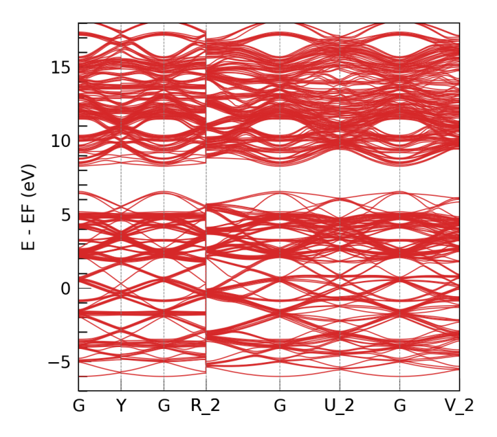

# **DeePTB** Tutorial 4 | Training Silicon's E3 Equivariant Electronic Structure Model [v2.2]

<div style="color:black; background-color:#FFF3E9; border: 1px solid #FFE0C3; border-radius: 10px; margin-bottom:1rem">
    <p style="margin:1rem; padding-left: 1rem; line-height: 2.5;">
        ©️ <b><i>Copyright 2024 @ Authors</i></b><br/>
        Author: <a href="mailto:zhouyinzhanghao@gmail.com">Zhanghao Zhouyin 📨 </a> <br/>
        Data: 2025-04-27<br/>
        Liscence: This notebook is authorized under <a rel="license" href="http://creativecommons.org/licenses/by-nc-sa/4.0/">CC BY-NC-SA 4.0</a></i><br/>
        Quick Start: click the above <span style="background-color:rgb(85, 91, 228); color:white; padding: 3px; border-radius: 5px;box-shadow: 2px 2px 3px rgba(0, 0, 0, 0.3); font-size:0.75rem;">Start Connection</span> And wait for a second to start.
    </p>
</div>

## Introduction
**DeePTB** is a method that uses deep learning to accelerate first-principles electronic structure simulations.

### Version Features
- **v1**: Constructed tight-binding (TB) models with first-principles accuracy (DeePTB-SK)
- **v2.0-2.1**: Added E3 equivariant networks to represent single-electron operators (Hamiltonian, density matrix, and overlap matrix) (DeePTB-E3)
- **v2.2**: Incorporated built-in SK empirical parameters covering commonly used elements across the periodic table

Through these capabilities, DeePTB provides multiple approaches to accelerate electronic structure simulations of materials.

### Learning Objectives
1. Understanding how to setup DeePTB-E3 model to train on equivariant LCAO Kohn-Sham (KS) Hamiltonian.
2. Get a highly accurate DeePTB-E3 model of single crystal silicon.
3. Get familiar with DeePTB's properties calculation module.

## Content

* [Method](#method)
  * [1. What is DeePTB-E3](#whatis)
  * [2. What to do with DeePTB-E3](#whattodo)
* [Practice](#practice)
  * [1. Prepare the data](#dataprepare)
  * [2. Model Training](#train)
  * [3. Properties Calculation](#application)
* [More Method](#moremethod)
  * [Parametrize E3 features](#e3representation)
  * [Invariant Representation of Overlap Matrix](#overlaprepresentation)
  * [Model Structure](#modelarchitecture)

## Method: <a id ='method'></a>
Here we briefly introduce the method of DeePTB-E3 from its functional and operational perspective. For more theoretical and technical parts, please refer to the [**More Method**](#moremethod) section or our paper: [SLEM ICLR2025](https://openreview.net/pdf?id=kpq3IIjUD3).
### What is DeePTB-E3: <a id = 'whatis'></a>
**DeePTB-E3** is a flexible function in DeePTB package supporting training a neural network model to predict directly the LCAO Quantum Operators, including Hamiltonian, Density Matrix and Overlap Matrix of Kohn-Sham DFT. The training data are generated directly via LCAO DFT packages. We employ a strictly local equivariant model, that preserves the physics, which enables efficient learning and a reduced amount of data required.

### What to do with DeePTB-E3 <a id = 'whattodo'></a>
DeePTB-E3 model, after being trained, can predict DFT Hamiltonian with an extremely lower cost than conventional DFT. You can use DeePTB-E3:
1. Do high-throughput calculations on Molecular Dynamics trajectory, combinations of structure, elements etc.
2. Predicting on large structure while training on the dataset of smaller ones.

## Practice <a id ='practice'></a>

### **1. Prepare the Data** <a id ='dataprepare'></a>

DeePTB need to calculate output from the LCAO DFT as the input dataset.

For illustration, we have prepared the dataset including crystalline silicon in DeePTB/examples/e3/data folder. The data are generated via ABACUS DFT software, using an SZP basis, containing one s and one p orbital. The cutoff of the LCAO basis is 7au, which indicates the largest bond should be smaller than 14au, which is around 7.408 angstrom. In DeePTB, we use angstroms as our length unit, and eV as the energy unit.

To make life easier, we provide [dftio](https://github.com/floatingCatty/dftio) to transform the DFT output data into a trainable dataset format, we refer to the former tutorial and the front page of [dftio](https://github.com/floatingCatty/dftio) repository for usage guide.

The directory of these examples looks like：
```bash
deeptb/examples/e3/
|-- band.json
|-- band_plot.py
|-- data
|   |-- Si64.0
|   |   |-- atomic_numbers.dat
|   |   |-- basis.dat
|   |   |-- cell.dat
|   |   |-- hamiltonians.h5
|   |   |-- kpoints.npy
|   |   |-- overlaps.h5
|   |   |-- pbc.dat
|   |   `-- positions.dat
|   |-- Si64.vasp
|   `-- info.json
|-- input_short.json
|-- input_short_cpu.json
`-- ref_model
    `-- nnenv.ep1474.pth
```

We can see the data folder contains a single frame Si.0. To inform the **DeePTB** that this is a dataset, we need to write a very simple `info.json', as:
```JSON
{
        "nframes": 1,
        "pos_type": "cart",
        "pbc": true
}
```
Where 'nframes' indicates the `Si64.0` folder contains only a single structure, `pos_type` suggests the `positions.dat` is written with absolute position. and `pbc` suggest it is a system with periodic boundary conditions on all `x`, `y` and `z` plains.

Now we have already prepared a training dataset for DeePTB-E3.

**To make life easier**, we highly recommend using **dftio** to prepare the data. With the DFT output, dftio can preprocess the data in parallel with only one line of command. Here we give an example to show.


```python
import os
os.chdir("/root/soft/dftio/test/data")
```

In the folder, there sits an abacus DFT calculation results. The directory looks like:
```
abacus
|-- INPUT
|-- OUT.ABACUS
|   |-- INPUT
|   |-- STRU_SIMPLE.cif
|   |-- data-HR-sparse_SPIN0.csr
|   |-- istate.info
|   |-- kpoints
|   |-- running_scf.log
|   `-- warning.log
`-- STRU
```

We can transform this into the machine learning readable format with one line:


```python
!dftio parse -r ./ -p abacus -o ./test -ham
```

    /opt/mamba/lib/python3.10/site-packages/dpdata/system.py:1106: UserWarning: Data type move is registered twice; only the newly registered one will be used.
      warnings.warn(
    Parsing the DFT files: 100%|██████████████████████| 1/1 [00:00<00:00,  2.22it/s]


```python
!tree test
```

    test
    └── MoS2.0
        ├── atomic_numbers.dat
        ├── basis.dat
        ├── cell.dat
        ├── hamiltonians.h5
        ├── pbc.dat
        └── positions.dat
    
    1 directory, 6 files


You can see the test folder we generated, containing  the prepared data of a single MoS2 frame with its Hamiltonian. The command has several options. Here, the `-r` and `-p` indicate the root and prefix of the DFT output folders to be processed. For example, for a current folder with abacus as its name, we use `-r ./` and `-p abacus`. The `-p` is the prefix that anchors on all the folders with this prefix string; therefore, by a single line, we can locate multiple DFT outputs. `-o` indicates the output directory, containing the processed data. Those are the essential flags.

Now, to decide which data should be processed, we need to specify the parsing of physical quantities. The tag includes `-ham`, `-ovp`, `-dm`, `-eig`, representing the Hamiltonian, Overlap Matrix, Density Matrix and the kpoints \& energy eigenvalues. Here we use `-ham` so the processed folder will contain `hamiltonians.h5` parsed from `data-HR-sparse_SPIN0.csr` of the abacus output.

In extra, we can specify the DFT software used to generated your raw data by `-m`. The default `-m` value are `abacus`. Other supported DFT software includes: `gaussian`, `vasp`, `rescu` and `siesta`.

If you have a large amount of data, to parse it efficiently, you can use `-n j` tag to launch the j processors simultaneously to handle the data.

### **2. Model Training** <a id ='train'></a>

The `input_short.json` file contains the least number of parameters that are required to start training the DeePTB-E3 model, we list some important parameters:

```JSON
"common_options": {
    "basis": {
        "Si": "1s1p"
    },
    "device": "cpu",
    "overlap": true
}
```
In `common_options`, here are the essential parameters. The `basis` should align with the DFT calculation, so 1 `s` and 1 `p` orbitals would result in a `1s1p` basis. The `device` can either be `cpu` or `cuda`, but we highly recommend using `cuda` if GPU is available. The `overlap` tag controls whether to fit the overlap matrix together. Benefitting from our parameterization, the fitting overlap only brings **negligible costs**, but is very convenient when using the model. So we highly suggest that you to do it.

Here comes the `model_options`:
```JSON
"model_options": {
    "embedding": {
        "method": "slem",
        "r_max": {
            "Si": 7.4
        },
        "irreps_hidden": "32x0e+32x1o+16x2e",
        "n_layers": 3,
        "avg_num_neighbors": 51,
        "tp_radial_emb": true
    },
    "prediction":{
        "method": "e3tb",
        "neurons": [64,64]
    }
}
```

The `model_options` contains `embedding` and `prediction` parts, denoting the construction of representation for equivariant features, and arranging and rescaling the features into quantum operators sub-blocks such as Hamiltonian, density and overlap matrix.

In `embedding`, the `method` supports `slem` and `lem` for now, where `slem` has a strictly localised dependency, which has better transferability and data efficiency, while `lem` has an adjustable semi-local dependency, which has better representation capacity, but would require a little more data. 

`r_max` stands for the maximum bond length. Since the cutoff radius for the DFT LCAO orbital is 7 au, which means the largest bond would be less than 14 au. Therefore, it should be set as 7.4 angstrom.

For `irreps_hidden`, this parameter defines the size of the hidden equivariant irreducible representation, which decides most of the power of the model. There are certain rules to define this parameter. But for quick usage, we provide a tool to do basis analysis to extract essential irreps:

```IPYTHON
In [1]: from dptb.data import OrbitalMapper

In [2]: idp = OrbitalMapper(basis={"Si": "1s1p"})

In [3]: idp.get_irreps_ess()
Out[3]: 2x0e+1x1o+1x2e
```

This is the number of independent irreps contained in the basis. Irreps configured should be multiple times of this essential irreps. The number can vary with a pretty large freedom, but all the types, for example ("0e", "1o", "2e") here, should be included for all. We usually take a descending order starting from "32", "64", or "128" for the first "0e" and decay by half for the latter high-order irreps. For general rules of the irreps, the user can read the advanced topics in the DeePTB document, but for now, you are safe to ignore!

`n_layers` is the number of hidden layers of the embedding networks, usually it should be set between 3-5. `avg_num_neighbors` is the normalisation constant of the node feature.`tp_radial_emb` is a bool type value, representing whether to explicitly include radial information in the SO2 tensor product.

In `prediction`, we should use the `e3tb` method to require the model output features using **DeePTB-E3** format. The neurons are defined for a simple MLP to predict the slater-koster-like parameters for predicting the overlap matrix, for which [64,64] is usually fine.

Now everything is prepared! We can using the following command and we can train the first model:


```python
import os
os.chdir("/root/soft/DeePTB/examples/e3")
```


```python
# Run the training
# GPU: 
!dptb train ././input_short_cpu.json -o ./e3_silicon
# If GPU is not available, please comment the line above and use the command below.
#!dptb train ./input_short_cpu.json -o ./e3_silicon
```

    TBPLaS is not installed. Thus the TBPLaS is not available, Please install it first.
     
     
    #################################################################################
    #                                                                               #
    #                                                                               #
    #      ██████████                     ███████████  ███████████ ███████████      #
    #     ░░███░░░░███                   ░░███░░░░░███░█░░░███░░░█░░███░░░░░███     #
    #      ░███   ░░███  ██████   ██████  ░███    ░███░   ░███  ░  ░███    ░███     #
    #      ░███    ░███ ███░░███ ███░░███ ░██████████     ░███     ░██████████      #
    #      ░███    ░███░███████ ░███████  ░███░░░░░░      ░███     ░███░░░░░███     #
    #      ░███    ███ ░███░░░  ░███░░░   ░███            ░███     ░███    ░███     #
    #      ██████████  ░░██████ ░░██████  █████           █████    ███████████      #
    #     ░░░░░░░░░░    ░░░░░░   ░░░░░░  ░░░░░           ░░░░░    ░░░░░░░░░░░       #
    #                                                                               #
    #                         Version: 2.0.4.dev93+ea00a42                          #
    #                                                                               #
    #################################################################################
     
     
    DEEPTB INFO    ------------------------------------------------------------------
    DEEPTB INFO         Cutoff options:                                            
    DEEPTB INFO                                                                    
    DEEPTB INFO         r_max            : {'Si': 7.4}                             
    DEEPTB INFO         er_max           : None                                    
    DEEPTB INFO         oer_max          : None                                    
    DEEPTB INFO    ------------------------------------------------------------------
    DEEPTB INFO    A public `info.json` file is provided, and will be used by the subfolders who do not have their own `info.json` file.
    Processing dataset...
    Loading data:   0%|                                       | 0/1 [00:00<?, ?it/s]/opt/mamba/lib/python3.10/site-packages/dptb/data/AtomicData.py:966: UserWarning: The given NumPy array is not writable, and PyTorch does not support non-writable tensors. This means writing to this tensor will result in undefined behavior. You may want to copy the array to protect its data or make it writable before converting it to a tensor. This type of warning will be suppressed for the rest of this program. (Triggered internally at ../torch/csrc/utils/tensor_numpy.cpp:206.)
      cell_tensor = torch.as_tensor(temp_cell, device=out_device, dtype=out_dtype)
    Loading data: 100%|███████████████████████████████| 1/1 [00:02<00:00,  2.60s/it]
    DEEPTB INFO    Loaded data: Batch(atomic_numbers=[64, 1], batch=[64], cell=[1, 3, 3], edge_cell_shift=[5504, 3], edge_features=[5504, 13], edge_index=[2, 5504], edge_overlap=[5504, 13], node_features=[64, 13], node_overlap=[64, 13], node_soc=[64, 1], node_soc_switch=[1, 1], pbc=[1, 3], pos=[64, 3], ptr=[2])
        processed data size: ~0.70 MB
    DEEPTB INFO    Cached processed data to disk
    Done!
    DEEPTB WARNING The cutoffs in data and model are not checked. be careful!
    DEEPTB INFO    iteration:1	train_loss: 4.057921  (1.217376)	lr: 0.005
    DEEPTB INFO    Epoch 1 summary:	train_loss: 4.057921	
    ---------------------------------------------------------------------------------
    DEEPTB INFO    checkpoint saved as nnenv.ep1
    DEEPTB INFO    iteration:2	train_loss: 2.491091  (1.599491)	lr: 0.005
    DEEPTB INFO    Epoch 2 summary:	train_loss: 2.491091	
    ---------------------------------------------------------------------------------
    DEEPTB INFO    checkpoint saved as nnenv.ep2
    DEEPTB INFO    iteration:3	train_loss: 1.070014  (1.440648)	lr: 0.005
    DEEPTB INFO    Epoch 3 summary:	train_loss: 1.070014	
    ---------------------------------------------------------------------------------
    DEEPTB INFO    checkpoint saved as nnenv.ep3
    DEEPTB INFO    iteration:4	train_loss: 0.422746  (1.135277)	lr: 0.005
    DEEPTB INFO    Epoch 4 summary:	train_loss: 0.422746	
    ---------------------------------------------------------------------------------
    DEEPTB INFO    checkpoint saved as nnenv.ep4
    DEEPTB INFO    iteration:5	train_loss: 0.785792  (1.030432)	lr: 0.005
    DEEPTB INFO    Epoch 5 summary:	train_loss: 0.785792	
    ---------------------------------------------------------------------------------
    DEEPTB INFO    iteration:6	train_loss: 0.780858  (0.955559)	lr: 0.005
    DEEPTB INFO    Epoch 6 summary:	train_loss: 0.780858	
    ---------------------------------------------------------------------------------
    DEEPTB INFO    iteration:7	train_loss: 0.606355  (0.850798)	lr: 0.005
    DEEPTB INFO    Epoch 7 summary:	train_loss: 0.606355	
    ---------------------------------------------------------------------------------
    DEEPTB INFO    iteration:8	train_loss: 0.326431  (0.693488)	lr: 0.005
    DEEPTB INFO    Epoch 8 summary:	train_loss: 0.326431	
    ---------------------------------------------------------------------------------
    DEEPTB INFO    checkpoint saved as nnenv.ep8
    DEEPTB INFO    iteration:9	train_loss: 0.133232  (0.525411)	lr: 0.005
    DEEPTB INFO    Epoch 9 summary:	train_loss: 0.133232	
    ---------------------------------------------------------------------------------
    DEEPTB INFO    checkpoint saved as nnenv.ep9
    DEEPTB INFO    iteration:10	train_loss: 0.281272  (0.452170)	lr: 0.005
    DEEPTB INFO    Epoch 10 summary:	train_loss: 0.281272	
    ---------------------------------------------------------------------------------
    DEEPTB INFO    iteration:11	train_loss: 0.280965  (0.400808)	lr: 0.005
    DEEPTB INFO    Epoch 11 summary:	train_loss: 0.280965	
    ---------------------------------------------------------------------------------
    DEEPTB INFO    iteration:12	train_loss: 0.177413  (0.333790)	lr: 0.005
    DEEPTB INFO    Epoch 12 summary:	train_loss: 0.177413	
    ---------------------------------------------------------------------------------
    DEEPTB INFO    iteration:13	train_loss: 0.101398  (0.264072)	lr: 0.005
    DEEPTB INFO    Epoch 13 summary:	train_loss: 0.101398	
    ---------------------------------------------------------------------------------
    DEEPTB INFO    checkpoint saved as nnenv.ep13
    DEEPTB INFO    iteration:14	train_loss: 0.174551  (0.237216)	lr: 0.005
    DEEPTB INFO    Epoch 14 summary:	train_loss: 0.174551	
    ---------------------------------------------------------------------------------
    DEEPTB INFO    iteration:15	train_loss: 0.163386  (0.215067)	lr: 0.005
    DEEPTB INFO    Epoch 15 summary:	train_loss: 0.163386	
    ---------------------------------------------------------------------------------
    DEEPTB INFO    iteration:16	train_loss: 0.087191  (0.176704)	lr: 0.005
    DEEPTB INFO    Epoch 16 summary:	train_loss: 0.087191	
    ---------------------------------------------------------------------------------
    DEEPTB INFO    checkpoint saved as nnenv.ep16
    DEEPTB INFO    iteration:17	train_loss: 0.124240  (0.160965)	lr: 0.005
    DEEPTB INFO    Epoch 17 summary:	train_loss: 0.124240	
    ---------------------------------------------------------------------------------
    DEEPTB INFO    iteration:18	train_loss: 0.158407  (0.160197)	lr: 0.005
    DEEPTB INFO    Epoch 18 summary:	train_loss: 0.158407	
    ---------------------------------------------------------------------------------
    DEEPTB INFO    iteration:19	train_loss: 0.124230  (0.149407)	lr: 0.005
    DEEPTB INFO    Epoch 19 summary:	train_loss: 0.124230	
    ---------------------------------------------------------------------------------
    DEEPTB INFO    iteration:20	train_loss: 0.066253  (0.124461)	lr: 0.005
    DEEPTB INFO    Epoch 20 summary:	train_loss: 0.066253	
    ---------------------------------------------------------------------------------
    DEEPTB INFO    checkpoint saved as nnenv.ep20
    DEEPTB INFO    iteration:21	train_loss: 0.113355  (0.121129)	lr: 0.005
    DEEPTB INFO    Epoch 21 summary:	train_loss: 0.113355	
    ---------------------------------------------------------------------------------
    DEEPTB INFO    iteration:22	train_loss: 0.118690  (0.120398)	lr: 0.005
    DEEPTB INFO    Epoch 22 summary:	train_loss: 0.118690	
    ---------------------------------------------------------------------------------
    DEEPTB INFO    iteration:23	train_loss: 0.075010  (0.106781)	lr: 0.005
    DEEPTB INFO    Epoch 23 summary:	train_loss: 0.075010	
    ---------------------------------------------------------------------------------
    DEEPTB INFO    iteration:24	train_loss: 0.085715  (0.100461)	lr: 0.005
    DEEPTB INFO    Epoch 24 summary:	train_loss: 0.085715	
    ---------------------------------------------------------------------------------
    DEEPTB INFO    iteration:25	train_loss: 0.107396  (0.102542)	lr: 0.005
    DEEPTB INFO    Epoch 25 summary:	train_loss: 0.107396	
    ---------------------------------------------------------------------------------
    DEEPTB INFO    iteration:26	train_loss: 0.082841  (0.096632)	lr: 0.005
    DEEPTB INFO    Epoch 26 summary:	train_loss: 0.082841	
    ---------------------------------------------------------------------------------
    DEEPTB INFO    iteration:27	train_loss: 0.061607  (0.086124)	lr: 0.005
    DEEPTB INFO    Epoch 27 summary:	train_loss: 0.061607	
    ---------------------------------------------------------------------------------
    DEEPTB INFO    checkpoint saved as nnenv.ep27
    DEEPTB INFO    iteration:28	train_loss: 0.085341  (0.085889)	lr: 0.005
    DEEPTB INFO    Epoch 28 summary:	train_loss: 0.085341	
    ---------------------------------------------------------------------------------
    DEEPTB INFO    iteration:29	train_loss: 0.074434  (0.082453)	lr: 0.005
    DEEPTB INFO    Epoch 29 summary:	train_loss: 0.074434	
    ---------------------------------------------------------------------------------
    DEEPTB INFO    iteration:30	train_loss: 0.055672  (0.074419)	lr: 0.005
    DEEPTB INFO    Epoch 30 summary:	train_loss: 0.055672	
    ---------------------------------------------------------------------------------
    DEEPTB INFO    checkpoint saved as nnenv.ep30
    DEEPTB INFO    iteration:31	train_loss: 0.070966  (0.073383)	lr: 0.005
    DEEPTB INFO    Epoch 31 summary:	train_loss: 0.070966	
    ---------------------------------------------------------------------------------
    DEEPTB INFO    iteration:32	train_loss: 0.061777  (0.069901)	lr: 0.005
    DEEPTB INFO    Epoch 32 summary:	train_loss: 0.061777	
    ---------------------------------------------------------------------------------
    DEEPTB INFO    iteration:33	train_loss: 0.053785  (0.065066)	lr: 0.005
    DEEPTB INFO    Epoch 33 summary:	train_loss: 0.053785	
    ---------------------------------------------------------------------------------
    DEEPTB INFO    checkpoint saved as nnenv.ep33
    DEEPTB INFO    iteration:34	train_loss: 0.066120  (0.065382)	lr: 0.005
    DEEPTB INFO    Epoch 34 summary:	train_loss: 0.066120	
    ---------------------------------------------------------------------------------
    DEEPTB INFO    iteration:35	train_loss: 0.051772  (0.061299)	lr: 0.005
    DEEPTB INFO    Epoch 35 summary:	train_loss: 0.051772	
    ---------------------------------------------------------------------------------
    DEEPTB INFO    checkpoint saved as nnenv.ep35
    DEEPTB INFO    iteration:36	train_loss: 0.055061  (0.059428)	lr: 0.005
    DEEPTB INFO    Epoch 36 summary:	train_loss: 0.055061	
    ---------------------------------------------------------------------------------
    DEEPTB INFO    iteration:37	train_loss: 0.057663  (0.058898)	lr: 0.005
    DEEPTB INFO    Epoch 37 summary:	train_loss: 0.057663	
    ---------------------------------------------------------------------------------
    DEEPTB INFO    iteration:38	train_loss: 0.045608  (0.054911)	lr: 0.005
    DEEPTB INFO    Epoch 38 summary:	train_loss: 0.045608	
    ---------------------------------------------------------------------------------
    DEEPTB INFO    checkpoint saved as nnenv.ep38
    DEEPTB INFO    iteration:39	train_loss: 0.053227  (0.054406)	lr: 0.005
    DEEPTB INFO    Epoch 39 summary:	train_loss: 0.053227	
    ---------------------------------------------------------------------------------
    DEEPTB INFO    iteration:40	train_loss: 0.047542  (0.052347)	lr: 0.005
    DEEPTB INFO    Epoch 40 summary:	train_loss: 0.047542	
    ---------------------------------------------------------------------------------
    DEEPTB INFO    iteration:41	train_loss: 0.047488  (0.050889)	lr: 0.005
    DEEPTB INFO    Epoch 41 summary:	train_loss: 0.047488	
    ---------------------------------------------------------------------------------
    DEEPTB INFO    iteration:42	train_loss: 0.049498  (0.050472)	lr: 0.005
    DEEPTB INFO    Epoch 42 summary:	train_loss: 0.049498	
    ---------------------------------------------------------------------------------
    DEEPTB INFO    iteration:43	train_loss: 0.042938  (0.048212)	lr: 0.005
    DEEPTB INFO    Epoch 43 summary:	train_loss: 0.042938	
    ---------------------------------------------------------------------------------
    DEEPTB INFO    checkpoint saved as nnenv.ep43
    DEEPTB INFO    iteration:44	train_loss: 0.047090  (0.047875)	lr: 0.005
    DEEPTB INFO    Epoch 44 summary:	train_loss: 0.047090	
    ---------------------------------------------------------------------------------
    DEEPTB INFO    iteration:45	train_loss: 0.043288  (0.046499)	lr: 0.005
    DEEPTB INFO    Epoch 45 summary:	train_loss: 0.043288	
    ---------------------------------------------------------------------------------
    DEEPTB INFO    iteration:46	train_loss: 0.044282  (0.045834)	lr: 0.005
    DEEPTB INFO    Epoch 46 summary:	train_loss: 0.044282	
    ---------------------------------------------------------------------------------
    DEEPTB INFO    iteration:47	train_loss: 0.043308  (0.045076)	lr: 0.005
    DEEPTB INFO    Epoch 47 summary:	train_loss: 0.043308	
    ---------------------------------------------------------------------------------
    DEEPTB INFO    iteration:48	train_loss: 0.042254  (0.044229)	lr: 0.005
    DEEPTB INFO    Epoch 48 summary:	train_loss: 0.042254	
    ---------------------------------------------------------------------------------
    DEEPTB INFO    checkpoint saved as nnenv.ep48
    DEEPTB INFO    iteration:49	train_loss: 0.043043  (0.043873)	lr: 0.005
    DEEPTB INFO    Epoch 49 summary:	train_loss: 0.043043	
    ---------------------------------------------------------------------------------
    DEEPTB INFO    iteration:50	train_loss: 0.040145  (0.042755)	lr: 0.005
    DEEPTB INFO    Epoch 50 summary:	train_loss: 0.040145	
    ---------------------------------------------------------------------------------
    DEEPTB INFO    checkpoint saved as nnenv.ep50
    DEEPTB INFO    iteration:51	train_loss: 0.042072  (0.042550)	lr: 0.005
    DEEPTB INFO    Epoch 51 summary:	train_loss: 0.042072	
    ---------------------------------------------------------------------------------
    DEEPTB INFO    iteration:52	train_loss: 0.039070  (0.041506)	lr: 0.005
    DEEPTB INFO    Epoch 52 summary:	train_loss: 0.039070	
    ---------------------------------------------------------------------------------
    DEEPTB INFO    checkpoint saved as nnenv.ep52
    DEEPTB INFO    iteration:53	train_loss: 0.041040  (0.041366)	lr: 0.005
    DEEPTB INFO    Epoch 53 summary:	train_loss: 0.041040	
    ---------------------------------------------------------------------------------
    DEEPTB INFO    iteration:54	train_loss: 0.038863  (0.040615)	lr: 0.005
    DEEPTB INFO    Epoch 54 summary:	train_loss: 0.038863	
    ---------------------------------------------------------------------------------
    DEEPTB INFO    checkpoint saved as nnenv.ep54
    DEEPTB INFO    iteration:55	train_loss: 0.039848  (0.040385)	lr: 0.005
    DEEPTB INFO    Epoch 55 summary:	train_loss: 0.039848	
    ---------------------------------------------------------------------------------
    DEEPTB INFO    iteration:56	train_loss: 0.039217  (0.040035)	lr: 0.005
    DEEPTB INFO    Epoch 56 summary:	train_loss: 0.039217	
    ---------------------------------------------------------------------------------
    DEEPTB INFO    iteration:57	train_loss: 0.039544  (0.039888)	lr: 0.005
    DEEPTB INFO    Epoch 57 summary:	train_loss: 0.039544	
    ---------------------------------------------------------------------------------
    DEEPTB INFO    iteration:58	train_loss: 0.038584  (0.039496)	lr: 0.005
    DEEPTB INFO    Epoch 58 summary:	train_loss: 0.038584	
    ---------------------------------------------------------------------------------
    DEEPTB INFO    checkpoint saved as nnenv.ep58
    DEEPTB INFO    iteration:59	train_loss: 0.038796  (0.039286)	lr: 0.005
    DEEPTB INFO    Epoch 59 summary:	train_loss: 0.038796	
    ---------------------------------------------------------------------------------
    DEEPTB INFO    iteration:60	train_loss: 0.038186  (0.038956)	lr: 0.005
    DEEPTB INFO    Epoch 60 summary:	train_loss: 0.038186	
    ---------------------------------------------------------------------------------
    DEEPTB INFO    checkpoint saved as nnenv.ep60
    DEEPTB INFO    iteration:61	train_loss: 0.037944  (0.038653)	lr: 0.005
    DEEPTB INFO    Epoch 61 summary:	train_loss: 0.037944	
    ---------------------------------------------------------------------------------
    DEEPTB INFO    checkpoint saved as nnenv.ep61
    DEEPTB INFO    iteration:62	train_loss: 0.038214  (0.038521)	lr: 0.005
    DEEPTB INFO    Epoch 62 summary:	train_loss: 0.038214	
    ---------------------------------------------------------------------------------
    DEEPTB INFO    iteration:63	train_loss: 0.037872  (0.038326)	lr: 0.005
    DEEPTB INFO    Epoch 63 summary:	train_loss: 0.037872	
    ---------------------------------------------------------------------------------
    DEEPTB INFO    checkpoint saved as nnenv.ep63
    DEEPTB INFO    iteration:64	train_loss: 0.036898  (0.037898)	lr: 0.005
    DEEPTB INFO    Epoch 64 summary:	train_loss: 0.036898	
    ---------------------------------------------------------------------------------
    DEEPTB INFO    checkpoint saved as nnenv.ep64
    DEEPTB INFO    iteration:65	train_loss: 0.038428  (0.038057)	lr: 0.005
    DEEPTB INFO    Epoch 65 summary:	train_loss: 0.038428	
    ---------------------------------------------------------------------------------
    DEEPTB INFO    iteration:66	train_loss: 0.037010  (0.037743)	lr: 0.005
    DEEPTB INFO    Epoch 66 summary:	train_loss: 0.037010	
    ---------------------------------------------------------------------------------
    DEEPTB INFO    iteration:67	train_loss: 0.037297  (0.037609)	lr: 0.005
    DEEPTB INFO    Epoch 67 summary:	train_loss: 0.037297	
    ---------------------------------------------------------------------------------
    DEEPTB INFO    iteration:68	train_loss: 0.037782  (0.037661)	lr: 0.005
    DEEPTB INFO    Epoch 68 summary:	train_loss: 0.037782	
    ---------------------------------------------------------------------------------
    DEEPTB INFO    iteration:69	train_loss: 0.036837  (0.037414)	lr: 0.005
    DEEPTB INFO    Epoch 69 summary:	train_loss: 0.036837	
    ---------------------------------------------------------------------------------
    DEEPTB INFO    checkpoint saved as nnenv.ep69
    DEEPTB INFO    iteration:70	train_loss: 0.039009  (0.037892)	lr: 0.005
    DEEPTB INFO    Epoch 70 summary:	train_loss: 0.039009	
    ---------------------------------------------------------------------------------
    DEEPTB INFO    iteration:71	train_loss: 0.038007  (0.037927)	lr: 0.005
    DEEPTB INFO    Epoch 71 summary:	train_loss: 0.038007	
    ---------------------------------------------------------------------------------
    DEEPTB INFO    iteration:72	train_loss: 0.037337  (0.037750)	lr: 0.005
    DEEPTB INFO    Epoch 72 summary:	train_loss: 0.037337	
    ---------------------------------------------------------------------------------
    DEEPTB INFO    iteration:73	train_loss: 0.037631  (0.037714)	lr: 0.005
    DEEPTB INFO    Epoch 73 summary:	train_loss: 0.037631	
    ---------------------------------------------------------------------------------
    DEEPTB INFO    iteration:74	train_loss: 0.036116  (0.037235)	lr: 0.005
    DEEPTB INFO    Epoch 74 summary:	train_loss: 0.036116	
    ---------------------------------------------------------------------------------
    DEEPTB INFO    checkpoint saved as nnenv.ep74
    DEEPTB INFO    iteration:75	train_loss: 0.036648  (0.037059)	lr: 0.005
    DEEPTB INFO    Epoch 75 summary:	train_loss: 0.036648	
    ---------------------------------------------------------------------------------
    DEEPTB INFO    iteration:76	train_loss: 0.036538  (0.036902)	lr: 0.005
    DEEPTB INFO    Epoch 76 summary:	train_loss: 0.036538	
    ---------------------------------------------------------------------------------
    DEEPTB INFO    iteration:77	train_loss: 0.036015  (0.036636)	lr: 0.005
    DEEPTB INFO    Epoch 77 summary:	train_loss: 0.036015	
    ---------------------------------------------------------------------------------
    DEEPTB INFO    checkpoint saved as nnenv.ep77
    DEEPTB INFO    iteration:78	train_loss: 0.036485  (0.036591)	lr: 0.005
    DEEPTB INFO    Epoch 78 summary:	train_loss: 0.036485	
    ---------------------------------------------------------------------------------
    DEEPTB INFO    iteration:79	train_loss: 0.035123  (0.036150)	lr: 0.005
    DEEPTB INFO    Epoch 79 summary:	train_loss: 0.035123	
    ---------------------------------------------------------------------------------
    DEEPTB INFO    checkpoint saved as nnenv.ep79
    DEEPTB INFO    iteration:80	train_loss: 0.036663  (0.036304)	lr: 0.005
    DEEPTB INFO    Epoch 80 summary:	train_loss: 0.036663	
    ---------------------------------------------------------------------------------
    DEEPTB INFO    iteration:81	train_loss: 0.035845  (0.036166)	lr: 0.005
    DEEPTB INFO    Epoch 81 summary:	train_loss: 0.035845	
    ---------------------------------------------------------------------------------
    DEEPTB INFO    iteration:82	train_loss: 0.036678  (0.036320)	lr: 0.005
    DEEPTB INFO    Epoch 82 summary:	train_loss: 0.036678	
    ---------------------------------------------------------------------------------
    DEEPTB INFO    iteration:83	train_loss: 0.036997  (0.036523)	lr: 0.005
    DEEPTB INFO    Epoch 83 summary:	train_loss: 0.036997	
    ---------------------------------------------------------------------------------
    DEEPTB INFO    iteration:84	train_loss: 0.035507  (0.036218)	lr: 0.005
    DEEPTB INFO    Epoch 84 summary:	train_loss: 0.035507	
    ---------------------------------------------------------------------------------
    DEEPTB INFO    iteration:85	train_loss: 0.035927  (0.036131)	lr: 0.005
    DEEPTB INFO    Epoch 85 summary:	train_loss: 0.035927	
    ---------------------------------------------------------------------------------
    DEEPTB INFO    iteration:86	train_loss: 0.034786  (0.035727)	lr: 0.005
    DEEPTB INFO    Epoch 86 summary:	train_loss: 0.034786	
    ---------------------------------------------------------------------------------
    DEEPTB INFO    checkpoint saved as nnenv.ep86
    DEEPTB INFO    iteration:87	train_loss: 0.036342  (0.035912)	lr: 0.005
    DEEPTB INFO    Epoch 87 summary:	train_loss: 0.036342	
    ---------------------------------------------------------------------------------
    DEEPTB INFO    iteration:88	train_loss: 0.035544  (0.035802)	lr: 0.005
    DEEPTB INFO    Epoch 88 summary:	train_loss: 0.035544	
    ---------------------------------------------------------------------------------
    DEEPTB INFO    iteration:89	train_loss: 0.035370  (0.035672)	lr: 0.005
    DEEPTB INFO    Epoch 89 summary:	train_loss: 0.035370	
    ---------------------------------------------------------------------------------
    DEEPTB INFO    iteration:90	train_loss: 0.035419  (0.035596)	lr: 0.005
    DEEPTB INFO    Epoch 90 summary:	train_loss: 0.035419	
    ---------------------------------------------------------------------------------
    DEEPTB INFO    iteration:91	train_loss: 0.034694  (0.035326)	lr: 0.005
    DEEPTB INFO    Epoch 91 summary:	train_loss: 0.034694	
    ---------------------------------------------------------------------------------
    DEEPTB INFO    checkpoint saved as nnenv.ep91
    DEEPTB INFO    iteration:92	train_loss: 0.035247  (0.035302)	lr: 0.005
    DEEPTB INFO    Epoch 92 summary:	train_loss: 0.035247	
    ---------------------------------------------------------------------------------
    DEEPTB INFO    iteration:93	train_loss: 0.035039  (0.035223)	lr: 0.005
    DEEPTB INFO    Epoch 93 summary:	train_loss: 0.035039	
    ---------------------------------------------------------------------------------
    DEEPTB INFO    iteration:94	train_loss: 0.034483  (0.035001)	lr: 0.005
    DEEPTB INFO    Epoch 94 summary:	train_loss: 0.034483	
    ---------------------------------------------------------------------------------
    DEEPTB INFO    checkpoint saved as nnenv.ep94
    DEEPTB INFO    iteration:95	train_loss: 0.034927  (0.034979)	lr: 0.005
    DEEPTB INFO    Epoch 95 summary:	train_loss: 0.034927	
    ---------------------------------------------------------------------------------
    DEEPTB INFO    iteration:96	train_loss: 0.034440  (0.034817)	lr: 0.005
    DEEPTB INFO    Epoch 96 summary:	train_loss: 0.034440	
    ---------------------------------------------------------------------------------
    DEEPTB INFO    checkpoint saved as nnenv.ep96
    DEEPTB INFO    iteration:97	train_loss: 0.033834  (0.034523)	lr: 0.005
    DEEPTB INFO    Epoch 97 summary:	train_loss: 0.033834	
    ---------------------------------------------------------------------------------
    DEEPTB INFO    checkpoint saved as nnenv.ep97
    DEEPTB INFO    iteration:98	train_loss: 0.033914  (0.034340)	lr: 0.005
    DEEPTB INFO    Epoch 98 summary:	train_loss: 0.033914	
    ---------------------------------------------------------------------------------
    DEEPTB INFO    iteration:99	train_loss: 0.033444  (0.034071)	lr: 0.005
    DEEPTB INFO    Epoch 99 summary:	train_loss: 0.033444	
    ---------------------------------------------------------------------------------
    DEEPTB INFO    checkpoint saved as nnenv.ep99
    DEEPTB INFO    iteration:100	train_loss: 0.033369  (0.033861)	lr: 0.005
    DEEPTB INFO    checkpoint saved as nnenv.iter100
    DEEPTB INFO    Epoch 100 summary:	train_loss: 0.033369	
    ---------------------------------------------------------------------------------
    DEEPTB INFO    checkpoint saved as nnenv.ep100
    DEEPTB INFO    iteration:101	train_loss: 0.033535  (0.033763)	lr: 0.005
    DEEPTB INFO    Epoch 101 summary:	train_loss: 0.033535	
    ---------------------------------------------------------------------------------
    DEEPTB INFO    iteration:102	train_loss: 0.033022  (0.033541)	lr: 0.005
    DEEPTB INFO    Epoch 102 summary:	train_loss: 0.033022	
    ---------------------------------------------------------------------------------
    DEEPTB INFO    checkpoint saved as nnenv.ep102
    DEEPTB INFO    iteration:103	train_loss: 0.033754  (0.033605)	lr: 0.005
    DEEPTB INFO    Epoch 103 summary:	train_loss: 0.033754	
    ---------------------------------------------------------------------------------
    DEEPTB INFO    iteration:104	train_loss: 0.033225  (0.033491)	lr: 0.005
    DEEPTB INFO    Epoch 104 summary:	train_loss: 0.033225	
    ---------------------------------------------------------------------------------
    DEEPTB INFO    iteration:105	train_loss: 0.032479  (0.033187)	lr: 0.005
    DEEPTB INFO    Epoch 105 summary:	train_loss: 0.032479	
    ---------------------------------------------------------------------------------
    DEEPTB INFO    checkpoint saved as nnenv.ep105
    DEEPTB INFO    iteration:106	train_loss: 0.033360  (0.033239)	lr: 0.005
    DEEPTB INFO    Epoch 106 summary:	train_loss: 0.033360	
    ---------------------------------------------------------------------------------
    DEEPTB INFO    iteration:107	train_loss: 0.032811  (0.033111)	lr: 0.005
    DEEPTB INFO    Epoch 107 summary:	train_loss: 0.032811	
    ---------------------------------------------------------------------------------
    DEEPTB INFO    iteration:108	train_loss: 0.034102  (0.033408)	lr: 0.005
    DEEPTB INFO    Epoch 108 summary:	train_loss: 0.034102	
    ---------------------------------------------------------------------------------
    DEEPTB INFO    iteration:109	train_loss: 0.033870  (0.033547)	lr: 0.005
    DEEPTB INFO    Epoch 109 summary:	train_loss: 0.033870	
    ---------------------------------------------------------------------------------
    DEEPTB INFO    iteration:110	train_loss: 0.033086  (0.033408)	lr: 0.005
    DEEPTB INFO    Epoch 110 summary:	train_loss: 0.033086	
    ---------------------------------------------------------------------------------
    DEEPTB INFO    iteration:111	train_loss: 0.033034  (0.033296)	lr: 0.005
    DEEPTB INFO    Epoch 111 summary:	train_loss: 0.033034	
    ---------------------------------------------------------------------------------
    DEEPTB INFO    iteration:112	train_loss: 0.031440  (0.032739)	lr: 0.005
    DEEPTB INFO    Epoch 112 summary:	train_loss: 0.031440	
    ---------------------------------------------------------------------------------
    DEEPTB INFO    checkpoint saved as nnenv.ep112
    DEEPTB INFO    iteration:113	train_loss: 0.030918  (0.032193)	lr: 0.005
    DEEPTB INFO    Epoch 113 summary:	train_loss: 0.030918	
    ---------------------------------------------------------------------------------
    DEEPTB INFO    checkpoint saved as nnenv.ep113
    DEEPTB INFO    iteration:114	train_loss: 0.030842  (0.031788)	lr: 0.005
    DEEPTB INFO    Epoch 114 summary:	train_loss: 0.030842	
    ---------------------------------------------------------------------------------
    DEEPTB INFO    checkpoint saved as nnenv.ep114
    DEEPTB INFO    iteration:115	train_loss: 0.030363  (0.031360)	lr: 0.005
    DEEPTB INFO    Epoch 115 summary:	train_loss: 0.030363	
    ---------------------------------------------------------------------------------
    DEEPTB INFO    checkpoint saved as nnenv.ep115
    DEEPTB INFO    iteration:116	train_loss: 0.032689  (0.031759)	lr: 0.005
    DEEPTB INFO    Epoch 116 summary:	train_loss: 0.032689	
    ---------------------------------------------------------------------------------
    DEEPTB INFO    iteration:117	train_loss: 0.033120  (0.032167)	lr: 0.005
    DEEPTB INFO    Epoch 117 summary:	train_loss: 0.033120	
    ---------------------------------------------------------------------------------
    DEEPTB INFO    iteration:118	train_loss: 0.032067  (0.032137)	lr: 0.005
    DEEPTB INFO    Epoch 118 summary:	train_loss: 0.032067	
    ---------------------------------------------------------------------------------
    DEEPTB INFO    iteration:119	train_loss: 0.030085  (0.031522)	lr: 0.005
    DEEPTB INFO    Epoch 119 summary:	train_loss: 0.030085	
    ---------------------------------------------------------------------------------
    DEEPTB INFO    checkpoint saved as nnenv.ep119
    DEEPTB INFO    iteration:120	train_loss: 0.028798  (0.030705)	lr: 0.005
    DEEPTB INFO    Epoch 120 summary:	train_loss: 0.028798	
    ---------------------------------------------------------------------------------
    DEEPTB INFO    checkpoint saved as nnenv.ep120
    DEEPTB INFO    iteration:121	train_loss: 0.028520  (0.030049)	lr: 0.005
    DEEPTB INFO    Epoch 121 summary:	train_loss: 0.028520	
    ---------------------------------------------------------------------------------
    DEEPTB INFO    checkpoint saved as nnenv.ep121
    DEEPTB INFO    iteration:122	train_loss: 0.028476  (0.029577)	lr: 0.005
    DEEPTB INFO    Epoch 122 summary:	train_loss: 0.028476	
    ---------------------------------------------------------------------------------
    DEEPTB INFO    checkpoint saved as nnenv.ep122
    DEEPTB INFO    iteration:123	train_loss: 0.031956  (0.030291)	lr: 0.005
    DEEPTB INFO    Epoch 123 summary:	train_loss: 0.031956	
    ---------------------------------------------------------------------------------
    DEEPTB INFO    iteration:124	train_loss: 0.035378  (0.031817)	lr: 0.005
    DEEPTB INFO    Epoch 124 summary:	train_loss: 0.035378	
    ---------------------------------------------------------------------------------
    DEEPTB INFO    iteration:125	train_loss: 0.030870  (0.031533)	lr: 0.005
    DEEPTB INFO    Epoch 125 summary:	train_loss: 0.030870	
    ---------------------------------------------------------------------------------
    DEEPTB INFO    iteration:126	train_loss: 0.025875  (0.029835)	lr: 0.005
    DEEPTB INFO    Epoch 126 summary:	train_loss: 0.025875	
    ---------------------------------------------------------------------------------
    DEEPTB INFO    checkpoint saved as nnenv.ep126
    DEEPTB INFO    iteration:127	train_loss: 0.024469  (0.028226)	lr: 0.005
    DEEPTB INFO    Epoch 127 summary:	train_loss: 0.024469	
    ---------------------------------------------------------------------------------
    DEEPTB INFO    checkpoint saved as nnenv.ep127
    DEEPTB INFO    iteration:128	train_loss: 0.024859  (0.027216)	lr: 0.005
    DEEPTB INFO    Epoch 128 summary:	train_loss: 0.024859	
    ---------------------------------------------------------------------------------
    DEEPTB INFO    iteration:129	train_loss: 0.026102  (0.026882)	lr: 0.005
    DEEPTB INFO    Epoch 129 summary:	train_loss: 0.026102	
    ---------------------------------------------------------------------------------
    DEEPTB INFO    iteration:130	train_loss: 0.031274  (0.028199)	lr: 0.005
    DEEPTB INFO    Epoch 130 summary:	train_loss: 0.031274	
    ---------------------------------------------------------------------------------
    DEEPTB INFO    iteration:131	train_loss: 0.035597  (0.030419)	lr: 0.005
    DEEPTB INFO    Epoch 131 summary:	train_loss: 0.035597	
    ---------------------------------------------------------------------------------
    DEEPTB INFO    iteration:132	train_loss: 0.027875  (0.029656)	lr: 0.005
    DEEPTB INFO    Epoch 132 summary:	train_loss: 0.027875	
    ---------------------------------------------------------------------------------
    DEEPTB INFO    iteration:133	train_loss: 0.024557  (0.028126)	lr: 0.005
    DEEPTB INFO    Epoch 133 summary:	train_loss: 0.024557	
    ---------------------------------------------------------------------------------
    DEEPTB INFO    iteration:134	train_loss: 0.028213  (0.028152)	lr: 0.005
    DEEPTB INFO    Epoch 134 summary:	train_loss: 0.028213	
    ---------------------------------------------------------------------------------
    DEEPTB INFO    iteration:135	train_loss: 0.034043  (0.029919)	lr: 0.005
    DEEPTB INFO    Epoch 135 summary:	train_loss: 0.034043	
    ---------------------------------------------------------------------------------
    DEEPTB INFO    iteration:136	train_loss: 0.027523  (0.029200)	lr: 0.005
    DEEPTB INFO    Epoch 136 summary:	train_loss: 0.027523	
    ---------------------------------------------------------------------------------
    DEEPTB INFO    iteration:137	train_loss: 0.024400  (0.027760)	lr: 0.005
    DEEPTB INFO    Epoch 137 summary:	train_loss: 0.024400	
    ---------------------------------------------------------------------------------
    DEEPTB INFO    checkpoint saved as nnenv.ep137
    DEEPTB INFO    iteration:138	train_loss: 0.026989  (0.027529)	lr: 0.005
    DEEPTB INFO    Epoch 138 summary:	train_loss: 0.026989	
    ---------------------------------------------------------------------------------
    DEEPTB INFO    iteration:139	train_loss: 0.030382  (0.028385)	lr: 0.005
    DEEPTB INFO    Epoch 139 summary:	train_loss: 0.030382	
    ---------------------------------------------------------------------------------
    DEEPTB INFO    iteration:140	train_loss: 0.026161  (0.027718)	lr: 0.005
    DEEPTB INFO    Epoch 140 summary:	train_loss: 0.026161	
    ---------------------------------------------------------------------------------
    DEEPTB INFO    iteration:141	train_loss: 0.025378  (0.027016)	lr: 0.005
    DEEPTB INFO    Epoch 141 summary:	train_loss: 0.025378	
    ---------------------------------------------------------------------------------
    DEEPTB INFO    iteration:142	train_loss: 0.029724  (0.027828)	lr: 0.005
    DEEPTB INFO    Epoch 142 summary:	train_loss: 0.029724	
    ---------------------------------------------------------------------------------
    DEEPTB INFO    iteration:143	train_loss: 0.028125  (0.027917)	lr: 0.005
    DEEPTB INFO    Epoch 143 summary:	train_loss: 0.028125	
    ---------------------------------------------------------------------------------
    DEEPTB INFO    iteration:144	train_loss: 0.025823  (0.027289)	lr: 0.005
    DEEPTB INFO    Epoch 144 summary:	train_loss: 0.025823	
    ---------------------------------------------------------------------------------
    DEEPTB INFO    iteration:145	train_loss: 0.027593  (0.027380)	lr: 0.005
    DEEPTB INFO    Epoch 145 summary:	train_loss: 0.027593	
    ---------------------------------------------------------------------------------
    DEEPTB INFO    iteration:146	train_loss: 0.028018  (0.027571)	lr: 0.005
    DEEPTB INFO    Epoch 146 summary:	train_loss: 0.028018	
    ---------------------------------------------------------------------------------
    DEEPTB INFO    iteration:147	train_loss: 0.025866  (0.027060)	lr: 0.005
    DEEPTB INFO    Epoch 147 summary:	train_loss: 0.025866	
    ---------------------------------------------------------------------------------
    DEEPTB INFO    iteration:148	train_loss: 0.025485  (0.026587)	lr: 0.005
    DEEPTB INFO    Epoch 148 summary:	train_loss: 0.025485	
    ---------------------------------------------------------------------------------
    DEEPTB INFO    iteration:149	train_loss: 0.028398  (0.027131)	lr: 0.005
    DEEPTB INFO    Epoch 149 summary:	train_loss: 0.028398	
    ---------------------------------------------------------------------------------
    DEEPTB INFO    iteration:150	train_loss: 0.023775  (0.026124)	lr: 0.005
    DEEPTB INFO    Epoch 150 summary:	train_loss: 0.023775	
    ---------------------------------------------------------------------------------
    DEEPTB INFO    checkpoint saved as nnenv.ep150
    DEEPTB INFO    iteration:151	train_loss: 0.025459  (0.025924)	lr: 0.005
    DEEPTB INFO    Epoch 151 summary:	train_loss: 0.025459	
    ---------------------------------------------------------------------------------
    DEEPTB INFO    iteration:152	train_loss: 0.026271  (0.026029)	lr: 0.005
    DEEPTB INFO    Epoch 152 summary:	train_loss: 0.026271	
    ---------------------------------------------------------------------------------
    DEEPTB INFO    iteration:153	train_loss: 0.022680  (0.025024)	lr: 0.005
    DEEPTB INFO    Epoch 153 summary:	train_loss: 0.022680	
    ---------------------------------------------------------------------------------
    DEEPTB INFO    checkpoint saved as nnenv.ep153
    DEEPTB INFO    iteration:154	train_loss: 0.025570  (0.025188)	lr: 0.005
    DEEPTB INFO    Epoch 154 summary:	train_loss: 0.025570	
    ---------------------------------------------------------------------------------
    DEEPTB INFO    iteration:155	train_loss: 0.025504  (0.025283)	lr: 0.005
    DEEPTB INFO    Epoch 155 summary:	train_loss: 0.025504	
    ---------------------------------------------------------------------------------
    DEEPTB INFO    iteration:156	train_loss: 0.021717  (0.024213)	lr: 0.005
    DEEPTB INFO    Epoch 156 summary:	train_loss: 0.021717	
    ---------------------------------------------------------------------------------
    DEEPTB INFO    checkpoint saved as nnenv.ep156
    DEEPTB INFO    iteration:157	train_loss: 0.026766  (0.024979)	lr: 0.005
    DEEPTB INFO    Epoch 157 summary:	train_loss: 0.026766	
    ---------------------------------------------------------------------------------
    DEEPTB INFO    iteration:158	train_loss: 0.022149  (0.024130)	lr: 0.005
    DEEPTB INFO    Epoch 158 summary:	train_loss: 0.022149	
    ---------------------------------------------------------------------------------
    DEEPTB INFO    iteration:159	train_loss: 0.025427  (0.024519)	lr: 0.005
    DEEPTB INFO    Epoch 159 summary:	train_loss: 0.025427	
    ---------------------------------------------------------------------------------
    DEEPTB INFO    iteration:160	train_loss: 0.022849  (0.024018)	lr: 0.005
    DEEPTB INFO    Epoch 160 summary:	train_loss: 0.022849	
    ---------------------------------------------------------------------------------
    DEEPTB INFO    iteration:161	train_loss: 0.023092  (0.023740)	lr: 0.005
    DEEPTB INFO    Epoch 161 summary:	train_loss: 0.023092	
    ---------------------------------------------------------------------------------
    DEEPTB INFO    iteration:162	train_loss: 0.023236  (0.023589)	lr: 0.005
    DEEPTB INFO    Epoch 162 summary:	train_loss: 0.023236	
    ---------------------------------------------------------------------------------
    DEEPTB INFO    iteration:163	train_loss: 0.023664  (0.023611)	lr: 0.005
    DEEPTB INFO    Epoch 163 summary:	train_loss: 0.023664	
    ---------------------------------------------------------------------------------
    DEEPTB INFO    iteration:164	train_loss: 0.022016  (0.023133)	lr: 0.005
    DEEPTB INFO    Epoch 164 summary:	train_loss: 0.022016	
    ---------------------------------------------------------------------------------
    DEEPTB INFO    iteration:165	train_loss: 0.023944  (0.023376)	lr: 0.005
    DEEPTB INFO    Epoch 165 summary:	train_loss: 0.023944	
    ---------------------------------------------------------------------------------
    DEEPTB INFO    iteration:166	train_loss: 0.020944  (0.022646)	lr: 0.005
    DEEPTB INFO    Epoch 166 summary:	train_loss: 0.020944	
    ---------------------------------------------------------------------------------
    DEEPTB INFO    checkpoint saved as nnenv.ep166
    DEEPTB INFO    iteration:167	train_loss: 0.024734  (0.023273)	lr: 0.005
    DEEPTB INFO    Epoch 167 summary:	train_loss: 0.024734	
    ---------------------------------------------------------------------------------
    DEEPTB INFO    iteration:168	train_loss: 0.019362  (0.022100)	lr: 0.005
    DEEPTB INFO    Epoch 168 summary:	train_loss: 0.019362	
    ---------------------------------------------------------------------------------
    DEEPTB INFO    checkpoint saved as nnenv.ep168
    DEEPTB INFO    iteration:169	train_loss: 0.024675  (0.022872)	lr: 0.005
    DEEPTB INFO    Epoch 169 summary:	train_loss: 0.024675	
    ---------------------------------------------------------------------------------
    DEEPTB INFO    iteration:170	train_loss: 0.019506  (0.021862)	lr: 0.005
    DEEPTB INFO    Epoch 170 summary:	train_loss: 0.019506	
    ---------------------------------------------------------------------------------
    DEEPTB INFO    iteration:171	train_loss: 0.023516  (0.022358)	lr: 0.005
    DEEPTB INFO    Epoch 171 summary:	train_loss: 0.023516	
    ---------------------------------------------------------------------------------
    DEEPTB INFO    iteration:172	train_loss: 0.020312  (0.021744)	lr: 0.005
    DEEPTB INFO    Epoch 172 summary:	train_loss: 0.020312	
    ---------------------------------------------------------------------------------
    DEEPTB INFO    iteration:173	train_loss: 0.022602  (0.022002)	lr: 0.005
    DEEPTB INFO    Epoch 173 summary:	train_loss: 0.022602	
    ---------------------------------------------------------------------------------
    DEEPTB INFO    iteration:174	train_loss: 0.020513  (0.021555)	lr: 0.005
    DEEPTB INFO    Epoch 174 summary:	train_loss: 0.020513	
    ---------------------------------------------------------------------------------
    DEEPTB INFO    iteration:175	train_loss: 0.021665  (0.021588)	lr: 0.005
    DEEPTB INFO    Epoch 175 summary:	train_loss: 0.021665	
    ---------------------------------------------------------------------------------
    DEEPTB INFO    iteration:176	train_loss: 0.019496  (0.020960)	lr: 0.005
    DEEPTB INFO    Epoch 176 summary:	train_loss: 0.019496	
    ---------------------------------------------------------------------------------
    DEEPTB INFO    iteration:177	train_loss: 0.022196  (0.021331)	lr: 0.005
    DEEPTB INFO    Epoch 177 summary:	train_loss: 0.022196	
    ---------------------------------------------------------------------------------
    DEEPTB INFO    iteration:178	train_loss: 0.018899  (0.020602)	lr: 0.005
    DEEPTB INFO    Epoch 178 summary:	train_loss: 0.018899	
    ---------------------------------------------------------------------------------
    DEEPTB INFO    checkpoint saved as nnenv.ep178
    DEEPTB INFO    iteration:179	train_loss: 0.022682  (0.021226)	lr: 0.005
    DEEPTB INFO    Epoch 179 summary:	train_loss: 0.022682	
    ---------------------------------------------------------------------------------
    DEEPTB INFO    iteration:180	train_loss: 0.017865  (0.020218)	lr: 0.005
    DEEPTB INFO    Epoch 180 summary:	train_loss: 0.017865	
    ---------------------------------------------------------------------------------
    DEEPTB INFO    checkpoint saved as nnenv.ep180
    DEEPTB INFO    iteration:181	train_loss: 0.022298  (0.020842)	lr: 0.005
    DEEPTB INFO    Epoch 181 summary:	train_loss: 0.022298	
    ---------------------------------------------------------------------------------
    DEEPTB INFO    iteration:182	train_loss: 0.017989  (0.019986)	lr: 0.005
    DEEPTB INFO    Epoch 182 summary:	train_loss: 0.017989	
    ---------------------------------------------------------------------------------
    DEEPTB INFO    iteration:183	train_loss: 0.021275  (0.020373)	lr: 0.005
    DEEPTB INFO    Epoch 183 summary:	train_loss: 0.021275	
    ---------------------------------------------------------------------------------
    DEEPTB INFO    iteration:184	train_loss: 0.018687  (0.019867)	lr: 0.005
    DEEPTB INFO    Epoch 184 summary:	train_loss: 0.018687	
    ---------------------------------------------------------------------------------
    DEEPTB INFO    iteration:185	train_loss: 0.020241  (0.019979)	lr: 0.005
    DEEPTB INFO    Epoch 185 summary:	train_loss: 0.020241	
    ---------------------------------------------------------------------------------
    DEEPTB INFO    iteration:186	train_loss: 0.019421  (0.019812)	lr: 0.005
    DEEPTB INFO    Epoch 186 summary:	train_loss: 0.019421	
    ---------------------------------------------------------------------------------
    DEEPTB INFO    iteration:187	train_loss: 0.019594  (0.019747)	lr: 0.005
    DEEPTB INFO    Epoch 187 summary:	train_loss: 0.019594	
    ---------------------------------------------------------------------------------
    DEEPTB INFO    iteration:188	train_loss: 0.018096  (0.019251)	lr: 0.005
    DEEPTB INFO    Epoch 188 summary:	train_loss: 0.018096	
    ---------------------------------------------------------------------------------
    DEEPTB INFO    iteration:189	train_loss: 0.020210  (0.019539)	lr: 0.005
    DEEPTB INFO    Epoch 189 summary:	train_loss: 0.020210	
    ---------------------------------------------------------------------------------
    DEEPTB INFO    iteration:190	train_loss: 0.017612  (0.018961)	lr: 0.005
    DEEPTB INFO    Epoch 190 summary:	train_loss: 0.017612	
    ---------------------------------------------------------------------------------
    DEEPTB INFO    checkpoint saved as nnenv.ep190
    DEEPTB INFO    iteration:191	train_loss: 0.021142  (0.019615)	lr: 0.005
    DEEPTB INFO    Epoch 191 summary:	train_loss: 0.021142	
    ---------------------------------------------------------------------------------
    DEEPTB INFO    iteration:192	train_loss: 0.017237  (0.018902)	lr: 0.005
    DEEPTB INFO    Epoch 192 summary:	train_loss: 0.017237	
    ---------------------------------------------------------------------------------
    DEEPTB INFO    checkpoint saved as nnenv.ep192
    DEEPTB INFO    iteration:193	train_loss: 0.020734  (0.019451)	lr: 0.005
    DEEPTB INFO    Epoch 193 summary:	train_loss: 0.020734	
    ---------------------------------------------------------------------------------
    DEEPTB INFO    iteration:194	train_loss: 0.017113  (0.018750)	lr: 0.005
    DEEPTB INFO    Epoch 194 summary:	train_loss: 0.017113	
    ---------------------------------------------------------------------------------
    DEEPTB INFO    checkpoint saved as nnenv.ep194
    DEEPTB INFO    iteration:195	train_loss: 0.019975  (0.019117)	lr: 0.005
    DEEPTB INFO    Epoch 195 summary:	train_loss: 0.019975	
    ---------------------------------------------------------------------------------
    DEEPTB INFO    iteration:196	train_loss: 0.016993  (0.018480)	lr: 0.005
    DEEPTB INFO    Epoch 196 summary:	train_loss: 0.016993	
    ---------------------------------------------------------------------------------
    DEEPTB INFO    checkpoint saved as nnenv.ep196
    DEEPTB INFO    iteration:197	train_loss: 0.020315  (0.019031)	lr: 0.005
    DEEPTB INFO    Epoch 197 summary:	train_loss: 0.020315	
    ---------------------------------------------------------------------------------
    DEEPTB INFO    iteration:198	train_loss: 0.017064  (0.018441)	lr: 0.005
    DEEPTB INFO    Epoch 198 summary:	train_loss: 0.017064	
    ---------------------------------------------------------------------------------
    DEEPTB INFO    iteration:199	train_loss: 0.020858  (0.019166)	lr: 0.005
    DEEPTB INFO    Epoch 199 summary:	train_loss: 0.020858	
    ---------------------------------------------------------------------------------
    DEEPTB INFO    iteration:200	train_loss: 0.015895  (0.018185)	lr: 0.005
    DEEPTB INFO    checkpoint saved as nnenv.iter200
    DEEPTB INFO    Epoch 200 summary:	train_loss: 0.015895	
    ---------------------------------------------------------------------------------
    DEEPTB INFO    checkpoint saved as nnenv.ep200
    DEEPTB INFO    iteration:201	train_loss: 0.021038  (0.019041)	lr: 0.005
    DEEPTB INFO    Epoch 201 summary:	train_loss: 0.021038	
    ---------------------------------------------------------------------------------
    DEEPTB INFO    iteration:202	train_loss: 0.016069  (0.018149)	lr: 0.005
    DEEPTB INFO    Epoch 202 summary:	train_loss: 0.016069	
    ---------------------------------------------------------------------------------
    DEEPTB INFO    iteration:203	train_loss: 0.018856  (0.018361)	lr: 0.005
    DEEPTB INFO    Epoch 203 summary:	train_loss: 0.018856	
    ---------------------------------------------------------------------------------
    DEEPTB INFO    iteration:204	train_loss: 0.018548  (0.018417)	lr: 0.005
    DEEPTB INFO    Epoch 204 summary:	train_loss: 0.018548	
    ---------------------------------------------------------------------------------
    DEEPTB INFO    iteration:205	train_loss: 0.015996  (0.017691)	lr: 0.005
    DEEPTB INFO    Epoch 205 summary:	train_loss: 0.015996	
    ---------------------------------------------------------------------------------
    DEEPTB INFO    iteration:206	train_loss: 0.018422  (0.017910)	lr: 0.005
    DEEPTB INFO    Epoch 206 summary:	train_loss: 0.018422	
    ---------------------------------------------------------------------------------
    DEEPTB INFO    iteration:207	train_loss: 0.016235  (0.017408)	lr: 0.005
    DEEPTB INFO    Epoch 207 summary:	train_loss: 0.016235	
    ---------------------------------------------------------------------------------
    DEEPTB INFO    iteration:208	train_loss: 0.016797  (0.017224)	lr: 0.005
    DEEPTB INFO    Epoch 208 summary:	train_loss: 0.016797	
    ---------------------------------------------------------------------------------
    DEEPTB INFO    iteration:209	train_loss: 0.018440  (0.017589)	lr: 0.005
    DEEPTB INFO    Epoch 209 summary:	train_loss: 0.018440	
    ---------------------------------------------------------------------------------
    DEEPTB INFO    iteration:210	train_loss: 0.014292  (0.016600)	lr: 0.005
    DEEPTB INFO    Epoch 210 summary:	train_loss: 0.014292	
    ---------------------------------------------------------------------------------
    DEEPTB INFO    checkpoint saved as nnenv.ep210
    DEEPTB INFO    iteration:211	train_loss: 0.020563  (0.017789)	lr: 0.005
    DEEPTB INFO    Epoch 211 summary:	train_loss: 0.020563	
    ---------------------------------------------------------------------------------
    DEEPTB INFO    iteration:212	train_loss: 0.013021  (0.016358)	lr: 0.005
    DEEPTB INFO    Epoch 212 summary:	train_loss: 0.013021	
    ---------------------------------------------------------------------------------
    DEEPTB INFO    checkpoint saved as nnenv.ep212
    DEEPTB INFO    iteration:213	train_loss: 0.020849  (0.017706)	lr: 0.005
    DEEPTB INFO    Epoch 213 summary:	train_loss: 0.020849	
    ---------------------------------------------------------------------------------
    DEEPTB INFO    iteration:214	train_loss: 0.013500  (0.016444)	lr: 0.005
    DEEPTB INFO    Epoch 214 summary:	train_loss: 0.013500	
    ---------------------------------------------------------------------------------
    DEEPTB INFO    iteration:215	train_loss: 0.019109  (0.017243)	lr: 0.005
    DEEPTB INFO    Epoch 215 summary:	train_loss: 0.019109	
    ---------------------------------------------------------------------------------
    DEEPTB INFO    iteration:216	train_loss: 0.015785  (0.016806)	lr: 0.005
    DEEPTB INFO    Epoch 216 summary:	train_loss: 0.015785	
    ---------------------------------------------------------------------------------
    DEEPTB INFO    iteration:217	train_loss: 0.016497  (0.016713)	lr: 0.005
    DEEPTB INFO    Epoch 217 summary:	train_loss: 0.016497	
    ---------------------------------------------------------------------------------
    DEEPTB INFO    iteration:218	train_loss: 0.017943  (0.017082)	lr: 0.005
    DEEPTB INFO    Epoch 218 summary:	train_loss: 0.017943	
    ---------------------------------------------------------------------------------
    DEEPTB INFO    iteration:219	train_loss: 0.014142  (0.016200)	lr: 0.005
    DEEPTB INFO    Epoch 219 summary:	train_loss: 0.014142	
    ---------------------------------------------------------------------------------
    DEEPTB INFO    iteration:220	train_loss: 0.017677  (0.016643)	lr: 0.005
    DEEPTB INFO    Epoch 220 summary:	train_loss: 0.017677	
    ---------------------------------------------------------------------------------
    DEEPTB INFO    iteration:221	train_loss: 0.015004  (0.016152)	lr: 0.005
    DEEPTB INFO    Epoch 221 summary:	train_loss: 0.015004	
    ---------------------------------------------------------------------------------
    DEEPTB INFO    iteration:222	train_loss: 0.015584  (0.015981)	lr: 0.005
    DEEPTB INFO    Epoch 222 summary:	train_loss: 0.015584	
    ---------------------------------------------------------------------------------
    DEEPTB INFO    iteration:223	train_loss: 0.017669  (0.016488)	lr: 0.005
    DEEPTB INFO    Epoch 223 summary:	train_loss: 0.017669	
    ---------------------------------------------------------------------------------
    DEEPTB INFO    iteration:224	train_loss: 0.012912  (0.015415)	lr: 0.005
    DEEPTB INFO    Epoch 224 summary:	train_loss: 0.012912	
    ---------------------------------------------------------------------------------
    DEEPTB INFO    checkpoint saved as nnenv.ep224
    DEEPTB INFO    iteration:225	train_loss: 0.019707  (0.016703)	lr: 0.005
    DEEPTB INFO    Epoch 225 summary:	train_loss: 0.019707	
    ---------------------------------------------------------------------------------
    DEEPTB INFO    iteration:226	train_loss: 0.011600  (0.015172)	lr: 0.005
    DEEPTB INFO    Epoch 226 summary:	train_loss: 0.011600	
    ---------------------------------------------------------------------------------
    DEEPTB INFO    checkpoint saved as nnenv.ep226
    DEEPTB INFO    iteration:227	train_loss: 0.018676  (0.016223)	lr: 0.005
    DEEPTB INFO    Epoch 227 summary:	train_loss: 0.018676	
    ---------------------------------------------------------------------------------
    DEEPTB INFO    iteration:228	train_loss: 0.014682  (0.015761)	lr: 0.005
    DEEPTB INFO    Epoch 228 summary:	train_loss: 0.014682	
    ---------------------------------------------------------------------------------
    DEEPTB INFO    iteration:229	train_loss: 0.014498  (0.015382)	lr: 0.005
    DEEPTB INFO    Epoch 229 summary:	train_loss: 0.014498	
    ---------------------------------------------------------------------------------
    DEEPTB INFO    iteration:230	train_loss: 0.019430  (0.016596)	lr: 0.005
    DEEPTB INFO    Epoch 230 summary:	train_loss: 0.019430	
    ---------------------------------------------------------------------------------
    DEEPTB INFO    iteration:231	train_loss: 0.010324  (0.014715)	lr: 0.005
    DEEPTB INFO    Epoch 231 summary:	train_loss: 0.010324	
    ---------------------------------------------------------------------------------
    DEEPTB INFO    checkpoint saved as nnenv.ep231
    DEEPTB INFO    iteration:232	train_loss: 0.019366  (0.016110)	lr: 0.005
    DEEPTB INFO    Epoch 232 summary:	train_loss: 0.019366	
    ---------------------------------------------------------------------------------
    DEEPTB INFO    iteration:233	train_loss: 0.013264  (0.015256)	lr: 0.005
    DEEPTB INFO    Epoch 233 summary:	train_loss: 0.013264	
    ---------------------------------------------------------------------------------
    DEEPTB INFO    iteration:234	train_loss: 0.012987  (0.014575)	lr: 0.005
    DEEPTB INFO    Epoch 234 summary:	train_loss: 0.012987	
    ---------------------------------------------------------------------------------
    DEEPTB INFO    iteration:235	train_loss: 0.021975  (0.016795)	lr: 0.005
    DEEPTB INFO    Epoch 235 summary:	train_loss: 0.021975	
    ---------------------------------------------------------------------------------
    DEEPTB INFO    iteration:236	train_loss: 0.007626  (0.014044)	lr: 0.005
    DEEPTB INFO    Epoch 236 summary:	train_loss: 0.007626	
    ---------------------------------------------------------------------------------
    DEEPTB INFO    checkpoint saved as nnenv.ep236
    DEEPTB INFO    iteration:237	train_loss: 0.013512  (0.013885)	lr: 0.005
    DEEPTB INFO    Epoch 237 summary:	train_loss: 0.013512	
    ---------------------------------------------------------------------------------
    DEEPTB INFO    iteration:238	train_loss: 0.015760  (0.014447)	lr: 0.005
    DEEPTB INFO    Epoch 238 summary:	train_loss: 0.015760	
    ---------------------------------------------------------------------------------
    DEEPTB INFO    iteration:239	train_loss: 0.022320  (0.016809)	lr: 0.005
    DEEPTB INFO    Epoch 239 summary:	train_loss: 0.022320	
    ---------------------------------------------------------------------------------
    DEEPTB INFO    iteration:240	train_loss: 0.012283  (0.015451)	lr: 0.005
    DEEPTB INFO    Epoch 240 summary:	train_loss: 0.012283	
    ---------------------------------------------------------------------------------
    DEEPTB INFO    iteration:241	train_loss: 0.019485  (0.016661)	lr: 0.005
    DEEPTB INFO    Epoch 241 summary:	train_loss: 0.019485	
    ---------------------------------------------------------------------------------
    DEEPTB INFO    iteration:242	train_loss: 0.021669  (0.018164)	lr: 0.005
    DEEPTB INFO    Epoch 242 summary:	train_loss: 0.021669	
    ---------------------------------------------------------------------------------
    DEEPTB INFO    iteration:243	train_loss: 0.015139  (0.017256)	lr: 0.005
    DEEPTB INFO    Epoch 243 summary:	train_loss: 0.015139	
    ---------------------------------------------------------------------------------
    DEEPTB INFO    iteration:244	train_loss: 0.031169  (0.021430)	lr: 0.005
    DEEPTB INFO    Epoch 244 summary:	train_loss: 0.031169	
    ---------------------------------------------------------------------------------
    DEEPTB INFO    iteration:245	train_loss: 0.023923  (0.022178)	lr: 0.005
    DEEPTB INFO    Epoch 245 summary:	train_loss: 0.023923	
    ---------------------------------------------------------------------------------
    DEEPTB INFO    iteration:246	train_loss: 0.029469  (0.024365)	lr: 0.005
    DEEPTB INFO    Epoch 246 summary:	train_loss: 0.029469	
    ---------------------------------------------------------------------------------
    DEEPTB INFO    iteration:247	train_loss: 0.021341  (0.023458)	lr: 0.005
    DEEPTB INFO    Epoch 247 summary:	train_loss: 0.021341	
    ---------------------------------------------------------------------------------
    DEEPTB INFO    iteration:248	train_loss: 0.034010  (0.026623)	lr: 0.005
    DEEPTB INFO    Epoch 248 summary:	train_loss: 0.034010	
    ---------------------------------------------------------------------------------
    DEEPTB INFO    iteration:249	train_loss: 0.035175  (0.029189)	lr: 0.005
    DEEPTB INFO    Epoch 249 summary:	train_loss: 0.035175	
    ---------------------------------------------------------------------------------
    DEEPTB INFO    iteration:250	train_loss: 0.020685  (0.026638)	lr: 0.005
    DEEPTB INFO    Epoch 250 summary:	train_loss: 0.020685	
    ---------------------------------------------------------------------------------
    DEEPTB INFO    iteration:251	train_loss: 0.025876  (0.026409)	lr: 0.005
    DEEPTB INFO    Epoch 251 summary:	train_loss: 0.025876	
    ---------------------------------------------------------------------------------
    DEEPTB INFO    iteration:252	train_loss: 0.015091  (0.023014)	lr: 0.005
    DEEPTB INFO    Epoch 252 summary:	train_loss: 0.015091	
    ---------------------------------------------------------------------------------
    DEEPTB INFO    iteration:253	train_loss: 0.012687  (0.019916)	lr: 0.005
    DEEPTB INFO    Epoch 253 summary:	train_loss: 0.012687	
    ---------------------------------------------------------------------------------
    DEEPTB INFO    iteration:254	train_loss: 0.022492  (0.020688)	lr: 0.005
    DEEPTB INFO    Epoch 254 summary:	train_loss: 0.022492	
    ---------------------------------------------------------------------------------
    DEEPTB INFO    iteration:255	train_loss: 0.009479  (0.017326)	lr: 0.005
    DEEPTB INFO    Epoch 255 summary:	train_loss: 0.009479	
    ---------------------------------------------------------------------------------
    DEEPTB INFO    iteration:256	train_loss: 0.022200  (0.018788)	lr: 0.005
    DEEPTB INFO    Epoch 256 summary:	train_loss: 0.022200	
    ---------------------------------------------------------------------------------
    DEEPTB INFO    iteration:257	train_loss: 0.010471  (0.016293)	lr: 0.005
    DEEPTB INFO    Epoch 257 summary:	train_loss: 0.010471	
    ---------------------------------------------------------------------------------
    DEEPTB INFO    iteration:258	train_loss: 0.008590  (0.013982)	lr: 0.005
    DEEPTB INFO    Epoch 258 summary:	train_loss: 0.008590	
    ---------------------------------------------------------------------------------
    DEEPTB INFO    iteration:259	train_loss: 0.013830  (0.013936)	lr: 0.005
    DEEPTB INFO    Epoch 259 summary:	train_loss: 0.013830	
    ---------------------------------------------------------------------------------
    DEEPTB INFO    iteration:260	train_loss: 0.019482  (0.015600)	lr: 0.005
    DEEPTB INFO    Epoch 260 summary:	train_loss: 0.019482	
    ---------------------------------------------------------------------------------
    DEEPTB INFO    iteration:261	train_loss: 0.007388  (0.013137)	lr: 0.005
    DEEPTB INFO    Epoch 261 summary:	train_loss: 0.007388	
    ---------------------------------------------------------------------------------
    DEEPTB INFO    checkpoint saved as nnenv.ep261
    DEEPTB INFO    iteration:262	train_loss: 0.013006  (0.013097)	lr: 0.005
    DEEPTB INFO    Epoch 262 summary:	train_loss: 0.013006	
    ---------------------------------------------------------------------------------
    DEEPTB INFO    iteration:263	train_loss: 0.022305  (0.015860)	lr: 0.005
    DEEPTB INFO    Epoch 263 summary:	train_loss: 0.022305	
    ---------------------------------------------------------------------------------
    DEEPTB INFO    iteration:264	train_loss: 0.011566  (0.014572)	lr: 0.005
    DEEPTB INFO    Epoch 264 summary:	train_loss: 0.011566	
    ---------------------------------------------------------------------------------
    DEEPTB INFO    iteration:265	train_loss: 0.031849  (0.019755)	lr: 0.005
    DEEPTB INFO    Epoch 265 summary:	train_loss: 0.031849	
    ---------------------------------------------------------------------------------
    DEEPTB INFO    iteration:266	train_loss: 0.024689  (0.021235)	lr: 0.005
    DEEPTB INFO    Epoch 266 summary:	train_loss: 0.024689	
    ---------------------------------------------------------------------------------
    DEEPTB INFO    iteration:267	train_loss: 0.026486  (0.022811)	lr: 0.005
    DEEPTB INFO    Epoch 267 summary:	train_loss: 0.026486	
    ---------------------------------------------------------------------------------
    DEEPTB INFO    iteration:268	train_loss: 0.023780  (0.023101)	lr: 0.005
    DEEPTB INFO    Epoch 268 summary:	train_loss: 0.023780	
    ---------------------------------------------------------------------------------
    DEEPTB INFO    iteration:269	train_loss: 0.022187  (0.022827)	lr: 0.005
    DEEPTB INFO    Epoch 269 summary:	train_loss: 0.022187	
    ---------------------------------------------------------------------------------
    DEEPTB INFO    iteration:270	train_loss: 0.018604  (0.021560)	lr: 0.005
    DEEPTB INFO    Epoch 270 summary:	train_loss: 0.018604	
    ---------------------------------------------------------------------------------
    DEEPTB INFO    iteration:271	train_loss: 0.028634  (0.023682)	lr: 0.005
    DEEPTB INFO    Epoch 271 summary:	train_loss: 0.028634	
    ---------------------------------------------------------------------------------
    DEEPTB INFO    iteration:272	train_loss: 0.026792  (0.024615)	lr: 0.005
    DEEPTB INFO    Epoch 272 summary:	train_loss: 0.026792	
    ---------------------------------------------------------------------------------
    DEEPTB INFO    iteration:273	train_loss: 0.019169  (0.022982)	lr: 0.005
    DEEPTB INFO    Epoch 273 summary:	train_loss: 0.019169	
    ---------------------------------------------------------------------------------
    DEEPTB INFO    iteration:274	train_loss: 0.016470  (0.021028)	lr: 0.005
    DEEPTB INFO    Epoch 274 summary:	train_loss: 0.016470	
    ---------------------------------------------------------------------------------
    DEEPTB INFO    iteration:275	train_loss: 0.028435  (0.023250)	lr: 0.005
    DEEPTB INFO    Epoch 275 summary:	train_loss: 0.028435	
    ---------------------------------------------------------------------------------
    DEEPTB INFO    iteration:276	train_loss: 0.025613  (0.023959)	lr: 0.005
    DEEPTB INFO    Epoch 276 summary:	train_loss: 0.025613	
    ---------------------------------------------------------------------------------
    DEEPTB INFO    iteration:277	train_loss: 0.021252  (0.023147)	lr: 0.005
    DEEPTB INFO    Epoch 277 summary:	train_loss: 0.021252	
    ---------------------------------------------------------------------------------
    DEEPTB INFO    iteration:278	train_loss: 0.020779  (0.022437)	lr: 0.005
    DEEPTB INFO    Epoch 278 summary:	train_loss: 0.020779	
    ---------------------------------------------------------------------------------
    DEEPTB INFO    iteration:279	train_loss: 0.021373  (0.022117)	lr: 0.005
    DEEPTB INFO    Epoch 279 summary:	train_loss: 0.021373	
    ---------------------------------------------------------------------------------
    DEEPTB INFO    iteration:280	train_loss: 0.017426  (0.020710)	lr: 0.005
    DEEPTB INFO    Epoch 280 summary:	train_loss: 0.017426	
    ---------------------------------------------------------------------------------
    DEEPTB INFO    iteration:281	train_loss: 0.028092  (0.022924)	lr: 0.005
    DEEPTB INFO    Epoch 281 summary:	train_loss: 0.028092	
    ---------------------------------------------------------------------------------
    DEEPTB INFO    iteration:282	train_loss: 0.027133  (0.024187)	lr: 0.005
    DEEPTB INFO    Epoch 282 summary:	train_loss: 0.027133	
    ---------------------------------------------------------------------------------
    DEEPTB INFO    iteration:283	train_loss: 0.015242  (0.021503)	lr: 0.005
    DEEPTB INFO    Epoch 283 summary:	train_loss: 0.015242	
    ---------------------------------------------------------------------------------
    DEEPTB INFO    iteration:284	train_loss: 0.013015  (0.018957)	lr: 0.005
    DEEPTB INFO    Epoch 284 summary:	train_loss: 0.013015	
    ---------------------------------------------------------------------------------
    DEEPTB INFO    iteration:285	train_loss: 0.028977  (0.021963)	lr: 0.005
    DEEPTB INFO    Epoch 285 summary:	train_loss: 0.028977	
    ---------------------------------------------------------------------------------
    DEEPTB INFO    iteration:286	train_loss: 0.026148  (0.023218)	lr: 0.005
    DEEPTB INFO    Epoch 286 summary:	train_loss: 0.026148	
    ---------------------------------------------------------------------------------
    DEEPTB INFO    iteration:287	train_loss: 0.017022  (0.021359)	lr: 0.005
    DEEPTB INFO    Epoch 287 summary:	train_loss: 0.017022	
    ---------------------------------------------------------------------------------
    DEEPTB INFO    iteration:288	train_loss: 0.016607  (0.019934)	lr: 0.005
    DEEPTB INFO    Epoch 288 summary:	train_loss: 0.016607	
    ---------------------------------------------------------------------------------
    DEEPTB INFO    iteration:289	train_loss: 0.023063  (0.020873)	lr: 0.005
    DEEPTB INFO    Epoch 289 summary:	train_loss: 0.023063	
    ---------------------------------------------------------------------------------
    DEEPTB INFO    iteration:290	train_loss: 0.019341  (0.020413)	lr: 0.005
    DEEPTB INFO    Epoch 290 summary:	train_loss: 0.019341	
    ---------------------------------------------------------------------------------
    DEEPTB INFO    iteration:291	train_loss: 0.022990  (0.021186)	lr: 0.005
    DEEPTB INFO    Epoch 291 summary:	train_loss: 0.022990	
    ---------------------------------------------------------------------------------
    DEEPTB INFO    iteration:292	train_loss: 0.022290  (0.021517)	lr: 0.005
    DEEPTB INFO    Epoch 292 summary:	train_loss: 0.022290	
    ---------------------------------------------------------------------------------
    DEEPTB INFO    iteration:293	train_loss: 0.016223  (0.019929)	lr: 0.005
    DEEPTB INFO    Epoch 293 summary:	train_loss: 0.016223	
    ---------------------------------------------------------------------------------
    DEEPTB INFO    iteration:294	train_loss: 0.012858  (0.017808)	lr: 0.005
    DEEPTB INFO    Epoch 294 summary:	train_loss: 0.012858	
    ---------------------------------------------------------------------------------
    DEEPTB INFO    iteration:295	train_loss: 0.027762  (0.020794)	lr: 0.005
    DEEPTB INFO    Epoch 295 summary:	train_loss: 0.027762	
    ---------------------------------------------------------------------------------
    DEEPTB INFO    iteration:296	train_loss: 0.026376  (0.022469)	lr: 0.005
    DEEPTB INFO    Epoch 296 summary:	train_loss: 0.026376	
    ---------------------------------------------------------------------------------
    DEEPTB INFO    iteration:297	train_loss: 0.012294  (0.019416)	lr: 0.005
    DEEPTB INFO    Epoch 297 summary:	train_loss: 0.012294	
    ---------------------------------------------------------------------------------
    DEEPTB INFO    iteration:298	train_loss: 0.011003  (0.016892)	lr: 0.005
    DEEPTB INFO    Epoch 298 summary:	train_loss: 0.011003	
    ---------------------------------------------------------------------------------
    DEEPTB INFO    iteration:299	train_loss: 0.026476  (0.019767)	lr: 0.005
    DEEPTB INFO    Epoch 299 summary:	train_loss: 0.026476	
    ---------------------------------------------------------------------------------
    DEEPTB INFO    iteration:300	train_loss: 0.023755  (0.020964)	lr: 0.005
    DEEPTB INFO    checkpoint saved as nnenv.iter300
    DEEPTB INFO    Epoch 300 summary:	train_loss: 0.023755	
    ---------------------------------------------------------------------------------
    DEEPTB INFO    iteration:301	train_loss: 0.014809  (0.019117)	lr: 0.005
    DEEPTB INFO    Epoch 301 summary:	train_loss: 0.014809	
    ---------------------------------------------------------------------------------
    DEEPTB INFO    iteration:302	train_loss: 0.014022  (0.017589)	lr: 0.005
    DEEPTB INFO    Epoch 302 summary:	train_loss: 0.014022	
    ---------------------------------------------------------------------------------
    DEEPTB INFO    iteration:303	train_loss: 0.022149  (0.018957)	lr: 0.005
    DEEPTB INFO    Epoch 303 summary:	train_loss: 0.022149	
    ---------------------------------------------------------------------------------
    DEEPTB INFO    iteration:304	train_loss: 0.019451  (0.019105)	lr: 0.005
    DEEPTB INFO    Epoch 304 summary:	train_loss: 0.019451	
    ---------------------------------------------------------------------------------
    DEEPTB INFO    iteration:305	train_loss: 0.018697  (0.018983)	lr: 0.005
    DEEPTB INFO    Epoch 305 summary:	train_loss: 0.018697	
    ---------------------------------------------------------------------------------
    DEEPTB INFO    iteration:306	train_loss: 0.017404  (0.018509)	lr: 0.005
    DEEPTB INFO    Epoch 306 summary:	train_loss: 0.017404	
    ---------------------------------------------------------------------------------
    DEEPTB INFO    iteration:307	train_loss: 0.018240  (0.018428)	lr: 0.005
    DEEPTB INFO    Epoch 307 summary:	train_loss: 0.018240	
    ---------------------------------------------------------------------------------
    DEEPTB INFO    iteration:308	train_loss: 0.016032  (0.017709)	lr: 0.005
    DEEPTB INFO    Epoch 308 summary:	train_loss: 0.016032	
    ---------------------------------------------------------------------------------
    DEEPTB INFO    iteration:309	train_loss: 0.020483  (0.018541)	lr: 0.005
    DEEPTB INFO    Epoch 309 summary:	train_loss: 0.020483	
    ---------------------------------------------------------------------------------
    DEEPTB INFO    iteration:310	train_loss: 0.019355  (0.018785)	lr: 0.005
    DEEPTB INFO    Epoch 310 summary:	train_loss: 0.019355	
    ---------------------------------------------------------------------------------
    DEEPTB INFO    iteration:311	train_loss: 0.015627  (0.017838)	lr: 0.005
    DEEPTB INFO    Epoch 311 summary:	train_loss: 0.015627	
    ---------------------------------------------------------------------------------
    DEEPTB INFO    iteration:312	train_loss: 0.013806  (0.016628)	lr: 0.005
    DEEPTB INFO    Epoch 312 summary:	train_loss: 0.013806	
    ---------------------------------------------------------------------------------
    DEEPTB INFO    iteration:313	train_loss: 0.021112  (0.017974)	lr: 0.004
    DEEPTB INFO    Epoch 313 summary:	train_loss: 0.021112	
    ---------------------------------------------------------------------------------
    DEEPTB INFO    iteration:314	train_loss: 0.019556  (0.018448)	lr: 0.004
    DEEPTB INFO    Epoch 314 summary:	train_loss: 0.019556	
    ---------------------------------------------------------------------------------
    DEEPTB INFO    iteration:315	train_loss: 0.008748  (0.015538)	lr: 0.004
    DEEPTB INFO    Epoch 315 summary:	train_loss: 0.008748	
    ---------------------------------------------------------------------------------
    DEEPTB INFO    iteration:316	train_loss: 0.008451  (0.013412)	lr: 0.004
    DEEPTB INFO    Epoch 316 summary:	train_loss: 0.008451	
    ---------------------------------------------------------------------------------
    DEEPTB INFO    iteration:317	train_loss: 0.017894  (0.014757)	lr: 0.004
    DEEPTB INFO    Epoch 317 summary:	train_loss: 0.017894	
    ---------------------------------------------------------------------------------
    DEEPTB INFO    iteration:318	train_loss: 0.015106  (0.014862)	lr: 0.004
    DEEPTB INFO    Epoch 318 summary:	train_loss: 0.015106	
    ---------------------------------------------------------------------------------
    DEEPTB INFO    iteration:319	train_loss: 0.013843  (0.014556)	lr: 0.004
    DEEPTB INFO    Epoch 319 summary:	train_loss: 0.013843	
    ---------------------------------------------------------------------------------
    DEEPTB INFO    iteration:320	train_loss: 0.013701  (0.014299)	lr: 0.004
    DEEPTB INFO    Epoch 320 summary:	train_loss: 0.013701	
    ---------------------------------------------------------------------------------
    DEEPTB INFO    iteration:321	train_loss: 0.012816  (0.013854)	lr: 0.004
    DEEPTB INFO    Epoch 321 summary:	train_loss: 0.012816	
    ---------------------------------------------------------------------------------
    DEEPTB INFO    iteration:322	train_loss: 0.010650  (0.012893)	lr: 0.004
    DEEPTB INFO    Epoch 322 summary:	train_loss: 0.010650	
    ---------------------------------------------------------------------------------
    DEEPTB INFO    iteration:323	train_loss: 0.017334  (0.014225)	lr: 0.004
    DEEPTB INFO    Epoch 323 summary:	train_loss: 0.017334	
    ---------------------------------------------------------------------------------
    DEEPTB INFO    iteration:324	train_loss: 0.016361  (0.014866)	lr: 0.004
    DEEPTB INFO    Epoch 324 summary:	train_loss: 0.016361	
    ---------------------------------------------------------------------------------
    DEEPTB INFO    iteration:325	train_loss: 0.010433  (0.013536)	lr: 0.004
    DEEPTB INFO    Epoch 325 summary:	train_loss: 0.010433	
    ---------------------------------------------------------------------------------
    DEEPTB INFO    iteration:326	train_loss: 0.008867  (0.012135)	lr: 0.004
    DEEPTB INFO    Epoch 326 summary:	train_loss: 0.008867	
    ---------------------------------------------------------------------------------
    DEEPTB INFO    iteration:327	train_loss: 0.017862  (0.013853)	lr: 0.004
    DEEPTB INFO    Epoch 327 summary:	train_loss: 0.017862	
    ---------------------------------------------------------------------------------
    DEEPTB INFO    iteration:328	train_loss: 0.016386  (0.014613)	lr: 0.004
    DEEPTB INFO    Epoch 328 summary:	train_loss: 0.016386	
    ---------------------------------------------------------------------------------
    DEEPTB INFO    iteration:329	train_loss: 0.010553  (0.013395)	lr: 0.004
    DEEPTB INFO    Epoch 329 summary:	train_loss: 0.010553	
    ---------------------------------------------------------------------------------
    DEEPTB INFO    iteration:330	train_loss: 0.009652  (0.012272)	lr: 0.004
    DEEPTB INFO    Epoch 330 summary:	train_loss: 0.009652	
    ---------------------------------------------------------------------------------
    DEEPTB INFO    iteration:331	train_loss: 0.016208  (0.013453)	lr: 0.004
    DEEPTB INFO    Epoch 331 summary:	train_loss: 0.016208	
    ---------------------------------------------------------------------------------
    DEEPTB INFO    iteration:332	train_loss: 0.014522  (0.013774)	lr: 0.004
    DEEPTB INFO    Epoch 332 summary:	train_loss: 0.014522	
    ---------------------------------------------------------------------------------
    DEEPTB INFO    iteration:333	train_loss: 0.011949  (0.013226)	lr: 0.004
    DEEPTB INFO    Epoch 333 summary:	train_loss: 0.011949	
    ---------------------------------------------------------------------------------
    DEEPTB INFO    iteration:334	train_loss: 0.010824  (0.012506)	lr: 0.004
    DEEPTB INFO    Epoch 334 summary:	train_loss: 0.010824	
    ---------------------------------------------------------------------------------
    DEEPTB INFO    iteration:335	train_loss: 0.014768  (0.013184)	lr: 0.004
    DEEPTB INFO    Epoch 335 summary:	train_loss: 0.014768	
    ---------------------------------------------------------------------------------
    DEEPTB INFO    iteration:336	train_loss: 0.012857  (0.013086)	lr: 0.004
    DEEPTB INFO    Epoch 336 summary:	train_loss: 0.012857	
    ---------------------------------------------------------------------------------
    DEEPTB INFO    iteration:337	train_loss: 0.013532  (0.013220)	lr: 0.004
    DEEPTB INFO    Epoch 337 summary:	train_loss: 0.013532	
    ---------------------------------------------------------------------------------
    DEEPTB INFO    iteration:338	train_loss: 0.012440  (0.012986)	lr: 0.004
    DEEPTB INFO    Epoch 338 summary:	train_loss: 0.012440	
    ---------------------------------------------------------------------------------
    DEEPTB INFO    iteration:339	train_loss: 0.013120  (0.013026)	lr: 0.004
    DEEPTB INFO    Epoch 339 summary:	train_loss: 0.013120	
    ---------------------------------------------------------------------------------
    DEEPTB INFO    iteration:340	train_loss: 0.011822  (0.012665)	lr: 0.004
    DEEPTB INFO    Epoch 340 summary:	train_loss: 0.011822	
    ---------------------------------------------------------------------------------
    DEEPTB INFO    iteration:341	train_loss: 0.013646  (0.012959)	lr: 0.004
    DEEPTB INFO    Epoch 341 summary:	train_loss: 0.013646	
    ---------------------------------------------------------------------------------
    DEEPTB INFO    iteration:342	train_loss: 0.012248  (0.012746)	lr: 0.004
    DEEPTB INFO    Epoch 342 summary:	train_loss: 0.012248	
    ---------------------------------------------------------------------------------
    DEEPTB INFO    iteration:343	train_loss: 0.013078  (0.012846)	lr: 0.004
    DEEPTB INFO    Epoch 343 summary:	train_loss: 0.013078	
    ---------------------------------------------------------------------------------
    DEEPTB INFO    iteration:344	train_loss: 0.011749  (0.012517)	lr: 0.004
    DEEPTB INFO    Epoch 344 summary:	train_loss: 0.011749	
    ---------------------------------------------------------------------------------
    DEEPTB INFO    iteration:345	train_loss: 0.013475  (0.012804)	lr: 0.004
    DEEPTB INFO    Epoch 345 summary:	train_loss: 0.013475	
    ---------------------------------------------------------------------------------
    DEEPTB INFO    iteration:346	train_loss: 0.012262  (0.012642)	lr: 0.004
    DEEPTB INFO    Epoch 346 summary:	train_loss: 0.012262	
    ---------------------------------------------------------------------------------
    DEEPTB INFO    iteration:347	train_loss: 0.012622  (0.012636)	lr: 0.004
    DEEPTB INFO    Epoch 347 summary:	train_loss: 0.012622	
    ---------------------------------------------------------------------------------
    DEEPTB INFO    iteration:348	train_loss: 0.011589  (0.012322)	lr: 0.004
    DEEPTB INFO    Epoch 348 summary:	train_loss: 0.011589	
    ---------------------------------------------------------------------------------
    DEEPTB INFO    iteration:349	train_loss: 0.012881  (0.012489)	lr: 0.004
    DEEPTB INFO    Epoch 349 summary:	train_loss: 0.012881	
    ---------------------------------------------------------------------------------
    DEEPTB INFO    iteration:350	train_loss: 0.011472  (0.012184)	lr: 0.004
    DEEPTB INFO    Epoch 350 summary:	train_loss: 0.011472	
    ---------------------------------------------------------------------------------
    DEEPTB INFO    iteration:351	train_loss: 0.013304  (0.012520)	lr: 0.004
    DEEPTB INFO    Epoch 351 summary:	train_loss: 0.013304	
    ---------------------------------------------------------------------------------
    DEEPTB INFO    iteration:352	train_loss: 0.012379  (0.012478)	lr: 0.004
    DEEPTB INFO    Epoch 352 summary:	train_loss: 0.012379	
    ---------------------------------------------------------------------------------
    DEEPTB INFO    iteration:353	train_loss: 0.011789  (0.012271)	lr: 0.004
    DEEPTB INFO    Epoch 353 summary:	train_loss: 0.011789	
    ---------------------------------------------------------------------------------
    DEEPTB INFO    iteration:354	train_loss: 0.010487  (0.011736)	lr: 0.004
    DEEPTB INFO    Epoch 354 summary:	train_loss: 0.010487	
    ---------------------------------------------------------------------------------
    DEEPTB INFO    iteration:355	train_loss: 0.013545  (0.012279)	lr: 0.004
    DEEPTB INFO    Epoch 355 summary:	train_loss: 0.013545	
    ---------------------------------------------------------------------------------
    DEEPTB INFO    iteration:356	train_loss: 0.012452  (0.012331)	lr: 0.004
    DEEPTB INFO    Epoch 356 summary:	train_loss: 0.012452	
    ---------------------------------------------------------------------------------
    DEEPTB INFO    iteration:357	train_loss: 0.011417  (0.012057)	lr: 0.004
    DEEPTB INFO    Epoch 357 summary:	train_loss: 0.011417	
    ---------------------------------------------------------------------------------
    DEEPTB INFO    iteration:358	train_loss: 0.010324  (0.011537)	lr: 0.004
    DEEPTB INFO    Epoch 358 summary:	train_loss: 0.010324	
    ---------------------------------------------------------------------------------
    DEEPTB INFO    iteration:359	train_loss: 0.013431  (0.012105)	lr: 0.004
    DEEPTB INFO    Epoch 359 summary:	train_loss: 0.013431	
    ---------------------------------------------------------------------------------
    DEEPTB INFO    iteration:360	train_loss: 0.012421  (0.012200)	lr: 0.004
    DEEPTB INFO    Epoch 360 summary:	train_loss: 0.012421	
    ---------------------------------------------------------------------------------
    DEEPTB INFO    iteration:361	train_loss: 0.011010  (0.011843)	lr: 0.004
    DEEPTB INFO    Epoch 361 summary:	train_loss: 0.011010	
    ---------------------------------------------------------------------------------
    DEEPTB INFO    iteration:362	train_loss: 0.009854  (0.011246)	lr: 0.004
    DEEPTB INFO    Epoch 362 summary:	train_loss: 0.009854	
    ---------------------------------------------------------------------------------
    DEEPTB INFO    iteration:363	train_loss: 0.013660  (0.011970)	lr: 0.004
    DEEPTB INFO    Epoch 363 summary:	train_loss: 0.013660	
    ---------------------------------------------------------------------------------
    DEEPTB INFO    iteration:364	train_loss: 0.012510  (0.012132)	lr: 0.0032
    DEEPTB INFO    Epoch 364 summary:	train_loss: 0.012510	
    ---------------------------------------------------------------------------------
    DEEPTB INFO    iteration:365	train_loss: 0.006657  (0.010490)	lr: 0.0032
    DEEPTB INFO    Epoch 365 summary:	train_loss: 0.006657	
    ---------------------------------------------------------------------------------
    DEEPTB INFO    checkpoint saved as nnenv.ep365
    DEEPTB INFO    iteration:366	train_loss: 0.006202  (0.009203)	lr: 0.0032
    DEEPTB INFO    Epoch 366 summary:	train_loss: 0.006202	
    ---------------------------------------------------------------------------------
    DEEPTB INFO    checkpoint saved as nnenv.ep366
    DEEPTB INFO    iteration:367	train_loss: 0.012216  (0.010107)	lr: 0.0032
    DEEPTB INFO    Epoch 367 summary:	train_loss: 0.012216	
    ---------------------------------------------------------------------------------
    DEEPTB INFO    iteration:368	train_loss: 0.010899  (0.010345)	lr: 0.0032
    DEEPTB INFO    Epoch 368 summary:	train_loss: 0.010899	
    ---------------------------------------------------------------------------------
    DEEPTB INFO    iteration:369	train_loss: 0.008170  (0.009692)	lr: 0.0032
    DEEPTB INFO    Epoch 369 summary:	train_loss: 0.008170	
    ---------------------------------------------------------------------------------
    DEEPTB INFO    iteration:370	train_loss: 0.007359  (0.008992)	lr: 0.0032
    DEEPTB INFO    Epoch 370 summary:	train_loss: 0.007359	
    ---------------------------------------------------------------------------------
    DEEPTB INFO    iteration:371	train_loss: 0.010542  (0.009457)	lr: 0.0032
    DEEPTB INFO    Epoch 371 summary:	train_loss: 0.010542	
    ---------------------------------------------------------------------------------
    DEEPTB INFO    iteration:372	train_loss: 0.009261  (0.009398)	lr: 0.0032
    DEEPTB INFO    Epoch 372 summary:	train_loss: 0.009261	
    ---------------------------------------------------------------------------------
    DEEPTB INFO    iteration:373	train_loss: 0.009290  (0.009366)	lr: 0.0032
    DEEPTB INFO    Epoch 373 summary:	train_loss: 0.009290	
    ---------------------------------------------------------------------------------
    DEEPTB INFO    iteration:374	train_loss: 0.008912  (0.009230)	lr: 0.0032
    DEEPTB INFO    Epoch 374 summary:	train_loss: 0.008912	
    ---------------------------------------------------------------------------------
    DEEPTB INFO    iteration:375	train_loss: 0.009179  (0.009215)	lr: 0.0032
    DEEPTB INFO    Epoch 375 summary:	train_loss: 0.009179	
    ---------------------------------------------------------------------------------
    DEEPTB INFO    iteration:376	train_loss: 0.008178  (0.008904)	lr: 0.0032
    DEEPTB INFO    Epoch 376 summary:	train_loss: 0.008178	
    ---------------------------------------------------------------------------------
    DEEPTB INFO    iteration:377	train_loss: 0.010233  (0.009302)	lr: 0.0032
    DEEPTB INFO    Epoch 377 summary:	train_loss: 0.010233	
    ---------------------------------------------------------------------------------
    DEEPTB INFO    iteration:378	train_loss: 0.009306  (0.009304)	lr: 0.0032
    DEEPTB INFO    Epoch 378 summary:	train_loss: 0.009306	
    ---------------------------------------------------------------------------------
    DEEPTB INFO    iteration:379	train_loss: 0.008835  (0.009163)	lr: 0.0032
    DEEPTB INFO    Epoch 379 summary:	train_loss: 0.008835	
    ---------------------------------------------------------------------------------
    DEEPTB INFO    iteration:380	train_loss: 0.007828  (0.008762)	lr: 0.0032
    DEEPTB INFO    Epoch 380 summary:	train_loss: 0.007828	
    ---------------------------------------------------------------------------------
    DEEPTB INFO    iteration:381	train_loss: 0.010428  (0.009262)	lr: 0.0032
    DEEPTB INFO    Epoch 381 summary:	train_loss: 0.010428	
    ---------------------------------------------------------------------------------
    DEEPTB INFO    iteration:382	train_loss: 0.009592  (0.009361)	lr: 0.0032
    DEEPTB INFO    Epoch 382 summary:	train_loss: 0.009592	
    ---------------------------------------------------------------------------------
    DEEPTB INFO    iteration:383	train_loss: 0.008889  (0.009219)	lr: 0.0032
    DEEPTB INFO    Epoch 383 summary:	train_loss: 0.008889	
    ---------------------------------------------------------------------------------
    DEEPTB INFO    iteration:384	train_loss: 0.008235  (0.008924)	lr: 0.0032
    DEEPTB INFO    Epoch 384 summary:	train_loss: 0.008235	
    ---------------------------------------------------------------------------------
    DEEPTB INFO    iteration:385	train_loss: 0.009699  (0.009156)	lr: 0.0032
    DEEPTB INFO    Epoch 385 summary:	train_loss: 0.009699	
    ---------------------------------------------------------------------------------
    DEEPTB INFO    iteration:386	train_loss: 0.008647  (0.009004)	lr: 0.0032
    DEEPTB INFO    Epoch 386 summary:	train_loss: 0.008647	
    ---------------------------------------------------------------------------------
    DEEPTB INFO    iteration:387	train_loss: 0.009251  (0.009078)	lr: 0.0032
    DEEPTB INFO    Epoch 387 summary:	train_loss: 0.009251	
    ---------------------------------------------------------------------------------
    DEEPTB INFO    iteration:388	train_loss: 0.008464  (0.008894)	lr: 0.0032
    DEEPTB INFO    Epoch 388 summary:	train_loss: 0.008464	
    ---------------------------------------------------------------------------------
    DEEPTB INFO    iteration:389	train_loss: 0.009011  (0.008929)	lr: 0.0032
    DEEPTB INFO    Epoch 389 summary:	train_loss: 0.009011	
    ---------------------------------------------------------------------------------
    DEEPTB INFO    iteration:390	train_loss: 0.008198  (0.008710)	lr: 0.0032
    DEEPTB INFO    Epoch 390 summary:	train_loss: 0.008198	
    ---------------------------------------------------------------------------------
    DEEPTB INFO    iteration:391	train_loss: 0.009634  (0.008987)	lr: 0.0032
    DEEPTB INFO    Epoch 391 summary:	train_loss: 0.009634	
    ---------------------------------------------------------------------------------
    DEEPTB INFO    iteration:392	train_loss: 0.008952  (0.008977)	lr: 0.0032
    DEEPTB INFO    Epoch 392 summary:	train_loss: 0.008952	
    ---------------------------------------------------------------------------------
    DEEPTB INFO    iteration:393	train_loss: 0.008573  (0.008856)	lr: 0.0032
    DEEPTB INFO    Epoch 393 summary:	train_loss: 0.008573	
    ---------------------------------------------------------------------------------
    DEEPTB INFO    iteration:394	train_loss: 0.007752  (0.008525)	lr: 0.0032
    DEEPTB INFO    Epoch 394 summary:	train_loss: 0.007752	
    ---------------------------------------------------------------------------------
    DEEPTB INFO    iteration:395	train_loss: 0.009833  (0.008917)	lr: 0.0032
    DEEPTB INFO    Epoch 395 summary:	train_loss: 0.009833	
    ---------------------------------------------------------------------------------
    DEEPTB INFO    iteration:396	train_loss: 0.009322  (0.009038)	lr: 0.0032
    DEEPTB INFO    Epoch 396 summary:	train_loss: 0.009322	
    ---------------------------------------------------------------------------------
    DEEPTB INFO    iteration:397	train_loss: 0.008501  (0.008877)	lr: 0.0032
    DEEPTB INFO    Epoch 397 summary:	train_loss: 0.008501	
    ---------------------------------------------------------------------------------
    DEEPTB INFO    iteration:398	train_loss: 0.007417  (0.008439)	lr: 0.0032
    DEEPTB INFO    Epoch 398 summary:	train_loss: 0.007417	
    ---------------------------------------------------------------------------------
    DEEPTB INFO    iteration:399	train_loss: 0.010035  (0.008918)	lr: 0.0032
    DEEPTB INFO    Epoch 399 summary:	train_loss: 0.010035	
    ---------------------------------------------------------------------------------
    DEEPTB INFO    iteration:400	train_loss: 0.009146  (0.008986)	lr: 0.0032
    DEEPTB INFO    checkpoint saved as nnenv.iter400
    DEEPTB INFO    Epoch 400 summary:	train_loss: 0.009146	
    ---------------------------------------------------------------------------------
    DEEPTB INFO    iteration:401	train_loss: 0.008185  (0.008746)	lr: 0.0032
    DEEPTB INFO    Epoch 401 summary:	train_loss: 0.008185	
    ---------------------------------------------------------------------------------
    DEEPTB INFO    iteration:402	train_loss: 0.007235  (0.008293)	lr: 0.0032
    DEEPTB INFO    Epoch 402 summary:	train_loss: 0.007235	
    ---------------------------------------------------------------------------------
    DEEPTB INFO    iteration:403	train_loss: 0.009931  (0.008784)	lr: 0.0032
    DEEPTB INFO    Epoch 403 summary:	train_loss: 0.009931	
    ---------------------------------------------------------------------------------
    DEEPTB INFO    iteration:404	train_loss: 0.008947  (0.008833)	lr: 0.0032
    DEEPTB INFO    Epoch 404 summary:	train_loss: 0.008947	
    ---------------------------------------------------------------------------------
    DEEPTB INFO    iteration:405	train_loss: 0.008247  (0.008657)	lr: 0.0032
    DEEPTB INFO    Epoch 405 summary:	train_loss: 0.008247	
    ---------------------------------------------------------------------------------
    DEEPTB INFO    iteration:406	train_loss: 0.007385  (0.008276)	lr: 0.0032
    DEEPTB INFO    Epoch 406 summary:	train_loss: 0.007385	
    ---------------------------------------------------------------------------------
    DEEPTB INFO    iteration:407	train_loss: 0.009815  (0.008737)	lr: 0.0032
    DEEPTB INFO    Epoch 407 summary:	train_loss: 0.009815	
    ---------------------------------------------------------------------------------
    DEEPTB INFO    iteration:408	train_loss: 0.008773  (0.008748)	lr: 0.0032
    DEEPTB INFO    Epoch 408 summary:	train_loss: 0.008773	
    ---------------------------------------------------------------------------------
    DEEPTB INFO    iteration:409	train_loss: 0.008422  (0.008650)	lr: 0.0032
    DEEPTB INFO    Epoch 409 summary:	train_loss: 0.008422	
    ---------------------------------------------------------------------------------
    DEEPTB INFO    iteration:410	train_loss: 0.007502  (0.008306)	lr: 0.0032
    DEEPTB INFO    Epoch 410 summary:	train_loss: 0.007502	
    ---------------------------------------------------------------------------------
    DEEPTB INFO    iteration:411	train_loss: 0.009597  (0.008693)	lr: 0.0032
    DEEPTB INFO    Epoch 411 summary:	train_loss: 0.009597	
    ---------------------------------------------------------------------------------
    DEEPTB INFO    iteration:412	train_loss: 0.008723  (0.008702)	lr: 0.0032
    DEEPTB INFO    Epoch 412 summary:	train_loss: 0.008723	
    ---------------------------------------------------------------------------------
    DEEPTB INFO    iteration:413	train_loss: 0.008501  (0.008642)	lr: 0.0032
    DEEPTB INFO    Epoch 413 summary:	train_loss: 0.008501	
    ---------------------------------------------------------------------------------
    DEEPTB INFO    iteration:414	train_loss: 0.007705  (0.008361)	lr: 0.0032
    DEEPTB INFO    Epoch 414 summary:	train_loss: 0.007705	
    ---------------------------------------------------------------------------------
    DEEPTB INFO    iteration:415	train_loss: 0.009437  (0.008684)	lr: 0.0032
    DEEPTB INFO    Epoch 415 summary:	train_loss: 0.009437	
    ---------------------------------------------------------------------------------
    DEEPTB INFO    iteration:416	train_loss: 0.008575  (0.008651)	lr: 0.0032
    DEEPTB INFO    Epoch 416 summary:	train_loss: 0.008575	
    ---------------------------------------------------------------------------------
    DEEPTB INFO    iteration:417	train_loss: 0.008457  (0.008593)	lr: 0.0032
    DEEPTB INFO    Epoch 417 summary:	train_loss: 0.008457	
    ---------------------------------------------------------------------------------
    DEEPTB INFO    iteration:418	train_loss: 0.007608  (0.008297)	lr: 0.00256
    DEEPTB INFO    Epoch 418 summary:	train_loss: 0.007608	
    ---------------------------------------------------------------------------------
    DEEPTB INFO    iteration:419	train_loss: 0.006260  (0.007686)	lr: 0.00256
    DEEPTB INFO    Epoch 419 summary:	train_loss: 0.006260	
    ---------------------------------------------------------------------------------
    DEEPTB INFO    iteration:420	train_loss: 0.005618  (0.007066)	lr: 0.00256
    DEEPTB INFO    Epoch 420 summary:	train_loss: 0.005618	
    ---------------------------------------------------------------------------------
    DEEPTB INFO    checkpoint saved as nnenv.ep420
    DEEPTB INFO    iteration:421	train_loss: 0.008000  (0.007346)	lr: 0.00256
    DEEPTB INFO    Epoch 421 summary:	train_loss: 0.008000	
    ---------------------------------------------------------------------------------
    DEEPTB INFO    iteration:422	train_loss: 0.007164  (0.007291)	lr: 0.00256
    DEEPTB INFO    Epoch 422 summary:	train_loss: 0.007164	
    ---------------------------------------------------------------------------------
    DEEPTB INFO    iteration:423	train_loss: 0.006699  (0.007114)	lr: 0.00256
    DEEPTB INFO    Epoch 423 summary:	train_loss: 0.006699	
    ---------------------------------------------------------------------------------
    DEEPTB INFO    iteration:424	train_loss: 0.006155  (0.006826)	lr: 0.00256
    DEEPTB INFO    Epoch 424 summary:	train_loss: 0.006155	
    ---------------------------------------------------------------------------------
    DEEPTB INFO    iteration:425	train_loss: 0.007447  (0.007012)	lr: 0.00256
    DEEPTB INFO    Epoch 425 summary:	train_loss: 0.007447	
    ---------------------------------------------------------------------------------
    DEEPTB INFO    iteration:426	train_loss: 0.006704  (0.006920)	lr: 0.00256
    DEEPTB INFO    Epoch 426 summary:	train_loss: 0.006704	
    ---------------------------------------------------------------------------------
    DEEPTB INFO    iteration:427	train_loss: 0.007112  (0.006978)	lr: 0.00256
    DEEPTB INFO    Epoch 427 summary:	train_loss: 0.007112	
    ---------------------------------------------------------------------------------
    DEEPTB INFO    iteration:428	train_loss: 0.006557  (0.006851)	lr: 0.00256
    DEEPTB INFO    Epoch 428 summary:	train_loss: 0.006557	
    ---------------------------------------------------------------------------------
    DEEPTB INFO    iteration:429	train_loss: 0.006920  (0.006872)	lr: 0.00256
    DEEPTB INFO    Epoch 429 summary:	train_loss: 0.006920	
    ---------------------------------------------------------------------------------
    DEEPTB INFO    iteration:430	train_loss: 0.006177  (0.006664)	lr: 0.00256
    DEEPTB INFO    Epoch 430 summary:	train_loss: 0.006177	
    ---------------------------------------------------------------------------------
    DEEPTB INFO    iteration:431	train_loss: 0.007478  (0.006908)	lr: 0.00256
    DEEPTB INFO    Epoch 431 summary:	train_loss: 0.007478	
    ---------------------------------------------------------------------------------
    DEEPTB INFO    iteration:432	train_loss: 0.006891  (0.006903)	lr: 0.00256
    DEEPTB INFO    Epoch 432 summary:	train_loss: 0.006891	
    ---------------------------------------------------------------------------------
    DEEPTB INFO    iteration:433	train_loss: 0.006680  (0.006836)	lr: 0.00256
    DEEPTB INFO    Epoch 433 summary:	train_loss: 0.006680	
    ---------------------------------------------------------------------------------
    DEEPTB INFO    iteration:434	train_loss: 0.005966  (0.006575)	lr: 0.00256
    DEEPTB INFO    Epoch 434 summary:	train_loss: 0.005966	
    ---------------------------------------------------------------------------------
    DEEPTB INFO    iteration:435	train_loss: 0.007607  (0.006885)	lr: 0.00256
    DEEPTB INFO    Epoch 435 summary:	train_loss: 0.007607	
    ---------------------------------------------------------------------------------
    DEEPTB INFO    iteration:436	train_loss: 0.007057  (0.006936)	lr: 0.00256
    DEEPTB INFO    Epoch 436 summary:	train_loss: 0.007057	
    ---------------------------------------------------------------------------------
    DEEPTB INFO    iteration:437	train_loss: 0.006382  (0.006770)	lr: 0.00256
    DEEPTB INFO    Epoch 437 summary:	train_loss: 0.006382	
    ---------------------------------------------------------------------------------
    DEEPTB INFO    iteration:438	train_loss: 0.005718  (0.006454)	lr: 0.00256
    DEEPTB INFO    Epoch 438 summary:	train_loss: 0.005718	
    ---------------------------------------------------------------------------------
    DEEPTB INFO    iteration:439	train_loss: 0.007758  (0.006845)	lr: 0.00256
    DEEPTB INFO    Epoch 439 summary:	train_loss: 0.007758	
    ---------------------------------------------------------------------------------
    DEEPTB INFO    iteration:440	train_loss: 0.007171  (0.006943)	lr: 0.00256
    DEEPTB INFO    Epoch 440 summary:	train_loss: 0.007171	
    ---------------------------------------------------------------------------------
    DEEPTB INFO    iteration:441	train_loss: 0.006256  (0.006737)	lr: 0.00256
    DEEPTB INFO    Epoch 441 summary:	train_loss: 0.006256	
    ---------------------------------------------------------------------------------
    DEEPTB INFO    iteration:442	train_loss: 0.005660  (0.006414)	lr: 0.00256
    DEEPTB INFO    Epoch 442 summary:	train_loss: 0.005660	
    ---------------------------------------------------------------------------------
    DEEPTB INFO    iteration:443	train_loss: 0.007658  (0.006787)	lr: 0.00256
    DEEPTB INFO    Epoch 443 summary:	train_loss: 0.007658	
    ---------------------------------------------------------------------------------
    DEEPTB INFO    iteration:444	train_loss: 0.006962  (0.006840)	lr: 0.00256
    DEEPTB INFO    Epoch 444 summary:	train_loss: 0.006962	
    ---------------------------------------------------------------------------------
    DEEPTB INFO    iteration:445	train_loss: 0.006469  (0.006728)	lr: 0.00256
    DEEPTB INFO    Epoch 445 summary:	train_loss: 0.006469	
    ---------------------------------------------------------------------------------
    DEEPTB INFO    iteration:446	train_loss: 0.005925  (0.006487)	lr: 0.00256
    DEEPTB INFO    Epoch 446 summary:	train_loss: 0.005925	
    ---------------------------------------------------------------------------------
    DEEPTB INFO    iteration:447	train_loss: 0.007343  (0.006744)	lr: 0.00256
    DEEPTB INFO    Epoch 447 summary:	train_loss: 0.007343	
    ---------------------------------------------------------------------------------
    DEEPTB INFO    iteration:448	train_loss: 0.006743  (0.006744)	lr: 0.00256
    DEEPTB INFO    Epoch 448 summary:	train_loss: 0.006743	
    ---------------------------------------------------------------------------------
    DEEPTB INFO    iteration:449	train_loss: 0.006521  (0.006677)	lr: 0.00256
    DEEPTB INFO    Epoch 449 summary:	train_loss: 0.006521	
    ---------------------------------------------------------------------------------
    DEEPTB INFO    iteration:450	train_loss: 0.005862  (0.006433)	lr: 0.00256
    DEEPTB INFO    Epoch 450 summary:	train_loss: 0.005862	
    ---------------------------------------------------------------------------------
    DEEPTB INFO    iteration:451	train_loss: 0.007391  (0.006720)	lr: 0.00256
    DEEPTB INFO    Epoch 451 summary:	train_loss: 0.007391	
    ---------------------------------------------------------------------------------
    DEEPTB INFO    iteration:452	train_loss: 0.006781  (0.006739)	lr: 0.00256
    DEEPTB INFO    Epoch 452 summary:	train_loss: 0.006781	
    ---------------------------------------------------------------------------------
    DEEPTB INFO    iteration:453	train_loss: 0.006494  (0.006665)	lr: 0.00256
    DEEPTB INFO    Epoch 453 summary:	train_loss: 0.006494	
    ---------------------------------------------------------------------------------
    DEEPTB INFO    iteration:454	train_loss: 0.005942  (0.006448)	lr: 0.00256
    DEEPTB INFO    Epoch 454 summary:	train_loss: 0.005942	
    ---------------------------------------------------------------------------------
    DEEPTB INFO    iteration:455	train_loss: 0.007192  (0.006671)	lr: 0.00256
    DEEPTB INFO    Epoch 455 summary:	train_loss: 0.007192	
    ---------------------------------------------------------------------------------
    DEEPTB INFO    iteration:456	train_loss: 0.006517  (0.006625)	lr: 0.00256
    DEEPTB INFO    Epoch 456 summary:	train_loss: 0.006517	
    ---------------------------------------------------------------------------------
    DEEPTB INFO    iteration:457	train_loss: 0.006683  (0.006642)	lr: 0.00256
    DEEPTB INFO    Epoch 457 summary:	train_loss: 0.006683	
    ---------------------------------------------------------------------------------
    DEEPTB INFO    iteration:458	train_loss: 0.006095  (0.006478)	lr: 0.00256
    DEEPTB INFO    Epoch 458 summary:	train_loss: 0.006095	
    ---------------------------------------------------------------------------------
    DEEPTB INFO    iteration:459	train_loss: 0.007029  (0.006643)	lr: 0.00256
    DEEPTB INFO    Epoch 459 summary:	train_loss: 0.007029	
    ---------------------------------------------------------------------------------
    DEEPTB INFO    iteration:460	train_loss: 0.006480  (0.006594)	lr: 0.00256
    DEEPTB INFO    Epoch 460 summary:	train_loss: 0.006480	
    ---------------------------------------------------------------------------------
    DEEPTB INFO    iteration:461	train_loss: 0.006604  (0.006597)	lr: 0.00256
    DEEPTB INFO    Epoch 461 summary:	train_loss: 0.006604	
    ---------------------------------------------------------------------------------
    DEEPTB INFO    iteration:462	train_loss: 0.005944  (0.006401)	lr: 0.00256
    DEEPTB INFO    Epoch 462 summary:	train_loss: 0.005944	
    ---------------------------------------------------------------------------------
    DEEPTB INFO    iteration:463	train_loss: 0.007167  (0.006631)	lr: 0.00256
    DEEPTB INFO    Epoch 463 summary:	train_loss: 0.007167	
    ---------------------------------------------------------------------------------
    DEEPTB INFO    iteration:464	train_loss: 0.006587  (0.006618)	lr: 0.00256
    DEEPTB INFO    Epoch 464 summary:	train_loss: 0.006587	
    ---------------------------------------------------------------------------------
    DEEPTB INFO    iteration:465	train_loss: 0.006473  (0.006574)	lr: 0.00256
    DEEPTB INFO    Epoch 465 summary:	train_loss: 0.006473	
    ---------------------------------------------------------------------------------
    DEEPTB INFO    iteration:466	train_loss: 0.005900  (0.006372)	lr: 0.00256
    DEEPTB INFO    Epoch 466 summary:	train_loss: 0.005900	
    ---------------------------------------------------------------------------------
    DEEPTB INFO    iteration:467	train_loss: 0.007038  (0.006572)	lr: 0.00256
    DEEPTB INFO    Epoch 467 summary:	train_loss: 0.007038	
    ---------------------------------------------------------------------------------
    DEEPTB INFO    iteration:468	train_loss: 0.006426  (0.006528)	lr: 0.00256
    DEEPTB INFO    Epoch 468 summary:	train_loss: 0.006426	
    ---------------------------------------------------------------------------------
    DEEPTB INFO    iteration:469	train_loss: 0.006612  (0.006553)	lr: 0.00256
    DEEPTB INFO    Epoch 469 summary:	train_loss: 0.006612	
    ---------------------------------------------------------------------------------
    DEEPTB INFO    iteration:470	train_loss: 0.006002  (0.006388)	lr: 0.00256
    DEEPTB INFO    Epoch 470 summary:	train_loss: 0.006002	
    ---------------------------------------------------------------------------------
    DEEPTB INFO    iteration:471	train_loss: 0.006954  (0.006558)	lr: 0.00256
    DEEPTB INFO    Epoch 471 summary:	train_loss: 0.006954	
    ---------------------------------------------------------------------------------
    DEEPTB INFO    iteration:472	train_loss: 0.006390  (0.006507)	lr: 0.002048
    DEEPTB INFO    Epoch 472 summary:	train_loss: 0.006390	
    ---------------------------------------------------------------------------------
    DEEPTB INFO    iteration:473	train_loss: 0.004269  (0.005836)	lr: 0.002048
    DEEPTB INFO    Epoch 473 summary:	train_loss: 0.004269	
    ---------------------------------------------------------------------------------
    DEEPTB INFO    checkpoint saved as nnenv.ep473
    DEEPTB INFO    iteration:474	train_loss: 0.003829  (0.005234)	lr: 0.002048
    DEEPTB INFO    Epoch 474 summary:	train_loss: 0.003829	
    ---------------------------------------------------------------------------------
    DEEPTB INFO    checkpoint saved as nnenv.ep474
    DEEPTB INFO    iteration:475	train_loss: 0.006663  (0.005663)	lr: 0.002048
    DEEPTB INFO    Epoch 475 summary:	train_loss: 0.006663	
    ---------------------------------------------------------------------------------
    DEEPTB INFO    iteration:476	train_loss: 0.006048  (0.005778)	lr: 0.002048
    DEEPTB INFO    Epoch 476 summary:	train_loss: 0.006048	
    ---------------------------------------------------------------------------------
    DEEPTB INFO    iteration:477	train_loss: 0.004650  (0.005440)	lr: 0.002048
    DEEPTB INFO    Epoch 477 summary:	train_loss: 0.004650	
    ---------------------------------------------------------------------------------
    DEEPTB INFO    iteration:478	train_loss: 0.004302  (0.005099)	lr: 0.002048
    DEEPTB INFO    Epoch 478 summary:	train_loss: 0.004302	
    ---------------------------------------------------------------------------------
    DEEPTB INFO    iteration:479	train_loss: 0.006125  (0.005407)	lr: 0.002048
    DEEPTB INFO    Epoch 479 summary:	train_loss: 0.006125	
    ---------------------------------------------------------------------------------
    DEEPTB INFO    iteration:480	train_loss: 0.005541  (0.005447)	lr: 0.002048
    DEEPTB INFO    Epoch 480 summary:	train_loss: 0.005541	
    ---------------------------------------------------------------------------------
    DEEPTB INFO    iteration:481	train_loss: 0.005158  (0.005360)	lr: 0.002048
    DEEPTB INFO    Epoch 481 summary:	train_loss: 0.005158	
    ---------------------------------------------------------------------------------
    DEEPTB INFO    iteration:482	train_loss: 0.004751  (0.005177)	lr: 0.002048
    DEEPTB INFO    Epoch 482 summary:	train_loss: 0.004751	
    ---------------------------------------------------------------------------------
    DEEPTB INFO    iteration:483	train_loss: 0.005670  (0.005325)	lr: 0.002048
    DEEPTB INFO    Epoch 483 summary:	train_loss: 0.005670	
    ---------------------------------------------------------------------------------
    DEEPTB INFO    iteration:484	train_loss: 0.005086  (0.005253)	lr: 0.002048
    DEEPTB INFO    Epoch 484 summary:	train_loss: 0.005086	
    ---------------------------------------------------------------------------------
    DEEPTB INFO    iteration:485	train_loss: 0.005438  (0.005309)	lr: 0.002048
    DEEPTB INFO    Epoch 485 summary:	train_loss: 0.005438	
    ---------------------------------------------------------------------------------
    DEEPTB INFO    iteration:486	train_loss: 0.005022  (0.005223)	lr: 0.002048
    DEEPTB INFO    Epoch 486 summary:	train_loss: 0.005022	
    ---------------------------------------------------------------------------------
    DEEPTB INFO    iteration:487	train_loss: 0.005433  (0.005286)	lr: 0.002048
    DEEPTB INFO    Epoch 487 summary:	train_loss: 0.005433	
    ---------------------------------------------------------------------------------
    DEEPTB INFO    iteration:488	train_loss: 0.004911  (0.005174)	lr: 0.002048
    DEEPTB INFO    Epoch 488 summary:	train_loss: 0.004911	
    ---------------------------------------------------------------------------------
    DEEPTB INFO    iteration:489	train_loss: 0.005619  (0.005307)	lr: 0.002048
    DEEPTB INFO    Epoch 489 summary:	train_loss: 0.005619	
    ---------------------------------------------------------------------------------
    DEEPTB INFO    iteration:490	train_loss: 0.005135  (0.005255)	lr: 0.002048
    DEEPTB INFO    Epoch 490 summary:	train_loss: 0.005135	
    ---------------------------------------------------------------------------------
    DEEPTB INFO    iteration:491	train_loss: 0.005307  (0.005271)	lr: 0.002048
    DEEPTB INFO    Epoch 491 summary:	train_loss: 0.005307	
    ---------------------------------------------------------------------------------
    DEEPTB INFO    iteration:492	train_loss: 0.004826  (0.005137)	lr: 0.002048
    DEEPTB INFO    Epoch 492 summary:	train_loss: 0.004826	
    ---------------------------------------------------------------------------------
    DEEPTB INFO    iteration:493	train_loss: 0.005580  (0.005270)	lr: 0.002048
    DEEPTB INFO    Epoch 493 summary:	train_loss: 0.005580	
    ---------------------------------------------------------------------------------
    DEEPTB INFO    iteration:494	train_loss: 0.005108  (0.005221)	lr: 0.002048
    DEEPTB INFO    Epoch 494 summary:	train_loss: 0.005108	
    ---------------------------------------------------------------------------------
    DEEPTB INFO    iteration:495	train_loss: 0.005364  (0.005264)	lr: 0.002048
    DEEPTB INFO    Epoch 495 summary:	train_loss: 0.005364	
    ---------------------------------------------------------------------------------
    DEEPTB INFO    iteration:496	train_loss: 0.004915  (0.005160)	lr: 0.002048
    DEEPTB INFO    Epoch 496 summary:	train_loss: 0.004915	
    ---------------------------------------------------------------------------------
    DEEPTB INFO    iteration:497	train_loss: 0.005476  (0.005255)	lr: 0.002048
    DEEPTB INFO    Epoch 497 summary:	train_loss: 0.005476	
    ---------------------------------------------------------------------------------
    DEEPTB INFO    iteration:498	train_loss: 0.004924  (0.005155)	lr: 0.002048
    DEEPTB INFO    Epoch 498 summary:	train_loss: 0.004924	
    ---------------------------------------------------------------------------------
    DEEPTB INFO    iteration:499	train_loss: 0.005467  (0.005249)	lr: 0.002048
    DEEPTB INFO    Epoch 499 summary:	train_loss: 0.005467	
    ---------------------------------------------------------------------------------
    DEEPTB INFO    iteration:500	train_loss: 0.005037  (0.005185)	lr: 0.002048
    DEEPTB INFO    checkpoint saved as nnenv.iter500
    DEEPTB INFO    Epoch 500 summary:	train_loss: 0.005037	
    ---------------------------------------------------------------------------------
    DEEPTB INFO    iteration:501	train_loss: 0.005290  (0.005217)	lr: 0.002048
    DEEPTB INFO    Epoch 501 summary:	train_loss: 0.005290	
    ---------------------------------------------------------------------------------
    DEEPTB INFO    iteration:502	train_loss: 0.004815  (0.005096)	lr: 0.002048
    DEEPTB INFO    Epoch 502 summary:	train_loss: 0.004815	
    ---------------------------------------------------------------------------------
    DEEPTB INFO    iteration:503	train_loss: 0.005588  (0.005244)	lr: 0.002048
    DEEPTB INFO    Epoch 503 summary:	train_loss: 0.005588	
    ---------------------------------------------------------------------------------
    DEEPTB INFO    iteration:504	train_loss: 0.005127  (0.005209)	lr: 0.002048
    DEEPTB INFO    Epoch 504 summary:	train_loss: 0.005127	
    ---------------------------------------------------------------------------------
    DEEPTB INFO    iteration:505	train_loss: 0.005189  (0.005203)	lr: 0.002048
    DEEPTB INFO    Epoch 505 summary:	train_loss: 0.005189	
    ---------------------------------------------------------------------------------
    DEEPTB INFO    iteration:506	train_loss: 0.004699  (0.005052)	lr: 0.002048
    DEEPTB INFO    Epoch 506 summary:	train_loss: 0.004699	
    ---------------------------------------------------------------------------------
    DEEPTB INFO    iteration:507	train_loss: 0.005621  (0.005222)	lr: 0.002048
    DEEPTB INFO    Epoch 507 summary:	train_loss: 0.005621	
    ---------------------------------------------------------------------------------
    DEEPTB INFO    iteration:508	train_loss: 0.005190  (0.005213)	lr: 0.002048
    DEEPTB INFO    Epoch 508 summary:	train_loss: 0.005190	
    ---------------------------------------------------------------------------------
    DEEPTB INFO    iteration:509	train_loss: 0.005130  (0.005188)	lr: 0.002048
    DEEPTB INFO    Epoch 509 summary:	train_loss: 0.005130	
    ---------------------------------------------------------------------------------
    DEEPTB INFO    iteration:510	train_loss: 0.004649  (0.005026)	lr: 0.002048
    DEEPTB INFO    Epoch 510 summary:	train_loss: 0.004649	
    ---------------------------------------------------------------------------------
    DEEPTB INFO    iteration:511	train_loss: 0.005654  (0.005215)	lr: 0.002048
    DEEPTB INFO    Epoch 511 summary:	train_loss: 0.005654	
    ---------------------------------------------------------------------------------
    DEEPTB INFO    iteration:512	train_loss: 0.005191  (0.005208)	lr: 0.002048
    DEEPTB INFO    Epoch 512 summary:	train_loss: 0.005191	
    ---------------------------------------------------------------------------------
    DEEPTB INFO    iteration:513	train_loss: 0.005113  (0.005179)	lr: 0.002048
    DEEPTB INFO    Epoch 513 summary:	train_loss: 0.005113	
    ---------------------------------------------------------------------------------
    DEEPTB INFO    iteration:514	train_loss: 0.004646  (0.005019)	lr: 0.002048
    DEEPTB INFO    Epoch 514 summary:	train_loss: 0.004646	
    ---------------------------------------------------------------------------------
    DEEPTB INFO    iteration:515	train_loss: 0.005625  (0.005201)	lr: 0.002048
    DEEPTB INFO    Epoch 515 summary:	train_loss: 0.005625	
    ---------------------------------------------------------------------------------
    DEEPTB INFO    iteration:516	train_loss: 0.005147  (0.005185)	lr: 0.002048
    DEEPTB INFO    Epoch 516 summary:	train_loss: 0.005147	
    ---------------------------------------------------------------------------------
    DEEPTB INFO    iteration:517	train_loss: 0.005097  (0.005159)	lr: 0.002048
    DEEPTB INFO    Epoch 517 summary:	train_loss: 0.005097	
    ---------------------------------------------------------------------------------
    DEEPTB INFO    iteration:518	train_loss: 0.004638  (0.005003)	lr: 0.002048
    DEEPTB INFO    Epoch 518 summary:	train_loss: 0.004638	
    ---------------------------------------------------------------------------------
    DEEPTB INFO    iteration:519	train_loss: 0.005596  (0.005181)	lr: 0.002048
    DEEPTB INFO    Epoch 519 summary:	train_loss: 0.005596	
    ---------------------------------------------------------------------------------
    DEEPTB INFO    iteration:520	train_loss: 0.005151  (0.005172)	lr: 0.002048
    DEEPTB INFO    Epoch 520 summary:	train_loss: 0.005151	
    ---------------------------------------------------------------------------------
    DEEPTB INFO    iteration:521	train_loss: 0.005106  (0.005152)	lr: 0.002048
    DEEPTB INFO    Epoch 521 summary:	train_loss: 0.005106	
    ---------------------------------------------------------------------------------
    DEEPTB INFO    iteration:522	train_loss: 0.004616  (0.004991)	lr: 0.002048
    DEEPTB INFO    Epoch 522 summary:	train_loss: 0.004616	
    ---------------------------------------------------------------------------------
    DEEPTB INFO    iteration:523	train_loss: 0.005574  (0.005166)	lr: 0.002048
    DEEPTB INFO    Epoch 523 summary:	train_loss: 0.005574	
    ---------------------------------------------------------------------------------
    DEEPTB INFO    iteration:524	train_loss: 0.005107  (0.005148)	lr: 0.002048
    DEEPTB INFO    Epoch 524 summary:	train_loss: 0.005107	
    ---------------------------------------------------------------------------------
    DEEPTB INFO    iteration:525	train_loss: 0.005076  (0.005127)	lr: 0.002048
    DEEPTB INFO    Epoch 525 summary:	train_loss: 0.005076	
    ---------------------------------------------------------------------------------
    DEEPTB INFO    iteration:526	train_loss: 0.004616  (0.004973)	lr: 0.001638
    DEEPTB INFO    Epoch 526 summary:	train_loss: 0.004616	
    ---------------------------------------------------------------------------------
    DEEPTB INFO    iteration:527	train_loss: 0.003837  (0.004632)	lr: 0.001638
    DEEPTB INFO    Epoch 527 summary:	train_loss: 0.003837	
    ---------------------------------------------------------------------------------
    DEEPTB INFO    iteration:528	train_loss: 0.003500  (0.004293)	lr: 0.001638
    DEEPTB INFO    Epoch 528 summary:	train_loss: 0.003500	
    ---------------------------------------------------------------------------------
    DEEPTB INFO    checkpoint saved as nnenv.ep528
    DEEPTB INFO    iteration:529	train_loss: 0.004821  (0.004451)	lr: 0.001638
    DEEPTB INFO    Epoch 529 summary:	train_loss: 0.004821	
    ---------------------------------------------------------------------------------
    DEEPTB INFO    iteration:530	train_loss: 0.004373  (0.004428)	lr: 0.001638
    DEEPTB INFO    Epoch 530 summary:	train_loss: 0.004373	
    ---------------------------------------------------------------------------------
    DEEPTB INFO    iteration:531	train_loss: 0.004067  (0.004319)	lr: 0.001638
    DEEPTB INFO    Epoch 531 summary:	train_loss: 0.004067	
    ---------------------------------------------------------------------------------
    DEEPTB INFO    iteration:532	train_loss: 0.003780  (0.004157)	lr: 0.001638
    DEEPTB INFO    Epoch 532 summary:	train_loss: 0.003780	
    ---------------------------------------------------------------------------------
    DEEPTB INFO    iteration:533	train_loss: 0.004550  (0.004275)	lr: 0.001638
    DEEPTB INFO    Epoch 533 summary:	train_loss: 0.004550	
    ---------------------------------------------------------------------------------
    DEEPTB INFO    iteration:534	train_loss: 0.004136  (0.004234)	lr: 0.001638
    DEEPTB INFO    Epoch 534 summary:	train_loss: 0.004136	
    ---------------------------------------------------------------------------------
    DEEPTB INFO    iteration:535	train_loss: 0.004290  (0.004250)	lr: 0.001638
    DEEPTB INFO    Epoch 535 summary:	train_loss: 0.004290	
    ---------------------------------------------------------------------------------
    DEEPTB INFO    iteration:536	train_loss: 0.003975  (0.004168)	lr: 0.001638
    DEEPTB INFO    Epoch 536 summary:	train_loss: 0.003975	
    ---------------------------------------------------------------------------------
    DEEPTB INFO    iteration:537	train_loss: 0.004328  (0.004216)	lr: 0.001638
    DEEPTB INFO    Epoch 537 summary:	train_loss: 0.004328	
    ---------------------------------------------------------------------------------
    DEEPTB INFO    iteration:538	train_loss: 0.003907  (0.004123)	lr: 0.001638
    DEEPTB INFO    Epoch 538 summary:	train_loss: 0.003907	
    ---------------------------------------------------------------------------------
    DEEPTB INFO    iteration:539	train_loss: 0.004486  (0.004232)	lr: 0.001638
    DEEPTB INFO    Epoch 539 summary:	train_loss: 0.004486	
    ---------------------------------------------------------------------------------
    DEEPTB INFO    iteration:540	train_loss: 0.004157  (0.004209)	lr: 0.001638
    DEEPTB INFO    Epoch 540 summary:	train_loss: 0.004157	
    ---------------------------------------------------------------------------------
    DEEPTB INFO    iteration:541	train_loss: 0.004144  (0.004190)	lr: 0.001638
    DEEPTB INFO    Epoch 541 summary:	train_loss: 0.004144	
    ---------------------------------------------------------------------------------
    DEEPTB INFO    iteration:542	train_loss: 0.003738  (0.004054)	lr: 0.001638
    DEEPTB INFO    Epoch 542 summary:	train_loss: 0.003738	
    ---------------------------------------------------------------------------------
    DEEPTB INFO    iteration:543	train_loss: 0.004616  (0.004223)	lr: 0.001638
    DEEPTB INFO    Epoch 543 summary:	train_loss: 0.004616	
    ---------------------------------------------------------------------------------
    DEEPTB INFO    iteration:544	train_loss: 0.004267  (0.004236)	lr: 0.001638
    DEEPTB INFO    Epoch 544 summary:	train_loss: 0.004267	
    ---------------------------------------------------------------------------------
    DEEPTB INFO    iteration:545	train_loss: 0.004051  (0.004180)	lr: 0.001638
    DEEPTB INFO    Epoch 545 summary:	train_loss: 0.004051	
    ---------------------------------------------------------------------------------
    DEEPTB INFO    iteration:546	train_loss: 0.003678  (0.004030)	lr: 0.001638
    DEEPTB INFO    Epoch 546 summary:	train_loss: 0.003678	
    ---------------------------------------------------------------------------------
    DEEPTB INFO    iteration:547	train_loss: 0.004645  (0.004214)	lr: 0.001638
    DEEPTB INFO    Epoch 547 summary:	train_loss: 0.004645	
    ---------------------------------------------------------------------------------
    DEEPTB INFO    iteration:548	train_loss: 0.004259  (0.004228)	lr: 0.001638
    DEEPTB INFO    Epoch 548 summary:	train_loss: 0.004259	
    ---------------------------------------------------------------------------------
    DEEPTB INFO    iteration:549	train_loss: 0.004053  (0.004175)	lr: 0.001638
    DEEPTB INFO    Epoch 549 summary:	train_loss: 0.004053	
    ---------------------------------------------------------------------------------
    DEEPTB INFO    iteration:550	train_loss: 0.003687  (0.004029)	lr: 0.001638
    DEEPTB INFO    Epoch 550 summary:	train_loss: 0.003687	
    ---------------------------------------------------------------------------------
    DEEPTB INFO    iteration:551	train_loss: 0.004585  (0.004196)	lr: 0.001638
    DEEPTB INFO    Epoch 551 summary:	train_loss: 0.004585	
    ---------------------------------------------------------------------------------
    DEEPTB INFO    iteration:552	train_loss: 0.004236  (0.004208)	lr: 0.001638
    DEEPTB INFO    Epoch 552 summary:	train_loss: 0.004236	
    ---------------------------------------------------------------------------------
    DEEPTB INFO    iteration:553	train_loss: 0.004062  (0.004164)	lr: 0.001638
    DEEPTB INFO    Epoch 553 summary:	train_loss: 0.004062	
    ---------------------------------------------------------------------------------
    DEEPTB INFO    iteration:554	train_loss: 0.003681  (0.004019)	lr: 0.001638
    DEEPTB INFO    Epoch 554 summary:	train_loss: 0.003681	
    ---------------------------------------------------------------------------------
    DEEPTB INFO    iteration:555	train_loss: 0.004596  (0.004192)	lr: 0.001638
    DEEPTB INFO    Epoch 555 summary:	train_loss: 0.004596	
    ---------------------------------------------------------------------------------
    DEEPTB INFO    iteration:556	train_loss: 0.004214  (0.004199)	lr: 0.001638
    DEEPTB INFO    Epoch 556 summary:	train_loss: 0.004214	
    ---------------------------------------------------------------------------------
    DEEPTB INFO    iteration:557	train_loss: 0.004076  (0.004162)	lr: 0.001638
    DEEPTB INFO    Epoch 557 summary:	train_loss: 0.004076	
    ---------------------------------------------------------------------------------
    DEEPTB INFO    iteration:558	train_loss: 0.003737  (0.004035)	lr: 0.001638
    DEEPTB INFO    Epoch 558 summary:	train_loss: 0.003737	
    ---------------------------------------------------------------------------------
    DEEPTB INFO    iteration:559	train_loss: 0.004507  (0.004176)	lr: 0.001638
    DEEPTB INFO    Epoch 559 summary:	train_loss: 0.004507	
    ---------------------------------------------------------------------------------
    DEEPTB INFO    iteration:560	train_loss: 0.004124  (0.004161)	lr: 0.001638
    DEEPTB INFO    Epoch 560 summary:	train_loss: 0.004124	
    ---------------------------------------------------------------------------------
    DEEPTB INFO    iteration:561	train_loss: 0.004172  (0.004164)	lr: 0.001638
    DEEPTB INFO    Epoch 561 summary:	train_loss: 0.004172	
    ---------------------------------------------------------------------------------
    DEEPTB INFO    iteration:562	train_loss: 0.003802  (0.004055)	lr: 0.001638
    DEEPTB INFO    Epoch 562 summary:	train_loss: 0.003802	
    ---------------------------------------------------------------------------------
    DEEPTB INFO    iteration:563	train_loss: 0.004426  (0.004167)	lr: 0.001638
    DEEPTB INFO    Epoch 563 summary:	train_loss: 0.004426	
    ---------------------------------------------------------------------------------
    DEEPTB INFO    iteration:564	train_loss: 0.004046  (0.004130)	lr: 0.001638
    DEEPTB INFO    Epoch 564 summary:	train_loss: 0.004046	
    ---------------------------------------------------------------------------------
    DEEPTB INFO    iteration:565	train_loss: 0.004163  (0.004140)	lr: 0.001638
    DEEPTB INFO    Epoch 565 summary:	train_loss: 0.004163	
    ---------------------------------------------------------------------------------
    DEEPTB INFO    iteration:566	train_loss: 0.003827  (0.004046)	lr: 0.001638
    DEEPTB INFO    Epoch 566 summary:	train_loss: 0.003827	
    ---------------------------------------------------------------------------------
    DEEPTB INFO    iteration:567	train_loss: 0.004417  (0.004157)	lr: 0.001638
    DEEPTB INFO    Epoch 567 summary:	train_loss: 0.004417	
    ---------------------------------------------------------------------------------
    DEEPTB INFO    iteration:568	train_loss: 0.004038  (0.004121)	lr: 0.001638
    DEEPTB INFO    Epoch 568 summary:	train_loss: 0.004038	
    ---------------------------------------------------------------------------------
    DEEPTB INFO    iteration:569	train_loss: 0.004185  (0.004140)	lr: 0.001638
    DEEPTB INFO    Epoch 569 summary:	train_loss: 0.004185	
    ---------------------------------------------------------------------------------
    DEEPTB INFO    iteration:570	train_loss: 0.003804  (0.004040)	lr: 0.001638
    DEEPTB INFO    Epoch 570 summary:	train_loss: 0.003804	
    ---------------------------------------------------------------------------------
    DEEPTB INFO    iteration:571	train_loss: 0.004372  (0.004139)	lr: 0.001638
    DEEPTB INFO    Epoch 571 summary:	train_loss: 0.004372	
    ---------------------------------------------------------------------------------
    DEEPTB INFO    iteration:572	train_loss: 0.004008  (0.004100)	lr: 0.001638
    DEEPTB INFO    Epoch 572 summary:	train_loss: 0.004008	
    ---------------------------------------------------------------------------------
    DEEPTB INFO    iteration:573	train_loss: 0.004167  (0.004120)	lr: 0.001638
    DEEPTB INFO    Epoch 573 summary:	train_loss: 0.004167	
    ---------------------------------------------------------------------------------
    DEEPTB INFO    iteration:574	train_loss: 0.003821  (0.004030)	lr: 0.001638
    DEEPTB INFO    Epoch 574 summary:	train_loss: 0.003821	
    ---------------------------------------------------------------------------------
    DEEPTB INFO    iteration:575	train_loss: 0.004368  (0.004132)	lr: 0.001638
    DEEPTB INFO    Epoch 575 summary:	train_loss: 0.004368	
    ---------------------------------------------------------------------------------
    DEEPTB INFO    iteration:576	train_loss: 0.004010  (0.004095)	lr: 0.001638
    DEEPTB INFO    Epoch 576 summary:	train_loss: 0.004010	
    ---------------------------------------------------------------------------------
    DEEPTB INFO    iteration:577	train_loss: 0.004170  (0.004118)	lr: 0.001638
    DEEPTB INFO    Epoch 577 summary:	train_loss: 0.004170	
    ---------------------------------------------------------------------------------
    DEEPTB INFO    iteration:578	train_loss: 0.003790  (0.004019)	lr: 0.001638
    DEEPTB INFO    Epoch 578 summary:	train_loss: 0.003790	
    ---------------------------------------------------------------------------------
    DEEPTB INFO    iteration:579	train_loss: 0.004359  (0.004121)	lr: 0.001638
    DEEPTB INFO    Epoch 579 summary:	train_loss: 0.004359	
    ---------------------------------------------------------------------------------
    DEEPTB INFO    iteration:580	train_loss: 0.004008  (0.004087)	lr: 0.001311
    DEEPTB INFO    Epoch 580 summary:	train_loss: 0.004008	
    ---------------------------------------------------------------------------------
    DEEPTB INFO    iteration:581	train_loss: 0.002796  (0.003700)	lr: 0.001311
    DEEPTB INFO    Epoch 581 summary:	train_loss: 0.002796	
    ---------------------------------------------------------------------------------
    DEEPTB INFO    checkpoint saved as nnenv.ep581
    DEEPTB INFO    iteration:582	train_loss: 0.002551  (0.003355)	lr: 0.001311
    DEEPTB INFO    Epoch 582 summary:	train_loss: 0.002551	
    ---------------------------------------------------------------------------------
    DEEPTB INFO    checkpoint saved as nnenv.ep582
    DEEPTB INFO    iteration:583	train_loss: 0.004111  (0.003582)	lr: 0.001311
    DEEPTB INFO    Epoch 583 summary:	train_loss: 0.004111	
    ---------------------------------------------------------------------------------
    DEEPTB INFO    iteration:584	train_loss: 0.003762  (0.003636)	lr: 0.001311
    DEEPTB INFO    Epoch 584 summary:	train_loss: 0.003762	
    ---------------------------------------------------------------------------------
    DEEPTB INFO    iteration:585	train_loss: 0.003026  (0.003453)	lr: 0.001311
    DEEPTB INFO    Epoch 585 summary:	train_loss: 0.003026	
    ---------------------------------------------------------------------------------
    DEEPTB INFO    iteration:586	train_loss: 0.002796  (0.003256)	lr: 0.001311
    DEEPTB INFO    Epoch 586 summary:	train_loss: 0.002796	
    ---------------------------------------------------------------------------------
    DEEPTB INFO    iteration:587	train_loss: 0.003880  (0.003443)	lr: 0.001311
    DEEPTB INFO    Epoch 587 summary:	train_loss: 0.003880	
    ---------------------------------------------------------------------------------
    DEEPTB INFO    iteration:588	train_loss: 0.003520  (0.003466)	lr: 0.001311
    DEEPTB INFO    Epoch 588 summary:	train_loss: 0.003520	
    ---------------------------------------------------------------------------------
    DEEPTB INFO    iteration:589	train_loss: 0.003306  (0.003418)	lr: 0.001311
    DEEPTB INFO    Epoch 589 summary:	train_loss: 0.003306	
    ---------------------------------------------------------------------------------
    DEEPTB INFO    iteration:590	train_loss: 0.003083  (0.003318)	lr: 0.001311
    DEEPTB INFO    Epoch 590 summary:	train_loss: 0.003083	
    ---------------------------------------------------------------------------------
    DEEPTB INFO    iteration:591	train_loss: 0.003578  (0.003396)	lr: 0.001311
    DEEPTB INFO    Epoch 591 summary:	train_loss: 0.003578	
    ---------------------------------------------------------------------------------
    DEEPTB INFO    iteration:592	train_loss: 0.003245  (0.003351)	lr: 0.001311
    DEEPTB INFO    Epoch 592 summary:	train_loss: 0.003245	
    ---------------------------------------------------------------------------------
    DEEPTB INFO    iteration:593	train_loss: 0.003521  (0.003402)	lr: 0.001311
    DEEPTB INFO    Epoch 593 summary:	train_loss: 0.003521	
    ---------------------------------------------------------------------------------
    DEEPTB INFO    iteration:594	train_loss: 0.003275  (0.003364)	lr: 0.001311
    DEEPTB INFO    Epoch 594 summary:	train_loss: 0.003275	
    ---------------------------------------------------------------------------------
    DEEPTB INFO    iteration:595	train_loss: 0.003421  (0.003381)	lr: 0.001311
    DEEPTB INFO    Epoch 595 summary:	train_loss: 0.003421	
    ---------------------------------------------------------------------------------
    DEEPTB INFO    iteration:596	train_loss: 0.003093  (0.003295)	lr: 0.001311
    DEEPTB INFO    Epoch 596 summary:	train_loss: 0.003093	
    ---------------------------------------------------------------------------------
    DEEPTB INFO    iteration:597	train_loss: 0.003636  (0.003397)	lr: 0.001311
    DEEPTB INFO    Epoch 597 summary:	train_loss: 0.003636	
    ---------------------------------------------------------------------------------
    DEEPTB INFO    iteration:598	train_loss: 0.003360  (0.003386)	lr: 0.001311
    DEEPTB INFO    Epoch 598 summary:	train_loss: 0.003360	
    ---------------------------------------------------------------------------------
    DEEPTB INFO    iteration:599	train_loss: 0.003315  (0.003365)	lr: 0.001311
    DEEPTB INFO    Epoch 599 summary:	train_loss: 0.003315	
    ---------------------------------------------------------------------------------
    DEEPTB INFO    iteration:600	train_loss: 0.003036  (0.003266)	lr: 0.001311
    DEEPTB INFO    checkpoint saved as nnenv.iter600
    DEEPTB INFO    Epoch 600 summary:	train_loss: 0.003036	
    ---------------------------------------------------------------------------------
    DEEPTB INFO    iteration:601	train_loss: 0.003665  (0.003386)	lr: 0.001311
    DEEPTB INFO    Epoch 601 summary:	train_loss: 0.003665	
    ---------------------------------------------------------------------------------
    DEEPTB INFO    iteration:602	train_loss: 0.003363  (0.003379)	lr: 0.001311
    DEEPTB INFO    Epoch 602 summary:	train_loss: 0.003363	
    ---------------------------------------------------------------------------------
    DEEPTB INFO    iteration:603	train_loss: 0.003345  (0.003369)	lr: 0.001311
    DEEPTB INFO    Epoch 603 summary:	train_loss: 0.003345	
    ---------------------------------------------------------------------------------
    DEEPTB INFO    iteration:604	train_loss: 0.003074  (0.003280)	lr: 0.001311
    DEEPTB INFO    Epoch 604 summary:	train_loss: 0.003074	
    ---------------------------------------------------------------------------------
    DEEPTB INFO    iteration:605	train_loss: 0.003602  (0.003377)	lr: 0.001311
    DEEPTB INFO    Epoch 605 summary:	train_loss: 0.003602	
    ---------------------------------------------------------------------------------
    DEEPTB INFO    iteration:606	train_loss: 0.003295  (0.003352)	lr: 0.001311
    DEEPTB INFO    Epoch 606 summary:	train_loss: 0.003295	
    ---------------------------------------------------------------------------------
    DEEPTB INFO    iteration:607	train_loss: 0.003415  (0.003371)	lr: 0.001311
    DEEPTB INFO    Epoch 607 summary:	train_loss: 0.003415	
    ---------------------------------------------------------------------------------
    DEEPTB INFO    iteration:608	train_loss: 0.003146  (0.003303)	lr: 0.001311
    DEEPTB INFO    Epoch 608 summary:	train_loss: 0.003146	
    ---------------------------------------------------------------------------------
    DEEPTB INFO    iteration:609	train_loss: 0.003516  (0.003367)	lr: 0.001311
    DEEPTB INFO    Epoch 609 summary:	train_loss: 0.003516	
    ---------------------------------------------------------------------------------
    DEEPTB INFO    iteration:610	train_loss: 0.003211  (0.003320)	lr: 0.001311
    DEEPTB INFO    Epoch 610 summary:	train_loss: 0.003211	
    ---------------------------------------------------------------------------------
    DEEPTB INFO    iteration:611	train_loss: 0.003482  (0.003369)	lr: 0.001311
    DEEPTB INFO    Epoch 611 summary:	train_loss: 0.003482	
    ---------------------------------------------------------------------------------
    DEEPTB INFO    iteration:612	train_loss: 0.003225  (0.003326)	lr: 0.001311
    DEEPTB INFO    Epoch 612 summary:	train_loss: 0.003225	
    ---------------------------------------------------------------------------------
    DEEPTB INFO    iteration:613	train_loss: 0.003451  (0.003363)	lr: 0.001311
    DEEPTB INFO    Epoch 613 summary:	train_loss: 0.003451	
    ---------------------------------------------------------------------------------
    DEEPTB INFO    iteration:614	train_loss: 0.003132  (0.003294)	lr: 0.001311
    DEEPTB INFO    Epoch 614 summary:	train_loss: 0.003132	
    ---------------------------------------------------------------------------------
    DEEPTB INFO    iteration:615	train_loss: 0.003543  (0.003368)	lr: 0.001311
    DEEPTB INFO    Epoch 615 summary:	train_loss: 0.003543	
    ---------------------------------------------------------------------------------
    DEEPTB INFO    iteration:616	train_loss: 0.003268  (0.003338)	lr: 0.001311
    DEEPTB INFO    Epoch 616 summary:	train_loss: 0.003268	
    ---------------------------------------------------------------------------------
    DEEPTB INFO    iteration:617	train_loss: 0.003375  (0.003349)	lr: 0.001311
    DEEPTB INFO    Epoch 617 summary:	train_loss: 0.003375	
    ---------------------------------------------------------------------------------
    DEEPTB INFO    iteration:618	train_loss: 0.003086  (0.003270)	lr: 0.001311
    DEEPTB INFO    Epoch 618 summary:	train_loss: 0.003086	
    ---------------------------------------------------------------------------------
    DEEPTB INFO    iteration:619	train_loss: 0.003602  (0.003370)	lr: 0.001311
    DEEPTB INFO    Epoch 619 summary:	train_loss: 0.003602	
    ---------------------------------------------------------------------------------
    DEEPTB INFO    iteration:620	train_loss: 0.003314  (0.003353)	lr: 0.001311
    DEEPTB INFO    Epoch 620 summary:	train_loss: 0.003314	
    ---------------------------------------------------------------------------------
    DEEPTB INFO    iteration:621	train_loss: 0.003346  (0.003351)	lr: 0.001311
    DEEPTB INFO    Epoch 621 summary:	train_loss: 0.003346	
    ---------------------------------------------------------------------------------
    DEEPTB INFO    iteration:622	train_loss: 0.003057  (0.003263)	lr: 0.001311
    DEEPTB INFO    Epoch 622 summary:	train_loss: 0.003057	
    ---------------------------------------------------------------------------------
    DEEPTB INFO    iteration:623	train_loss: 0.003592  (0.003362)	lr: 0.001311
    DEEPTB INFO    Epoch 623 summary:	train_loss: 0.003592	
    ---------------------------------------------------------------------------------
    DEEPTB INFO    iteration:624	train_loss: 0.003316  (0.003348)	lr: 0.001311
    DEEPTB INFO    Epoch 624 summary:	train_loss: 0.003316	
    ---------------------------------------------------------------------------------
    DEEPTB INFO    iteration:625	train_loss: 0.003332  (0.003343)	lr: 0.001311
    DEEPTB INFO    Epoch 625 summary:	train_loss: 0.003332	
    ---------------------------------------------------------------------------------
    DEEPTB INFO    iteration:626	train_loss: 0.003054  (0.003256)	lr: 0.001311
    DEEPTB INFO    Epoch 626 summary:	train_loss: 0.003054	
    ---------------------------------------------------------------------------------
    DEEPTB INFO    iteration:627	train_loss: 0.003604  (0.003361)	lr: 0.001311
    DEEPTB INFO    Epoch 627 summary:	train_loss: 0.003604	
    ---------------------------------------------------------------------------------
    DEEPTB INFO    iteration:628	train_loss: 0.003314  (0.003347)	lr: 0.001311
    DEEPTB INFO    Epoch 628 summary:	train_loss: 0.003314	
    ---------------------------------------------------------------------------------
    DEEPTB INFO    iteration:629	train_loss: 0.003332  (0.003343)	lr: 0.001311
    DEEPTB INFO    Epoch 629 summary:	train_loss: 0.003332	
    ---------------------------------------------------------------------------------
    DEEPTB INFO    iteration:630	train_loss: 0.003058  (0.003257)	lr: 0.001311
    DEEPTB INFO    Epoch 630 summary:	train_loss: 0.003058	
    ---------------------------------------------------------------------------------
    DEEPTB INFO    iteration:631	train_loss: 0.003583  (0.003355)	lr: 0.001311
    DEEPTB INFO    Epoch 631 summary:	train_loss: 0.003583	
    ---------------------------------------------------------------------------------
    DEEPTB INFO    iteration:632	train_loss: 0.003298  (0.003338)	lr: 0.001311
    DEEPTB INFO    Epoch 632 summary:	train_loss: 0.003298	
    ---------------------------------------------------------------------------------
    DEEPTB INFO    iteration:633	train_loss: 0.003368  (0.003347)	lr: 0.001311
    DEEPTB INFO    Epoch 633 summary:	train_loss: 0.003368	
    ---------------------------------------------------------------------------------
    DEEPTB INFO    iteration:634	train_loss: 0.003076  (0.003266)	lr: 0.001049
    DEEPTB INFO    Epoch 634 summary:	train_loss: 0.003076	
    ---------------------------------------------------------------------------------
    DEEPTB INFO    iteration:635	train_loss: 0.002512  (0.003040)	lr: 0.001049
    DEEPTB INFO    Epoch 635 summary:	train_loss: 0.002512	
    ---------------------------------------------------------------------------------
    DEEPTB INFO    checkpoint saved as nnenv.ep635
    DEEPTB INFO    iteration:636	train_loss: 0.002314  (0.002822)	lr: 0.001049
    DEEPTB INFO    Epoch 636 summary:	train_loss: 0.002314	
    ---------------------------------------------------------------------------------
    DEEPTB INFO    checkpoint saved as nnenv.ep636
    DEEPTB INFO    iteration:637	train_loss: 0.003210  (0.002938)	lr: 0.001049
    DEEPTB INFO    Epoch 637 summary:	train_loss: 0.003210	
    ---------------------------------------------------------------------------------
    DEEPTB INFO    iteration:638	train_loss: 0.002971  (0.002948)	lr: 0.001049
    DEEPTB INFO    Epoch 638 summary:	train_loss: 0.002971	
    ---------------------------------------------------------------------------------
    DEEPTB INFO    iteration:639	train_loss: 0.002586  (0.002839)	lr: 0.001049
    DEEPTB INFO    Epoch 639 summary:	train_loss: 0.002586	
    ---------------------------------------------------------------------------------
    DEEPTB INFO    iteration:640	train_loss: 0.002427  (0.002716)	lr: 0.001049
    DEEPTB INFO    Epoch 640 summary:	train_loss: 0.002427	
    ---------------------------------------------------------------------------------
    DEEPTB INFO    iteration:641	train_loss: 0.003055  (0.002817)	lr: 0.001049
    DEEPTB INFO    Epoch 641 summary:	train_loss: 0.003055	
    ---------------------------------------------------------------------------------
    DEEPTB INFO    iteration:642	train_loss: 0.002796  (0.002811)	lr: 0.001049
    DEEPTB INFO    Epoch 642 summary:	train_loss: 0.002796	
    ---------------------------------------------------------------------------------
    DEEPTB INFO    iteration:643	train_loss: 0.002769  (0.002798)	lr: 0.001049
    DEEPTB INFO    Epoch 643 summary:	train_loss: 0.002769	
    ---------------------------------------------------------------------------------
    DEEPTB INFO    iteration:644	train_loss: 0.002576  (0.002732)	lr: 0.001049
    DEEPTB INFO    Epoch 644 summary:	train_loss: 0.002576	
    ---------------------------------------------------------------------------------
    DEEPTB INFO    iteration:645	train_loss: 0.002905  (0.002784)	lr: 0.001049
    DEEPTB INFO    Epoch 645 summary:	train_loss: 0.002905	
    ---------------------------------------------------------------------------------
    DEEPTB INFO    iteration:646	train_loss: 0.002635  (0.002739)	lr: 0.001049
    DEEPTB INFO    Epoch 646 summary:	train_loss: 0.002635	
    ---------------------------------------------------------------------------------
    DEEPTB INFO    iteration:647	train_loss: 0.002915  (0.002792)	lr: 0.001049
    DEEPTB INFO    Epoch 647 summary:	train_loss: 0.002915	
    ---------------------------------------------------------------------------------
    DEEPTB INFO    iteration:648	train_loss: 0.002717  (0.002770)	lr: 0.001049
    DEEPTB INFO    Epoch 648 summary:	train_loss: 0.002717	
    ---------------------------------------------------------------------------------
    DEEPTB INFO    iteration:649	train_loss: 0.002756  (0.002765)	lr: 0.001049
    DEEPTB INFO    Epoch 649 summary:	train_loss: 0.002756	
    ---------------------------------------------------------------------------------
    DEEPTB INFO    iteration:650	train_loss: 0.002507  (0.002688)	lr: 0.001049
    DEEPTB INFO    Epoch 650 summary:	train_loss: 0.002507	
    ---------------------------------------------------------------------------------
    DEEPTB INFO    iteration:651	train_loss: 0.003006  (0.002784)	lr: 0.001049
    DEEPTB INFO    Epoch 651 summary:	train_loss: 0.003006	
    ---------------------------------------------------------------------------------
    DEEPTB INFO    iteration:652	train_loss: 0.002788  (0.002785)	lr: 0.001049
    DEEPTB INFO    Epoch 652 summary:	train_loss: 0.002788	
    ---------------------------------------------------------------------------------
    DEEPTB INFO    iteration:653	train_loss: 0.002695  (0.002758)	lr: 0.001049
    DEEPTB INFO    Epoch 653 summary:	train_loss: 0.002695	
    ---------------------------------------------------------------------------------
    DEEPTB INFO    iteration:654	train_loss: 0.002460  (0.002668)	lr: 0.001049
    DEEPTB INFO    Epoch 654 summary:	train_loss: 0.002460	
    ---------------------------------------------------------------------------------
    DEEPTB INFO    iteration:655	train_loss: 0.003019  (0.002774)	lr: 0.001049
    DEEPTB INFO    Epoch 655 summary:	train_loss: 0.003019	
    ---------------------------------------------------------------------------------
    DEEPTB INFO    iteration:656	train_loss: 0.002806  (0.002783)	lr: 0.001049
    DEEPTB INFO    Epoch 656 summary:	train_loss: 0.002806	
    ---------------------------------------------------------------------------------
    DEEPTB INFO    iteration:657	train_loss: 0.002684  (0.002754)	lr: 0.001049
    DEEPTB INFO    Epoch 657 summary:	train_loss: 0.002684	
    ---------------------------------------------------------------------------------
    DEEPTB INFO    iteration:658	train_loss: 0.002473  (0.002669)	lr: 0.001049
    DEEPTB INFO    Epoch 658 summary:	train_loss: 0.002473	
    ---------------------------------------------------------------------------------
    DEEPTB INFO    iteration:659	train_loss: 0.003036  (0.002779)	lr: 0.001049
    DEEPTB INFO    Epoch 659 summary:	train_loss: 0.003036	
    ---------------------------------------------------------------------------------
    DEEPTB INFO    iteration:660	train_loss: 0.002819  (0.002791)	lr: 0.001049
    DEEPTB INFO    Epoch 660 summary:	train_loss: 0.002819	
    ---------------------------------------------------------------------------------
    DEEPTB INFO    iteration:661	train_loss: 0.002701  (0.002764)	lr: 0.001049
    DEEPTB INFO    Epoch 661 summary:	train_loss: 0.002701	
    ---------------------------------------------------------------------------------
    DEEPTB INFO    iteration:662	train_loss: 0.002491  (0.002682)	lr: 0.001049
    DEEPTB INFO    Epoch 662 summary:	train_loss: 0.002491	
    ---------------------------------------------------------------------------------
    DEEPTB INFO    iteration:663	train_loss: 0.003011  (0.002781)	lr: 0.001049
    DEEPTB INFO    Epoch 663 summary:	train_loss: 0.003011	
    ---------------------------------------------------------------------------------
    DEEPTB INFO    iteration:664	train_loss: 0.002771  (0.002778)	lr: 0.001049
    DEEPTB INFO    Epoch 664 summary:	train_loss: 0.002771	
    ---------------------------------------------------------------------------------
    DEEPTB INFO    iteration:665	train_loss: 0.002743  (0.002767)	lr: 0.001049
    DEEPTB INFO    Epoch 665 summary:	train_loss: 0.002743	
    ---------------------------------------------------------------------------------
    DEEPTB INFO    iteration:666	train_loss: 0.002530  (0.002696)	lr: 0.001049
    DEEPTB INFO    Epoch 666 summary:	train_loss: 0.002530	
    ---------------------------------------------------------------------------------
    DEEPTB INFO    iteration:667	train_loss: 0.002957  (0.002774)	lr: 0.001049
    DEEPTB INFO    Epoch 667 summary:	train_loss: 0.002957	
    ---------------------------------------------------------------------------------
    DEEPTB INFO    iteration:668	train_loss: 0.002731  (0.002761)	lr: 0.001049
    DEEPTB INFO    Epoch 668 summary:	train_loss: 0.002731	
    ---------------------------------------------------------------------------------
    DEEPTB INFO    iteration:669	train_loss: 0.002773  (0.002765)	lr: 0.001049
    DEEPTB INFO    Epoch 669 summary:	train_loss: 0.002773	
    ---------------------------------------------------------------------------------
    DEEPTB INFO    iteration:670	train_loss: 0.002561  (0.002704)	lr: 0.001049
    DEEPTB INFO    Epoch 670 summary:	train_loss: 0.002561	
    ---------------------------------------------------------------------------------
    DEEPTB INFO    iteration:671	train_loss: 0.002906  (0.002765)	lr: 0.001049
    DEEPTB INFO    Epoch 671 summary:	train_loss: 0.002906	
    ---------------------------------------------------------------------------------
    DEEPTB INFO    iteration:672	train_loss: 0.002693  (0.002743)	lr: 0.001049
    DEEPTB INFO    Epoch 672 summary:	train_loss: 0.002693	
    ---------------------------------------------------------------------------------
    DEEPTB INFO    iteration:673	train_loss: 0.002814  (0.002764)	lr: 0.001049
    DEEPTB INFO    Epoch 673 summary:	train_loss: 0.002814	
    ---------------------------------------------------------------------------------
    DEEPTB INFO    iteration:674	train_loss: 0.002597  (0.002714)	lr: 0.001049
    DEEPTB INFO    Epoch 674 summary:	train_loss: 0.002597	
    ---------------------------------------------------------------------------------
    DEEPTB INFO    iteration:675	train_loss: 0.002889  (0.002767)	lr: 0.001049
    DEEPTB INFO    Epoch 675 summary:	train_loss: 0.002889	
    ---------------------------------------------------------------------------------
    DEEPTB INFO    iteration:676	train_loss: 0.002660  (0.002735)	lr: 0.001049
    DEEPTB INFO    Epoch 676 summary:	train_loss: 0.002660	
    ---------------------------------------------------------------------------------
    DEEPTB INFO    iteration:677	train_loss: 0.002833  (0.002764)	lr: 0.001049
    DEEPTB INFO    Epoch 677 summary:	train_loss: 0.002833	
    ---------------------------------------------------------------------------------
    DEEPTB INFO    iteration:678	train_loss: 0.002610  (0.002718)	lr: 0.001049
    DEEPTB INFO    Epoch 678 summary:	train_loss: 0.002610	
    ---------------------------------------------------------------------------------
    DEEPTB INFO    iteration:679	train_loss: 0.002867  (0.002763)	lr: 0.001049
    DEEPTB INFO    Epoch 679 summary:	train_loss: 0.002867	
    ---------------------------------------------------------------------------------
    DEEPTB INFO    iteration:680	train_loss: 0.002663  (0.002733)	lr: 0.001049
    DEEPTB INFO    Epoch 680 summary:	train_loss: 0.002663	
    ---------------------------------------------------------------------------------
    DEEPTB INFO    iteration:681	train_loss: 0.002831  (0.002762)	lr: 0.001049
    DEEPTB INFO    Epoch 681 summary:	train_loss: 0.002831	
    ---------------------------------------------------------------------------------
    DEEPTB INFO    iteration:682	train_loss: 0.002611  (0.002717)	lr: 0.001049
    DEEPTB INFO    Epoch 682 summary:	train_loss: 0.002611	
    ---------------------------------------------------------------------------------
    DEEPTB INFO    iteration:683	train_loss: 0.002867  (0.002762)	lr: 0.001049
    DEEPTB INFO    Epoch 683 summary:	train_loss: 0.002867	
    ---------------------------------------------------------------------------------
    DEEPTB INFO    iteration:684	train_loss: 0.002640  (0.002725)	lr: 0.001049
    DEEPTB INFO    Epoch 684 summary:	train_loss: 0.002640	
    ---------------------------------------------------------------------------------
    DEEPTB INFO    iteration:685	train_loss: 0.002821  (0.002754)	lr: 0.001049
    DEEPTB INFO    Epoch 685 summary:	train_loss: 0.002821	
    ---------------------------------------------------------------------------------
    DEEPTB INFO    iteration:686	train_loss: 0.002607  (0.002710)	lr: 0.001049
    DEEPTB INFO    Epoch 686 summary:	train_loss: 0.002607	
    ---------------------------------------------------------------------------------
    DEEPTB INFO    iteration:687	train_loss: 0.002895  (0.002765)	lr: 0.001049
    DEEPTB INFO    Epoch 687 summary:	train_loss: 0.002895	
    ---------------------------------------------------------------------------------
    DEEPTB INFO    iteration:688	train_loss: 0.002666  (0.002736)	lr: 0.0008389
    DEEPTB INFO    Epoch 688 summary:	train_loss: 0.002666	
    ---------------------------------------------------------------------------------
    DEEPTB INFO    iteration:689	train_loss: 0.002003  (0.002516)	lr: 0.0008389
    DEEPTB INFO    Epoch 689 summary:	train_loss: 0.002003	
    ---------------------------------------------------------------------------------
    DEEPTB INFO    checkpoint saved as nnenv.ep689
    DEEPTB INFO    iteration:690	train_loss: 0.001858  (0.002318)	lr: 0.0008389
    DEEPTB INFO    Epoch 690 summary:	train_loss: 0.001858	
    ---------------------------------------------------------------------------------
    DEEPTB INFO    checkpoint saved as nnenv.ep690
    DEEPTB INFO    iteration:691	train_loss: 0.002756  (0.002450)	lr: 0.0008389
    DEEPTB INFO    Epoch 691 summary:	train_loss: 0.002756	
    ---------------------------------------------------------------------------------
    DEEPTB INFO    iteration:692	train_loss: 0.002519  (0.002471)	lr: 0.0008389
    DEEPTB INFO    Epoch 692 summary:	train_loss: 0.002519	
    ---------------------------------------------------------------------------------
    DEEPTB INFO    iteration:693	train_loss: 0.002153  (0.002375)	lr: 0.0008389
    DEEPTB INFO    Epoch 693 summary:	train_loss: 0.002153	
    ---------------------------------------------------------------------------------
    DEEPTB INFO    iteration:694	train_loss: 0.002014  (0.002267)	lr: 0.0008389
    DEEPTB INFO    Epoch 694 summary:	train_loss: 0.002014	
    ---------------------------------------------------------------------------------
    DEEPTB INFO    iteration:695	train_loss: 0.002574  (0.002359)	lr: 0.0008389
    DEEPTB INFO    Epoch 695 summary:	train_loss: 0.002574	
    ---------------------------------------------------------------------------------
    DEEPTB INFO    iteration:696	train_loss: 0.002389  (0.002368)	lr: 0.0008389
    DEEPTB INFO    Epoch 696 summary:	train_loss: 0.002389	
    ---------------------------------------------------------------------------------
    DEEPTB INFO    iteration:697	train_loss: 0.002317  (0.002353)	lr: 0.0008389
    DEEPTB INFO    Epoch 697 summary:	train_loss: 0.002317	
    ---------------------------------------------------------------------------------
    DEEPTB INFO    iteration:698	train_loss: 0.002197  (0.002306)	lr: 0.0008389
    DEEPTB INFO    Epoch 698 summary:	train_loss: 0.002197	
    ---------------------------------------------------------------------------------
    DEEPTB INFO    iteration:699	train_loss: 0.002441  (0.002347)	lr: 0.0008389
    DEEPTB INFO    Epoch 699 summary:	train_loss: 0.002441	
    ---------------------------------------------------------------------------------
    DEEPTB INFO    iteration:700	train_loss: 0.002223  (0.002309)	lr: 0.0008389
    DEEPTB INFO    checkpoint saved as nnenv.iter700
    DEEPTB INFO    Epoch 700 summary:	train_loss: 0.002223	
    ---------------------------------------------------------------------------------
    DEEPTB INFO    iteration:701	train_loss: 0.002444  (0.002350)	lr: 0.0008389
    DEEPTB INFO    Epoch 701 summary:	train_loss: 0.002444	
    ---------------------------------------------------------------------------------
    DEEPTB INFO    iteration:702	train_loss: 0.002281  (0.002329)	lr: 0.0008389
    DEEPTB INFO    Epoch 702 summary:	train_loss: 0.002281	
    ---------------------------------------------------------------------------------
    DEEPTB INFO    iteration:703	train_loss: 0.002346  (0.002334)	lr: 0.0008389
    DEEPTB INFO    Epoch 703 summary:	train_loss: 0.002346	
    ---------------------------------------------------------------------------------
    DEEPTB INFO    iteration:704	train_loss: 0.002183  (0.002289)	lr: 0.0008389
    DEEPTB INFO    Epoch 704 summary:	train_loss: 0.002183	
    ---------------------------------------------------------------------------------
    DEEPTB INFO    iteration:705	train_loss: 0.002484  (0.002347)	lr: 0.0008389
    DEEPTB INFO    Epoch 705 summary:	train_loss: 0.002484	
    ---------------------------------------------------------------------------------
    DEEPTB INFO    iteration:706	train_loss: 0.002317  (0.002338)	lr: 0.0008389
    DEEPTB INFO    Epoch 706 summary:	train_loss: 0.002317	
    ---------------------------------------------------------------------------------
    DEEPTB INFO    iteration:707	train_loss: 0.002318  (0.002332)	lr: 0.0008389
    DEEPTB INFO    Epoch 707 summary:	train_loss: 0.002318	
    ---------------------------------------------------------------------------------
    DEEPTB INFO    iteration:708	train_loss: 0.002135  (0.002273)	lr: 0.0008389
    DEEPTB INFO    Epoch 708 summary:	train_loss: 0.002135	
    ---------------------------------------------------------------------------------
    DEEPTB INFO    iteration:709	train_loss: 0.002491  (0.002338)	lr: 0.0008389
    DEEPTB INFO    Epoch 709 summary:	train_loss: 0.002491	
    ---------------------------------------------------------------------------------
    DEEPTB INFO    iteration:710	train_loss: 0.002334  (0.002337)	lr: 0.0008389
    DEEPTB INFO    Epoch 710 summary:	train_loss: 0.002334	
    ---------------------------------------------------------------------------------
    DEEPTB INFO    iteration:711	train_loss: 0.002306  (0.002328)	lr: 0.0008389
    DEEPTB INFO    Epoch 711 summary:	train_loss: 0.002306	
    ---------------------------------------------------------------------------------
    DEEPTB INFO    iteration:712	train_loss: 0.002144  (0.002273)	lr: 0.0008389
    DEEPTB INFO    Epoch 712 summary:	train_loss: 0.002144	
    ---------------------------------------------------------------------------------
    DEEPTB INFO    iteration:713	train_loss: 0.002477  (0.002334)	lr: 0.0008389
    DEEPTB INFO    Epoch 713 summary:	train_loss: 0.002477	
    ---------------------------------------------------------------------------------
    DEEPTB INFO    iteration:714	train_loss: 0.002299  (0.002324)	lr: 0.0008389
    DEEPTB INFO    Epoch 714 summary:	train_loss: 0.002299	
    ---------------------------------------------------------------------------------
    DEEPTB INFO    iteration:715	train_loss: 0.002342  (0.002329)	lr: 0.0008389
    DEEPTB INFO    Epoch 715 summary:	train_loss: 0.002342	
    ---------------------------------------------------------------------------------
    DEEPTB INFO    iteration:716	train_loss: 0.002177  (0.002284)	lr: 0.0008389
    DEEPTB INFO    Epoch 716 summary:	train_loss: 0.002177	
    ---------------------------------------------------------------------------------
    DEEPTB INFO    iteration:717	train_loss: 0.002425  (0.002326)	lr: 0.0008389
    DEEPTB INFO    Epoch 717 summary:	train_loss: 0.002425	
    ---------------------------------------------------------------------------------
    DEEPTB INFO    iteration:718	train_loss: 0.002252  (0.002304)	lr: 0.0008389
    DEEPTB INFO    Epoch 718 summary:	train_loss: 0.002252	
    ---------------------------------------------------------------------------------
    DEEPTB INFO    iteration:719	train_loss: 0.002392  (0.002330)	lr: 0.0008389
    DEEPTB INFO    Epoch 719 summary:	train_loss: 0.002392	
    ---------------------------------------------------------------------------------
    DEEPTB INFO    iteration:720	train_loss: 0.002224  (0.002298)	lr: 0.0008389
    DEEPTB INFO    Epoch 720 summary:	train_loss: 0.002224	
    ---------------------------------------------------------------------------------
    DEEPTB INFO    iteration:721	train_loss: 0.002391  (0.002326)	lr: 0.0008389
    DEEPTB INFO    Epoch 721 summary:	train_loss: 0.002391	
    ---------------------------------------------------------------------------------
    DEEPTB INFO    iteration:722	train_loss: 0.002210  (0.002291)	lr: 0.0008389
    DEEPTB INFO    Epoch 722 summary:	train_loss: 0.002210	
    ---------------------------------------------------------------------------------
    DEEPTB INFO    iteration:723	train_loss: 0.002422  (0.002330)	lr: 0.0008389
    DEEPTB INFO    Epoch 723 summary:	train_loss: 0.002422	
    ---------------------------------------------------------------------------------
    DEEPTB INFO    iteration:724	train_loss: 0.002267  (0.002311)	lr: 0.0008389
    DEEPTB INFO    Epoch 724 summary:	train_loss: 0.002267	
    ---------------------------------------------------------------------------------
    DEEPTB INFO    iteration:725	train_loss: 0.002347  (0.002322)	lr: 0.0008389
    DEEPTB INFO    Epoch 725 summary:	train_loss: 0.002347	
    ---------------------------------------------------------------------------------
    DEEPTB INFO    iteration:726	train_loss: 0.002176  (0.002278)	lr: 0.0008389
    DEEPTB INFO    Epoch 726 summary:	train_loss: 0.002176	
    ---------------------------------------------------------------------------------
    DEEPTB INFO    iteration:727	train_loss: 0.002468  (0.002335)	lr: 0.0008389
    DEEPTB INFO    Epoch 727 summary:	train_loss: 0.002468	
    ---------------------------------------------------------------------------------
    DEEPTB INFO    iteration:728	train_loss: 0.002286  (0.002321)	lr: 0.0008389
    DEEPTB INFO    Epoch 728 summary:	train_loss: 0.002286	
    ---------------------------------------------------------------------------------
    DEEPTB INFO    iteration:729	train_loss: 0.002319  (0.002320)	lr: 0.0008389
    DEEPTB INFO    Epoch 729 summary:	train_loss: 0.002319	
    ---------------------------------------------------------------------------------
    DEEPTB INFO    iteration:730	train_loss: 0.002149  (0.002269)	lr: 0.0008389
    DEEPTB INFO    Epoch 730 summary:	train_loss: 0.002149	
    ---------------------------------------------------------------------------------
    DEEPTB INFO    iteration:731	train_loss: 0.002481  (0.002333)	lr: 0.0008389
    DEEPTB INFO    Epoch 731 summary:	train_loss: 0.002481	
    ---------------------------------------------------------------------------------
    DEEPTB INFO    iteration:732	train_loss: 0.002301  (0.002323)	lr: 0.0008389
    DEEPTB INFO    Epoch 732 summary:	train_loss: 0.002301	
    ---------------------------------------------------------------------------------
    DEEPTB INFO    iteration:733	train_loss: 0.002323  (0.002323)	lr: 0.0008389
    DEEPTB INFO    Epoch 733 summary:	train_loss: 0.002323	
    ---------------------------------------------------------------------------------
    DEEPTB INFO    iteration:734	train_loss: 0.002145  (0.002270)	lr: 0.0008389
    DEEPTB INFO    Epoch 734 summary:	train_loss: 0.002145	
    ---------------------------------------------------------------------------------
    DEEPTB INFO    iteration:735	train_loss: 0.002466  (0.002329)	lr: 0.0008389
    DEEPTB INFO    Epoch 735 summary:	train_loss: 0.002466	
    ---------------------------------------------------------------------------------
    DEEPTB INFO    iteration:736	train_loss: 0.002289  (0.002317)	lr: 0.0008389
    DEEPTB INFO    Epoch 736 summary:	train_loss: 0.002289	
    ---------------------------------------------------------------------------------
    DEEPTB INFO    iteration:737	train_loss: 0.002330  (0.002321)	lr: 0.0008389
    DEEPTB INFO    Epoch 737 summary:	train_loss: 0.002330	
    ---------------------------------------------------------------------------------
    DEEPTB INFO    iteration:738	train_loss: 0.002161  (0.002273)	lr: 0.0008389
    DEEPTB INFO    Epoch 738 summary:	train_loss: 0.002161	
    ---------------------------------------------------------------------------------
    DEEPTB INFO    iteration:739	train_loss: 0.002449  (0.002326)	lr: 0.0008389
    DEEPTB INFO    Epoch 739 summary:	train_loss: 0.002449	
    ---------------------------------------------------------------------------------
    DEEPTB INFO    iteration:740	train_loss: 0.002276  (0.002311)	lr: 0.0008389
    DEEPTB INFO    Epoch 740 summary:	train_loss: 0.002276	
    ---------------------------------------------------------------------------------
    DEEPTB INFO    iteration:741	train_loss: 0.002342  (0.002320)	lr: 0.0008389
    DEEPTB INFO    Epoch 741 summary:	train_loss: 0.002342	
    ---------------------------------------------------------------------------------
    DEEPTB INFO    iteration:742	train_loss: 0.002172  (0.002276)	lr: 0.0006711
    DEEPTB INFO    Epoch 742 summary:	train_loss: 0.002172	
    ---------------------------------------------------------------------------------
    DEEPTB INFO    iteration:743	train_loss: 0.001788  (0.002129)	lr: 0.0006711
    DEEPTB INFO    Epoch 743 summary:	train_loss: 0.001788	
    ---------------------------------------------------------------------------------
    DEEPTB INFO    checkpoint saved as nnenv.ep743
    DEEPTB INFO    iteration:744	train_loss: 0.001657  (0.001988)	lr: 0.0006711
    DEEPTB INFO    Epoch 744 summary:	train_loss: 0.001657	
    ---------------------------------------------------------------------------------
    DEEPTB INFO    checkpoint saved as nnenv.ep744
    DEEPTB INFO    iteration:745	train_loss: 0.002257  (0.002069)	lr: 0.0006711
    DEEPTB INFO    Epoch 745 summary:	train_loss: 0.002257	
    ---------------------------------------------------------------------------------
    DEEPTB INFO    iteration:746	train_loss: 0.002105  (0.002079)	lr: 0.0006711
    DEEPTB INFO    Epoch 746 summary:	train_loss: 0.002105	
    ---------------------------------------------------------------------------------
    DEEPTB INFO    iteration:747	train_loss: 0.001856  (0.002012)	lr: 0.0006711
    DEEPTB INFO    Epoch 747 summary:	train_loss: 0.001856	
    ---------------------------------------------------------------------------------
    DEEPTB INFO    iteration:748	train_loss: 0.001757  (0.001936)	lr: 0.0006711
    DEEPTB INFO    Epoch 748 summary:	train_loss: 0.001757	
    ---------------------------------------------------------------------------------
    DEEPTB INFO    iteration:749	train_loss: 0.002165  (0.002004)	lr: 0.0006711
    DEEPTB INFO    Epoch 749 summary:	train_loss: 0.002165	
    ---------------------------------------------------------------------------------
    DEEPTB INFO    iteration:750	train_loss: 0.001995  (0.002002)	lr: 0.0006711
    DEEPTB INFO    Epoch 750 summary:	train_loss: 0.001995	
    ---------------------------------------------------------------------------------
    DEEPTB INFO    iteration:751	train_loss: 0.001996  (0.002000)	lr: 0.0006711
    DEEPTB INFO    Epoch 751 summary:	train_loss: 0.001996	
    ---------------------------------------------------------------------------------
    DEEPTB INFO    iteration:752	train_loss: 0.001863  (0.001959)	lr: 0.0006711
    DEEPTB INFO    Epoch 752 summary:	train_loss: 0.001863	
    ---------------------------------------------------------------------------------
    DEEPTB INFO    iteration:753	train_loss: 0.002065  (0.001991)	lr: 0.0006711
    DEEPTB INFO    Epoch 753 summary:	train_loss: 0.002065	
    ---------------------------------------------------------------------------------
    DEEPTB INFO    iteration:754	train_loss: 0.001895  (0.001962)	lr: 0.0006711
    DEEPTB INFO    Epoch 754 summary:	train_loss: 0.001895	
    ---------------------------------------------------------------------------------
    DEEPTB INFO    iteration:755	train_loss: 0.002084  (0.001999)	lr: 0.0006711
    DEEPTB INFO    Epoch 755 summary:	train_loss: 0.002084	
    ---------------------------------------------------------------------------------
    DEEPTB INFO    iteration:756	train_loss: 0.001959  (0.001987)	lr: 0.0006711
    DEEPTB INFO    Epoch 756 summary:	train_loss: 0.001959	
    ---------------------------------------------------------------------------------
    DEEPTB INFO    iteration:757	train_loss: 0.002011  (0.001994)	lr: 0.0006711
    DEEPTB INFO    Epoch 757 summary:	train_loss: 0.002011	
    ---------------------------------------------------------------------------------
    DEEPTB INFO    iteration:758	train_loss: 0.001837  (0.001947)	lr: 0.0006711
    DEEPTB INFO    Epoch 758 summary:	train_loss: 0.001837	
    ---------------------------------------------------------------------------------
    DEEPTB INFO    iteration:759	train_loss: 0.002151  (0.002008)	lr: 0.0006711
    DEEPTB INFO    Epoch 759 summary:	train_loss: 0.002151	
    ---------------------------------------------------------------------------------
    DEEPTB INFO    iteration:760	train_loss: 0.002000  (0.002006)	lr: 0.0006711
    DEEPTB INFO    Epoch 760 summary:	train_loss: 0.002000	
    ---------------------------------------------------------------------------------
    DEEPTB INFO    iteration:761	train_loss: 0.001958  (0.001991)	lr: 0.0006711
    DEEPTB INFO    Epoch 761 summary:	train_loss: 0.001958	
    ---------------------------------------------------------------------------------
    DEEPTB INFO    iteration:762	train_loss: 0.001810  (0.001937)	lr: 0.0006711
    DEEPTB INFO    Epoch 762 summary:	train_loss: 0.001810	
    ---------------------------------------------------------------------------------
    DEEPTB INFO    iteration:763	train_loss: 0.002155  (0.002002)	lr: 0.0006711
    DEEPTB INFO    Epoch 763 summary:	train_loss: 0.002155	
    ---------------------------------------------------------------------------------
    DEEPTB INFO    iteration:764	train_loss: 0.002025  (0.002009)	lr: 0.0006711
    DEEPTB INFO    Epoch 764 summary:	train_loss: 0.002025	
    ---------------------------------------------------------------------------------
    DEEPTB INFO    iteration:765	train_loss: 0.001947  (0.001990)	lr: 0.0006711
    DEEPTB INFO    Epoch 765 summary:	train_loss: 0.001947	
    ---------------------------------------------------------------------------------
    DEEPTB INFO    iteration:766	train_loss: 0.001814  (0.001938)	lr: 0.0006711
    DEEPTB INFO    Epoch 766 summary:	train_loss: 0.001814	
    ---------------------------------------------------------------------------------
    DEEPTB INFO    iteration:767	train_loss: 0.002139  (0.001998)	lr: 0.0006711
    DEEPTB INFO    Epoch 767 summary:	train_loss: 0.002139	
    ---------------------------------------------------------------------------------
    DEEPTB INFO    iteration:768	train_loss: 0.002006  (0.002000)	lr: 0.0006711
    DEEPTB INFO    Epoch 768 summary:	train_loss: 0.002006	
    ---------------------------------------------------------------------------------
    DEEPTB INFO    iteration:769	train_loss: 0.001958  (0.001988)	lr: 0.0006711
    DEEPTB INFO    Epoch 769 summary:	train_loss: 0.001958	
    ---------------------------------------------------------------------------------
    DEEPTB INFO    iteration:770	train_loss: 0.001838  (0.001943)	lr: 0.0006711
    DEEPTB INFO    Epoch 770 summary:	train_loss: 0.001838	
    ---------------------------------------------------------------------------------
    DEEPTB INFO    iteration:771	train_loss: 0.002111  (0.001993)	lr: 0.0006711
    DEEPTB INFO    Epoch 771 summary:	train_loss: 0.002111	
    ---------------------------------------------------------------------------------
    DEEPTB INFO    iteration:772	train_loss: 0.001981  (0.001990)	lr: 0.0006711
    DEEPTB INFO    Epoch 772 summary:	train_loss: 0.001981	
    ---------------------------------------------------------------------------------
    DEEPTB INFO    iteration:773	train_loss: 0.001985  (0.001988)	lr: 0.0006711
    DEEPTB INFO    Epoch 773 summary:	train_loss: 0.001985	
    ---------------------------------------------------------------------------------
    DEEPTB INFO    iteration:774	train_loss: 0.001873  (0.001954)	lr: 0.0006711
    DEEPTB INFO    Epoch 774 summary:	train_loss: 0.001873	
    ---------------------------------------------------------------------------------
    DEEPTB INFO    iteration:775	train_loss: 0.002072  (0.001989)	lr: 0.0006711
    DEEPTB INFO    Epoch 775 summary:	train_loss: 0.002072	
    ---------------------------------------------------------------------------------
    DEEPTB INFO    iteration:776	train_loss: 0.001951  (0.001978)	lr: 0.0006711
    DEEPTB INFO    Epoch 776 summary:	train_loss: 0.001951	
    ---------------------------------------------------------------------------------
    DEEPTB INFO    iteration:777	train_loss: 0.002027  (0.001993)	lr: 0.0006711
    DEEPTB INFO    Epoch 777 summary:	train_loss: 0.002027	
    ---------------------------------------------------------------------------------
    DEEPTB INFO    iteration:778	train_loss: 0.001904  (0.001966)	lr: 0.0006711
    DEEPTB INFO    Epoch 778 summary:	train_loss: 0.001904	
    ---------------------------------------------------------------------------------
    DEEPTB INFO    iteration:779	train_loss: 0.002068  (0.001997)	lr: 0.0006711
    DEEPTB INFO    Epoch 779 summary:	train_loss: 0.002068	
    ---------------------------------------------------------------------------------
    DEEPTB INFO    iteration:780	train_loss: 0.001914  (0.001972)	lr: 0.0006711
    DEEPTB INFO    Epoch 780 summary:	train_loss: 0.001914	
    ---------------------------------------------------------------------------------
    DEEPTB INFO    iteration:781	train_loss: 0.002056  (0.001997)	lr: 0.0006711
    DEEPTB INFO    Epoch 781 summary:	train_loss: 0.002056	
    ---------------------------------------------------------------------------------
    DEEPTB INFO    iteration:782	train_loss: 0.001912  (0.001972)	lr: 0.0006711
    DEEPTB INFO    Epoch 782 summary:	train_loss: 0.001912	
    ---------------------------------------------------------------------------------
    DEEPTB INFO    iteration:783	train_loss: 0.002044  (0.001993)	lr: 0.0006711
    DEEPTB INFO    Epoch 783 summary:	train_loss: 0.002044	
    ---------------------------------------------------------------------------------
    DEEPTB INFO    iteration:784	train_loss: 0.001901  (0.001966)	lr: 0.0006711
    DEEPTB INFO    Epoch 784 summary:	train_loss: 0.001901	
    ---------------------------------------------------------------------------------
    DEEPTB INFO    iteration:785	train_loss: 0.002059  (0.001994)	lr: 0.0006711
    DEEPTB INFO    Epoch 785 summary:	train_loss: 0.002059	
    ---------------------------------------------------------------------------------
    DEEPTB INFO    iteration:786	train_loss: 0.001925  (0.001973)	lr: 0.0006711
    DEEPTB INFO    Epoch 786 summary:	train_loss: 0.001925	
    ---------------------------------------------------------------------------------
    DEEPTB INFO    iteration:787	train_loss: 0.002044  (0.001994)	lr: 0.0006711
    DEEPTB INFO    Epoch 787 summary:	train_loss: 0.002044	
    ---------------------------------------------------------------------------------
    DEEPTB INFO    iteration:788	train_loss: 0.001903  (0.001967)	lr: 0.0006711
    DEEPTB INFO    Epoch 788 summary:	train_loss: 0.001903	
    ---------------------------------------------------------------------------------
    DEEPTB INFO    iteration:789	train_loss: 0.002075  (0.001999)	lr: 0.0006711
    DEEPTB INFO    Epoch 789 summary:	train_loss: 0.002075	
    ---------------------------------------------------------------------------------
    DEEPTB INFO    iteration:790	train_loss: 0.001925  (0.001977)	lr: 0.0006711
    DEEPTB INFO    Epoch 790 summary:	train_loss: 0.001925	
    ---------------------------------------------------------------------------------
    DEEPTB INFO    iteration:791	train_loss: 0.002062  (0.002003)	lr: 0.0006711
    DEEPTB INFO    Epoch 791 summary:	train_loss: 0.002062	
    ---------------------------------------------------------------------------------
    DEEPTB INFO    iteration:792	train_loss: 0.001921  (0.001978)	lr: 0.0006711
    DEEPTB INFO    Epoch 792 summary:	train_loss: 0.001921	
    ---------------------------------------------------------------------------------
    DEEPTB INFO    iteration:793	train_loss: 0.002085  (0.002010)	lr: 0.0006711
    DEEPTB INFO    Epoch 793 summary:	train_loss: 0.002085	
    ---------------------------------------------------------------------------------
    DEEPTB INFO    iteration:794	train_loss: 0.001905  (0.001978)	lr: 0.0006711
    DEEPTB INFO    Epoch 794 summary:	train_loss: 0.001905	
    ---------------------------------------------------------------------------------
    DEEPTB INFO    iteration:795	train_loss: 0.002095  (0.002013)	lr: 0.0006711
    DEEPTB INFO    Epoch 795 summary:	train_loss: 0.002095	
    ---------------------------------------------------------------------------------
    DEEPTB INFO    iteration:796	train_loss: 0.001916  (0.001984)	lr: 0.0005369
    DEEPTB INFO    Epoch 796 summary:	train_loss: 0.001916	
    ---------------------------------------------------------------------------------
    DEEPTB INFO    iteration:797	train_loss: 0.001528  (0.001847)	lr: 0.0005369
    DEEPTB INFO    Epoch 797 summary:	train_loss: 0.001528	
    ---------------------------------------------------------------------------------
    DEEPTB INFO    checkpoint saved as nnenv.ep797
    DEEPTB INFO    iteration:798	train_loss: 0.001395  (0.001711)	lr: 0.0005369
    DEEPTB INFO    Epoch 798 summary:	train_loss: 0.001395	
    ---------------------------------------------------------------------------------
    DEEPTB INFO    checkpoint saved as nnenv.ep798
    DEEPTB INFO    iteration:799	train_loss: 0.001991  (0.001795)	lr: 0.0005369
    DEEPTB INFO    Epoch 799 summary:	train_loss: 0.001991	
    ---------------------------------------------------------------------------------
    DEEPTB INFO    iteration:800	train_loss: 0.001817  (0.001802)	lr: 0.0005369
    DEEPTB INFO    checkpoint saved as nnenv.iter800
    DEEPTB INFO    Epoch 800 summary:	train_loss: 0.001817	
    ---------------------------------------------------------------------------------
    DEEPTB INFO    iteration:801	train_loss: 0.001631  (0.001751)	lr: 0.0005369
    DEEPTB INFO    Epoch 801 summary:	train_loss: 0.001631	
    ---------------------------------------------------------------------------------
    DEEPTB INFO    iteration:802	train_loss: 0.001536  (0.001686)	lr: 0.0005369
    DEEPTB INFO    Epoch 802 summary:	train_loss: 0.001536	
    ---------------------------------------------------------------------------------
    DEEPTB INFO    iteration:803	train_loss: 0.001848  (0.001735)	lr: 0.0005369
    DEEPTB INFO    Epoch 803 summary:	train_loss: 0.001848	
    ---------------------------------------------------------------------------------
    DEEPTB INFO    iteration:804	train_loss: 0.001676  (0.001717)	lr: 0.0005369
    DEEPTB INFO    Epoch 804 summary:	train_loss: 0.001676	
    ---------------------------------------------------------------------------------
    DEEPTB INFO    iteration:805	train_loss: 0.001784  (0.001737)	lr: 0.0005369
    DEEPTB INFO    Epoch 805 summary:	train_loss: 0.001784	
    ---------------------------------------------------------------------------------
    DEEPTB INFO    iteration:806	train_loss: 0.001672  (0.001718)	lr: 0.0005369
    DEEPTB INFO    Epoch 806 summary:	train_loss: 0.001672	
    ---------------------------------------------------------------------------------
    DEEPTB INFO    iteration:807	train_loss: 0.001726  (0.001720)	lr: 0.0005369
    DEEPTB INFO    Epoch 807 summary:	train_loss: 0.001726	
    ---------------------------------------------------------------------------------
    DEEPTB INFO    iteration:808	train_loss: 0.001567  (0.001674)	lr: 0.0005369
    DEEPTB INFO    Epoch 808 summary:	train_loss: 0.001567	
    ---------------------------------------------------------------------------------
    DEEPTB INFO    iteration:809	train_loss: 0.001861  (0.001730)	lr: 0.0005369
    DEEPTB INFO    Epoch 809 summary:	train_loss: 0.001861	
    ---------------------------------------------------------------------------------
    DEEPTB INFO    iteration:810	train_loss: 0.001746  (0.001735)	lr: 0.0005369
    DEEPTB INFO    Epoch 810 summary:	train_loss: 0.001746	
    ---------------------------------------------------------------------------------
    DEEPTB INFO    iteration:811	train_loss: 0.001666  (0.001714)	lr: 0.0005369
    DEEPTB INFO    Epoch 811 summary:	train_loss: 0.001666	
    ---------------------------------------------------------------------------------
    DEEPTB INFO    iteration:812	train_loss: 0.001538  (0.001661)	lr: 0.0005369
    DEEPTB INFO    Epoch 812 summary:	train_loss: 0.001538	
    ---------------------------------------------------------------------------------
    DEEPTB INFO    iteration:813	train_loss: 0.001884  (0.001728)	lr: 0.0005369
    DEEPTB INFO    Epoch 813 summary:	train_loss: 0.001884	
    ---------------------------------------------------------------------------------
    DEEPTB INFO    iteration:814	train_loss: 0.001753  (0.001736)	lr: 0.0005369
    DEEPTB INFO    Epoch 814 summary:	train_loss: 0.001753	
    ---------------------------------------------------------------------------------
    DEEPTB INFO    iteration:815	train_loss: 0.001684  (0.001720)	lr: 0.0005369
    DEEPTB INFO    Epoch 815 summary:	train_loss: 0.001684	
    ---------------------------------------------------------------------------------
    DEEPTB INFO    iteration:816	train_loss: 0.001559  (0.001672)	lr: 0.0005369
    DEEPTB INFO    Epoch 816 summary:	train_loss: 0.001559	
    ---------------------------------------------------------------------------------
    DEEPTB INFO    iteration:817	train_loss: 0.001843  (0.001723)	lr: 0.0005369
    DEEPTB INFO    Epoch 817 summary:	train_loss: 0.001843	
    ---------------------------------------------------------------------------------
    DEEPTB INFO    iteration:818	train_loss: 0.001695  (0.001715)	lr: 0.0005369
    DEEPTB INFO    Epoch 818 summary:	train_loss: 0.001695	
    ---------------------------------------------------------------------------------
    DEEPTB INFO    iteration:819	train_loss: 0.001731  (0.001720)	lr: 0.0005369
    DEEPTB INFO    Epoch 819 summary:	train_loss: 0.001731	
    ---------------------------------------------------------------------------------
    DEEPTB INFO    iteration:820	train_loss: 0.001617  (0.001689)	lr: 0.0005369
    DEEPTB INFO    Epoch 820 summary:	train_loss: 0.001617	
    ---------------------------------------------------------------------------------
    DEEPTB INFO    iteration:821	train_loss: 0.001780  (0.001716)	lr: 0.0005369
    DEEPTB INFO    Epoch 821 summary:	train_loss: 0.001780	
    ---------------------------------------------------------------------------------
    DEEPTB INFO    iteration:822	train_loss: 0.001644  (0.001695)	lr: 0.0005369
    DEEPTB INFO    Epoch 822 summary:	train_loss: 0.001644	
    ---------------------------------------------------------------------------------
    DEEPTB INFO    iteration:823	train_loss: 0.001790  (0.001723)	lr: 0.0005369
    DEEPTB INFO    Epoch 823 summary:	train_loss: 0.001790	
    ---------------------------------------------------------------------------------
    DEEPTB INFO    iteration:824	train_loss: 0.001669  (0.001707)	lr: 0.0005369
    DEEPTB INFO    Epoch 824 summary:	train_loss: 0.001669	
    ---------------------------------------------------------------------------------
    DEEPTB INFO    iteration:825	train_loss: 0.001745  (0.001718)	lr: 0.0005369
    DEEPTB INFO    Epoch 825 summary:	train_loss: 0.001745	
    ---------------------------------------------------------------------------------
    DEEPTB INFO    iteration:826	train_loss: 0.001601  (0.001683)	lr: 0.0005369
    DEEPTB INFO    Epoch 826 summary:	train_loss: 0.001601	
    ---------------------------------------------------------------------------------
    DEEPTB INFO    iteration:827	train_loss: 0.001822  (0.001725)	lr: 0.0005369
    DEEPTB INFO    Epoch 827 summary:	train_loss: 0.001822	
    ---------------------------------------------------------------------------------
    DEEPTB INFO    iteration:828	train_loss: 0.001700  (0.001718)	lr: 0.0005369
    DEEPTB INFO    Epoch 828 summary:	train_loss: 0.001700	
    ---------------------------------------------------------------------------------
    DEEPTB INFO    iteration:829	train_loss: 0.001714  (0.001717)	lr: 0.0005369
    DEEPTB INFO    Epoch 829 summary:	train_loss: 0.001714	
    ---------------------------------------------------------------------------------
    DEEPTB INFO    iteration:830	train_loss: 0.001596  (0.001680)	lr: 0.0005369
    DEEPTB INFO    Epoch 830 summary:	train_loss: 0.001596	
    ---------------------------------------------------------------------------------
    DEEPTB INFO    iteration:831	train_loss: 0.001830  (0.001725)	lr: 0.0005369
    DEEPTB INFO    Epoch 831 summary:	train_loss: 0.001830	
    ---------------------------------------------------------------------------------
    DEEPTB INFO    iteration:832	train_loss: 0.001700  (0.001718)	lr: 0.0005369
    DEEPTB INFO    Epoch 832 summary:	train_loss: 0.001700	
    ---------------------------------------------------------------------------------
    DEEPTB INFO    iteration:833	train_loss: 0.001726  (0.001720)	lr: 0.0005369
    DEEPTB INFO    Epoch 833 summary:	train_loss: 0.001726	
    ---------------------------------------------------------------------------------
    DEEPTB INFO    iteration:834	train_loss: 0.001598  (0.001684)	lr: 0.0005369
    DEEPTB INFO    Epoch 834 summary:	train_loss: 0.001598	
    ---------------------------------------------------------------------------------
    DEEPTB INFO    iteration:835	train_loss: 0.001816  (0.001723)	lr: 0.0005369
    DEEPTB INFO    Epoch 835 summary:	train_loss: 0.001816	
    ---------------------------------------------------------------------------------
    DEEPTB INFO    iteration:836	train_loss: 0.001688  (0.001713)	lr: 0.0005369
    DEEPTB INFO    Epoch 836 summary:	train_loss: 0.001688	
    ---------------------------------------------------------------------------------
    DEEPTB INFO    iteration:837	train_loss: 0.001742  (0.001722)	lr: 0.0005369
    DEEPTB INFO    Epoch 837 summary:	train_loss: 0.001742	
    ---------------------------------------------------------------------------------
    DEEPTB INFO    iteration:838	train_loss: 0.001624  (0.001692)	lr: 0.0005369
    DEEPTB INFO    Epoch 838 summary:	train_loss: 0.001624	
    ---------------------------------------------------------------------------------
    DEEPTB INFO    iteration:839	train_loss: 0.001798  (0.001724)	lr: 0.0005369
    DEEPTB INFO    Epoch 839 summary:	train_loss: 0.001798	
    ---------------------------------------------------------------------------------
    DEEPTB INFO    iteration:840	train_loss: 0.001662  (0.001706)	lr: 0.0005369
    DEEPTB INFO    Epoch 840 summary:	train_loss: 0.001662	
    ---------------------------------------------------------------------------------
    DEEPTB INFO    iteration:841	train_loss: 0.001765  (0.001723)	lr: 0.0005369
    DEEPTB INFO    Epoch 841 summary:	train_loss: 0.001765	
    ---------------------------------------------------------------------------------
    DEEPTB INFO    iteration:842	train_loss: 0.001640  (0.001698)	lr: 0.0005369
    DEEPTB INFO    Epoch 842 summary:	train_loss: 0.001640	
    ---------------------------------------------------------------------------------
    DEEPTB INFO    iteration:843	train_loss: 0.001775  (0.001721)	lr: 0.0005369
    DEEPTB INFO    Epoch 843 summary:	train_loss: 0.001775	
    ---------------------------------------------------------------------------------
    DEEPTB INFO    iteration:844	train_loss: 0.001646  (0.001699)	lr: 0.0005369
    DEEPTB INFO    Epoch 844 summary:	train_loss: 0.001646	
    ---------------------------------------------------------------------------------
    DEEPTB INFO    iteration:845	train_loss: 0.001775  (0.001721)	lr: 0.0005369
    DEEPTB INFO    Epoch 845 summary:	train_loss: 0.001775	
    ---------------------------------------------------------------------------------
    DEEPTB INFO    iteration:846	train_loss: 0.001661  (0.001703)	lr: 0.0005369
    DEEPTB INFO    Epoch 846 summary:	train_loss: 0.001661	
    ---------------------------------------------------------------------------------
    DEEPTB INFO    iteration:847	train_loss: 0.001767  (0.001722)	lr: 0.0005369
    DEEPTB INFO    Epoch 847 summary:	train_loss: 0.001767	
    ---------------------------------------------------------------------------------
    DEEPTB INFO    iteration:848	train_loss: 0.001640  (0.001697)	lr: 0.0005369
    DEEPTB INFO    Epoch 848 summary:	train_loss: 0.001640	
    ---------------------------------------------------------------------------------
    DEEPTB INFO    iteration:849	train_loss: 0.001791  (0.001725)	lr: 0.0005369
    DEEPTB INFO    Epoch 849 summary:	train_loss: 0.001791	
    ---------------------------------------------------------------------------------
    DEEPTB INFO    iteration:850	train_loss: 0.001656  (0.001705)	lr: 0.0004295
    DEEPTB INFO    Epoch 850 summary:	train_loss: 0.001656	
    ---------------------------------------------------------------------------------
    DEEPTB INFO    iteration:851	train_loss: 0.001326  (0.001591)	lr: 0.0004295
    DEEPTB INFO    Epoch 851 summary:	train_loss: 0.001326	
    ---------------------------------------------------------------------------------
    DEEPTB INFO    checkpoint saved as nnenv.ep851
    DEEPTB INFO    iteration:852	train_loss: 0.001250  (0.001489)	lr: 0.0004295
    DEEPTB INFO    Epoch 852 summary:	train_loss: 0.001250	
    ---------------------------------------------------------------------------------
    DEEPTB INFO    checkpoint saved as nnenv.ep852
    DEEPTB INFO    iteration:853	train_loss: 0.001697  (0.001551)	lr: 0.0004295
    DEEPTB INFO    Epoch 853 summary:	train_loss: 0.001697	
    ---------------------------------------------------------------------------------
    DEEPTB INFO    iteration:854	train_loss: 0.001577  (0.001559)	lr: 0.0004295
    DEEPTB INFO    Epoch 854 summary:	train_loss: 0.001577	
    ---------------------------------------------------------------------------------
    DEEPTB INFO    iteration:855	train_loss: 0.001417  (0.001516)	lr: 0.0004295
    DEEPTB INFO    Epoch 855 summary:	train_loss: 0.001417	
    ---------------------------------------------------------------------------------
    DEEPTB INFO    iteration:856	train_loss: 0.001344  (0.001464)	lr: 0.0004295
    DEEPTB INFO    Epoch 856 summary:	train_loss: 0.001344	
    ---------------------------------------------------------------------------------
    DEEPTB INFO    iteration:857	train_loss: 0.001588  (0.001501)	lr: 0.0004295
    DEEPTB INFO    Epoch 857 summary:	train_loss: 0.001588	
    ---------------------------------------------------------------------------------
    DEEPTB INFO    iteration:858	train_loss: 0.001461  (0.001489)	lr: 0.0004295
    DEEPTB INFO    Epoch 858 summary:	train_loss: 0.001461	
    ---------------------------------------------------------------------------------
    DEEPTB INFO    iteration:859	train_loss: 0.001522  (0.001499)	lr: 0.0004295
    DEEPTB INFO    Epoch 859 summary:	train_loss: 0.001522	
    ---------------------------------------------------------------------------------
    DEEPTB INFO    iteration:860	train_loss: 0.001451  (0.001485)	lr: 0.0004295
    DEEPTB INFO    Epoch 860 summary:	train_loss: 0.001451	
    ---------------------------------------------------------------------------------
    DEEPTB INFO    iteration:861	train_loss: 0.001492  (0.001487)	lr: 0.0004295
    DEEPTB INFO    Epoch 861 summary:	train_loss: 0.001492	
    ---------------------------------------------------------------------------------
    DEEPTB INFO    iteration:862	train_loss: 0.001374  (0.001453)	lr: 0.0004295
    DEEPTB INFO    Epoch 862 summary:	train_loss: 0.001374	
    ---------------------------------------------------------------------------------
    DEEPTB INFO    iteration:863	train_loss: 0.001600  (0.001497)	lr: 0.0004295
    DEEPTB INFO    Epoch 863 summary:	train_loss: 0.001600	
    ---------------------------------------------------------------------------------
    DEEPTB INFO    iteration:864	train_loss: 0.001507  (0.001500)	lr: 0.0004295
    DEEPTB INFO    Epoch 864 summary:	train_loss: 0.001507	
    ---------------------------------------------------------------------------------
    DEEPTB INFO    iteration:865	train_loss: 0.001443  (0.001483)	lr: 0.0004295
    DEEPTB INFO    Epoch 865 summary:	train_loss: 0.001443	
    ---------------------------------------------------------------------------------
    DEEPTB INFO    iteration:866	train_loss: 0.001341  (0.001440)	lr: 0.0004295
    DEEPTB INFO    Epoch 866 summary:	train_loss: 0.001341	
    ---------------------------------------------------------------------------------
    DEEPTB INFO    iteration:867	train_loss: 0.001616  (0.001493)	lr: 0.0004295
    DEEPTB INFO    Epoch 867 summary:	train_loss: 0.001616	
    ---------------------------------------------------------------------------------
    DEEPTB INFO    iteration:868	train_loss: 0.001513  (0.001499)	lr: 0.0004295
    DEEPTB INFO    Epoch 868 summary:	train_loss: 0.001513	
    ---------------------------------------------------------------------------------
    DEEPTB INFO    iteration:869	train_loss: 0.001453  (0.001485)	lr: 0.0004295
    DEEPTB INFO    Epoch 869 summary:	train_loss: 0.001453	
    ---------------------------------------------------------------------------------
    DEEPTB INFO    iteration:870	train_loss: 0.001358  (0.001447)	lr: 0.0004295
    DEEPTB INFO    Epoch 870 summary:	train_loss: 0.001358	
    ---------------------------------------------------------------------------------
    DEEPTB INFO    iteration:871	train_loss: 0.001593  (0.001491)	lr: 0.0004295
    DEEPTB INFO    Epoch 871 summary:	train_loss: 0.001593	
    ---------------------------------------------------------------------------------
    DEEPTB INFO    iteration:872	train_loss: 0.001482  (0.001488)	lr: 0.0004295
    DEEPTB INFO    Epoch 872 summary:	train_loss: 0.001482	
    ---------------------------------------------------------------------------------
    DEEPTB INFO    iteration:873	train_loss: 0.001490  (0.001489)	lr: 0.0004295
    DEEPTB INFO    Epoch 873 summary:	train_loss: 0.001490	
    ---------------------------------------------------------------------------------
    DEEPTB INFO    iteration:874	train_loss: 0.001396  (0.001461)	lr: 0.0004295
    DEEPTB INFO    Epoch 874 summary:	train_loss: 0.001396	
    ---------------------------------------------------------------------------------
    DEEPTB INFO    iteration:875	train_loss: 0.001555  (0.001489)	lr: 0.0004295
    DEEPTB INFO    Epoch 875 summary:	train_loss: 0.001555	
    ---------------------------------------------------------------------------------
    DEEPTB INFO    iteration:876	train_loss: 0.001443  (0.001475)	lr: 0.0004295
    DEEPTB INFO    Epoch 876 summary:	train_loss: 0.001443	
    ---------------------------------------------------------------------------------
    DEEPTB INFO    iteration:877	train_loss: 0.001525  (0.001490)	lr: 0.0004295
    DEEPTB INFO    Epoch 877 summary:	train_loss: 0.001525	
    ---------------------------------------------------------------------------------
    DEEPTB INFO    iteration:878	train_loss: 0.001432  (0.001473)	lr: 0.0004295
    DEEPTB INFO    Epoch 878 summary:	train_loss: 0.001432	
    ---------------------------------------------------------------------------------
    DEEPTB INFO    iteration:879	train_loss: 0.001522  (0.001488)	lr: 0.0004295
    DEEPTB INFO    Epoch 879 summary:	train_loss: 0.001522	
    ---------------------------------------------------------------------------------
    DEEPTB INFO    iteration:880	train_loss: 0.001419  (0.001467)	lr: 0.0004295
    DEEPTB INFO    Epoch 880 summary:	train_loss: 0.001419	
    ---------------------------------------------------------------------------------
    DEEPTB INFO    iteration:881	train_loss: 0.001548  (0.001491)	lr: 0.0004295
    DEEPTB INFO    Epoch 881 summary:	train_loss: 0.001548	
    ---------------------------------------------------------------------------------
    DEEPTB INFO    iteration:882	train_loss: 0.001452  (0.001480)	lr: 0.0004295
    DEEPTB INFO    Epoch 882 summary:	train_loss: 0.001452	
    ---------------------------------------------------------------------------------
    DEEPTB INFO    iteration:883	train_loss: 0.001511  (0.001489)	lr: 0.0004295
    DEEPTB INFO    Epoch 883 summary:	train_loss: 0.001511	
    ---------------------------------------------------------------------------------
    DEEPTB INFO    iteration:884	train_loss: 0.001413  (0.001466)	lr: 0.0004295
    DEEPTB INFO    Epoch 884 summary:	train_loss: 0.001413	
    ---------------------------------------------------------------------------------
    DEEPTB INFO    iteration:885	train_loss: 0.001552  (0.001492)	lr: 0.0004295
    DEEPTB INFO    Epoch 885 summary:	train_loss: 0.001552	
    ---------------------------------------------------------------------------------
    DEEPTB INFO    iteration:886	train_loss: 0.001457  (0.001481)	lr: 0.0004295
    DEEPTB INFO    Epoch 886 summary:	train_loss: 0.001457	
    ---------------------------------------------------------------------------------
    DEEPTB INFO    iteration:887	train_loss: 0.001514  (0.001491)	lr: 0.0004295
    DEEPTB INFO    Epoch 887 summary:	train_loss: 0.001514	
    ---------------------------------------------------------------------------------
    DEEPTB INFO    iteration:888	train_loss: 0.001412  (0.001467)	lr: 0.0004295
    DEEPTB INFO    Epoch 888 summary:	train_loss: 0.001412	
    ---------------------------------------------------------------------------------
    DEEPTB INFO    iteration:889	train_loss: 0.001556  (0.001494)	lr: 0.0004295
    DEEPTB INFO    Epoch 889 summary:	train_loss: 0.001556	
    ---------------------------------------------------------------------------------
    DEEPTB INFO    iteration:890	train_loss: 0.001450  (0.001481)	lr: 0.0004295
    DEEPTB INFO    Epoch 890 summary:	train_loss: 0.001450	
    ---------------------------------------------------------------------------------
    DEEPTB INFO    iteration:891	train_loss: 0.001520  (0.001492)	lr: 0.0004295
    DEEPTB INFO    Epoch 891 summary:	train_loss: 0.001520	
    ---------------------------------------------------------------------------------
    DEEPTB INFO    iteration:892	train_loss: 0.001422  (0.001471)	lr: 0.0004295
    DEEPTB INFO    Epoch 892 summary:	train_loss: 0.001422	
    ---------------------------------------------------------------------------------
    DEEPTB INFO    iteration:893	train_loss: 0.001542  (0.001493)	lr: 0.0004295
    DEEPTB INFO    Epoch 893 summary:	train_loss: 0.001542	
    ---------------------------------------------------------------------------------
    DEEPTB INFO    iteration:894	train_loss: 0.001441  (0.001477)	lr: 0.0004295
    DEEPTB INFO    Epoch 894 summary:	train_loss: 0.001441	
    ---------------------------------------------------------------------------------
    DEEPTB INFO    iteration:895	train_loss: 0.001525  (0.001491)	lr: 0.0004295
    DEEPTB INFO    Epoch 895 summary:	train_loss: 0.001525	
    ---------------------------------------------------------------------------------
    DEEPTB INFO    iteration:896	train_loss: 0.001435  (0.001474)	lr: 0.0004295
    DEEPTB INFO    Epoch 896 summary:	train_loss: 0.001435	
    ---------------------------------------------------------------------------------
    DEEPTB INFO    iteration:897	train_loss: 0.001530  (0.001491)	lr: 0.0004295
    DEEPTB INFO    Epoch 897 summary:	train_loss: 0.001530	
    ---------------------------------------------------------------------------------
    DEEPTB INFO    iteration:898	train_loss: 0.001429  (0.001472)	lr: 0.0004295
    DEEPTB INFO    Epoch 898 summary:	train_loss: 0.001429	
    ---------------------------------------------------------------------------------
    DEEPTB INFO    iteration:899	train_loss: 0.001540  (0.001493)	lr: 0.0004295
    DEEPTB INFO    Epoch 899 summary:	train_loss: 0.001540	
    ---------------------------------------------------------------------------------
    DEEPTB INFO    iteration:900	train_loss: 0.001436  (0.001476)	lr: 0.0004295
    DEEPTB INFO    checkpoint saved as nnenv.iter900
    DEEPTB INFO    Epoch 900 summary:	train_loss: 0.001436	
    ---------------------------------------------------------------------------------
    DEEPTB INFO    iteration:901	train_loss: 0.001528  (0.001491)	lr: 0.0004295
    DEEPTB INFO    Epoch 901 summary:	train_loss: 0.001528	
    ---------------------------------------------------------------------------------
    DEEPTB INFO    iteration:902	train_loss: 0.001423  (0.001471)	lr: 0.0004295
    DEEPTB INFO    Epoch 902 summary:	train_loss: 0.001423	
    ---------------------------------------------------------------------------------
    DEEPTB INFO    iteration:903	train_loss: 0.001544  (0.001493)	lr: 0.0004295
    DEEPTB INFO    Epoch 903 summary:	train_loss: 0.001544	
    ---------------------------------------------------------------------------------
    DEEPTB INFO    iteration:904	train_loss: 0.001442  (0.001477)	lr: 0.0003436
    DEEPTB INFO    Epoch 904 summary:	train_loss: 0.001442	
    ---------------------------------------------------------------------------------
    DEEPTB INFO    iteration:905	train_loss: 0.001181  (0.001388)	lr: 0.0003436
    DEEPTB INFO    Epoch 905 summary:	train_loss: 0.001181	
    ---------------------------------------------------------------------------------
    DEEPTB INFO    checkpoint saved as nnenv.ep905
    DEEPTB INFO    iteration:906	train_loss: 0.001107  (0.001304)	lr: 0.0003436
    DEEPTB INFO    Epoch 906 summary:	train_loss: 0.001107	
    ---------------------------------------------------------------------------------
    DEEPTB INFO    checkpoint saved as nnenv.ep906
    DEEPTB INFO    iteration:907	train_loss: 0.001477  (0.001356)	lr: 0.0003436
    DEEPTB INFO    Epoch 907 summary:	train_loss: 0.001477	
    ---------------------------------------------------------------------------------
    DEEPTB INFO    iteration:908	train_loss: 0.001369  (0.001360)	lr: 0.0003436
    DEEPTB INFO    Epoch 908 summary:	train_loss: 0.001369	
    ---------------------------------------------------------------------------------
    DEEPTB INFO    iteration:909	train_loss: 0.001248  (0.001326)	lr: 0.0003436
    DEEPTB INFO    Epoch 909 summary:	train_loss: 0.001248	
    ---------------------------------------------------------------------------------
    DEEPTB INFO    iteration:910	train_loss: 0.001197  (0.001288)	lr: 0.0003436
    DEEPTB INFO    Epoch 910 summary:	train_loss: 0.001197	
    ---------------------------------------------------------------------------------
    DEEPTB INFO    iteration:911	train_loss: 0.001379  (0.001315)	lr: 0.0003436
    DEEPTB INFO    Epoch 911 summary:	train_loss: 0.001379	
    ---------------------------------------------------------------------------------
    DEEPTB INFO    iteration:912	train_loss: 0.001278  (0.001304)	lr: 0.0003436
    DEEPTB INFO    Epoch 912 summary:	train_loss: 0.001278	
    ---------------------------------------------------------------------------------
    DEEPTB INFO    iteration:913	train_loss: 0.001343  (0.001316)	lr: 0.0003436
    DEEPTB INFO    Epoch 913 summary:	train_loss: 0.001343	
    ---------------------------------------------------------------------------------
    DEEPTB INFO    iteration:914	train_loss: 0.001281  (0.001305)	lr: 0.0003436
    DEEPTB INFO    Epoch 914 summary:	train_loss: 0.001281	
    ---------------------------------------------------------------------------------
    DEEPTB INFO    iteration:915	train_loss: 0.001300  (0.001304)	lr: 0.0003436
    DEEPTB INFO    Epoch 915 summary:	train_loss: 0.001300	
    ---------------------------------------------------------------------------------
    DEEPTB INFO    iteration:916	train_loss: 0.001208  (0.001275)	lr: 0.0003436
    DEEPTB INFO    Epoch 916 summary:	train_loss: 0.001208	
    ---------------------------------------------------------------------------------
    DEEPTB INFO    iteration:917	train_loss: 0.001398  (0.001312)	lr: 0.0003436
    DEEPTB INFO    Epoch 917 summary:	train_loss: 0.001398	
    ---------------------------------------------------------------------------------
    DEEPTB INFO    iteration:918	train_loss: 0.001325  (0.001316)	lr: 0.0003436
    DEEPTB INFO    Epoch 918 summary:	train_loss: 0.001325	
    ---------------------------------------------------------------------------------
    DEEPTB INFO    iteration:919	train_loss: 0.001268  (0.001301)	lr: 0.0003436
    DEEPTB INFO    Epoch 919 summary:	train_loss: 0.001268	
    ---------------------------------------------------------------------------------
    DEEPTB INFO    iteration:920	train_loss: 0.001185  (0.001266)	lr: 0.0003436
    DEEPTB INFO    Epoch 920 summary:	train_loss: 0.001185	
    ---------------------------------------------------------------------------------
    DEEPTB INFO    iteration:921	train_loss: 0.001411  (0.001310)	lr: 0.0003436
    DEEPTB INFO    Epoch 921 summary:	train_loss: 0.001411	
    ---------------------------------------------------------------------------------
    DEEPTB INFO    iteration:922	train_loss: 0.001326  (0.001315)	lr: 0.0003436
    DEEPTB INFO    Epoch 922 summary:	train_loss: 0.001326	
    ---------------------------------------------------------------------------------
    DEEPTB INFO    iteration:923	train_loss: 0.001277  (0.001303)	lr: 0.0003436
    DEEPTB INFO    Epoch 923 summary:	train_loss: 0.001277	
    ---------------------------------------------------------------------------------
    DEEPTB INFO    iteration:924	train_loss: 0.001200  (0.001272)	lr: 0.0003436
    DEEPTB INFO    Epoch 924 summary:	train_loss: 0.001200	
    ---------------------------------------------------------------------------------
    DEEPTB INFO    iteration:925	train_loss: 0.001388  (0.001307)	lr: 0.0003436
    DEEPTB INFO    Epoch 925 summary:	train_loss: 0.001388	
    ---------------------------------------------------------------------------------
    DEEPTB INFO    iteration:926	train_loss: 0.001300  (0.001305)	lr: 0.0003436
    DEEPTB INFO    Epoch 926 summary:	train_loss: 0.001300	
    ---------------------------------------------------------------------------------
    DEEPTB INFO    iteration:927	train_loss: 0.001304  (0.001305)	lr: 0.0003436
    DEEPTB INFO    Epoch 927 summary:	train_loss: 0.001304	
    ---------------------------------------------------------------------------------
    DEEPTB INFO    iteration:928	train_loss: 0.001232  (0.001283)	lr: 0.0003436
    DEEPTB INFO    Epoch 928 summary:	train_loss: 0.001232	
    ---------------------------------------------------------------------------------
    DEEPTB INFO    iteration:929	train_loss: 0.001358  (0.001306)	lr: 0.0003436
    DEEPTB INFO    Epoch 929 summary:	train_loss: 0.001358	
    ---------------------------------------------------------------------------------
    DEEPTB INFO    iteration:930	train_loss: 0.001267  (0.001294)	lr: 0.0003436
    DEEPTB INFO    Epoch 930 summary:	train_loss: 0.001267	
    ---------------------------------------------------------------------------------
    DEEPTB INFO    iteration:931	train_loss: 0.001339  (0.001307)	lr: 0.0003436
    DEEPTB INFO    Epoch 931 summary:	train_loss: 0.001339	
    ---------------------------------------------------------------------------------
    DEEPTB INFO    iteration:932	train_loss: 0.001264  (0.001294)	lr: 0.0003436
    DEEPTB INFO    Epoch 932 summary:	train_loss: 0.001264	
    ---------------------------------------------------------------------------------
    DEEPTB INFO    iteration:933	train_loss: 0.001329  (0.001305)	lr: 0.0003436
    DEEPTB INFO    Epoch 933 summary:	train_loss: 0.001329	
    ---------------------------------------------------------------------------------
    DEEPTB INFO    iteration:934	train_loss: 0.001242  (0.001286)	lr: 0.0003436
    DEEPTB INFO    Epoch 934 summary:	train_loss: 0.001242	
    ---------------------------------------------------------------------------------
    DEEPTB INFO    iteration:935	train_loss: 0.001359  (0.001308)	lr: 0.0003436
    DEEPTB INFO    Epoch 935 summary:	train_loss: 0.001359	
    ---------------------------------------------------------------------------------
    DEEPTB INFO    iteration:936	train_loss: 0.001278  (0.001299)	lr: 0.0003436
    DEEPTB INFO    Epoch 936 summary:	train_loss: 0.001278	
    ---------------------------------------------------------------------------------
    DEEPTB INFO    iteration:937	train_loss: 0.001314  (0.001303)	lr: 0.0003436
    DEEPTB INFO    Epoch 937 summary:	train_loss: 0.001314	
    ---------------------------------------------------------------------------------
    DEEPTB INFO    iteration:938	train_loss: 0.001235  (0.001283)	lr: 0.0003436
    DEEPTB INFO    Epoch 938 summary:	train_loss: 0.001235	
    ---------------------------------------------------------------------------------
    DEEPTB INFO    iteration:939	train_loss: 0.001363  (0.001307)	lr: 0.0003436
    DEEPTB INFO    Epoch 939 summary:	train_loss: 0.001363	
    ---------------------------------------------------------------------------------
    DEEPTB INFO    iteration:940	train_loss: 0.001286  (0.001301)	lr: 0.0003436
    DEEPTB INFO    Epoch 940 summary:	train_loss: 0.001286	
    ---------------------------------------------------------------------------------
    DEEPTB INFO    iteration:941	train_loss: 0.001314  (0.001305)	lr: 0.0003436
    DEEPTB INFO    Epoch 941 summary:	train_loss: 0.001314	
    ---------------------------------------------------------------------------------
    DEEPTB INFO    iteration:942	train_loss: 0.001237  (0.001285)	lr: 0.0003436
    DEEPTB INFO    Epoch 942 summary:	train_loss: 0.001237	
    ---------------------------------------------------------------------------------
    DEEPTB INFO    iteration:943	train_loss: 0.001359  (0.001307)	lr: 0.0003436
    DEEPTB INFO    Epoch 943 summary:	train_loss: 0.001359	
    ---------------------------------------------------------------------------------
    DEEPTB INFO    iteration:944	train_loss: 0.001277  (0.001298)	lr: 0.0003436
    DEEPTB INFO    Epoch 944 summary:	train_loss: 0.001277	
    ---------------------------------------------------------------------------------
    DEEPTB INFO    iteration:945	train_loss: 0.001322  (0.001305)	lr: 0.0003436
    DEEPTB INFO    Epoch 945 summary:	train_loss: 0.001322	
    ---------------------------------------------------------------------------------
    DEEPTB INFO    iteration:946	train_loss: 0.001244  (0.001287)	lr: 0.0003436
    DEEPTB INFO    Epoch 946 summary:	train_loss: 0.001244	
    ---------------------------------------------------------------------------------
    DEEPTB INFO    iteration:947	train_loss: 0.001351  (0.001306)	lr: 0.0003436
    DEEPTB INFO    Epoch 947 summary:	train_loss: 0.001351	
    ---------------------------------------------------------------------------------
    DEEPTB INFO    iteration:948	train_loss: 0.001270  (0.001295)	lr: 0.0003436
    DEEPTB INFO    Epoch 948 summary:	train_loss: 0.001270	
    ---------------------------------------------------------------------------------
    DEEPTB INFO    iteration:949	train_loss: 0.001330  (0.001306)	lr: 0.0003436
    DEEPTB INFO    Epoch 949 summary:	train_loss: 0.001330	
    ---------------------------------------------------------------------------------
    DEEPTB INFO    iteration:950	train_loss: 0.001251  (0.001289)	lr: 0.0003436
    DEEPTB INFO    Epoch 950 summary:	train_loss: 0.001251	
    ---------------------------------------------------------------------------------
    DEEPTB INFO    iteration:951	train_loss: 0.001343  (0.001305)	lr: 0.0003436
    DEEPTB INFO    Epoch 951 summary:	train_loss: 0.001343	
    ---------------------------------------------------------------------------------
    DEEPTB INFO    iteration:952	train_loss: 0.001262  (0.001292)	lr: 0.0003436
    DEEPTB INFO    Epoch 952 summary:	train_loss: 0.001262	
    ---------------------------------------------------------------------------------
    DEEPTB INFO    iteration:953	train_loss: 0.001338  (0.001306)	lr: 0.0003436
    DEEPTB INFO    Epoch 953 summary:	train_loss: 0.001338	
    ---------------------------------------------------------------------------------
    DEEPTB INFO    iteration:954	train_loss: 0.001256  (0.001291)	lr: 0.0003436
    DEEPTB INFO    Epoch 954 summary:	train_loss: 0.001256	
    ---------------------------------------------------------------------------------
    DEEPTB INFO    iteration:955	train_loss: 0.001342  (0.001306)	lr: 0.0003436
    DEEPTB INFO    Epoch 955 summary:	train_loss: 0.001342	
    ---------------------------------------------------------------------------------
    DEEPTB INFO    iteration:956	train_loss: 0.001257  (0.001292)	lr: 0.0003436
    DEEPTB INFO    Epoch 956 summary:	train_loss: 0.001257	
    ---------------------------------------------------------------------------------
    DEEPTB INFO    iteration:957	train_loss: 0.001340  (0.001306)	lr: 0.0003436
    DEEPTB INFO    Epoch 957 summary:	train_loss: 0.001340	
    ---------------------------------------------------------------------------------
    DEEPTB INFO    iteration:958	train_loss: 0.001259  (0.001292)	lr: 0.0002749
    DEEPTB INFO    Epoch 958 summary:	train_loss: 0.001259	
    ---------------------------------------------------------------------------------
    DEEPTB INFO    iteration:959	train_loss: 0.001059  (0.001222)	lr: 0.0002749
    DEEPTB INFO    Epoch 959 summary:	train_loss: 0.001059	
    ---------------------------------------------------------------------------------
    DEEPTB INFO    checkpoint saved as nnenv.ep959
    DEEPTB INFO    iteration:960	train_loss: 0.001004  (0.001157)	lr: 0.0002749
    DEEPTB INFO    Epoch 960 summary:	train_loss: 0.001004	
    ---------------------------------------------------------------------------------
    DEEPTB INFO    checkpoint saved as nnenv.ep960
    DEEPTB INFO    iteration:961	train_loss: 0.001292  (0.001197)	lr: 0.0002749
    DEEPTB INFO    Epoch 961 summary:	train_loss: 0.001292	
    ---------------------------------------------------------------------------------
    DEEPTB INFO    iteration:962	train_loss: 0.001213  (0.001202)	lr: 0.0002749
    DEEPTB INFO    Epoch 962 summary:	train_loss: 0.001213	
    ---------------------------------------------------------------------------------
    DEEPTB INFO    iteration:963	train_loss: 0.001112  (0.001175)	lr: 0.0002749
    DEEPTB INFO    Epoch 963 summary:	train_loss: 0.001112	
    ---------------------------------------------------------------------------------
    DEEPTB INFO    iteration:964	train_loss: 0.001069  (0.001143)	lr: 0.0002749
    DEEPTB INFO    Epoch 964 summary:	train_loss: 0.001069	
    ---------------------------------------------------------------------------------
    DEEPTB INFO    iteration:965	train_loss: 0.001224  (0.001167)	lr: 0.0002749
    DEEPTB INFO    Epoch 965 summary:	train_loss: 0.001224	
    ---------------------------------------------------------------------------------
    DEEPTB INFO    iteration:966	train_loss: 0.001141  (0.001159)	lr: 0.0002749
    DEEPTB INFO    Epoch 966 summary:	train_loss: 0.001141	
    ---------------------------------------------------------------------------------
    DEEPTB INFO    iteration:967	train_loss: 0.001187  (0.001168)	lr: 0.0002749
    DEEPTB INFO    Epoch 967 summary:	train_loss: 0.001187	
    ---------------------------------------------------------------------------------
    DEEPTB INFO    iteration:968	train_loss: 0.001136  (0.001158)	lr: 0.0002749
    DEEPTB INFO    Epoch 968 summary:	train_loss: 0.001136	
    ---------------------------------------------------------------------------------
    DEEPTB INFO    iteration:969	train_loss: 0.001159  (0.001158)	lr: 0.0002749
    DEEPTB INFO    Epoch 969 summary:	train_loss: 0.001159	
    ---------------------------------------------------------------------------------
    DEEPTB INFO    iteration:970	train_loss: 0.001082  (0.001135)	lr: 0.0002749
    DEEPTB INFO    Epoch 970 summary:	train_loss: 0.001082	
    ---------------------------------------------------------------------------------
    DEEPTB INFO    iteration:971	train_loss: 0.001234  (0.001165)	lr: 0.0002749
    DEEPTB INFO    Epoch 971 summary:	train_loss: 0.001234	
    ---------------------------------------------------------------------------------
    DEEPTB INFO    iteration:972	train_loss: 0.001176  (0.001168)	lr: 0.0002749
    DEEPTB INFO    Epoch 972 summary:	train_loss: 0.001176	
    ---------------------------------------------------------------------------------
    DEEPTB INFO    iteration:973	train_loss: 0.001128  (0.001156)	lr: 0.0002749
    DEEPTB INFO    Epoch 973 summary:	train_loss: 0.001128	
    ---------------------------------------------------------------------------------
    DEEPTB INFO    iteration:974	train_loss: 0.001064  (0.001129)	lr: 0.0002749
    DEEPTB INFO    Epoch 974 summary:	train_loss: 0.001064	
    ---------------------------------------------------------------------------------
    DEEPTB INFO    iteration:975	train_loss: 0.001246  (0.001164)	lr: 0.0002749
    DEEPTB INFO    Epoch 975 summary:	train_loss: 0.001246	
    ---------------------------------------------------------------------------------
    DEEPTB INFO    iteration:976	train_loss: 0.001177  (0.001168)	lr: 0.0002749
    DEEPTB INFO    Epoch 976 summary:	train_loss: 0.001177	
    ---------------------------------------------------------------------------------
    DEEPTB INFO    iteration:977	train_loss: 0.001140  (0.001159)	lr: 0.0002749
    DEEPTB INFO    Epoch 977 summary:	train_loss: 0.001140	
    ---------------------------------------------------------------------------------
    DEEPTB INFO    iteration:978	train_loss: 0.001075  (0.001134)	lr: 0.0002749
    DEEPTB INFO    Epoch 978 summary:	train_loss: 0.001075	
    ---------------------------------------------------------------------------------
    DEEPTB INFO    iteration:979	train_loss: 0.001225  (0.001161)	lr: 0.0002749
    DEEPTB INFO    Epoch 979 summary:	train_loss: 0.001225	
    ---------------------------------------------------------------------------------
    DEEPTB INFO    iteration:980	train_loss: 0.001151  (0.001158)	lr: 0.0002749
    DEEPTB INFO    Epoch 980 summary:	train_loss: 0.001151	
    ---------------------------------------------------------------------------------
    DEEPTB INFO    iteration:981	train_loss: 0.001162  (0.001159)	lr: 0.0002749
    DEEPTB INFO    Epoch 981 summary:	train_loss: 0.001162	
    ---------------------------------------------------------------------------------
    DEEPTB INFO    iteration:982	train_loss: 0.001106  (0.001143)	lr: 0.0002749
    DEEPTB INFO    Epoch 982 summary:	train_loss: 0.001106	
    ---------------------------------------------------------------------------------
    DEEPTB INFO    iteration:983	train_loss: 0.001198  (0.001160)	lr: 0.0002749
    DEEPTB INFO    Epoch 983 summary:	train_loss: 0.001198	
    ---------------------------------------------------------------------------------
    DEEPTB INFO    iteration:984	train_loss: 0.001126  (0.001150)	lr: 0.0002749
    DEEPTB INFO    Epoch 984 summary:	train_loss: 0.001126	
    ---------------------------------------------------------------------------------
    DEEPTB INFO    iteration:985	train_loss: 0.001192  (0.001162)	lr: 0.0002749
    DEEPTB INFO    Epoch 985 summary:	train_loss: 0.001192	
    ---------------------------------------------------------------------------------
    DEEPTB INFO    iteration:986	train_loss: 0.001127  (0.001152)	lr: 0.0002749
    DEEPTB INFO    Epoch 986 summary:	train_loss: 0.001127	
    ---------------------------------------------------------------------------------
    DEEPTB INFO    iteration:987	train_loss: 0.001174  (0.001159)	lr: 0.0002749
    DEEPTB INFO    Epoch 987 summary:	train_loss: 0.001174	
    ---------------------------------------------------------------------------------
    DEEPTB INFO    iteration:988	train_loss: 0.001106  (0.001143)	lr: 0.0002749
    DEEPTB INFO    Epoch 988 summary:	train_loss: 0.001106	
    ---------------------------------------------------------------------------------
    DEEPTB INFO    iteration:989	train_loss: 0.001203  (0.001161)	lr: 0.0002749
    DEEPTB INFO    Epoch 989 summary:	train_loss: 0.001203	
    ---------------------------------------------------------------------------------
    DEEPTB INFO    iteration:990	train_loss: 0.001144  (0.001156)	lr: 0.0002749
    DEEPTB INFO    Epoch 990 summary:	train_loss: 0.001144	
    ---------------------------------------------------------------------------------
    DEEPTB INFO    iteration:991	train_loss: 0.001169  (0.001160)	lr: 0.0002749
    DEEPTB INFO    Epoch 991 summary:	train_loss: 0.001169	
    ---------------------------------------------------------------------------------
    DEEPTB INFO    iteration:992	train_loss: 0.001101  (0.001142)	lr: 0.0002749
    DEEPTB INFO    Epoch 992 summary:	train_loss: 0.001101	
    ---------------------------------------------------------------------------------
    DEEPTB INFO    iteration:993	train_loss: 0.001209  (0.001162)	lr: 0.0002749
    DEEPTB INFO    Epoch 993 summary:	train_loss: 0.001209	
    ---------------------------------------------------------------------------------
    DEEPTB INFO    iteration:994	train_loss: 0.001139  (0.001155)	lr: 0.0002749
    DEEPTB INFO    Epoch 994 summary:	train_loss: 0.001139	
    ---------------------------------------------------------------------------------
    DEEPTB INFO    iteration:995	train_loss: 0.001169  (0.001159)	lr: 0.0002749
    DEEPTB INFO    Epoch 995 summary:	train_loss: 0.001169	
    ---------------------------------------------------------------------------------
    DEEPTB INFO    iteration:996	train_loss: 0.001107  (0.001144)	lr: 0.0002749
    DEEPTB INFO    Epoch 996 summary:	train_loss: 0.001107	
    ---------------------------------------------------------------------------------
    DEEPTB INFO    iteration:997	train_loss: 0.001198  (0.001160)	lr: 0.0002749
    DEEPTB INFO    Epoch 997 summary:	train_loss: 0.001198	
    ---------------------------------------------------------------------------------
    DEEPTB INFO    iteration:998	train_loss: 0.001133  (0.001152)	lr: 0.0002749
    DEEPTB INFO    Epoch 998 summary:	train_loss: 0.001133	
    ---------------------------------------------------------------------------------
    DEEPTB INFO    iteration:999	train_loss: 0.001183  (0.001161)	lr: 0.0002749
    DEEPTB INFO    Epoch 999 summary:	train_loss: 0.001183	
    ---------------------------------------------------------------------------------
    DEEPTB INFO    iteration:1000	train_loss: 0.001119  (0.001148)	lr: 0.0002749
    DEEPTB INFO    checkpoint saved as nnenv.iter1000
    DEEPTB INFO    Epoch 1000 summary:	train_loss: 0.001119	
    ---------------------------------------------------------------------------------
    DEEPTB INFO    iteration:1001	train_loss: 0.001191  (0.001161)	lr: 0.0002749
    DEEPTB INFO    Epoch 1001 summary:	train_loss: 0.001191	
    ---------------------------------------------------------------------------------
    DEEPTB INFO    iteration:1002	train_loss: 0.001117  (0.001148)	lr: 0.0002749
    DEEPTB INFO    Epoch 1002 summary:	train_loss: 0.001117	
    ---------------------------------------------------------------------------------
    DEEPTB INFO    iteration:1003	train_loss: 0.001191  (0.001161)	lr: 0.0002749
    DEEPTB INFO    Epoch 1003 summary:	train_loss: 0.001191	
    ---------------------------------------------------------------------------------
    DEEPTB INFO    iteration:1004	train_loss: 0.001130  (0.001152)	lr: 0.0002749
    DEEPTB INFO    Epoch 1004 summary:	train_loss: 0.001130	
    ---------------------------------------------------------------------------------
    DEEPTB INFO    iteration:1005	train_loss: 0.001176  (0.001159)	lr: 0.0002749
    DEEPTB INFO    Epoch 1005 summary:	train_loss: 0.001176	
    ---------------------------------------------------------------------------------
    DEEPTB INFO    iteration:1006	train_loss: 0.001114  (0.001145)	lr: 0.0002749
    DEEPTB INFO    Epoch 1006 summary:	train_loss: 0.001114	
    ---------------------------------------------------------------------------------
    DEEPTB INFO    iteration:1007	train_loss: 0.001201  (0.001162)	lr: 0.0002749
    DEEPTB INFO    Epoch 1007 summary:	train_loss: 0.001201	
    ---------------------------------------------------------------------------------
    DEEPTB INFO    iteration:1008	train_loss: 0.001134  (0.001154)	lr: 0.0002749
    DEEPTB INFO    Epoch 1008 summary:	train_loss: 0.001134	
    ---------------------------------------------------------------------------------
    DEEPTB INFO    iteration:1009	train_loss: 0.001178  (0.001161)	lr: 0.0002749
    DEEPTB INFO    Epoch 1009 summary:	train_loss: 0.001178	
    ---------------------------------------------------------------------------------
    DEEPTB INFO    iteration:1010	train_loss: 0.001108  (0.001145)	lr: 0.0002749
    DEEPTB INFO    Epoch 1010 summary:	train_loss: 0.001108	
    ---------------------------------------------------------------------------------
    DEEPTB INFO    iteration:1011	train_loss: 0.001198  (0.001161)	lr: 0.0002749
    DEEPTB INFO    Epoch 1011 summary:	train_loss: 0.001198	
    ---------------------------------------------------------------------------------
    DEEPTB INFO    iteration:1012	train_loss: 0.001133  (0.001152)	lr: 0.0002199
    DEEPTB INFO    Epoch 1012 summary:	train_loss: 0.001133	
    ---------------------------------------------------------------------------------
    DEEPTB INFO    iteration:1013	train_loss: 0.000953  (0.001093)	lr: 0.0002199
    DEEPTB INFO    Epoch 1013 summary:	train_loss: 0.000953	
    ---------------------------------------------------------------------------------
    DEEPTB INFO    checkpoint saved as nnenv.ep1013
    DEEPTB INFO    iteration:1014	train_loss: 0.000908  (0.001037)	lr: 0.0002199
    DEEPTB INFO    Epoch 1014 summary:	train_loss: 0.000908	
    ---------------------------------------------------------------------------------
    DEEPTB INFO    checkpoint saved as nnenv.ep1014
    DEEPTB INFO    iteration:1015	train_loss: 0.001153  (0.001072)	lr: 0.0002199
    DEEPTB INFO    Epoch 1015 summary:	train_loss: 0.001153	
    ---------------------------------------------------------------------------------
    DEEPTB INFO    iteration:1016	train_loss: 0.001078  (0.001074)	lr: 0.0002199
    DEEPTB INFO    Epoch 1016 summary:	train_loss: 0.001078	
    ---------------------------------------------------------------------------------
    DEEPTB INFO    iteration:1017	train_loss: 0.001011  (0.001055)	lr: 0.0002199
    DEEPTB INFO    Epoch 1017 summary:	train_loss: 0.001011	
    ---------------------------------------------------------------------------------
    DEEPTB INFO    iteration:1018	train_loss: 0.000975  (0.001031)	lr: 0.0002199
    DEEPTB INFO    Epoch 1018 summary:	train_loss: 0.000975	
    ---------------------------------------------------------------------------------
    DEEPTB INFO    iteration:1019	train_loss: 0.001077  (0.001045)	lr: 0.0002199
    DEEPTB INFO    Epoch 1019 summary:	train_loss: 0.001077	
    ---------------------------------------------------------------------------------
    DEEPTB INFO    iteration:1020	train_loss: 0.001011  (0.001034)	lr: 0.0002199
    DEEPTB INFO    Epoch 1020 summary:	train_loss: 0.001011	
    ---------------------------------------------------------------------------------
    DEEPTB INFO    iteration:1021	train_loss: 0.001078  (0.001048)	lr: 0.0002199
    DEEPTB INFO    Epoch 1021 summary:	train_loss: 0.001078	
    ---------------------------------------------------------------------------------
    DEEPTB INFO    iteration:1022	train_loss: 0.001038  (0.001045)	lr: 0.0002199
    DEEPTB INFO    Epoch 1022 summary:	train_loss: 0.001038	
    ---------------------------------------------------------------------------------
    DEEPTB INFO    iteration:1023	train_loss: 0.001025  (0.001039)	lr: 0.0002199
    DEEPTB INFO    Epoch 1023 summary:	train_loss: 0.001025	
    ---------------------------------------------------------------------------------
    DEEPTB INFO    iteration:1024	train_loss: 0.000963  (0.001016)	lr: 0.0002199
    DEEPTB INFO    Epoch 1024 summary:	train_loss: 0.000963	
    ---------------------------------------------------------------------------------
    DEEPTB INFO    iteration:1025	train_loss: 0.001113  (0.001045)	lr: 0.0002199
    DEEPTB INFO    Epoch 1025 summary:	train_loss: 0.001113	
    ---------------------------------------------------------------------------------
    DEEPTB INFO    iteration:1026	train_loss: 0.001064  (0.001051)	lr: 0.0002199
    DEEPTB INFO    Epoch 1026 summary:	train_loss: 0.001064	
    ---------------------------------------------------------------------------------
    DEEPTB INFO    iteration:1027	train_loss: 0.001007  (0.001038)	lr: 0.0002199
    DEEPTB INFO    Epoch 1027 summary:	train_loss: 0.001007	
    ---------------------------------------------------------------------------------
    DEEPTB INFO    iteration:1028	train_loss: 0.000956  (0.001013)	lr: 0.0002199
    DEEPTB INFO    Epoch 1028 summary:	train_loss: 0.000956	
    ---------------------------------------------------------------------------------
    DEEPTB INFO    iteration:1029	train_loss: 0.001114  (0.001043)	lr: 0.0002199
    DEEPTB INFO    Epoch 1029 summary:	train_loss: 0.001114	
    ---------------------------------------------------------------------------------
    DEEPTB INFO    iteration:1030	train_loss: 0.001057  (0.001047)	lr: 0.0002199
    DEEPTB INFO    Epoch 1030 summary:	train_loss: 0.001057	
    ---------------------------------------------------------------------------------
    DEEPTB INFO    iteration:1031	train_loss: 0.001023  (0.001040)	lr: 0.0002199
    DEEPTB INFO    Epoch 1031 summary:	train_loss: 0.001023	
    ---------------------------------------------------------------------------------
    DEEPTB INFO    iteration:1032	train_loss: 0.000977  (0.001021)	lr: 0.0002199
    DEEPTB INFO    Epoch 1032 summary:	train_loss: 0.000977	
    ---------------------------------------------------------------------------------
    DEEPTB INFO    iteration:1033	train_loss: 0.001089  (0.001042)	lr: 0.0002199
    DEEPTB INFO    Epoch 1033 summary:	train_loss: 0.001089	
    ---------------------------------------------------------------------------------
    DEEPTB INFO    iteration:1034	train_loss: 0.001030  (0.001038)	lr: 0.0002199
    DEEPTB INFO    Epoch 1034 summary:	train_loss: 0.001030	
    ---------------------------------------------------------------------------------
    DEEPTB INFO    iteration:1035	train_loss: 0.001053  (0.001042)	lr: 0.0002199
    DEEPTB INFO    Epoch 1035 summary:	train_loss: 0.001053	
    ---------------------------------------------------------------------------------
    DEEPTB INFO    iteration:1036	train_loss: 0.001007  (0.001032)	lr: 0.0002199
    DEEPTB INFO    Epoch 1036 summary:	train_loss: 0.001007	
    ---------------------------------------------------------------------------------
    DEEPTB INFO    iteration:1037	train_loss: 0.001061  (0.001040)	lr: 0.0002199
    DEEPTB INFO    Epoch 1037 summary:	train_loss: 0.001061	
    ---------------------------------------------------------------------------------
    DEEPTB INFO    iteration:1038	train_loss: 0.001003  (0.001029)	lr: 0.0002199
    DEEPTB INFO    Epoch 1038 summary:	train_loss: 0.001003	
    ---------------------------------------------------------------------------------
    DEEPTB INFO    iteration:1039	train_loss: 0.001076  (0.001043)	lr: 0.0002199
    DEEPTB INFO    Epoch 1039 summary:	train_loss: 0.001076	
    ---------------------------------------------------------------------------------
    DEEPTB INFO    iteration:1040	train_loss: 0.001029  (0.001039)	lr: 0.0002199
    DEEPTB INFO    Epoch 1040 summary:	train_loss: 0.001029	
    ---------------------------------------------------------------------------------
    DEEPTB INFO    iteration:1041	train_loss: 0.001043  (0.001040)	lr: 0.0002199
    DEEPTB INFO    Epoch 1041 summary:	train_loss: 0.001043	
    ---------------------------------------------------------------------------------
    DEEPTB INFO    iteration:1042	train_loss: 0.000988  (0.001025)	lr: 0.0002199
    DEEPTB INFO    Epoch 1042 summary:	train_loss: 0.000988	
    ---------------------------------------------------------------------------------
    DEEPTB INFO    iteration:1043	train_loss: 0.001086  (0.001043)	lr: 0.0002199
    DEEPTB INFO    Epoch 1043 summary:	train_loss: 0.001086	
    ---------------------------------------------------------------------------------
    DEEPTB INFO    iteration:1044	train_loss: 0.001035  (0.001041)	lr: 0.0002199
    DEEPTB INFO    Epoch 1044 summary:	train_loss: 0.001035	
    ---------------------------------------------------------------------------------
    DEEPTB INFO    iteration:1045	train_loss: 0.001040  (0.001040)	lr: 0.0002199
    DEEPTB INFO    Epoch 1045 summary:	train_loss: 0.001040	
    ---------------------------------------------------------------------------------
    DEEPTB INFO    iteration:1046	train_loss: 0.000990  (0.001025)	lr: 0.0002199
    DEEPTB INFO    Epoch 1046 summary:	train_loss: 0.000990	
    ---------------------------------------------------------------------------------
    DEEPTB INFO    iteration:1047	train_loss: 0.001085  (0.001043)	lr: 0.0002199
    DEEPTB INFO    Epoch 1047 summary:	train_loss: 0.001085	
    ---------------------------------------------------------------------------------
    DEEPTB INFO    iteration:1048	train_loss: 0.001029  (0.001039)	lr: 0.0002199
    DEEPTB INFO    Epoch 1048 summary:	train_loss: 0.001029	
    ---------------------------------------------------------------------------------
    DEEPTB INFO    iteration:1049	train_loss: 0.001049  (0.001042)	lr: 0.0002199
    DEEPTB INFO    Epoch 1049 summary:	train_loss: 0.001049	
    ---------------------------------------------------------------------------------
    DEEPTB INFO    iteration:1050	train_loss: 0.000997  (0.001029)	lr: 0.0002199
    DEEPTB INFO    Epoch 1050 summary:	train_loss: 0.000997	
    ---------------------------------------------------------------------------------
    DEEPTB INFO    iteration:1051	train_loss: 0.001074  (0.001042)	lr: 0.0002199
    DEEPTB INFO    Epoch 1051 summary:	train_loss: 0.001074	
    ---------------------------------------------------------------------------------
    DEEPTB INFO    iteration:1052	train_loss: 0.001019  (0.001035)	lr: 0.0002199
    DEEPTB INFO    Epoch 1052 summary:	train_loss: 0.001019	
    ---------------------------------------------------------------------------------
    DEEPTB INFO    iteration:1053	train_loss: 0.001059  (0.001042)	lr: 0.0002199
    DEEPTB INFO    Epoch 1053 summary:	train_loss: 0.001059	
    ---------------------------------------------------------------------------------
    DEEPTB INFO    iteration:1054	train_loss: 0.001010  (0.001033)	lr: 0.0002199
    DEEPTB INFO    Epoch 1054 summary:	train_loss: 0.001010	
    ---------------------------------------------------------------------------------
    DEEPTB INFO    iteration:1055	train_loss: 0.001064  (0.001042)	lr: 0.0002199
    DEEPTB INFO    Epoch 1055 summary:	train_loss: 0.001064	
    ---------------------------------------------------------------------------------
    DEEPTB INFO    iteration:1056	train_loss: 0.001009  (0.001032)	lr: 0.0002199
    DEEPTB INFO    Epoch 1056 summary:	train_loss: 0.001009	
    ---------------------------------------------------------------------------------
    DEEPTB INFO    iteration:1057	train_loss: 0.001069  (0.001043)	lr: 0.0002199
    DEEPTB INFO    Epoch 1057 summary:	train_loss: 0.001069	
    ---------------------------------------------------------------------------------
    DEEPTB INFO    iteration:1058	train_loss: 0.001015  (0.001035)	lr: 0.0002199
    DEEPTB INFO    Epoch 1058 summary:	train_loss: 0.001015	
    ---------------------------------------------------------------------------------
    DEEPTB INFO    iteration:1059	train_loss: 0.001056  (0.001041)	lr: 0.0002199
    DEEPTB INFO    Epoch 1059 summary:	train_loss: 0.001056	
    ---------------------------------------------------------------------------------
    DEEPTB INFO    iteration:1060	train_loss: 0.001004  (0.001030)	lr: 0.0002199
    DEEPTB INFO    Epoch 1060 summary:	train_loss: 0.001004	
    ---------------------------------------------------------------------------------
    DEEPTB INFO    iteration:1061	train_loss: 0.001070  (0.001042)	lr: 0.0002199
    DEEPTB INFO    Epoch 1061 summary:	train_loss: 0.001070	
    ---------------------------------------------------------------------------------
    DEEPTB INFO    iteration:1062	train_loss: 0.001020  (0.001035)	lr: 0.0002199
    DEEPTB INFO    Epoch 1062 summary:	train_loss: 0.001020	
    ---------------------------------------------------------------------------------
    DEEPTB INFO    iteration:1063	train_loss: 0.001059  (0.001042)	lr: 0.0002199
    DEEPTB INFO    Epoch 1063 summary:	train_loss: 0.001059	
    ---------------------------------------------------------------------------------
    DEEPTB INFO    iteration:1064	train_loss: 0.001005  (0.001031)	lr: 0.0002199
    DEEPTB INFO    Epoch 1064 summary:	train_loss: 0.001005	
    ---------------------------------------------------------------------------------
    DEEPTB INFO    iteration:1065	train_loss: 0.001070  (0.001043)	lr: 0.0002199
    DEEPTB INFO    Epoch 1065 summary:	train_loss: 0.001070	
    ---------------------------------------------------------------------------------
    DEEPTB INFO    iteration:1066	train_loss: 0.001015  (0.001035)	lr: 0.0001759
    DEEPTB INFO    Epoch 1066 summary:	train_loss: 0.001015	
    ---------------------------------------------------------------------------------
    DEEPTB INFO    iteration:1067	train_loss: 0.000881  (0.000988)	lr: 0.0001759
    DEEPTB INFO    Epoch 1067 summary:	train_loss: 0.000881	
    ---------------------------------------------------------------------------------
    DEEPTB INFO    checkpoint saved as nnenv.ep1067
    DEEPTB INFO    iteration:1068	train_loss: 0.000842  (0.000944)	lr: 0.0001759
    DEEPTB INFO    Epoch 1068 summary:	train_loss: 0.000842	
    ---------------------------------------------------------------------------------
    DEEPTB INFO    checkpoint saved as nnenv.ep1068
    DEEPTB INFO    iteration:1069	train_loss: 0.001032  (0.000971)	lr: 0.0001759
    DEEPTB INFO    Epoch 1069 summary:	train_loss: 0.001032	
    ---------------------------------------------------------------------------------
    DEEPTB INFO    iteration:1070	train_loss: 0.000975  (0.000972)	lr: 0.0001759
    DEEPTB INFO    Epoch 1070 summary:	train_loss: 0.000975	
    ---------------------------------------------------------------------------------
    DEEPTB INFO    iteration:1071	train_loss: 0.000918  (0.000956)	lr: 0.0001759
    DEEPTB INFO    Epoch 1071 summary:	train_loss: 0.000918	
    ---------------------------------------------------------------------------------
    DEEPTB INFO    iteration:1072	train_loss: 0.000889  (0.000936)	lr: 0.0001759
    DEEPTB INFO    Epoch 1072 summary:	train_loss: 0.000889	
    ---------------------------------------------------------------------------------
    DEEPTB INFO    iteration:1073	train_loss: 0.000980  (0.000949)	lr: 0.0001759
    DEEPTB INFO    Epoch 1073 summary:	train_loss: 0.000980	
    ---------------------------------------------------------------------------------
    DEEPTB INFO    iteration:1074	train_loss: 0.000926  (0.000942)	lr: 0.0001759
    DEEPTB INFO    Epoch 1074 summary:	train_loss: 0.000926	
    ---------------------------------------------------------------------------------
    DEEPTB INFO    iteration:1075	train_loss: 0.000968  (0.000950)	lr: 0.0001759
    DEEPTB INFO    Epoch 1075 summary:	train_loss: 0.000968	
    ---------------------------------------------------------------------------------
    DEEPTB INFO    iteration:1076	train_loss: 0.000935  (0.000945)	lr: 0.0001759
    DEEPTB INFO    Epoch 1076 summary:	train_loss: 0.000935	
    ---------------------------------------------------------------------------------
    DEEPTB INFO    iteration:1077	train_loss: 0.000940  (0.000944)	lr: 0.0001759
    DEEPTB INFO    Epoch 1077 summary:	train_loss: 0.000940	
    ---------------------------------------------------------------------------------
    DEEPTB INFO    iteration:1078	train_loss: 0.000890  (0.000928)	lr: 0.0001759
    DEEPTB INFO    Epoch 1078 summary:	train_loss: 0.000890	
    ---------------------------------------------------------------------------------
    DEEPTB INFO    iteration:1079	train_loss: 0.000998  (0.000949)	lr: 0.0001759
    DEEPTB INFO    Epoch 1079 summary:	train_loss: 0.000998	
    ---------------------------------------------------------------------------------
    DEEPTB INFO    iteration:1080	train_loss: 0.000958  (0.000952)	lr: 0.0001759
    DEEPTB INFO    Epoch 1080 summary:	train_loss: 0.000958	
    ---------------------------------------------------------------------------------
    DEEPTB INFO    iteration:1081	train_loss: 0.000923  (0.000943)	lr: 0.0001759
    DEEPTB INFO    Epoch 1081 summary:	train_loss: 0.000923	
    ---------------------------------------------------------------------------------
    DEEPTB INFO    iteration:1082	train_loss: 0.000880  (0.000924)	lr: 0.0001759
    DEEPTB INFO    Epoch 1082 summary:	train_loss: 0.000880	
    ---------------------------------------------------------------------------------
    DEEPTB INFO    iteration:1083	train_loss: 0.001002  (0.000947)	lr: 0.0001759
    DEEPTB INFO    Epoch 1083 summary:	train_loss: 0.001002	
    ---------------------------------------------------------------------------------
    DEEPTB INFO    iteration:1084	train_loss: 0.000956  (0.000950)	lr: 0.0001759
    DEEPTB INFO    Epoch 1084 summary:	train_loss: 0.000956	
    ---------------------------------------------------------------------------------
    DEEPTB INFO    iteration:1085	train_loss: 0.000930  (0.000944)	lr: 0.0001759
    DEEPTB INFO    Epoch 1085 summary:	train_loss: 0.000930	
    ---------------------------------------------------------------------------------
    DEEPTB INFO    iteration:1086	train_loss: 0.000893  (0.000929)	lr: 0.0001759
    DEEPTB INFO    Epoch 1086 summary:	train_loss: 0.000893	
    ---------------------------------------------------------------------------------
    DEEPTB INFO    iteration:1087	train_loss: 0.000987  (0.000946)	lr: 0.0001759
    DEEPTB INFO    Epoch 1087 summary:	train_loss: 0.000987	
    ---------------------------------------------------------------------------------
    DEEPTB INFO    iteration:1088	train_loss: 0.000938  (0.000944)	lr: 0.0001759
    DEEPTB INFO    Epoch 1088 summary:	train_loss: 0.000938	
    ---------------------------------------------------------------------------------
    DEEPTB INFO    iteration:1089	train_loss: 0.000950  (0.000946)	lr: 0.0001759
    DEEPTB INFO    Epoch 1089 summary:	train_loss: 0.000950	
    ---------------------------------------------------------------------------------
    DEEPTB INFO    iteration:1090	train_loss: 0.000913  (0.000936)	lr: 0.0001759
    DEEPTB INFO    Epoch 1090 summary:	train_loss: 0.000913	
    ---------------------------------------------------------------------------------
    DEEPTB INFO    iteration:1091	train_loss: 0.000966  (0.000945)	lr: 0.0001759
    DEEPTB INFO    Epoch 1091 summary:	train_loss: 0.000966	
    ---------------------------------------------------------------------------------
    DEEPTB INFO    iteration:1092	train_loss: 0.000919  (0.000937)	lr: 0.0001759
    DEEPTB INFO    Epoch 1092 summary:	train_loss: 0.000919	
    ---------------------------------------------------------------------------------
    DEEPTB INFO    iteration:1093	train_loss: 0.000969  (0.000947)	lr: 0.0001759
    DEEPTB INFO    Epoch 1093 summary:	train_loss: 0.000969	
    ---------------------------------------------------------------------------------
    DEEPTB INFO    iteration:1094	train_loss: 0.000928  (0.000941)	lr: 0.0001759
    DEEPTB INFO    Epoch 1094 summary:	train_loss: 0.000928	
    ---------------------------------------------------------------------------------
    DEEPTB INFO    iteration:1095	train_loss: 0.000952  (0.000944)	lr: 0.0001759
    DEEPTB INFO    Epoch 1095 summary:	train_loss: 0.000952	
    ---------------------------------------------------------------------------------
    DEEPTB INFO    iteration:1096	train_loss: 0.000908  (0.000933)	lr: 0.0001759
    DEEPTB INFO    Epoch 1096 summary:	train_loss: 0.000908	
    ---------------------------------------------------------------------------------
    DEEPTB INFO    iteration:1097	train_loss: 0.000976  (0.000946)	lr: 0.0001759
    DEEPTB INFO    Epoch 1097 summary:	train_loss: 0.000976	
    ---------------------------------------------------------------------------------
    DEEPTB INFO    iteration:1098	train_loss: 0.000936  (0.000943)	lr: 0.0001759
    DEEPTB INFO    Epoch 1098 summary:	train_loss: 0.000936	
    ---------------------------------------------------------------------------------
    DEEPTB INFO    iteration:1099	train_loss: 0.000949  (0.000945)	lr: 0.0001759
    DEEPTB INFO    Epoch 1099 summary:	train_loss: 0.000949	
    ---------------------------------------------------------------------------------
    DEEPTB INFO    iteration:1100	train_loss: 0.000905  (0.000933)	lr: 0.0001759
    DEEPTB INFO    checkpoint saved as nnenv.iter1100
    DEEPTB INFO    Epoch 1100 summary:	train_loss: 0.000905	
    ---------------------------------------------------------------------------------
    DEEPTB INFO    iteration:1101	train_loss: 0.000978  (0.000946)	lr: 0.0001759
    DEEPTB INFO    Epoch 1101 summary:	train_loss: 0.000978	
    ---------------------------------------------------------------------------------
    DEEPTB INFO    iteration:1102	train_loss: 0.000933  (0.000942)	lr: 0.0001759
    DEEPTB INFO    Epoch 1102 summary:	train_loss: 0.000933	
    ---------------------------------------------------------------------------------
    DEEPTB INFO    iteration:1103	train_loss: 0.000949  (0.000944)	lr: 0.0001759
    DEEPTB INFO    Epoch 1103 summary:	train_loss: 0.000949	
    ---------------------------------------------------------------------------------
    DEEPTB INFO    iteration:1104	train_loss: 0.000911  (0.000934)	lr: 0.0001759
    DEEPTB INFO    Epoch 1104 summary:	train_loss: 0.000911	
    ---------------------------------------------------------------------------------
    DEEPTB INFO    iteration:1105	train_loss: 0.000972  (0.000946)	lr: 0.0001759
    DEEPTB INFO    Epoch 1105 summary:	train_loss: 0.000972	
    ---------------------------------------------------------------------------------
    DEEPTB INFO    iteration:1106	train_loss: 0.000926  (0.000940)	lr: 0.0001759
    DEEPTB INFO    Epoch 1106 summary:	train_loss: 0.000926	
    ---------------------------------------------------------------------------------
    DEEPTB INFO    iteration:1107	train_loss: 0.000960  (0.000946)	lr: 0.0001759
    DEEPTB INFO    Epoch 1107 summary:	train_loss: 0.000960	
    ---------------------------------------------------------------------------------
    DEEPTB INFO    iteration:1108	train_loss: 0.000916  (0.000937)	lr: 0.0001759
    DEEPTB INFO    Epoch 1108 summary:	train_loss: 0.000916	
    ---------------------------------------------------------------------------------
    DEEPTB INFO    iteration:1109	train_loss: 0.000963  (0.000945)	lr: 0.0001759
    DEEPTB INFO    Epoch 1109 summary:	train_loss: 0.000963	
    ---------------------------------------------------------------------------------
    DEEPTB INFO    iteration:1110	train_loss: 0.000920  (0.000937)	lr: 0.0001759
    DEEPTB INFO    Epoch 1110 summary:	train_loss: 0.000920	
    ---------------------------------------------------------------------------------
    DEEPTB INFO    iteration:1111	train_loss: 0.000966  (0.000946)	lr: 0.0001759
    DEEPTB INFO    Epoch 1111 summary:	train_loss: 0.000966	
    ---------------------------------------------------------------------------------
    DEEPTB INFO    iteration:1112	train_loss: 0.000924  (0.000940)	lr: 0.0001759
    DEEPTB INFO    Epoch 1112 summary:	train_loss: 0.000924	
    ---------------------------------------------------------------------------------
    DEEPTB INFO    iteration:1113	train_loss: 0.000960  (0.000946)	lr: 0.0001759
    DEEPTB INFO    Epoch 1113 summary:	train_loss: 0.000960	
    ---------------------------------------------------------------------------------
    DEEPTB INFO    iteration:1114	train_loss: 0.000915  (0.000937)	lr: 0.0001759
    DEEPTB INFO    Epoch 1114 summary:	train_loss: 0.000915	
    ---------------------------------------------------------------------------------
    DEEPTB INFO    iteration:1115	train_loss: 0.000969  (0.000946)	lr: 0.0001759
    DEEPTB INFO    Epoch 1115 summary:	train_loss: 0.000969	
    ---------------------------------------------------------------------------------
    DEEPTB INFO    iteration:1116	train_loss: 0.000927  (0.000941)	lr: 0.0001759
    DEEPTB INFO    Epoch 1116 summary:	train_loss: 0.000927	
    ---------------------------------------------------------------------------------
    DEEPTB INFO    iteration:1117	train_loss: 0.000954  (0.000945)	lr: 0.0001759
    DEEPTB INFO    Epoch 1117 summary:	train_loss: 0.000954	
    ---------------------------------------------------------------------------------
    DEEPTB INFO    iteration:1118	train_loss: 0.000915  (0.000936)	lr: 0.0001759
    DEEPTB INFO    Epoch 1118 summary:	train_loss: 0.000915	
    ---------------------------------------------------------------------------------
    DEEPTB INFO    iteration:1119	train_loss: 0.000969  (0.000946)	lr: 0.0001759
    DEEPTB INFO    Epoch 1119 summary:	train_loss: 0.000969	
    ---------------------------------------------------------------------------------
    DEEPTB INFO    iteration:1120	train_loss: 0.000927  (0.000940)	lr: 0.0001407
    DEEPTB INFO    Epoch 1120 summary:	train_loss: 0.000927	
    ---------------------------------------------------------------------------------
    DEEPTB INFO    iteration:1121	train_loss: 0.000813  (0.000902)	lr: 0.0001407
    DEEPTB INFO    Epoch 1121 summary:	train_loss: 0.000813	
    ---------------------------------------------------------------------------------
    DEEPTB INFO    checkpoint saved as nnenv.ep1121
    DEEPTB INFO    iteration:1122	train_loss: 0.000781  (0.000866)	lr: 0.0001407
    DEEPTB INFO    Epoch 1122 summary:	train_loss: 0.000781	
    ---------------------------------------------------------------------------------
    DEEPTB INFO    checkpoint saved as nnenv.ep1122
    DEEPTB INFO    iteration:1123	train_loss: 0.000939  (0.000888)	lr: 0.0001407
    DEEPTB INFO    Epoch 1123 summary:	train_loss: 0.000939	
    ---------------------------------------------------------------------------------
    DEEPTB INFO    iteration:1124	train_loss: 0.000892  (0.000889)	lr: 0.0001407
    DEEPTB INFO    Epoch 1124 summary:	train_loss: 0.000892	
    ---------------------------------------------------------------------------------
    DEEPTB INFO    iteration:1125	train_loss: 0.000843  (0.000875)	lr: 0.0001407
    DEEPTB INFO    Epoch 1125 summary:	train_loss: 0.000843	
    ---------------------------------------------------------------------------------
    DEEPTB INFO    iteration:1126	train_loss: 0.000822  (0.000859)	lr: 0.0001407
    DEEPTB INFO    Epoch 1126 summary:	train_loss: 0.000822	
    ---------------------------------------------------------------------------------
    DEEPTB INFO    iteration:1127	train_loss: 0.000894  (0.000870)	lr: 0.0001407
    DEEPTB INFO    Epoch 1127 summary:	train_loss: 0.000894	
    ---------------------------------------------------------------------------------
    DEEPTB INFO    iteration:1128	train_loss: 0.000852  (0.000864)	lr: 0.0001407
    DEEPTB INFO    Epoch 1128 summary:	train_loss: 0.000852	
    ---------------------------------------------------------------------------------
    DEEPTB INFO    iteration:1129	train_loss: 0.000887  (0.000871)	lr: 0.0001407
    DEEPTB INFO    Epoch 1129 summary:	train_loss: 0.000887	
    ---------------------------------------------------------------------------------
    DEEPTB INFO    iteration:1130	train_loss: 0.000860  (0.000868)	lr: 0.0001407
    DEEPTB INFO    Epoch 1130 summary:	train_loss: 0.000860	
    ---------------------------------------------------------------------------------
    DEEPTB INFO    iteration:1131	train_loss: 0.000862  (0.000866)	lr: 0.0001407
    DEEPTB INFO    Epoch 1131 summary:	train_loss: 0.000862	
    ---------------------------------------------------------------------------------
    DEEPTB INFO    iteration:1132	train_loss: 0.000821  (0.000853)	lr: 0.0001407
    DEEPTB INFO    Epoch 1132 summary:	train_loss: 0.000821	
    ---------------------------------------------------------------------------------
    DEEPTB INFO    iteration:1133	train_loss: 0.000911  (0.000870)	lr: 0.0001407
    DEEPTB INFO    Epoch 1133 summary:	train_loss: 0.000911	
    ---------------------------------------------------------------------------------
    DEEPTB INFO    iteration:1134	train_loss: 0.000879  (0.000873)	lr: 0.0001407
    DEEPTB INFO    Epoch 1134 summary:	train_loss: 0.000879	
    ---------------------------------------------------------------------------------
    DEEPTB INFO    iteration:1135	train_loss: 0.000848  (0.000865)	lr: 0.0001407
    DEEPTB INFO    Epoch 1135 summary:	train_loss: 0.000848	
    ---------------------------------------------------------------------------------
    DEEPTB INFO    iteration:1136	train_loss: 0.000814  (0.000850)	lr: 0.0001407
    DEEPTB INFO    Epoch 1136 summary:	train_loss: 0.000814	
    ---------------------------------------------------------------------------------
    DEEPTB INFO    iteration:1137	train_loss: 0.000913  (0.000869)	lr: 0.0001407
    DEEPTB INFO    Epoch 1137 summary:	train_loss: 0.000913	
    ---------------------------------------------------------------------------------
    DEEPTB INFO    iteration:1138	train_loss: 0.000878  (0.000872)	lr: 0.0001407
    DEEPTB INFO    Epoch 1138 summary:	train_loss: 0.000878	
    ---------------------------------------------------------------------------------
    DEEPTB INFO    iteration:1139	train_loss: 0.000855  (0.000867)	lr: 0.0001407
    DEEPTB INFO    Epoch 1139 summary:	train_loss: 0.000855	
    ---------------------------------------------------------------------------------
    DEEPTB INFO    iteration:1140	train_loss: 0.000823  (0.000854)	lr: 0.0001407
    DEEPTB INFO    Epoch 1140 summary:	train_loss: 0.000823	
    ---------------------------------------------------------------------------------
    DEEPTB INFO    iteration:1141	train_loss: 0.000900  (0.000868)	lr: 0.0001407
    DEEPTB INFO    Epoch 1141 summary:	train_loss: 0.000900	
    ---------------------------------------------------------------------------------
    DEEPTB INFO    iteration:1142	train_loss: 0.000861  (0.000866)	lr: 0.0001407
    DEEPTB INFO    Epoch 1142 summary:	train_loss: 0.000861	
    ---------------------------------------------------------------------------------
    DEEPTB INFO    iteration:1143	train_loss: 0.000869  (0.000867)	lr: 0.0001407
    DEEPTB INFO    Epoch 1143 summary:	train_loss: 0.000869	
    ---------------------------------------------------------------------------------
    DEEPTB INFO    iteration:1144	train_loss: 0.000842  (0.000859)	lr: 0.0001407
    DEEPTB INFO    Epoch 1144 summary:	train_loss: 0.000842	
    ---------------------------------------------------------------------------------
    DEEPTB INFO    iteration:1145	train_loss: 0.000883  (0.000866)	lr: 0.0001407
    DEEPTB INFO    Epoch 1145 summary:	train_loss: 0.000883	
    ---------------------------------------------------------------------------------
    DEEPTB INFO    iteration:1146	train_loss: 0.000847  (0.000860)	lr: 0.0001407
    DEEPTB INFO    Epoch 1146 summary:	train_loss: 0.000847	
    ---------------------------------------------------------------------------------
    DEEPTB INFO    iteration:1147	train_loss: 0.000888  (0.000869)	lr: 0.0001407
    DEEPTB INFO    Epoch 1147 summary:	train_loss: 0.000888	
    ---------------------------------------------------------------------------------
    DEEPTB INFO    iteration:1148	train_loss: 0.000853  (0.000864)	lr: 0.0001407
    DEEPTB INFO    Epoch 1148 summary:	train_loss: 0.000853	
    ---------------------------------------------------------------------------------
    DEEPTB INFO    iteration:1149	train_loss: 0.000871  (0.000866)	lr: 0.0001407
    DEEPTB INFO    Epoch 1149 summary:	train_loss: 0.000871	
    ---------------------------------------------------------------------------------
    DEEPTB INFO    iteration:1150	train_loss: 0.000835  (0.000857)	lr: 0.0001407
    DEEPTB INFO    Epoch 1150 summary:	train_loss: 0.000835	
    ---------------------------------------------------------------------------------
    DEEPTB INFO    iteration:1151	train_loss: 0.000892  (0.000868)	lr: 0.0001407
    DEEPTB INFO    Epoch 1151 summary:	train_loss: 0.000892	
    ---------------------------------------------------------------------------------
    DEEPTB INFO    iteration:1152	train_loss: 0.000861  (0.000866)	lr: 0.0001407
    DEEPTB INFO    Epoch 1152 summary:	train_loss: 0.000861	
    ---------------------------------------------------------------------------------
    DEEPTB INFO    iteration:1153	train_loss: 0.000869  (0.000867)	lr: 0.0001407
    DEEPTB INFO    Epoch 1153 summary:	train_loss: 0.000869	
    ---------------------------------------------------------------------------------
    DEEPTB INFO    iteration:1154	train_loss: 0.000833  (0.000857)	lr: 0.0001407
    DEEPTB INFO    Epoch 1154 summary:	train_loss: 0.000833	
    ---------------------------------------------------------------------------------
    DEEPTB INFO    iteration:1155	train_loss: 0.000893  (0.000868)	lr: 0.0001407
    DEEPTB INFO    Epoch 1155 summary:	train_loss: 0.000893	
    ---------------------------------------------------------------------------------
    DEEPTB INFO    iteration:1156	train_loss: 0.000858  (0.000865)	lr: 0.0001407
    DEEPTB INFO    Epoch 1156 summary:	train_loss: 0.000858	
    ---------------------------------------------------------------------------------
    DEEPTB INFO    iteration:1157	train_loss: 0.000871  (0.000867)	lr: 0.0001407
    DEEPTB INFO    Epoch 1157 summary:	train_loss: 0.000871	
    ---------------------------------------------------------------------------------
    DEEPTB INFO    iteration:1158	train_loss: 0.000839  (0.000858)	lr: 0.0001407
    DEEPTB INFO    Epoch 1158 summary:	train_loss: 0.000839	
    ---------------------------------------------------------------------------------
    DEEPTB INFO    iteration:1159	train_loss: 0.000890  (0.000868)	lr: 0.0001407
    DEEPTB INFO    Epoch 1159 summary:	train_loss: 0.000890	
    ---------------------------------------------------------------------------------
    DEEPTB INFO    iteration:1160	train_loss: 0.000852  (0.000863)	lr: 0.0001407
    DEEPTB INFO    Epoch 1160 summary:	train_loss: 0.000852	
    ---------------------------------------------------------------------------------
    DEEPTB INFO    iteration:1161	train_loss: 0.000878  (0.000868)	lr: 0.0001407
    DEEPTB INFO    Epoch 1161 summary:	train_loss: 0.000878	
    ---------------------------------------------------------------------------------
    DEEPTB INFO    iteration:1162	train_loss: 0.000844  (0.000860)	lr: 0.0001407
    DEEPTB INFO    Epoch 1162 summary:	train_loss: 0.000844	
    ---------------------------------------------------------------------------------
    DEEPTB INFO    iteration:1163	train_loss: 0.000883  (0.000867)	lr: 0.0001407
    DEEPTB INFO    Epoch 1163 summary:	train_loss: 0.000883	
    ---------------------------------------------------------------------------------
    DEEPTB INFO    iteration:1164	train_loss: 0.000846  (0.000861)	lr: 0.0001407
    DEEPTB INFO    Epoch 1164 summary:	train_loss: 0.000846	
    ---------------------------------------------------------------------------------
    DEEPTB INFO    iteration:1165	train_loss: 0.000883  (0.000867)	lr: 0.0001407
    DEEPTB INFO    Epoch 1165 summary:	train_loss: 0.000883	
    ---------------------------------------------------------------------------------
    DEEPTB INFO    iteration:1166	train_loss: 0.000850  (0.000862)	lr: 0.0001407
    DEEPTB INFO    Epoch 1166 summary:	train_loss: 0.000850	
    ---------------------------------------------------------------------------------
    DEEPTB INFO    iteration:1167	train_loss: 0.000877  (0.000867)	lr: 0.0001407
    DEEPTB INFO    Epoch 1167 summary:	train_loss: 0.000877	
    ---------------------------------------------------------------------------------
    DEEPTB INFO    iteration:1168	train_loss: 0.000843  (0.000860)	lr: 0.0001407
    DEEPTB INFO    Epoch 1168 summary:	train_loss: 0.000843	
    ---------------------------------------------------------------------------------
    DEEPTB INFO    iteration:1169	train_loss: 0.000886  (0.000868)	lr: 0.0001407
    DEEPTB INFO    Epoch 1169 summary:	train_loss: 0.000886	
    ---------------------------------------------------------------------------------
    DEEPTB INFO    iteration:1170	train_loss: 0.000852  (0.000863)	lr: 0.0001407
    DEEPTB INFO    Epoch 1170 summary:	train_loss: 0.000852	
    ---------------------------------------------------------------------------------
    DEEPTB INFO    iteration:1171	train_loss: 0.000876  (0.000867)	lr: 0.0001407
    DEEPTB INFO    Epoch 1171 summary:	train_loss: 0.000876	
    ---------------------------------------------------------------------------------
    DEEPTB INFO    iteration:1172	train_loss: 0.000843  (0.000860)	lr: 0.0001407
    DEEPTB INFO    Epoch 1172 summary:	train_loss: 0.000843	
    ---------------------------------------------------------------------------------
    DEEPTB INFO    iteration:1173	train_loss: 0.000885  (0.000867)	lr: 0.0001407
    DEEPTB INFO    Epoch 1173 summary:	train_loss: 0.000885	
    ---------------------------------------------------------------------------------
    DEEPTB INFO    iteration:1174	train_loss: 0.000851  (0.000862)	lr: 0.0001126
    DEEPTB INFO    Epoch 1174 summary:	train_loss: 0.000851	
    ---------------------------------------------------------------------------------
    DEEPTB INFO    iteration:1175	train_loss: 0.000762  (0.000832)	lr: 0.0001126
    DEEPTB INFO    Epoch 1175 summary:	train_loss: 0.000762	
    ---------------------------------------------------------------------------------
    DEEPTB INFO    checkpoint saved as nnenv.ep1175
    DEEPTB INFO    iteration:1176	train_loss: 0.000735  (0.000803)	lr: 0.0001126
    DEEPTB INFO    Epoch 1176 summary:	train_loss: 0.000735	
    ---------------------------------------------------------------------------------
    DEEPTB INFO    checkpoint saved as nnenv.ep1176
    DEEPTB INFO    iteration:1177	train_loss: 0.000861  (0.000820)	lr: 0.0001126
    DEEPTB INFO    Epoch 1177 summary:	train_loss: 0.000861	
    ---------------------------------------------------------------------------------
    DEEPTB INFO    iteration:1178	train_loss: 0.000823  (0.000821)	lr: 0.0001126
    DEEPTB INFO    Epoch 1178 summary:	train_loss: 0.000823	
    ---------------------------------------------------------------------------------
    DEEPTB INFO    iteration:1179	train_loss: 0.000785  (0.000810)	lr: 0.0001126
    DEEPTB INFO    Epoch 1179 summary:	train_loss: 0.000785	
    ---------------------------------------------------------------------------------
    DEEPTB INFO    iteration:1180	train_loss: 0.000769  (0.000798)	lr: 0.0001126
    DEEPTB INFO    Epoch 1180 summary:	train_loss: 0.000769	
    ---------------------------------------------------------------------------------
    DEEPTB INFO    iteration:1181	train_loss: 0.000826  (0.000806)	lr: 0.0001126
    DEEPTB INFO    Epoch 1181 summary:	train_loss: 0.000826	
    ---------------------------------------------------------------------------------
    DEEPTB INFO    iteration:1182	train_loss: 0.000793  (0.000802)	lr: 0.0001126
    DEEPTB INFO    Epoch 1182 summary:	train_loss: 0.000793	
    ---------------------------------------------------------------------------------
    DEEPTB INFO    iteration:1183	train_loss: 0.000820  (0.000808)	lr: 0.0001126
    DEEPTB INFO    Epoch 1183 summary:	train_loss: 0.000820	
    ---------------------------------------------------------------------------------
    DEEPTB INFO    iteration:1184	train_loss: 0.000798  (0.000805)	lr: 0.0001126
    DEEPTB INFO    Epoch 1184 summary:	train_loss: 0.000798	
    ---------------------------------------------------------------------------------
    DEEPTB INFO    iteration:1185	train_loss: 0.000802  (0.000804)	lr: 0.0001126
    DEEPTB INFO    Epoch 1185 summary:	train_loss: 0.000802	
    ---------------------------------------------------------------------------------
    DEEPTB INFO    iteration:1186	train_loss: 0.000768  (0.000793)	lr: 0.0001126
    DEEPTB INFO    Epoch 1186 summary:	train_loss: 0.000768	
    ---------------------------------------------------------------------------------
    DEEPTB INFO    iteration:1187	train_loss: 0.000837  (0.000806)	lr: 0.0001126
    DEEPTB INFO    Epoch 1187 summary:	train_loss: 0.000837	
    ---------------------------------------------------------------------------------
    DEEPTB INFO    iteration:1188	train_loss: 0.000812  (0.000808)	lr: 0.0001126
    DEEPTB INFO    Epoch 1188 summary:	train_loss: 0.000812	
    ---------------------------------------------------------------------------------
    DEEPTB INFO    iteration:1189	train_loss: 0.000790  (0.000803)	lr: 0.0001126
    DEEPTB INFO    Epoch 1189 summary:	train_loss: 0.000790	
    ---------------------------------------------------------------------------------
    DEEPTB INFO    iteration:1190	train_loss: 0.000762  (0.000791)	lr: 0.0001126
    DEEPTB INFO    Epoch 1190 summary:	train_loss: 0.000762	
    ---------------------------------------------------------------------------------
    DEEPTB INFO    iteration:1191	train_loss: 0.000838  (0.000805)	lr: 0.0001126
    DEEPTB INFO    Epoch 1191 summary:	train_loss: 0.000838	
    ---------------------------------------------------------------------------------
    DEEPTB INFO    iteration:1192	train_loss: 0.000811  (0.000807)	lr: 0.0001126
    DEEPTB INFO    Epoch 1192 summary:	train_loss: 0.000811	
    ---------------------------------------------------------------------------------
    DEEPTB INFO    iteration:1193	train_loss: 0.000796  (0.000803)	lr: 0.0001126
    DEEPTB INFO    Epoch 1193 summary:	train_loss: 0.000796	
    ---------------------------------------------------------------------------------
    DEEPTB INFO    iteration:1194	train_loss: 0.000770  (0.000793)	lr: 0.0001126
    DEEPTB INFO    Epoch 1194 summary:	train_loss: 0.000770	
    ---------------------------------------------------------------------------------
    DEEPTB INFO    iteration:1195	train_loss: 0.000831  (0.000805)	lr: 0.0001126
    DEEPTB INFO    Epoch 1195 summary:	train_loss: 0.000831	
    ---------------------------------------------------------------------------------
    DEEPTB INFO    iteration:1196	train_loss: 0.000800  (0.000803)	lr: 0.0001126
    DEEPTB INFO    Epoch 1196 summary:	train_loss: 0.000800	
    ---------------------------------------------------------------------------------
    DEEPTB INFO    iteration:1197	train_loss: 0.000806  (0.000804)	lr: 0.0001126
    DEEPTB INFO    Epoch 1197 summary:	train_loss: 0.000806	
    ---------------------------------------------------------------------------------
    DEEPTB INFO    iteration:1198	train_loss: 0.000783  (0.000798)	lr: 0.0001126
    DEEPTB INFO    Epoch 1198 summary:	train_loss: 0.000783	
    ---------------------------------------------------------------------------------
    DEEPTB INFO    iteration:1199	train_loss: 0.000818  (0.000804)	lr: 0.0001126
    DEEPTB INFO    Epoch 1199 summary:	train_loss: 0.000818	
    ---------------------------------------------------------------------------------
    DEEPTB INFO    iteration:1200	train_loss: 0.000788  (0.000799)	lr: 0.0001126
    DEEPTB INFO    checkpoint saved as nnenv.iter1200
    DEEPTB INFO    Epoch 1200 summary:	train_loss: 0.000788	
    ---------------------------------------------------------------------------------
    DEEPTB INFO    iteration:1201	train_loss: 0.000818  (0.000805)	lr: 0.0001126
    DEEPTB INFO    Epoch 1201 summary:	train_loss: 0.000818	
    ---------------------------------------------------------------------------------
    DEEPTB INFO    iteration:1202	train_loss: 0.000793  (0.000801)	lr: 0.0001126
    DEEPTB INFO    Epoch 1202 summary:	train_loss: 0.000793	
    ---------------------------------------------------------------------------------
    DEEPTB INFO    iteration:1203	train_loss: 0.000808  (0.000803)	lr: 0.0001126
    DEEPTB INFO    Epoch 1203 summary:	train_loss: 0.000808	
    ---------------------------------------------------------------------------------
    DEEPTB INFO    iteration:1204	train_loss: 0.000779  (0.000796)	lr: 0.0001126
    DEEPTB INFO    Epoch 1204 summary:	train_loss: 0.000779	
    ---------------------------------------------------------------------------------
    DEEPTB INFO    iteration:1205	train_loss: 0.000825  (0.000805)	lr: 0.0001126
    DEEPTB INFO    Epoch 1205 summary:	train_loss: 0.000825	
    ---------------------------------------------------------------------------------
    DEEPTB INFO    iteration:1206	train_loss: 0.000798  (0.000803)	lr: 0.0001126
    DEEPTB INFO    Epoch 1206 summary:	train_loss: 0.000798	
    ---------------------------------------------------------------------------------
    DEEPTB INFO    iteration:1207	train_loss: 0.000805  (0.000803)	lr: 0.0001126
    DEEPTB INFO    Epoch 1207 summary:	train_loss: 0.000805	
    ---------------------------------------------------------------------------------
    DEEPTB INFO    iteration:1208	train_loss: 0.000777  (0.000796)	lr: 0.0001126
    DEEPTB INFO    Epoch 1208 summary:	train_loss: 0.000777	
    ---------------------------------------------------------------------------------
    DEEPTB INFO    iteration:1209	train_loss: 0.000825  (0.000804)	lr: 0.0001126
    DEEPTB INFO    Epoch 1209 summary:	train_loss: 0.000825	
    ---------------------------------------------------------------------------------
    DEEPTB INFO    iteration:1210	train_loss: 0.000798  (0.000802)	lr: 0.0001126
    DEEPTB INFO    Epoch 1210 summary:	train_loss: 0.000798	
    ---------------------------------------------------------------------------------
    DEEPTB INFO    iteration:1211	train_loss: 0.000807  (0.000804)	lr: 0.0001126
    DEEPTB INFO    Epoch 1211 summary:	train_loss: 0.000807	
    ---------------------------------------------------------------------------------
    DEEPTB INFO    iteration:1212	train_loss: 0.000781  (0.000797)	lr: 0.0001126
    DEEPTB INFO    Epoch 1212 summary:	train_loss: 0.000781	
    ---------------------------------------------------------------------------------
    DEEPTB INFO    iteration:1213	train_loss: 0.000821  (0.000804)	lr: 0.0001126
    DEEPTB INFO    Epoch 1213 summary:	train_loss: 0.000821	
    ---------------------------------------------------------------------------------
    DEEPTB INFO    iteration:1214	train_loss: 0.000791  (0.000800)	lr: 0.0001126
    DEEPTB INFO    Epoch 1214 summary:	train_loss: 0.000791	
    ---------------------------------------------------------------------------------
    DEEPTB INFO    iteration:1215	train_loss: 0.000812  (0.000804)	lr: 0.0001126
    DEEPTB INFO    Epoch 1215 summary:	train_loss: 0.000812	
    ---------------------------------------------------------------------------------
    DEEPTB INFO    iteration:1216	train_loss: 0.000787  (0.000799)	lr: 0.0001126
    DEEPTB INFO    Epoch 1216 summary:	train_loss: 0.000787	
    ---------------------------------------------------------------------------------
    DEEPTB INFO    iteration:1217	train_loss: 0.000815  (0.000804)	lr: 0.0001126
    DEEPTB INFO    Epoch 1217 summary:	train_loss: 0.000815	
    ---------------------------------------------------------------------------------
    DEEPTB INFO    iteration:1218	train_loss: 0.000787  (0.000799)	lr: 0.0001126
    DEEPTB INFO    Epoch 1218 summary:	train_loss: 0.000787	
    ---------------------------------------------------------------------------------
    DEEPTB INFO    iteration:1219	train_loss: 0.000818  (0.000804)	lr: 0.0001126
    DEEPTB INFO    Epoch 1219 summary:	train_loss: 0.000818	
    ---------------------------------------------------------------------------------
    DEEPTB INFO    iteration:1220	train_loss: 0.000790  (0.000800)	lr: 0.0001126
    DEEPTB INFO    Epoch 1220 summary:	train_loss: 0.000790	
    ---------------------------------------------------------------------------------
    DEEPTB INFO    iteration:1221	train_loss: 0.000812  (0.000804)	lr: 0.0001126
    DEEPTB INFO    Epoch 1221 summary:	train_loss: 0.000812	
    ---------------------------------------------------------------------------------
    DEEPTB INFO    iteration:1222	train_loss: 0.000784  (0.000798)	lr: 0.0001126
    DEEPTB INFO    Epoch 1222 summary:	train_loss: 0.000784	
    ---------------------------------------------------------------------------------
    DEEPTB INFO    iteration:1223	train_loss: 0.000818  (0.000804)	lr: 0.0001126
    DEEPTB INFO    Epoch 1223 summary:	train_loss: 0.000818	
    ---------------------------------------------------------------------------------
    DEEPTB INFO    iteration:1224	train_loss: 0.000793  (0.000801)	lr: 0.0001126
    DEEPTB INFO    Epoch 1224 summary:	train_loss: 0.000793	
    ---------------------------------------------------------------------------------
    DEEPTB INFO    iteration:1225	train_loss: 0.000812  (0.000804)	lr: 0.0001126
    DEEPTB INFO    Epoch 1225 summary:	train_loss: 0.000812	
    ---------------------------------------------------------------------------------
    DEEPTB INFO    iteration:1226	train_loss: 0.000783  (0.000798)	lr: 0.0001126
    DEEPTB INFO    Epoch 1226 summary:	train_loss: 0.000783	
    ---------------------------------------------------------------------------------
    DEEPTB INFO    iteration:1227	train_loss: 0.000820  (0.000804)	lr: 0.0001126
    DEEPTB INFO    Epoch 1227 summary:	train_loss: 0.000820	
    ---------------------------------------------------------------------------------
    DEEPTB INFO    iteration:1228	train_loss: 0.000791  (0.000800)	lr: 9.007e-05
    DEEPTB INFO    Epoch 1228 summary:	train_loss: 0.000791	
    ---------------------------------------------------------------------------------
    DEEPTB INFO    iteration:1229	train_loss: 0.000716  (0.000775)	lr: 9.007e-05
    DEEPTB INFO    Epoch 1229 summary:	train_loss: 0.000716	
    ---------------------------------------------------------------------------------
    DEEPTB INFO    checkpoint saved as nnenv.ep1229
    DEEPTB INFO    iteration:1230	train_loss: 0.000696  (0.000751)	lr: 9.007e-05
    DEEPTB INFO    Epoch 1230 summary:	train_loss: 0.000696	
    ---------------------------------------------------------------------------------
    DEEPTB INFO    checkpoint saved as nnenv.ep1230
    DEEPTB INFO    iteration:1231	train_loss: 0.000800  (0.000766)	lr: 9.007e-05
    DEEPTB INFO    Epoch 1231 summary:	train_loss: 0.000800	
    ---------------------------------------------------------------------------------
    DEEPTB INFO    iteration:1232	train_loss: 0.000771  (0.000768)	lr: 9.007e-05
    DEEPTB INFO    Epoch 1232 summary:	train_loss: 0.000771	
    ---------------------------------------------------------------------------------
    DEEPTB INFO    iteration:1233	train_loss: 0.000738  (0.000759)	lr: 9.007e-05
    DEEPTB INFO    Epoch 1233 summary:	train_loss: 0.000738	
    ---------------------------------------------------------------------------------
    DEEPTB INFO    iteration:1234	train_loss: 0.000723  (0.000748)	lr: 9.007e-05
    DEEPTB INFO    Epoch 1234 summary:	train_loss: 0.000723	
    ---------------------------------------------------------------------------------
    DEEPTB INFO    iteration:1235	train_loss: 0.000771  (0.000755)	lr: 9.007e-05
    DEEPTB INFO    Epoch 1235 summary:	train_loss: 0.000771	
    ---------------------------------------------------------------------------------
    DEEPTB INFO    iteration:1236	train_loss: 0.000743  (0.000751)	lr: 9.007e-05
    DEEPTB INFO    Epoch 1236 summary:	train_loss: 0.000743	
    ---------------------------------------------------------------------------------
    DEEPTB INFO    iteration:1237	train_loss: 0.000766  (0.000756)	lr: 9.007e-05
    DEEPTB INFO    Epoch 1237 summary:	train_loss: 0.000766	
    ---------------------------------------------------------------------------------
    DEEPTB INFO    iteration:1238	train_loss: 0.000749  (0.000754)	lr: 9.007e-05
    DEEPTB INFO    Epoch 1238 summary:	train_loss: 0.000749	
    ---------------------------------------------------------------------------------
    DEEPTB INFO    iteration:1239	train_loss: 0.000748  (0.000752)	lr: 9.007e-05
    DEEPTB INFO    Epoch 1239 summary:	train_loss: 0.000748	
    ---------------------------------------------------------------------------------
    DEEPTB INFO    iteration:1240	train_loss: 0.000722  (0.000743)	lr: 9.007e-05
    DEEPTB INFO    Epoch 1240 summary:	train_loss: 0.000722	
    ---------------------------------------------------------------------------------
    DEEPTB INFO    iteration:1241	train_loss: 0.000781  (0.000755)	lr: 9.007e-05
    DEEPTB INFO    Epoch 1241 summary:	train_loss: 0.000781	
    ---------------------------------------------------------------------------------
    DEEPTB INFO    iteration:1242	train_loss: 0.000762  (0.000757)	lr: 9.007e-05
    DEEPTB INFO    Epoch 1242 summary:	train_loss: 0.000762	
    ---------------------------------------------------------------------------------
    DEEPTB INFO    iteration:1243	train_loss: 0.000740  (0.000752)	lr: 9.007e-05
    DEEPTB INFO    Epoch 1243 summary:	train_loss: 0.000740	
    ---------------------------------------------------------------------------------
    DEEPTB INFO    iteration:1244	train_loss: 0.000718  (0.000742)	lr: 9.007e-05
    DEEPTB INFO    Epoch 1244 summary:	train_loss: 0.000718	
    ---------------------------------------------------------------------------------
    DEEPTB INFO    iteration:1245	train_loss: 0.000783  (0.000754)	lr: 9.007e-05
    DEEPTB INFO    Epoch 1245 summary:	train_loss: 0.000783	
    ---------------------------------------------------------------------------------
    DEEPTB INFO    iteration:1246	train_loss: 0.000759  (0.000756)	lr: 9.007e-05
    DEEPTB INFO    Epoch 1246 summary:	train_loss: 0.000759	
    ---------------------------------------------------------------------------------
    DEEPTB INFO    iteration:1247	train_loss: 0.000744  (0.000752)	lr: 9.007e-05
    DEEPTB INFO    Epoch 1247 summary:	train_loss: 0.000744	
    ---------------------------------------------------------------------------------
    DEEPTB INFO    iteration:1248	train_loss: 0.000726  (0.000744)	lr: 9.007e-05
    DEEPTB INFO    Epoch 1248 summary:	train_loss: 0.000726	
    ---------------------------------------------------------------------------------
    DEEPTB INFO    iteration:1249	train_loss: 0.000774  (0.000753)	lr: 9.007e-05
    DEEPTB INFO    Epoch 1249 summary:	train_loss: 0.000774	
    ---------------------------------------------------------------------------------
    DEEPTB INFO    iteration:1250	train_loss: 0.000748  (0.000752)	lr: 9.007e-05
    DEEPTB INFO    Epoch 1250 summary:	train_loss: 0.000748	
    ---------------------------------------------------------------------------------
    DEEPTB INFO    iteration:1251	train_loss: 0.000757  (0.000753)	lr: 9.007e-05
    DEEPTB INFO    Epoch 1251 summary:	train_loss: 0.000757	
    ---------------------------------------------------------------------------------
    DEEPTB INFO    iteration:1252	train_loss: 0.000738  (0.000749)	lr: 9.007e-05
    DEEPTB INFO    Epoch 1252 summary:	train_loss: 0.000738	
    ---------------------------------------------------------------------------------
    DEEPTB INFO    iteration:1253	train_loss: 0.000761  (0.000752)	lr: 9.007e-05
    DEEPTB INFO    Epoch 1253 summary:	train_loss: 0.000761	
    ---------------------------------------------------------------------------------
    DEEPTB INFO    iteration:1254	train_loss: 0.000736  (0.000748)	lr: 9.007e-05
    DEEPTB INFO    Epoch 1254 summary:	train_loss: 0.000736	
    ---------------------------------------------------------------------------------
    DEEPTB INFO    iteration:1255	train_loss: 0.000767  (0.000754)	lr: 9.007e-05
    DEEPTB INFO    Epoch 1255 summary:	train_loss: 0.000767	
    ---------------------------------------------------------------------------------
    DEEPTB INFO    iteration:1256	train_loss: 0.000747  (0.000752)	lr: 9.007e-05
    DEEPTB INFO    Epoch 1256 summary:	train_loss: 0.000747	
    ---------------------------------------------------------------------------------
    DEEPTB INFO    iteration:1257	train_loss: 0.000753  (0.000752)	lr: 9.007e-05
    DEEPTB INFO    Epoch 1257 summary:	train_loss: 0.000753	
    ---------------------------------------------------------------------------------
    DEEPTB INFO    iteration:1258	train_loss: 0.000731  (0.000746)	lr: 9.007e-05
    DEEPTB INFO    Epoch 1258 summary:	train_loss: 0.000731	
    ---------------------------------------------------------------------------------
    DEEPTB INFO    iteration:1259	train_loss: 0.000772  (0.000754)	lr: 9.007e-05
    DEEPTB INFO    Epoch 1259 summary:	train_loss: 0.000772	
    ---------------------------------------------------------------------------------
    DEEPTB INFO    iteration:1260	train_loss: 0.000749  (0.000752)	lr: 9.007e-05
    DEEPTB INFO    Epoch 1260 summary:	train_loss: 0.000749	
    ---------------------------------------------------------------------------------
    DEEPTB INFO    iteration:1261	train_loss: 0.000753  (0.000753)	lr: 9.007e-05
    DEEPTB INFO    Epoch 1261 summary:	train_loss: 0.000753	
    ---------------------------------------------------------------------------------
    DEEPTB INFO    iteration:1262	train_loss: 0.000731  (0.000746)	lr: 9.007e-05
    DEEPTB INFO    Epoch 1262 summary:	train_loss: 0.000731	
    ---------------------------------------------------------------------------------
    DEEPTB INFO    iteration:1263	train_loss: 0.000768  (0.000753)	lr: 9.007e-05
    DEEPTB INFO    Epoch 1263 summary:	train_loss: 0.000768	
    ---------------------------------------------------------------------------------
    DEEPTB INFO    iteration:1264	train_loss: 0.000747  (0.000751)	lr: 9.007e-05
    DEEPTB INFO    Epoch 1264 summary:	train_loss: 0.000747	
    ---------------------------------------------------------------------------------
    DEEPTB INFO    iteration:1265	train_loss: 0.000757  (0.000753)	lr: 9.007e-05
    DEEPTB INFO    Epoch 1265 summary:	train_loss: 0.000757	
    ---------------------------------------------------------------------------------
    DEEPTB INFO    iteration:1266	train_loss: 0.000735  (0.000748)	lr: 9.007e-05
    DEEPTB INFO    Epoch 1266 summary:	train_loss: 0.000735	
    ---------------------------------------------------------------------------------
    DEEPTB INFO    iteration:1267	train_loss: 0.000766  (0.000753)	lr: 9.007e-05
    DEEPTB INFO    Epoch 1267 summary:	train_loss: 0.000766	
    ---------------------------------------------------------------------------------
    DEEPTB INFO    iteration:1268	train_loss: 0.000742  (0.000750)	lr: 9.007e-05
    DEEPTB INFO    Epoch 1268 summary:	train_loss: 0.000742	
    ---------------------------------------------------------------------------------
    DEEPTB INFO    iteration:1269	train_loss: 0.000760  (0.000753)	lr: 9.007e-05
    DEEPTB INFO    Epoch 1269 summary:	train_loss: 0.000760	
    ---------------------------------------------------------------------------------
    DEEPTB INFO    iteration:1270	train_loss: 0.000740  (0.000749)	lr: 9.007e-05
    DEEPTB INFO    Epoch 1270 summary:	train_loss: 0.000740	
    ---------------------------------------------------------------------------------
    DEEPTB INFO    iteration:1271	train_loss: 0.000762  (0.000753)	lr: 9.007e-05
    DEEPTB INFO    Epoch 1271 summary:	train_loss: 0.000762	
    ---------------------------------------------------------------------------------
    DEEPTB INFO    iteration:1272	train_loss: 0.000738  (0.000748)	lr: 9.007e-05
    DEEPTB INFO    Epoch 1272 summary:	train_loss: 0.000738	
    ---------------------------------------------------------------------------------
    DEEPTB INFO    iteration:1273	train_loss: 0.000764  (0.000753)	lr: 9.007e-05
    DEEPTB INFO    Epoch 1273 summary:	train_loss: 0.000764	
    ---------------------------------------------------------------------------------
    DEEPTB INFO    iteration:1274	train_loss: 0.000742  (0.000750)	lr: 9.007e-05
    DEEPTB INFO    Epoch 1274 summary:	train_loss: 0.000742	
    ---------------------------------------------------------------------------------
    DEEPTB INFO    iteration:1275	train_loss: 0.000759  (0.000752)	lr: 9.007e-05
    DEEPTB INFO    Epoch 1275 summary:	train_loss: 0.000759	
    ---------------------------------------------------------------------------------
    DEEPTB INFO    iteration:1276	train_loss: 0.000736  (0.000748)	lr: 9.007e-05
    DEEPTB INFO    Epoch 1276 summary:	train_loss: 0.000736	
    ---------------------------------------------------------------------------------
    DEEPTB INFO    iteration:1277	train_loss: 0.000765  (0.000753)	lr: 9.007e-05
    DEEPTB INFO    Epoch 1277 summary:	train_loss: 0.000765	
    ---------------------------------------------------------------------------------
    DEEPTB INFO    iteration:1278	train_loss: 0.000744  (0.000750)	lr: 9.007e-05
    DEEPTB INFO    Epoch 1278 summary:	train_loss: 0.000744	
    ---------------------------------------------------------------------------------
    DEEPTB INFO    iteration:1279	train_loss: 0.000759  (0.000753)	lr: 9.007e-05
    DEEPTB INFO    Epoch 1279 summary:	train_loss: 0.000759	
    ---------------------------------------------------------------------------------
    DEEPTB INFO    iteration:1280	train_loss: 0.000736  (0.000748)	lr: 9.007e-05
    DEEPTB INFO    Epoch 1280 summary:	train_loss: 0.000736	
    ---------------------------------------------------------------------------------
    DEEPTB INFO    iteration:1281	train_loss: 0.000766  (0.000753)	lr: 9.007e-05
    DEEPTB INFO    Epoch 1281 summary:	train_loss: 0.000766	
    ---------------------------------------------------------------------------------
    DEEPTB INFO    iteration:1282	train_loss: 0.000742  (0.000750)	lr: 7.206e-05
    DEEPTB INFO    Epoch 1282 summary:	train_loss: 0.000742	
    ---------------------------------------------------------------------------------
    DEEPTB INFO    iteration:1283	train_loss: 0.000683  (0.000730)	lr: 7.206e-05
    DEEPTB INFO    Epoch 1283 summary:	train_loss: 0.000683	
    ---------------------------------------------------------------------------------
    DEEPTB INFO    checkpoint saved as nnenv.ep1283
    DEEPTB INFO    iteration:1284	train_loss: 0.000667  (0.000711)	lr: 7.206e-05
    DEEPTB INFO    Epoch 1284 summary:	train_loss: 0.000667	
    ---------------------------------------------------------------------------------
    DEEPTB INFO    checkpoint saved as nnenv.ep1284
    DEEPTB INFO    iteration:1285	train_loss: 0.000748  (0.000722)	lr: 7.206e-05
    DEEPTB INFO    Epoch 1285 summary:	train_loss: 0.000748	
    ---------------------------------------------------------------------------------
    DEEPTB INFO    iteration:1286	train_loss: 0.000723  (0.000722)	lr: 7.206e-05
    DEEPTB INFO    Epoch 1286 summary:	train_loss: 0.000723	
    ---------------------------------------------------------------------------------
    DEEPTB INFO    iteration:1287	train_loss: 0.000702  (0.000716)	lr: 7.206e-05
    DEEPTB INFO    Epoch 1287 summary:	train_loss: 0.000702	
    ---------------------------------------------------------------------------------
    DEEPTB INFO    iteration:1288	train_loss: 0.000692  (0.000709)	lr: 7.206e-05
    DEEPTB INFO    Epoch 1288 summary:	train_loss: 0.000692	
    ---------------------------------------------------------------------------------
    DEEPTB INFO    iteration:1289	train_loss: 0.000722  (0.000713)	lr: 7.206e-05
    DEEPTB INFO    Epoch 1289 summary:	train_loss: 0.000722	
    ---------------------------------------------------------------------------------
    DEEPTB INFO    iteration:1290	train_loss: 0.000700  (0.000709)	lr: 7.206e-05
    DEEPTB INFO    Epoch 1290 summary:	train_loss: 0.000700	
    ---------------------------------------------------------------------------------
    DEEPTB INFO    iteration:1291	train_loss: 0.000727  (0.000714)	lr: 7.206e-05
    DEEPTB INFO    Epoch 1291 summary:	train_loss: 0.000727	
    ---------------------------------------------------------------------------------
    DEEPTB INFO    iteration:1292	train_loss: 0.000712  (0.000714)	lr: 7.206e-05
    DEEPTB INFO    Epoch 1292 summary:	train_loss: 0.000712	
    ---------------------------------------------------------------------------------
    DEEPTB INFO    iteration:1293	train_loss: 0.000704  (0.000711)	lr: 7.206e-05
    DEEPTB INFO    Epoch 1293 summary:	train_loss: 0.000704	
    ---------------------------------------------------------------------------------
    DEEPTB INFO    iteration:1294	train_loss: 0.000683  (0.000703)	lr: 7.206e-05
    DEEPTB INFO    Epoch 1294 summary:	train_loss: 0.000683	
    ---------------------------------------------------------------------------------
    DEEPTB INFO    iteration:1295	train_loss: 0.000738  (0.000713)	lr: 7.206e-05
    DEEPTB INFO    Epoch 1295 summary:	train_loss: 0.000738	
    ---------------------------------------------------------------------------------
    DEEPTB INFO    iteration:1296	train_loss: 0.000721  (0.000716)	lr: 7.206e-05
    DEEPTB INFO    Epoch 1296 summary:	train_loss: 0.000721	
    ---------------------------------------------------------------------------------
    DEEPTB INFO    iteration:1297	train_loss: 0.000699  (0.000711)	lr: 7.206e-05
    DEEPTB INFO    Epoch 1297 summary:	train_loss: 0.000699	
    ---------------------------------------------------------------------------------
    DEEPTB INFO    iteration:1298	train_loss: 0.000682  (0.000702)	lr: 7.206e-05
    DEEPTB INFO    Epoch 1298 summary:	train_loss: 0.000682	
    ---------------------------------------------------------------------------------
    DEEPTB INFO    iteration:1299	train_loss: 0.000737  (0.000713)	lr: 7.206e-05
    DEEPTB INFO    Epoch 1299 summary:	train_loss: 0.000737	
    ---------------------------------------------------------------------------------
    DEEPTB INFO    iteration:1300	train_loss: 0.000716  (0.000714)	lr: 7.206e-05
    DEEPTB INFO    checkpoint saved as nnenv.iter1300
    DEEPTB INFO    Epoch 1300 summary:	train_loss: 0.000716	
    ---------------------------------------------------------------------------------
    DEEPTB INFO    iteration:1301	train_loss: 0.000706  (0.000711)	lr: 7.206e-05
    DEEPTB INFO    Epoch 1301 summary:	train_loss: 0.000706	
    ---------------------------------------------------------------------------------
    DEEPTB INFO    iteration:1302	train_loss: 0.000691  (0.000705)	lr: 7.206e-05
    DEEPTB INFO    Epoch 1302 summary:	train_loss: 0.000691	
    ---------------------------------------------------------------------------------
    DEEPTB INFO    iteration:1303	train_loss: 0.000726  (0.000711)	lr: 7.206e-05
    DEEPTB INFO    Epoch 1303 summary:	train_loss: 0.000726	
    ---------------------------------------------------------------------------------
    DEEPTB INFO    iteration:1304	train_loss: 0.000706  (0.000710)	lr: 7.206e-05
    DEEPTB INFO    Epoch 1304 summary:	train_loss: 0.000706	
    ---------------------------------------------------------------------------------
    DEEPTB INFO    iteration:1305	train_loss: 0.000716  (0.000712)	lr: 7.206e-05
    DEEPTB INFO    Epoch 1305 summary:	train_loss: 0.000716	
    ---------------------------------------------------------------------------------
    DEEPTB INFO    iteration:1306	train_loss: 0.000703  (0.000709)	lr: 7.206e-05
    DEEPTB INFO    Epoch 1306 summary:	train_loss: 0.000703	
    ---------------------------------------------------------------------------------
    DEEPTB INFO    iteration:1307	train_loss: 0.000716  (0.000711)	lr: 7.206e-05
    DEEPTB INFO    Epoch 1307 summary:	train_loss: 0.000716	
    ---------------------------------------------------------------------------------
    DEEPTB INFO    iteration:1308	train_loss: 0.000696  (0.000707)	lr: 7.206e-05
    DEEPTB INFO    Epoch 1308 summary:	train_loss: 0.000696	
    ---------------------------------------------------------------------------------
    DEEPTB INFO    iteration:1309	train_loss: 0.000725  (0.000712)	lr: 7.206e-05
    DEEPTB INFO    Epoch 1309 summary:	train_loss: 0.000725	
    ---------------------------------------------------------------------------------
    DEEPTB INFO    iteration:1310	train_loss: 0.000708  (0.000711)	lr: 7.206e-05
    DEEPTB INFO    Epoch 1310 summary:	train_loss: 0.000708	
    ---------------------------------------------------------------------------------
    DEEPTB INFO    iteration:1311	train_loss: 0.000711  (0.000711)	lr: 7.206e-05
    DEEPTB INFO    Epoch 1311 summary:	train_loss: 0.000711	
    ---------------------------------------------------------------------------------
    DEEPTB INFO    iteration:1312	train_loss: 0.000693  (0.000706)	lr: 7.206e-05
    DEEPTB INFO    Epoch 1312 summary:	train_loss: 0.000693	
    ---------------------------------------------------------------------------------
    DEEPTB INFO    iteration:1313	train_loss: 0.000727  (0.000712)	lr: 7.206e-05
    DEEPTB INFO    Epoch 1313 summary:	train_loss: 0.000727	
    ---------------------------------------------------------------------------------
    DEEPTB INFO    iteration:1314	train_loss: 0.000709  (0.000711)	lr: 7.206e-05
    DEEPTB INFO    Epoch 1314 summary:	train_loss: 0.000709	
    ---------------------------------------------------------------------------------
    DEEPTB INFO    iteration:1315	train_loss: 0.000711  (0.000711)	lr: 7.206e-05
    DEEPTB INFO    Epoch 1315 summary:	train_loss: 0.000711	
    ---------------------------------------------------------------------------------
    DEEPTB INFO    iteration:1316	train_loss: 0.000694  (0.000706)	lr: 7.206e-05
    DEEPTB INFO    Epoch 1316 summary:	train_loss: 0.000694	
    ---------------------------------------------------------------------------------
    DEEPTB INFO    iteration:1317	train_loss: 0.000725  (0.000712)	lr: 7.206e-05
    DEEPTB INFO    Epoch 1317 summary:	train_loss: 0.000725	
    ---------------------------------------------------------------------------------
    DEEPTB INFO    iteration:1318	train_loss: 0.000706  (0.000710)	lr: 7.206e-05
    DEEPTB INFO    Epoch 1318 summary:	train_loss: 0.000706	
    ---------------------------------------------------------------------------------
    DEEPTB INFO    iteration:1319	train_loss: 0.000715  (0.000712)	lr: 7.206e-05
    DEEPTB INFO    Epoch 1319 summary:	train_loss: 0.000715	
    ---------------------------------------------------------------------------------
    DEEPTB INFO    iteration:1320	train_loss: 0.000698  (0.000707)	lr: 7.206e-05
    DEEPTB INFO    Epoch 1320 summary:	train_loss: 0.000698	
    ---------------------------------------------------------------------------------
    DEEPTB INFO    iteration:1321	train_loss: 0.000720  (0.000711)	lr: 7.206e-05
    DEEPTB INFO    Epoch 1321 summary:	train_loss: 0.000720	
    ---------------------------------------------------------------------------------
    DEEPTB INFO    iteration:1322	train_loss: 0.000702  (0.000709)	lr: 7.206e-05
    DEEPTB INFO    Epoch 1322 summary:	train_loss: 0.000702	
    ---------------------------------------------------------------------------------
    DEEPTB INFO    iteration:1323	train_loss: 0.000718  (0.000711)	lr: 7.206e-05
    DEEPTB INFO    Epoch 1323 summary:	train_loss: 0.000718	
    ---------------------------------------------------------------------------------
    DEEPTB INFO    iteration:1324	train_loss: 0.000703  (0.000709)	lr: 7.206e-05
    DEEPTB INFO    Epoch 1324 summary:	train_loss: 0.000703	
    ---------------------------------------------------------------------------------
    DEEPTB INFO    iteration:1325	train_loss: 0.000718  (0.000711)	lr: 7.206e-05
    DEEPTB INFO    Epoch 1325 summary:	train_loss: 0.000718	
    ---------------------------------------------------------------------------------
    DEEPTB INFO    iteration:1326	train_loss: 0.000699  (0.000708)	lr: 7.206e-05
    DEEPTB INFO    Epoch 1326 summary:	train_loss: 0.000699	
    ---------------------------------------------------------------------------------
    DEEPTB INFO    iteration:1327	train_loss: 0.000722  (0.000712)	lr: 7.206e-05
    DEEPTB INFO    Epoch 1327 summary:	train_loss: 0.000722	
    ---------------------------------------------------------------------------------
    DEEPTB INFO    iteration:1328	train_loss: 0.000704  (0.000709)	lr: 7.206e-05
    DEEPTB INFO    Epoch 1328 summary:	train_loss: 0.000704	
    ---------------------------------------------------------------------------------
    DEEPTB INFO    iteration:1329	train_loss: 0.000715  (0.000711)	lr: 7.206e-05
    DEEPTB INFO    Epoch 1329 summary:	train_loss: 0.000715	
    ---------------------------------------------------------------------------------
    DEEPTB INFO    iteration:1330	train_loss: 0.000697  (0.000707)	lr: 7.206e-05
    DEEPTB INFO    Epoch 1330 summary:	train_loss: 0.000697	
    ---------------------------------------------------------------------------------
    DEEPTB INFO    iteration:1331	train_loss: 0.000722  (0.000711)	lr: 7.206e-05
    DEEPTB INFO    Epoch 1331 summary:	train_loss: 0.000722	
    ---------------------------------------------------------------------------------
    DEEPTB INFO    iteration:1332	train_loss: 0.000705  (0.000710)	lr: 7.206e-05
    DEEPTB INFO    Epoch 1332 summary:	train_loss: 0.000705	
    ---------------------------------------------------------------------------------
    DEEPTB INFO    iteration:1333	train_loss: 0.000716  (0.000711)	lr: 7.206e-05
    DEEPTB INFO    Epoch 1333 summary:	train_loss: 0.000716	
    ---------------------------------------------------------------------------------
    DEEPTB INFO    iteration:1334	train_loss: 0.000697  (0.000707)	lr: 7.206e-05
    DEEPTB INFO    Epoch 1334 summary:	train_loss: 0.000697	
    ---------------------------------------------------------------------------------
    DEEPTB INFO    iteration:1335	train_loss: 0.000722  (0.000712)	lr: 7.206e-05
    DEEPTB INFO    Epoch 1335 summary:	train_loss: 0.000722	
    ---------------------------------------------------------------------------------
    DEEPTB INFO    iteration:1336	train_loss: 0.000703  (0.000709)	lr: 5.765e-05
    DEEPTB INFO    Epoch 1336 summary:	train_loss: 0.000703	
    ---------------------------------------------------------------------------------
    DEEPTB INFO    iteration:1337	train_loss: 0.000654  (0.000692)	lr: 5.765e-05
    DEEPTB INFO    Epoch 1337 summary:	train_loss: 0.000654	
    ---------------------------------------------------------------------------------
    DEEPTB INFO    checkpoint saved as nnenv.ep1337
    DEEPTB INFO    iteration:1338	train_loss: 0.000642  (0.000677)	lr: 5.765e-05
    DEEPTB INFO    Epoch 1338 summary:	train_loss: 0.000642	
    ---------------------------------------------------------------------------------
    DEEPTB INFO    checkpoint saved as nnenv.ep1338
    DEEPTB INFO    iteration:1339	train_loss: 0.000708  (0.000687)	lr: 5.765e-05
    DEEPTB INFO    Epoch 1339 summary:	train_loss: 0.000708	
    ---------------------------------------------------------------------------------
    DEEPTB INFO    iteration:1340	train_loss: 0.000689  (0.000687)	lr: 5.765e-05
    DEEPTB INFO    Epoch 1340 summary:	train_loss: 0.000689	
    ---------------------------------------------------------------------------------
    DEEPTB INFO    iteration:1341	train_loss: 0.000671  (0.000682)	lr: 5.765e-05
    DEEPTB INFO    Epoch 1341 summary:	train_loss: 0.000671	
    ---------------------------------------------------------------------------------
    DEEPTB INFO    iteration:1342	train_loss: 0.000661  (0.000676)	lr: 5.765e-05
    DEEPTB INFO    Epoch 1342 summary:	train_loss: 0.000661	
    ---------------------------------------------------------------------------------
    DEEPTB INFO    iteration:1343	train_loss: 0.000687  (0.000679)	lr: 5.765e-05
    DEEPTB INFO    Epoch 1343 summary:	train_loss: 0.000687	
    ---------------------------------------------------------------------------------
    DEEPTB INFO    iteration:1344	train_loss: 0.000668  (0.000676)	lr: 5.765e-05
    DEEPTB INFO    Epoch 1344 summary:	train_loss: 0.000668	
    ---------------------------------------------------------------------------------
    DEEPTB INFO    iteration:1345	train_loss: 0.000690  (0.000680)	lr: 5.765e-05
    DEEPTB INFO    Epoch 1345 summary:	train_loss: 0.000690	
    ---------------------------------------------------------------------------------
    DEEPTB INFO    iteration:1346	train_loss: 0.000679  (0.000680)	lr: 5.765e-05
    DEEPTB INFO    Epoch 1346 summary:	train_loss: 0.000679	
    ---------------------------------------------------------------------------------
    DEEPTB INFO    iteration:1347	train_loss: 0.000672  (0.000678)	lr: 5.765e-05
    DEEPTB INFO    Epoch 1347 summary:	train_loss: 0.000672	
    ---------------------------------------------------------------------------------
    DEEPTB INFO    iteration:1348	train_loss: 0.000656  (0.000671)	lr: 5.765e-05
    DEEPTB INFO    Epoch 1348 summary:	train_loss: 0.000656	
    ---------------------------------------------------------------------------------
    DEEPTB INFO    iteration:1349	train_loss: 0.000699  (0.000680)	lr: 5.765e-05
    DEEPTB INFO    Epoch 1349 summary:	train_loss: 0.000699	
    ---------------------------------------------------------------------------------
    DEEPTB INFO    iteration:1350	train_loss: 0.000686  (0.000681)	lr: 5.765e-05
    DEEPTB INFO    Epoch 1350 summary:	train_loss: 0.000686	
    ---------------------------------------------------------------------------------
    DEEPTB INFO    iteration:1351	train_loss: 0.000668  (0.000677)	lr: 5.765e-05
    DEEPTB INFO    Epoch 1351 summary:	train_loss: 0.000668	
    ---------------------------------------------------------------------------------
    DEEPTB INFO    iteration:1352	train_loss: 0.000655  (0.000671)	lr: 5.765e-05
    DEEPTB INFO    Epoch 1352 summary:	train_loss: 0.000655	
    ---------------------------------------------------------------------------------
    DEEPTB INFO    iteration:1353	train_loss: 0.000698  (0.000679)	lr: 5.765e-05
    DEEPTB INFO    Epoch 1353 summary:	train_loss: 0.000698	
    ---------------------------------------------------------------------------------
    DEEPTB INFO    iteration:1354	train_loss: 0.000682  (0.000680)	lr: 5.765e-05
    DEEPTB INFO    Epoch 1354 summary:	train_loss: 0.000682	
    ---------------------------------------------------------------------------------
    DEEPTB INFO    iteration:1355	train_loss: 0.000675  (0.000678)	lr: 5.765e-05
    DEEPTB INFO    Epoch 1355 summary:	train_loss: 0.000675	
    ---------------------------------------------------------------------------------
    DEEPTB INFO    iteration:1356	train_loss: 0.000662  (0.000673)	lr: 5.765e-05
    DEEPTB INFO    Epoch 1356 summary:	train_loss: 0.000662	
    ---------------------------------------------------------------------------------
    DEEPTB INFO    iteration:1357	train_loss: 0.000690  (0.000678)	lr: 5.765e-05
    DEEPTB INFO    Epoch 1357 summary:	train_loss: 0.000690	
    ---------------------------------------------------------------------------------
    DEEPTB INFO    iteration:1358	train_loss: 0.000672  (0.000676)	lr: 5.765e-05
    DEEPTB INFO    Epoch 1358 summary:	train_loss: 0.000672	
    ---------------------------------------------------------------------------------
    DEEPTB INFO    iteration:1359	train_loss: 0.000683  (0.000678)	lr: 5.765e-05
    DEEPTB INFO    Epoch 1359 summary:	train_loss: 0.000683	
    ---------------------------------------------------------------------------------
    DEEPTB INFO    iteration:1360	train_loss: 0.000672  (0.000676)	lr: 5.765e-05
    DEEPTB INFO    Epoch 1360 summary:	train_loss: 0.000672	
    ---------------------------------------------------------------------------------
    DEEPTB INFO    iteration:1361	train_loss: 0.000681  (0.000678)	lr: 5.765e-05
    DEEPTB INFO    Epoch 1361 summary:	train_loss: 0.000681	
    ---------------------------------------------------------------------------------
    DEEPTB INFO    iteration:1362	train_loss: 0.000665  (0.000674)	lr: 5.765e-05
    DEEPTB INFO    Epoch 1362 summary:	train_loss: 0.000665	
    ---------------------------------------------------------------------------------
    DEEPTB INFO    iteration:1363	train_loss: 0.000690  (0.000679)	lr: 5.765e-05
    DEEPTB INFO    Epoch 1363 summary:	train_loss: 0.000690	
    ---------------------------------------------------------------------------------
    DEEPTB INFO    iteration:1364	train_loss: 0.000676  (0.000678)	lr: 5.765e-05
    DEEPTB INFO    Epoch 1364 summary:	train_loss: 0.000676	
    ---------------------------------------------------------------------------------
    DEEPTB INFO    iteration:1365	train_loss: 0.000677  (0.000678)	lr: 5.765e-05
    DEEPTB INFO    Epoch 1365 summary:	train_loss: 0.000677	
    ---------------------------------------------------------------------------------
    DEEPTB INFO    iteration:1366	train_loss: 0.000662  (0.000673)	lr: 5.765e-05
    DEEPTB INFO    Epoch 1366 summary:	train_loss: 0.000662	
    ---------------------------------------------------------------------------------
    DEEPTB INFO    iteration:1367	train_loss: 0.000691  (0.000678)	lr: 5.765e-05
    DEEPTB INFO    Epoch 1367 summary:	train_loss: 0.000691	
    ---------------------------------------------------------------------------------
    DEEPTB INFO    iteration:1368	train_loss: 0.000676  (0.000678)	lr: 5.765e-05
    DEEPTB INFO    Epoch 1368 summary:	train_loss: 0.000676	
    ---------------------------------------------------------------------------------
    DEEPTB INFO    iteration:1369	train_loss: 0.000677  (0.000678)	lr: 5.765e-05
    DEEPTB INFO    Epoch 1369 summary:	train_loss: 0.000677	
    ---------------------------------------------------------------------------------
    DEEPTB INFO    iteration:1370	train_loss: 0.000664  (0.000674)	lr: 5.765e-05
    DEEPTB INFO    Epoch 1370 summary:	train_loss: 0.000664	
    ---------------------------------------------------------------------------------
    DEEPTB INFO    iteration:1371	train_loss: 0.000688  (0.000678)	lr: 5.765e-05
    DEEPTB INFO    Epoch 1371 summary:	train_loss: 0.000688	
    ---------------------------------------------------------------------------------
    DEEPTB INFO    iteration:1372	train_loss: 0.000673  (0.000677)	lr: 5.765e-05
    DEEPTB INFO    Epoch 1372 summary:	train_loss: 0.000673	
    ---------------------------------------------------------------------------------
    DEEPTB INFO    iteration:1373	train_loss: 0.000681  (0.000678)	lr: 5.765e-05
    DEEPTB INFO    Epoch 1373 summary:	train_loss: 0.000681	
    ---------------------------------------------------------------------------------
    DEEPTB INFO    iteration:1374	train_loss: 0.000668  (0.000675)	lr: 5.765e-05
    DEEPTB INFO    Epoch 1374 summary:	train_loss: 0.000668	
    ---------------------------------------------------------------------------------
    DEEPTB INFO    iteration:1375	train_loss: 0.000685  (0.000678)	lr: 5.765e-05
    DEEPTB INFO    Epoch 1375 summary:	train_loss: 0.000685	
    ---------------------------------------------------------------------------------
    DEEPTB INFO    iteration:1376	train_loss: 0.000669  (0.000675)	lr: 5.765e-05
    DEEPTB INFO    Epoch 1376 summary:	train_loss: 0.000669	
    ---------------------------------------------------------------------------------
    DEEPTB INFO    iteration:1377	train_loss: 0.000685  (0.000678)	lr: 5.765e-05
    DEEPTB INFO    Epoch 1377 summary:	train_loss: 0.000685	
    ---------------------------------------------------------------------------------
    DEEPTB INFO    iteration:1378	train_loss: 0.000671  (0.000676)	lr: 5.765e-05
    DEEPTB INFO    Epoch 1378 summary:	train_loss: 0.000671	
    ---------------------------------------------------------------------------------
    DEEPTB INFO    iteration:1379	train_loss: 0.000682  (0.000678)	lr: 5.765e-05
    DEEPTB INFO    Epoch 1379 summary:	train_loss: 0.000682	
    ---------------------------------------------------------------------------------
    DEEPTB INFO    iteration:1380	train_loss: 0.000668  (0.000675)	lr: 5.765e-05
    DEEPTB INFO    Epoch 1380 summary:	train_loss: 0.000668	
    ---------------------------------------------------------------------------------
    DEEPTB INFO    iteration:1381	train_loss: 0.000687  (0.000678)	lr: 5.765e-05
    DEEPTB INFO    Epoch 1381 summary:	train_loss: 0.000687	
    ---------------------------------------------------------------------------------
    DEEPTB INFO    iteration:1382	train_loss: 0.000672  (0.000676)	lr: 5.765e-05
    DEEPTB INFO    Epoch 1382 summary:	train_loss: 0.000672	
    ---------------------------------------------------------------------------------
    DEEPTB INFO    iteration:1383	train_loss: 0.000682  (0.000678)	lr: 5.765e-05
    DEEPTB INFO    Epoch 1383 summary:	train_loss: 0.000682	
    ---------------------------------------------------------------------------------
    DEEPTB INFO    iteration:1384	train_loss: 0.000667  (0.000675)	lr: 5.765e-05
    DEEPTB INFO    Epoch 1384 summary:	train_loss: 0.000667	
    ---------------------------------------------------------------------------------
    DEEPTB INFO    iteration:1385	train_loss: 0.000686  (0.000678)	lr: 5.765e-05
    DEEPTB INFO    Epoch 1385 summary:	train_loss: 0.000686	
    ---------------------------------------------------------------------------------
    DEEPTB INFO    iteration:1386	train_loss: 0.000672  (0.000676)	lr: 5.765e-05
    DEEPTB INFO    Epoch 1386 summary:	train_loss: 0.000672	
    ---------------------------------------------------------------------------------
    DEEPTB INFO    iteration:1387	train_loss: 0.000682  (0.000678)	lr: 5.765e-05
    DEEPTB INFO    Epoch 1387 summary:	train_loss: 0.000682	
    ---------------------------------------------------------------------------------
    DEEPTB INFO    iteration:1388	train_loss: 0.000668  (0.000675)	lr: 5.765e-05
    DEEPTB INFO    Epoch 1388 summary:	train_loss: 0.000668	
    ---------------------------------------------------------------------------------
    DEEPTB INFO    iteration:1389	train_loss: 0.000685  (0.000678)	lr: 5.765e-05
    DEEPTB INFO    Epoch 1389 summary:	train_loss: 0.000685	
    ---------------------------------------------------------------------------------
    DEEPTB INFO    iteration:1390	train_loss: 0.000671  (0.000676)	lr: 4.612e-05
    DEEPTB INFO    Epoch 1390 summary:	train_loss: 0.000671	
    ---------------------------------------------------------------------------------
    DEEPTB INFO    iteration:1391	train_loss: 0.000634  (0.000663)	lr: 4.612e-05
    DEEPTB INFO    Epoch 1391 summary:	train_loss: 0.000634	
    ---------------------------------------------------------------------------------
    DEEPTB INFO    checkpoint saved as nnenv.ep1391
    DEEPTB INFO    iteration:1392	train_loss: 0.000624  (0.000652)	lr: 4.612e-05
    DEEPTB INFO    Epoch 1392 summary:	train_loss: 0.000624	
    ---------------------------------------------------------------------------------
    DEEPTB INFO    checkpoint saved as nnenv.ep1392
    DEEPTB INFO    iteration:1393	train_loss: 0.000672  (0.000658)	lr: 4.612e-05
    DEEPTB INFO    Epoch 1393 summary:	train_loss: 0.000672	
    ---------------------------------------------------------------------------------
    DEEPTB INFO    iteration:1394	train_loss: 0.000654  (0.000656)	lr: 4.612e-05
    DEEPTB INFO    Epoch 1394 summary:	train_loss: 0.000654	
    ---------------------------------------------------------------------------------
    DEEPTB INFO    iteration:1395	train_loss: 0.000650  (0.000655)	lr: 4.612e-05
    DEEPTB INFO    Epoch 1395 summary:	train_loss: 0.000650	
    ---------------------------------------------------------------------------------
    DEEPTB INFO    iteration:1396	train_loss: 0.000644  (0.000651)	lr: 4.612e-05
    DEEPTB INFO    Epoch 1396 summary:	train_loss: 0.000644	
    ---------------------------------------------------------------------------------
    DEEPTB INFO    iteration:1397	train_loss: 0.000652  (0.000652)	lr: 4.612e-05
    DEEPTB INFO    Epoch 1397 summary:	train_loss: 0.000652	
    ---------------------------------------------------------------------------------
    DEEPTB INFO    iteration:1398	train_loss: 0.000638  (0.000647)	lr: 4.612e-05
    DEEPTB INFO    Epoch 1398 summary:	train_loss: 0.000638	
    ---------------------------------------------------------------------------------
    DEEPTB INFO    iteration:1399	train_loss: 0.000666  (0.000653)	lr: 4.612e-05
    DEEPTB INFO    Epoch 1399 summary:	train_loss: 0.000666	
    ---------------------------------------------------------------------------------
    DEEPTB INFO    iteration:1400	train_loss: 0.000656  (0.000654)	lr: 4.612e-05
    DEEPTB INFO    checkpoint saved as nnenv.iter1400
    DEEPTB INFO    Epoch 1400 summary:	train_loss: 0.000656	
    ---------------------------------------------------------------------------------
    DEEPTB INFO    iteration:1401	train_loss: 0.000643  (0.000651)	lr: 4.612e-05
    DEEPTB INFO    Epoch 1401 summary:	train_loss: 0.000643	
    ---------------------------------------------------------------------------------
    DEEPTB INFO    iteration:1402	train_loss: 0.000630  (0.000645)	lr: 4.612e-05
    DEEPTB INFO    Epoch 1402 summary:	train_loss: 0.000630	
    ---------------------------------------------------------------------------------
    DEEPTB INFO    iteration:1403	train_loss: 0.000670  (0.000652)	lr: 4.612e-05
    DEEPTB INFO    Epoch 1403 summary:	train_loss: 0.000670	
    ---------------------------------------------------------------------------------
    DEEPTB INFO    iteration:1404	train_loss: 0.000657  (0.000654)	lr: 4.612e-05
    DEEPTB INFO    Epoch 1404 summary:	train_loss: 0.000657	
    ---------------------------------------------------------------------------------
    DEEPTB INFO    iteration:1405	train_loss: 0.000644  (0.000651)	lr: 4.612e-05
    DEEPTB INFO    Epoch 1405 summary:	train_loss: 0.000644	
    ---------------------------------------------------------------------------------
    DEEPTB INFO    iteration:1406	train_loss: 0.000633  (0.000645)	lr: 4.612e-05
    DEEPTB INFO    Epoch 1406 summary:	train_loss: 0.000633	
    ---------------------------------------------------------------------------------
    DEEPTB INFO    iteration:1407	train_loss: 0.000665  (0.000651)	lr: 4.612e-05
    DEEPTB INFO    Epoch 1407 summary:	train_loss: 0.000665	
    ---------------------------------------------------------------------------------
    DEEPTB INFO    iteration:1408	train_loss: 0.000652  (0.000652)	lr: 4.612e-05
    DEEPTB INFO    Epoch 1408 summary:	train_loss: 0.000652	
    ---------------------------------------------------------------------------------
    DEEPTB INFO    iteration:1409	train_loss: 0.000650  (0.000651)	lr: 4.612e-05
    DEEPTB INFO    Epoch 1409 summary:	train_loss: 0.000650	
    ---------------------------------------------------------------------------------
    DEEPTB INFO    iteration:1410	train_loss: 0.000640  (0.000648)	lr: 4.612e-05
    DEEPTB INFO    Epoch 1410 summary:	train_loss: 0.000640	
    ---------------------------------------------------------------------------------
    DEEPTB INFO    iteration:1411	train_loss: 0.000657  (0.000651)	lr: 4.612e-05
    DEEPTB INFO    Epoch 1411 summary:	train_loss: 0.000657	
    ---------------------------------------------------------------------------------
    DEEPTB INFO    iteration:1412	train_loss: 0.000644  (0.000649)	lr: 4.612e-05
    DEEPTB INFO    Epoch 1412 summary:	train_loss: 0.000644	
    ---------------------------------------------------------------------------------
    DEEPTB INFO    iteration:1413	train_loss: 0.000657  (0.000651)	lr: 4.612e-05
    DEEPTB INFO    Epoch 1413 summary:	train_loss: 0.000657	
    ---------------------------------------------------------------------------------
    DEEPTB INFO    iteration:1414	train_loss: 0.000647  (0.000650)	lr: 4.612e-05
    DEEPTB INFO    Epoch 1414 summary:	train_loss: 0.000647	
    ---------------------------------------------------------------------------------
    DEEPTB INFO    iteration:1415	train_loss: 0.000652  (0.000651)	lr: 4.612e-05
    DEEPTB INFO    Epoch 1415 summary:	train_loss: 0.000652	
    ---------------------------------------------------------------------------------
    DEEPTB INFO    iteration:1416	train_loss: 0.000640  (0.000647)	lr: 4.612e-05
    DEEPTB INFO    Epoch 1416 summary:	train_loss: 0.000640	
    ---------------------------------------------------------------------------------
    DEEPTB INFO    iteration:1417	train_loss: 0.000661  (0.000652)	lr: 4.612e-05
    DEEPTB INFO    Epoch 1417 summary:	train_loss: 0.000661	
    ---------------------------------------------------------------------------------
    DEEPTB INFO    iteration:1418	train_loss: 0.000650  (0.000651)	lr: 4.612e-05
    DEEPTB INFO    Epoch 1418 summary:	train_loss: 0.000650	
    ---------------------------------------------------------------------------------
    DEEPTB INFO    iteration:1419	train_loss: 0.000650  (0.000651)	lr: 4.612e-05
    DEEPTB INFO    Epoch 1419 summary:	train_loss: 0.000650	
    ---------------------------------------------------------------------------------
    DEEPTB INFO    iteration:1420	train_loss: 0.000638  (0.000647)	lr: 4.612e-05
    DEEPTB INFO    Epoch 1420 summary:	train_loss: 0.000638	
    ---------------------------------------------------------------------------------
    DEEPTB INFO    iteration:1421	train_loss: 0.000661  (0.000651)	lr: 4.612e-05
    DEEPTB INFO    Epoch 1421 summary:	train_loss: 0.000661	
    ---------------------------------------------------------------------------------
    DEEPTB INFO    iteration:1422	train_loss: 0.000649  (0.000651)	lr: 4.612e-05
    DEEPTB INFO    Epoch 1422 summary:	train_loss: 0.000649	
    ---------------------------------------------------------------------------------
    DEEPTB INFO    iteration:1423	train_loss: 0.000652  (0.000651)	lr: 4.612e-05
    DEEPTB INFO    Epoch 1423 summary:	train_loss: 0.000652	
    ---------------------------------------------------------------------------------
    DEEPTB INFO    iteration:1424	train_loss: 0.000640  (0.000648)	lr: 4.612e-05
    DEEPTB INFO    Epoch 1424 summary:	train_loss: 0.000640	
    ---------------------------------------------------------------------------------
    DEEPTB INFO    iteration:1425	train_loss: 0.000659  (0.000651)	lr: 4.612e-05
    DEEPTB INFO    Epoch 1425 summary:	train_loss: 0.000659	
    ---------------------------------------------------------------------------------
    DEEPTB INFO    iteration:1426	train_loss: 0.000646  (0.000650)	lr: 4.612e-05
    DEEPTB INFO    Epoch 1426 summary:	train_loss: 0.000646	
    ---------------------------------------------------------------------------------
    DEEPTB INFO    iteration:1427	train_loss: 0.000654  (0.000651)	lr: 4.612e-05
    DEEPTB INFO    Epoch 1427 summary:	train_loss: 0.000654	
    ---------------------------------------------------------------------------------
    DEEPTB INFO    iteration:1428	train_loss: 0.000644  (0.000649)	lr: 4.612e-05
    DEEPTB INFO    Epoch 1428 summary:	train_loss: 0.000644	
    ---------------------------------------------------------------------------------
    DEEPTB INFO    iteration:1429	train_loss: 0.000656  (0.000651)	lr: 4.612e-05
    DEEPTB INFO    Epoch 1429 summary:	train_loss: 0.000656	
    ---------------------------------------------------------------------------------
    DEEPTB INFO    iteration:1430	train_loss: 0.000644  (0.000649)	lr: 4.612e-05
    DEEPTB INFO    Epoch 1430 summary:	train_loss: 0.000644	
    ---------------------------------------------------------------------------------
    DEEPTB INFO    iteration:1431	train_loss: 0.000658  (0.000651)	lr: 4.612e-05
    DEEPTB INFO    Epoch 1431 summary:	train_loss: 0.000658	
    ---------------------------------------------------------------------------------
    DEEPTB INFO    iteration:1432	train_loss: 0.000646  (0.000650)	lr: 4.612e-05
    DEEPTB INFO    Epoch 1432 summary:	train_loss: 0.000646	
    ---------------------------------------------------------------------------------
    DEEPTB INFO    iteration:1433	train_loss: 0.000654  (0.000651)	lr: 4.612e-05
    DEEPTB INFO    Epoch 1433 summary:	train_loss: 0.000654	
    ---------------------------------------------------------------------------------
    DEEPTB INFO    iteration:1434	train_loss: 0.000641  (0.000648)	lr: 4.612e-05
    DEEPTB INFO    Epoch 1434 summary:	train_loss: 0.000641	
    ---------------------------------------------------------------------------------
    DEEPTB INFO    iteration:1435	train_loss: 0.000658  (0.000651)	lr: 4.612e-05
    DEEPTB INFO    Epoch 1435 summary:	train_loss: 0.000658	
    ---------------------------------------------------------------------------------
    DEEPTB INFO    iteration:1436	train_loss: 0.000647  (0.000650)	lr: 4.612e-05
    DEEPTB INFO    Epoch 1436 summary:	train_loss: 0.000647	
    ---------------------------------------------------------------------------------
    DEEPTB INFO    iteration:1437	train_loss: 0.000653  (0.000651)	lr: 4.612e-05
    DEEPTB INFO    Epoch 1437 summary:	train_loss: 0.000653	
    ---------------------------------------------------------------------------------
    DEEPTB INFO    iteration:1438	train_loss: 0.000642  (0.000648)	lr: 4.612e-05
    DEEPTB INFO    Epoch 1438 summary:	train_loss: 0.000642	
    ---------------------------------------------------------------------------------
    DEEPTB INFO    iteration:1439	train_loss: 0.000658  (0.000651)	lr: 4.612e-05
    DEEPTB INFO    Epoch 1439 summary:	train_loss: 0.000658	
    ---------------------------------------------------------------------------------
    DEEPTB INFO    iteration:1440	train_loss: 0.000646  (0.000650)	lr: 4.612e-05
    DEEPTB INFO    Epoch 1440 summary:	train_loss: 0.000646	
    ---------------------------------------------------------------------------------
    DEEPTB INFO    iteration:1441	train_loss: 0.000654  (0.000651)	lr: 4.612e-05
    DEEPTB INFO    Epoch 1441 summary:	train_loss: 0.000654	
    ---------------------------------------------------------------------------------
    DEEPTB INFO    iteration:1442	train_loss: 0.000643  (0.000648)	lr: 4.612e-05
    DEEPTB INFO    Epoch 1442 summary:	train_loss: 0.000643	
    ---------------------------------------------------------------------------------
    DEEPTB INFO    iteration:1443	train_loss: 0.000657  (0.000651)	lr: 4.612e-05
    DEEPTB INFO    Epoch 1443 summary:	train_loss: 0.000657	
    ---------------------------------------------------------------------------------
    DEEPTB INFO    iteration:1444	train_loss: 0.000646  (0.000649)	lr: 3.689e-05
    DEEPTB INFO    Epoch 1444 summary:	train_loss: 0.000646	
    ---------------------------------------------------------------------------------
    DEEPTB INFO    iteration:1445	train_loss: 0.000615  (0.000639)	lr: 3.689e-05
    DEEPTB INFO    Epoch 1445 summary:	train_loss: 0.000615	
    ---------------------------------------------------------------------------------
    DEEPTB INFO    checkpoint saved as nnenv.ep1445
    DEEPTB INFO    iteration:1446	train_loss: 0.000607  (0.000630)	lr: 3.689e-05
    DEEPTB INFO    Epoch 1446 summary:	train_loss: 0.000607	
    ---------------------------------------------------------------------------------
    DEEPTB INFO    checkpoint saved as nnenv.ep1446
    DEEPTB INFO    iteration:1447	train_loss: 0.000648  (0.000635)	lr: 3.689e-05
    DEEPTB INFO    Epoch 1447 summary:	train_loss: 0.000648	
    ---------------------------------------------------------------------------------
    DEEPTB INFO    iteration:1448	train_loss: 0.000634  (0.000635)	lr: 3.689e-05
    DEEPTB INFO    Epoch 1448 summary:	train_loss: 0.000634	
    ---------------------------------------------------------------------------------
    DEEPTB INFO    iteration:1449	train_loss: 0.000625  (0.000632)	lr: 3.689e-05
    DEEPTB INFO    Epoch 1449 summary:	train_loss: 0.000625	
    ---------------------------------------------------------------------------------
    DEEPTB INFO    iteration:1450	train_loss: 0.000620  (0.000628)	lr: 3.689e-05
    DEEPTB INFO    Epoch 1450 summary:	train_loss: 0.000620	
    ---------------------------------------------------------------------------------
    DEEPTB INFO    iteration:1451	train_loss: 0.000634  (0.000630)	lr: 3.689e-05
    DEEPTB INFO    Epoch 1451 summary:	train_loss: 0.000634	
    ---------------------------------------------------------------------------------
    DEEPTB INFO    iteration:1452	train_loss: 0.000622  (0.000628)	lr: 3.689e-05
    DEEPTB INFO    Epoch 1452 summary:	train_loss: 0.000622	
    ---------------------------------------------------------------------------------
    DEEPTB INFO    iteration:1453	train_loss: 0.000638  (0.000631)	lr: 3.689e-05
    DEEPTB INFO    Epoch 1453 summary:	train_loss: 0.000638	
    ---------------------------------------------------------------------------------
    DEEPTB INFO    iteration:1454	train_loss: 0.000630  (0.000630)	lr: 3.689e-05
    DEEPTB INFO    Epoch 1454 summary:	train_loss: 0.000630	
    ---------------------------------------------------------------------------------
    DEEPTB INFO    iteration:1455	train_loss: 0.000626  (0.000629)	lr: 3.689e-05
    DEEPTB INFO    Epoch 1455 summary:	train_loss: 0.000626	
    ---------------------------------------------------------------------------------
    DEEPTB INFO    iteration:1456	train_loss: 0.000615  (0.000625)	lr: 3.689e-05
    DEEPTB INFO    Epoch 1456 summary:	train_loss: 0.000615	
    ---------------------------------------------------------------------------------
    DEEPTB INFO    iteration:1457	train_loss: 0.000641  (0.000630)	lr: 3.689e-05
    DEEPTB INFO    Epoch 1457 summary:	train_loss: 0.000641	
    ---------------------------------------------------------------------------------
    DEEPTB INFO    iteration:1458	train_loss: 0.000632  (0.000630)	lr: 3.689e-05
    DEEPTB INFO    Epoch 1458 summary:	train_loss: 0.000632	
    ---------------------------------------------------------------------------------
    DEEPTB INFO    iteration:1459	train_loss: 0.000626  (0.000629)	lr: 3.689e-05
    DEEPTB INFO    Epoch 1459 summary:	train_loss: 0.000626	
    ---------------------------------------------------------------------------------
    DEEPTB INFO    iteration:1460	train_loss: 0.000618  (0.000626)	lr: 3.689e-05
    DEEPTB INFO    Epoch 1460 summary:	train_loss: 0.000618	
    ---------------------------------------------------------------------------------
    DEEPTB INFO    iteration:1461	train_loss: 0.000639  (0.000630)	lr: 3.689e-05
    DEEPTB INFO    Epoch 1461 summary:	train_loss: 0.000639	
    ---------------------------------------------------------------------------------
    DEEPTB INFO    iteration:1462	train_loss: 0.000627  (0.000629)	lr: 3.689e-05
    DEEPTB INFO    Epoch 1462 summary:	train_loss: 0.000627	
    ---------------------------------------------------------------------------------
    DEEPTB INFO    iteration:1463	train_loss: 0.000631  (0.000630)	lr: 3.689e-05
    DEEPTB INFO    Epoch 1463 summary:	train_loss: 0.000631	
    ---------------------------------------------------------------------------------
    DEEPTB INFO    iteration:1464	train_loss: 0.000623  (0.000628)	lr: 3.689e-05
    DEEPTB INFO    Epoch 1464 summary:	train_loss: 0.000623	
    ---------------------------------------------------------------------------------
    DEEPTB INFO    iteration:1465	train_loss: 0.000633  (0.000629)	lr: 3.689e-05
    DEEPTB INFO    Epoch 1465 summary:	train_loss: 0.000633	
    ---------------------------------------------------------------------------------
    DEEPTB INFO    iteration:1466	train_loss: 0.000623  (0.000627)	lr: 3.689e-05
    DEEPTB INFO    Epoch 1466 summary:	train_loss: 0.000623	
    ---------------------------------------------------------------------------------
    DEEPTB INFO    iteration:1467	train_loss: 0.000636  (0.000630)	lr: 3.689e-05
    DEEPTB INFO    Epoch 1467 summary:	train_loss: 0.000636	
    ---------------------------------------------------------------------------------
    DEEPTB INFO    iteration:1468	train_loss: 0.000627  (0.000629)	lr: 3.689e-05
    DEEPTB INFO    Epoch 1468 summary:	train_loss: 0.000627	
    ---------------------------------------------------------------------------------
    DEEPTB INFO    iteration:1469	train_loss: 0.000630  (0.000629)	lr: 3.689e-05
    DEEPTB INFO    Epoch 1469 summary:	train_loss: 0.000630	
    ---------------------------------------------------------------------------------
    DEEPTB INFO    iteration:1470	train_loss: 0.000620  (0.000626)	lr: 3.689e-05
    DEEPTB INFO    Epoch 1470 summary:	train_loss: 0.000620	
    ---------------------------------------------------------------------------------
    DEEPTB INFO    iteration:1471	train_loss: 0.000637  (0.000630)	lr: 3.689e-05
    DEEPTB INFO    Epoch 1471 summary:	train_loss: 0.000637	
    ---------------------------------------------------------------------------------
    DEEPTB INFO    iteration:1472	train_loss: 0.000628  (0.000629)	lr: 3.689e-05
    DEEPTB INFO    Epoch 1472 summary:	train_loss: 0.000628	
    ---------------------------------------------------------------------------------
    DEEPTB INFO    iteration:1473	train_loss: 0.000630  (0.000629)	lr: 3.689e-05
    DEEPTB INFO    Epoch 1473 summary:	train_loss: 0.000630	
    ---------------------------------------------------------------------------------
    DEEPTB INFO    iteration:1474	train_loss: 0.000621  (0.000627)	lr: 3.689e-05
    DEEPTB INFO    Epoch 1474 summary:	train_loss: 0.000621	
    ---------------------------------------------------------------------------------
    DEEPTB INFO    iteration:1475	train_loss: 0.000636  (0.000630)	lr: 3.689e-05
    DEEPTB INFO    Epoch 1475 summary:	train_loss: 0.000636	
    ---------------------------------------------------------------------------------
    DEEPTB INFO    iteration:1476	train_loss: 0.000626  (0.000628)	lr: 3.689e-05
    DEEPTB INFO    Epoch 1476 summary:	train_loss: 0.000626	
    ---------------------------------------------------------------------------------
    DEEPTB INFO    iteration:1477	train_loss: 0.000632  (0.000629)	lr: 3.689e-05
    DEEPTB INFO    Epoch 1477 summary:	train_loss: 0.000632	
    ---------------------------------------------------------------------------------
    DEEPTB INFO    iteration:1478	train_loss: 0.000622  (0.000627)	lr: 3.689e-05
    DEEPTB INFO    Epoch 1478 summary:	train_loss: 0.000622	
    ---------------------------------------------------------------------------------
    DEEPTB INFO    iteration:1479	train_loss: 0.000633  (0.000629)	lr: 3.689e-05
    DEEPTB INFO    Epoch 1479 summary:	train_loss: 0.000633	
    ---------------------------------------------------------------------------------
    DEEPTB INFO    iteration:1480	train_loss: 0.000624  (0.000627)	lr: 3.689e-05
    DEEPTB INFO    Epoch 1480 summary:	train_loss: 0.000624	
    ---------------------------------------------------------------------------------
    DEEPTB INFO    iteration:1481	train_loss: 0.000633  (0.000629)	lr: 3.689e-05
    DEEPTB INFO    Epoch 1481 summary:	train_loss: 0.000633	
    ---------------------------------------------------------------------------------
    DEEPTB INFO    iteration:1482	train_loss: 0.000625  (0.000628)	lr: 3.689e-05
    DEEPTB INFO    Epoch 1482 summary:	train_loss: 0.000625	
    ---------------------------------------------------------------------------------
    DEEPTB INFO    iteration:1483	train_loss: 0.000632  (0.000629)	lr: 3.689e-05
    DEEPTB INFO    Epoch 1483 summary:	train_loss: 0.000632	
    ---------------------------------------------------------------------------------
    DEEPTB INFO    iteration:1484	train_loss: 0.000622  (0.000627)	lr: 3.689e-05
    DEEPTB INFO    Epoch 1484 summary:	train_loss: 0.000622	
    ---------------------------------------------------------------------------------
    DEEPTB INFO    iteration:1485	train_loss: 0.000635  (0.000629)	lr: 3.689e-05
    DEEPTB INFO    Epoch 1485 summary:	train_loss: 0.000635	
    ---------------------------------------------------------------------------------
    DEEPTB INFO    iteration:1486	train_loss: 0.000625  (0.000628)	lr: 3.689e-05
    DEEPTB INFO    Epoch 1486 summary:	train_loss: 0.000625	
    ---------------------------------------------------------------------------------
    DEEPTB INFO    iteration:1487	train_loss: 0.000631  (0.000629)	lr: 3.689e-05
    DEEPTB INFO    Epoch 1487 summary:	train_loss: 0.000631	
    ---------------------------------------------------------------------------------
    DEEPTB INFO    iteration:1488	train_loss: 0.000622  (0.000627)	lr: 3.689e-05
    DEEPTB INFO    Epoch 1488 summary:	train_loss: 0.000622	
    ---------------------------------------------------------------------------------
    DEEPTB INFO    iteration:1489	train_loss: 0.000635  (0.000629)	lr: 3.689e-05
    DEEPTB INFO    Epoch 1489 summary:	train_loss: 0.000635	
    ---------------------------------------------------------------------------------
    DEEPTB INFO    iteration:1490	train_loss: 0.000625  (0.000628)	lr: 3.689e-05
    DEEPTB INFO    Epoch 1490 summary:	train_loss: 0.000625	
    ---------------------------------------------------------------------------------
    DEEPTB INFO    iteration:1491	train_loss: 0.000632  (0.000629)	lr: 3.689e-05
    DEEPTB INFO    Epoch 1491 summary:	train_loss: 0.000632	
    ---------------------------------------------------------------------------------
    DEEPTB INFO    iteration:1492	train_loss: 0.000623  (0.000627)	lr: 3.689e-05
    DEEPTB INFO    Epoch 1492 summary:	train_loss: 0.000623	
    ---------------------------------------------------------------------------------
    DEEPTB INFO    iteration:1493	train_loss: 0.000633  (0.000629)	lr: 3.689e-05
    DEEPTB INFO    Epoch 1493 summary:	train_loss: 0.000633	
    ---------------------------------------------------------------------------------
    DEEPTB INFO    iteration:1494	train_loss: 0.000624  (0.000628)	lr: 3.689e-05
    DEEPTB INFO    Epoch 1494 summary:	train_loss: 0.000624	
    ---------------------------------------------------------------------------------
    DEEPTB INFO    iteration:1495	train_loss: 0.000633  (0.000629)	lr: 3.689e-05
    DEEPTB INFO    Epoch 1495 summary:	train_loss: 0.000633	
    ---------------------------------------------------------------------------------
    DEEPTB INFO    iteration:1496	train_loss: 0.000624  (0.000628)	lr: 3.689e-05
    DEEPTB INFO    Epoch 1496 summary:	train_loss: 0.000624	
    ---------------------------------------------------------------------------------
    DEEPTB INFO    iteration:1497	train_loss: 0.000633  (0.000629)	lr: 3.689e-05
    DEEPTB INFO    Epoch 1497 summary:	train_loss: 0.000633	
    ---------------------------------------------------------------------------------
    DEEPTB INFO    iteration:1498	train_loss: 0.000623  (0.000627)	lr: 2.951e-05
    DEEPTB INFO    Epoch 1498 summary:	train_loss: 0.000623	
    ---------------------------------------------------------------------------------
    DEEPTB INFO    iteration:1499	train_loss: 0.000602  (0.000620)	lr: 2.951e-05
    DEEPTB INFO    Epoch 1499 summary:	train_loss: 0.000602	
    ---------------------------------------------------------------------------------
    DEEPTB INFO    checkpoint saved as nnenv.ep1499
    DEEPTB INFO    iteration:1500	train_loss: 0.000595  (0.000612)	lr: 2.951e-05
    DEEPTB INFO    checkpoint saved as nnenv.iter1500
    DEEPTB INFO    Epoch 1500 summary:	train_loss: 0.000595	
    ---------------------------------------------------------------------------------
    DEEPTB INFO    checkpoint saved as nnenv.ep1500
    DEEPTB INFO    finished training
    DEEPTB INFO    wall time: 2425.828 s


Here ``-o`` indicates the output directory. During the fitting procedure, we can see that the loss curve of hBN decreases consistently. When finished, we get the fitting results in folders ```e3_silicon```.

Aftering training, we can use directly our model for electronic structure calculation. Since overlap is fitted along with others, the calculation can be used independently to the source DFT software. Here we illustrate this with electron band structure plotting. We can directly run the prepared band plotting config:

训练完成后，我们可以画图看看能带拟合怎么样了，需要准备这样的能带绘制参数：
```json
{   
    "task_options": {
        "task": "band",
        "kline_type":"abacus",
        "kpath":[
                [0.0000000000,   0.0000000000,   0.0000000000,   20],   
                [0.5000000000,   0.0000000000,   0.0000000000,   1],               
                [0.0000000000,   0.5000000000,   0.0000000000,   20],    
                [0.0000000000,   0.0000000000,   0.0000000000,   20],     
                [0.0000000000,   0.0000000000,   0.5000000000,   1],    
                [-0.500000000,  -0.5000000000,   0.5000000000,   20],                
                [0.0000000000,   0.0000000000,   0.0000000000,   20],               
                [0.0000000000,  -0.5000000000,   0.5000000000,   1 ],
                [-0.500000000,   0.0000000000,   0.5000000000,   20],
                [0.0000000000,   0.0000000000,   0.0000000000,   20],
                [0.5000000000,  -0.5000000000,   0.0000000000,   1 ]
                ],
        "klabels":["G","X","Y","G","Z","R_2","G","T_2","U_2","G","V_2"],
        "nel_atom":{"Si":4},
        "E_fermi":0.0,
        "emin":-7,
        "emax":18
    }
}
```


```python
!dptb run band.json -i ./ref_model/nnenv.ep1474.pth -o band -stu ./data/Si64.vasp

# display the band plot:
import matplotlib.pyplot as plt
import matplotlib.image as mpimg
image_path = f'./band/results/band.png'
img = mpimg.imread(image_path)
plt.figure(figsize=(10, 8))
plt.imshow(img)
plt.axis('off')
plt.show()
```

    TBPLaS is not installed. Thus the TBPLaS is not available, Please install it first.
     
     
    #################################################################################
    #                                                                               #
    #                                                                               #
    #      ██████████                     ███████████  ███████████ ███████████      #
    #     ░░███░░░░███                   ░░███░░░░░███░█░░░███░░░█░░███░░░░░███     #
    #      ░███   ░░███  ██████   ██████  ░███    ░███░   ░███  ░  ░███    ░███     #
    #      ░███    ░███ ███░░███ ███░░███ ░██████████     ░███     ░██████████      #
    #      ░███    ░███░███████ ░███████  ░███░░░░░░      ░███     ░███░░░░░███     #
    #      ░███    ███ ░███░░░  ░███░░░   ░███            ░███     ░███    ░███     #
    #      ██████████  ░░██████ ░░██████  █████           █████    ███████████      #
    #     ░░░░░░░░░░    ░░░░░░   ░░░░░░  ░░░░░           ░░░░░    ░░░░░░░░░░░       #
    #                                                                               #
    #                         Version: 2.0.4.dev93+ea00a42                          #
    #                                                                               #
    #################################################################################
     
     
    /opt/mamba/lib/python3.10/site-packages/torch/nested/__init__.py:107: UserWarning: The PyTorch API of nested tensors is in prototype stage and will change in the near future. (Triggered internally at ../aten/src/ATen/NestedTensorImpl.cpp:178.)
      return torch._nested_tensor_from_tensor_list(ts, dtype, None, device, None)
    DEEPTB INFO    KPOINTS  klist: 144 kpoints
    DEEPTB INFO    The eigenvalues are already in data. will use them.
    DEEPTB INFO    Calculating Fermi energy in the case of spin-degeneracy.
    DEEPTB INFO    Fermi energy converged after 4 iterations.
    DEEPTB INFO    q_cal: 256.00000000000273, total_electrons: 256.0, diff q: 2.7284841053187847e-12
    DEEPTB INFO    Estimated E_fermi: 7.60427369727953 based on the valence electrons setting nel_atom : {'Si': 4} .
    DEEPTB INFO    Using input Fermi energy: 0.0000 eV (estimated: 7.6043 eV)
    Figure(640x560)
    DEEPTB INFO    band calculation successfully completed.


    

    


Now you know how to train a **DeePTB-E3** model to predict Hamiltonian Matrix and Overlap Matrix. If you want further introduction of the features and more advanced usages, please read the [official document](https://deeptb.readthedocs.io/en/latest/) of **DeePTB**.

## More Method<a id ='moremethod'></a>

**DeePTB-E3** are functions based on the core design of a Strictly Local Equivariant Message Passing network (SLEM) model to represent single-electron operator matrices, including the Hamiltonian, density matrix, overlap matrix, and so on. This innovative approach is intended to accelerate first-principles electronic structure and property calculations. DeePTB employs an equivariant representation for the density matrix and Hamiltonian, whereas for overlap integrals, though they can also be represented equivariantly, given their strictly two-centre character, we achieve a more efficient invariant representation via Slater–Koster parameterisation.


### Parametrization of the Equivariant Representation: <a id ='e3representation'></a>

In the LCAO-basis DFT framework, a single-electron operator $\hat{O}$ (such as the Hamiltonian or density matrix) obeys equivariance under the E(3) group, and thus can be expressed using tensorized features from group theory. The E(3) group includes spatial rotations, translations, and reflections. Translation symmetry is automatically satisfied by operating only on relative coordinates, whereas rotations and reflections require explicit treatment.

In the LCAO basis, the matrix elements of $\hat{O}$ are written as:

$$O^{i,j}_{l_1,l_2,m_1,m_2} = \langle i, l_1, m_1 | \hat{O} | j, l_2, m_2 \rangle$$

where $i$ and $j$ label atomic positions, and $l_1,m_1$ and $l_2,m_2$ denote the orbitals at positions $i$ and $j$ respectively. Here, $m_1$ and $m_2$ are the magnetic quantum numbers associated with angular momenta $l_1$ and $l_2$.

Under a rotation $R$ of the system coordinates, equivariance demands that the operator matrix elements transform as:
$$O'^{i,j}_{l_1,l_2,m'_1,m'_2} = \sum_{m_1,m_2} D(R)^{l_1}_{m_1,m'_1} D^*(R)^{l_2}_{m_2,m'_2} O^{i,j}_{l_1,l_2,m_1,m_2}$$

where $O'$ is the rotated (equivariant) representation matrix and $D(R)^l_{m,m'}$ is the Wigner-D matrix of order $l$.

Applying the Wigner–Eckart theorem, we can decompose the operator into irreducible features:

$$o^{i,j}_{l_3,m_3} = \sum_{l_1,m_1,l_2,m_2} C^{(l_3,m_3)}_{(l_1,m_1)(l_2,m_2)} O^{i,j}_{l_1,l_2,m_1,m_2}$$

Here $l_3$ ranges over $\lvert l_1 - l_2\rvert \le l_3 \le l_1 + l_2$. Edge $(i\neq j)$ and node $(i=j)$ features $o^{i,j}_{l_3,m_3}$ are grouped by the index $m$ into vectors $\mathbf{o}^{i,j}_{c,l}$, where $c$ indexes the multiplicity of each $l$. To align with the network outputs, we normalise these target features:

$$o^{i,i/j}_{c,l} = \sigma^{Z_i,Z_{i/j}}_{c,l} \hat{o}^{i,i/j}_{c,l} + \mu^{Z_i,Z_{i/j}}_{c,l} \delta_{l,0}$$

where $Z_i, Z_j$ are atomic numbers of atoms $i$ and $j$, and $\sigma^{Z_i,Z_{i/j}}_{c,l}$ and $\mu^{Z_i,Z_{i/j}}_{c,l}$ are dataset‐derived scale and bias parameters for each atom or atom‐pair.

The network is trained to produce aggregated node and edge features $\mathbf{n}^i_{c,l}, \mathbf{e}^{ij}_{c,l}$ that supervise the decomposed target features $\hat{o}^{i,i}_{c,l}$ and $\hat{o}^{i,j}_{c,l}$. Finally, we reconstruct the predicted operator matrix via the inverse Wigner–Eckart transform:

$$O^{i,j}_{l_1,l_2,m_1,m_2} = \sum_{l_3,m_3} C^{(l_3,m_3)}_{(l_1,m_1)(l_2,m_2)} o^{i,j}_{l_3,m_3}$$

This procedure ensures the representation respects rotational, translational, and reflection symmetries.


### Invariant Representation of Overlap Integrals <a id ='overlaprepresentation'></a>

The overlap matrix is defined as:

$$S^{i,j}_{l_1,l_2,m_1,m_2} = \langle i, l_1, m_1 | j, l_2, m_2 \rangle = \int \phi^{i,l_1}_{m_1}(r)\phi^{j,l_2}_{m_2}(r - r_{ij})dr$$

where $\phi^{i,l}_{m}$ are the LCAO basis functions. The overlap matrix naturally satisfies equivariance. Since this property derives entirely from the basis functions, we can rotate them so that the bond vector $r_{ij}$ aligns with the $z$-axis, reducing the matrix elements to scalars via:

$$\int \phi^{\prime i,l_1}_{m_1}(r)\phi^{\prime j l_2}_{m_2}(r - r_{ij})dr = s^{Z_i,Z_j}_{l_1,l_2,|m_1|}(r_{ij}) \delta_{m_1,m_2}$$

Here $\phi'$ denotes the orbitals rotated into the bond-aligned frame. The integral depends only on the two-centre parameters $Z_i, Z_j,$ and $r_{ij}$. We then learn a mapping from these atomic types and bond lengths to the scalar overlap parameters via a small MLP:

$$f_{l_1,l_2,|m|}(Z_i, Z_j, r_{ij}) = s^{Z_i,Z_j}_{l_1,l_2,|m_1|}(r_{ij}) \delta_{m_1,m_2}$$

Using these learned scalars, we build the overlap matrix in the bond-aligned frame and then rotate it back to the original coordinate system.

### Model Architecture <a id ='modelarchitecture'></a>
The **DeePTB-E3** module’s central innovation is the Strictly Local Equivariant Message Passing (SLEM) model for representing single-electron operator matrices. The SLEM architecture comprises:

1. **Input Encoding:** Encode atomic types, coordination numbers, distances, and other physico-chemical information into scalar hidden-state features.  
2. **Feature Initialisation:** Initialise edge features, hidden‐state features, and node features using the encoded scalars and spherical harmonics.  
3. **Feature Update Modules:** Iteratively update hidden‐state, node, and edge features via a series of strictly local node/edge message‐passing operations.  
4. **Quantum Operator Reconstruction:** Reconstruct the Hamiltonian, density matrix, and other operator representations from the updated node and edge features.

<div align="center">
  
</div>

The SLEM update rules can be summarised by:
$$
\begin{align*}
    \mathbf{V}^{ij,L}&=\mathcal{V}_L\left(\mathbf{n}^{i,L-1},\mathbf{V}^{ij,L-1}\right)\\
    \mathbf{e}^{ij,L}&=\mathcal{N}_L\left(\mathbf{e}^{ij,L-1},\mathbf{n}^{i,L-1},\mathbf{V}^{ij,L},\mathbf{n}^{j,L-1}\right)\\
    \mathbf{m}^{ij,L}&=M_L\left(\mathbf{n}^{i,L-1},\mathbf{V}^{ij,L}\right)\\
    \mathbf{n}^{i,L}&=U_L\left(\mathbf{n}^{i,L-1},\sum_{j\in\mathcal{N}(i)}\mathbf{m}^{ij,L}\right)
\end{align*}
$$

For further methodological details, see the [SLEM paper](https://openreview.net/pdf?id=kpq3IIjUD3).
